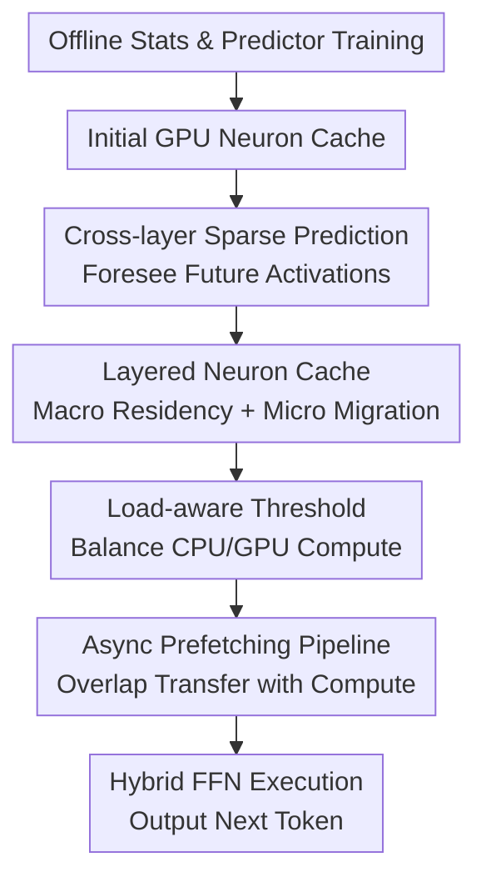

# DynamicInfer: Runtime-Aware Sparse Offloading for LLMs Inference on a Consumer-Grade GPU

**Conference**: ICLR 2026  
**OpenReview**: [https://openreview.net/forum?id=CvjmvjlczZ](https://openreview.net/forum?id=CvjmvjlczZ)  
**Code**: Unconfirmed  
**Area**: LLM Efficiency  
**Keywords**: Sparse activation, Model offloading, LLM inference, Dynamic scheduling, Consumer-grade GPU  

## TL;DR
DynamicInfer targets consumer-grade GPUs with insufficient VRAM by dynamically scheduling LLM FFN neurons between CPU and GPU based on runtime activation patterns. It utilizes cross-layer prediction, layered neuron caching, and load-aware thresholds to ensure more neurons that are actually used reside on the GPU, achieving significant speedups over llama.cpp and PowerInfer while maintaining near-constant accuracy.

## Background & Motivation

**Background**: Local deployment of Large Language Models (LLMs) is becoming increasingly important, as inference on personal devices reduces cloud costs and privacy risks. However, the parameter counts of modern LLMs far exceed the VRAM capacity of consumer GPUs. FFN layers, in particular, account for most of the parameters, making it impractical to fit full models into devices like the RTX 4090 or RTX 2080 Ti.

**Limitations of Prior Work**: Model offloading places some weights in CPU memory and moves them to the GPU when needed, or involves the CPU in computation directly. Sparse activation leverages the abundance of near-zero FFN neurons in models like ReLU/ProSparse to skip neurons predicted as inactive. PowerInfer combines both by using offline statistics to identify frequently active "hot" neurons for GPU residency, while keeping "cold" neurons on the CPU. However, this one-time partitioning is static and can mismatch during new prompts or decoding tokens: hot neurons on the GPU might not be used in a step, while active cold neurons are computed slowly on the CPU.

**Key Challenge**: LLM FFN sparsity exhibits both locality and high input dependency. Observations show that in certain layers of ReluLLaMA, the top 40% of neurons can cover approximately 80% of activations, confirming the existence of "hot neurons." However, the Jaccard distance of hot neuron sets between different sentences reaches 0.53-0.57, and the difference between adjacent token activations is even higher, with Jaccard distances of 0.70-0.75. This suggests that static configurations capture general trends but fail to grasp the actual computational load required for the current token.

**Goal**: The authors aim to solve a systems problem: in an environment with limited VRAM, expensive PCIe transfers, and significant CPU/GPU compute disparities, how to ensure active FFN neurons are computed on the GPU as much as possible without letting dynamic weight migration become an I/O bottleneck or damaging accuracy through aggressive skipping.

**Key Insight**: DynamicInfer focuses on "runtime-aware scheduling" rather than "better offline partitioning." Predicting which neurons future layers will activate allows for asynchronous migration of required neurons to the GPU during current layer computation. Furthermore, adjusting activation thresholds based on real-time CPU/GPU load enables shifting computation from the slower side to the faster side.

**Core Idea**: Use cross-layer sparse prediction to expose "future active neurons" early, combined with historical frequency and real-time load for dynamic neuron caching and threshold adjustment, transforming static offloading into runtime-aware sparse offloading.

## Method

### Overall Architecture
The workflow of DynamicInfer is divided into offline preparation and online inference. In the offline phase, lightweight MLP sparse predictors are trained, and activation frequencies of neurons across each layer are collected using public data. In the online phase, a portion of historically high-frequency neurons is preloaded into the GPU based on the VRAM budget. During each inference step, current hidden states are used to predict active neurons in future layers, migrate weights asynchronously, and adjust sparse thresholds based on CPU/GPU load.

From a systems perspective, it is not merely "moving more weights to the GPU," but continuously swapping the GPU neuron cache within a limited budget: macro-level retention of repeating hot neurons within an input and micro-level prefetching of soon-to-be-used neurons for the next token/future layers. FFN execution remains a hybrid CPU/GPU process: the GPU handles active neurons already in VRAM, while the CPU handles active neurons in main memory, with CPU results synced back to the GPU for aggregation.

The key system path involves three interlocking components. First, cross-layer sparse prediction provides a time window for scheduling. Second, a layered neuron cache determines which weights reside in the GPU versus which should be migrated. Third, load-aware thresholds decide the actual number of neurons activated on the GPU and CPU. Finally, an asynchronous transfer pipeline hides scheduling costs within the computation of adjacent layers.

### Key Designs

**1. Cross-layer Sparse Prediction: Turning "Future Neurons" into Scheduling Signals**

PowerInfer performs sparse prediction near FFN computation. If migration decisions are made then, PCIe transfers can easily block the current computation. DynamicInfer utilizes the observation that hidden states evolve relatively smoothly across adjacent or nearby layers; appendix data shows an average cosine similarity of over 88% between adjacent layers. Thus, for a sparse predictor $\text{MLP}_{i+k}$ of layer $i+k$, the hidden state $h_i$ from the attention output of layer $i$ can be used in advance to obtain the predicted vector $z_{i+k}\in\mathbb{R}^d$.

The value of this design lies in moving scheduling out of the synchronous path. After layer $i$ attention completes, the system starts a scheduling sub-thread for sparse prediction and neuron migration while the main thread continues with layer $i$ FFN. Given a sufficient look-ahead $k$ and computation window, cold neurons needed for future layers complete CPU-to-GPU prefetching before their FFN execution.

**2. Layered Neuron Cache: Exploiting Sentence-level Locality and Token-level Dynamics**

Neuron scheduling is split into macro and micro levels. At the macro level, a batch of high-frequency neurons tends to activate repeatedly within the same input sentence; the system tracks historical activation frequencies to keep these neurons resident on the GPU. At the micro level, specific activation sets vary significantly between adjacent tokens; the system uses the current token context to predict next-step activations and temporarily ranks these predicted neurons into the GPU cache.

This strategy is modeled as a constrained GPU placement problem. For the $i$-th neuron in layer $l$, importance is defined as $v_{l,i}=a_{l,i}+\lambda f_{l,i}$, where $a_{l,i}\in\{0,1\}$ is the current prediction and $f_{l,i}$ is the historical frequency, with $\lambda$ weighting the two. The goal is to maximize $\sum_{l,i}g_{l,i}v_{l,i}$ subject to VRAM budget, communication windows, and residency constraints. Since real-time integer programming is expensive, a layer-wise greedy strategy is used: high-frequency neurons are fixed first, and remaining neurons are replaced by importance until communication constraints prevent further migration.

**3. Load-aware Threshold: Decoupling CPU and GPU Sparse Thresholds**

Traditional sparse activation uses a uniform threshold $\theta$. However, in a CPU/GPU heterogeneous system, a uniform threshold causes load imbalance. The GPU has high throughput but limited VRAM, while the CPU has large memory but slow computation. Overloading the CPU side with active neurons can cause the CPU to bottleneck the entire FFN layer. DynamicInfer applies different thresholds $\theta_g$ and $\theta_c$ for the GPU and CPU, adjusting them dynamically based on load.

FFN latency is modeled as the maximum of both sides' completion times:
$$\min_{\theta_g,\theta_c}\max(t_{gpu}N_{gpu}(\theta_g), t_{cpu}N_{cpu}(\theta_c)+t_{sync})$$
Intuitively, when the CPU is the bottleneck, the system lowers the GPU threshold $\theta_g$ to compute more neurons on the GPU and raises $\theta_c$ to reduce CPU load. To maintain accuracy, adjustment is bound by $Err(\theta_g,\theta_c)\le Err(\theta)$, ensuring the error from dynamic thresholds does not exceed the original static threshold. A greedy strategy starts from the static threshold and iteratively shifts load to the GPU within accuracy constraints.

**4. Async Prefetching Pipeline: Hiding Weight Migration Costs**

The primary risk of dynamic scheduling is that "weight migration may be slower than the computation saved." DynamicInfer's pipeline handles this by running a scheduling thread during main thread computation, using CUDA asynchronous transfers to copy predicted active weights from CPU pinned memory to the GPU. Before entering an FFN layer, a synchronization barrier ensures weights and CPU results are ready.

Memory layout is also reorganized. LLaMA FFNs usually include gate, up, and down weights; weights for the same neuron are accessed and migrated together. DynamicInfer stores these weights contiguously per neuron and maintains a `gpu_bucket` index table on the GPU, where `gpu_bucket[i]` points to the corresponding neuron ID. This allows migrating a neuron by transferring its associated weight block in one go, reducing overhead from fragmented copies.

### Loss & Training
The offline sparse predictors are lightweight MLPs. Training data consists of 2,000 randomly sampled sequences from C4, generating approximately 700,000 tokens. Predictors treat neuron activation as a binary classification problem using cross-entropy loss: 
$$L=-(y_i\log\sigma(z_i)+(1-y_i)\log(1-\sigma(z_i)))$$
Under maximum likelihood, $\sigma(z_i)$ is interpreted as the activation probability $p_i=P(y=1|x_i)$.

During online initialization, an initial neuron cache is determined by offline frequencies and VRAM budget. The implementation follows an ILP approach similar to PowerInfer for budget allocation across FFN layers. During inference, memory is not dynamically allocated per step; instead, neurons are swapped within the pre-allocated budget. Hardware parameters like fixed overhead $t_0$, transfer time $t_{trans}$, and per-neuron compute times $t_{gpu}, t_{cpu}$ are profiled during initial decoding steps.

## Key Experimental Results

### Main Results
Evaluation was conducted on two configurations: PC-High (RTX 4090 24GB + Xeon Platinum 8358P + PCIe 4.0) and PC-Low (RTX 2080 Ti 12GB + Ryzen 9 5950X + PCIe 3.0). Models include ReluLLaMA and ProSparse. 70B models use INT4 quantization; others use FP16. The primary metric is decoding tokens per second (TPS) with batch size 1.

| Hardware / Model | In/Out Len | Transformers | llama.cpp | PowerInfer | DynamicInfer |
|-------------|---------------|--------------|-----------|------------|--------------|
| PC-High / ReluLLaMA-13B | 64 / 128 | 4.0 | 9.7 | 15.5 | 19.1 |
| PC-High / ProSparse-13B | 64 / 128 | 3.0 | 9.3 | 15.6 | 18.3 |
| PC-High / ReluLLaMA-70B | 64 / 128 | 0.28 | 2.23 | 5.14 | 7.88 |
| PC-Low / ReluLLaMA-7B | 64 / 128 | 2.0 | 8.1 | 18.9 | 24.4 |
| PC-Low / ProSparse-7B | 64 / 128 | 2.0 | 8.2 | 21.9 | 26.5 |
| PC-Low / ReluLLaMA-13B | 64 / 128 | 0.39 | 2.90 | 7.49 | 8.47 |

On PC-High, the 13B model improves by 18%-26% over PowerInfer and 60%-97% over llama.cpp. The 70B model improves by 53%-59% over PowerInfer and 148%-253% over llama.cpp. On PC-Low, the 7B model gains 20%-35% over PowerInfer, while 13B gains are smaller (11%-13%) due to tighter VRAM on the 2080 Ti limiting migratable FFN neurons.

| Setup | Metric | PowerInfer | DynamicInfer | Description |
|------|----------|------------|--------------|------|
| PC-High / ReluLLaMA | % Active Neurons on GPU | Avg 51% | Avg 68% | Dynamic scheduling places more active neurons on GPU |
| PC-High / ReluLLaMA | CPU Contribution to FFN Latency | Avg 72% | Avg 57% | CPU bottleneck is mitigated but not eliminated |
| ReluLLaMA-13B / PC-High | 64 / 128 TPS | 15.5 | 19.1 | ~23.2% Gain in typical config |
| ReluLLaMA-70B / PC-High | 64 / 128 TPS | 5.14 | 7.88 | Larger models benefit more from CPU bottleneck reduction |

### Ablation Study
Ablations on PC-High show the relative speedup when adding components to the PowerInfer baseline.

| Configuration | ReluLLaMA-13B Gain | ReluLLaMA-70B Gain | Description |
|------|--------------------|--------------------|------|
| PowerInfer | 0% | 0% | Static hot/cold partitioning |
| + Micro-level scheduling | 11.3% | 27.6% | Largest single gain from token-level prediction |
| + Macro-level scheduling | 13.6% | 34.0% | Residency of freq. neurons reduces CPU usage |
| + Dynamic threshold | 23.1% | 57.1% | Shifting load to GPU provides major boost |

Accuracy across RTE, PIQA, COPA, and Winogrande shows minimal variance between dense and sparse inference. For 70B, PIQA changed from 80.14 to 80.41, while Winogrande adjusted from 75.85 to 75.06.

### Key Findings
- **Micro-level scheduling** is the primary source of improvement, confirming that token-level activation dynamics are the main weakness of static partitioning.
- **Macro-level scheduling** yields smaller gains but is vital for preventing the dynamic strategy from degenerating into excessive weight migration.
- **Dynamic threshold** does not simply "increase sparsity" but redistributes load, allowing the GPU to take on more computation to minimize CPU trailing latency within accuracy bounds.
- **VRAM budget** correlates with gains; as VRAM increases from 12GB to 24GB, DynamicInfer's advantage over PowerInfer widens as more neurons can be scheduled to the GPU.
- **CPU memory overhead** increases due to the predictor and transfer buffers. For ReluLLaMA-13B on PC-Low, CPU RAM usage rose from 21.3GB to 36.6GB.

## Highlights & Insights
- Reducing offloading granularity to the neuron level and moving from static partitioning to runtime scheduling is a major system insight. It leverages ReLU/ProSparse without assuming global hot neurons fit all inputs.
- Cross-layer prediction is a clever design utilizing hidden state smoothness to create an I/O hiding window, transforming predictive accuracy into system schedulability.
- Load-aware thresholds address hardware heterogeneity more effectively than uniform thresholds, which often leave the faster GPU waiting for the slower CPU.
- Combining "sparse activation" with "weight placement" rather than treating them as separate algorithmic and system problems provides a template for MoE expert offloading or tiered KV cache storage.

## Limitations & Future Work
- DynamicInfer depends on predictable activation sparsity, making it most natural for ReLU/ProSparse models. While it generalizes to SiLU models via magnitude pruning, the sparsity semantics are weaker.
- The system assumes a relatively dedicated environment. If other tasks consume PCIe bandwidth or CPU/GPU resources, the fixed-parameter scheduling may fail to adapt.
- CPU memory overhead is significant, which might be a barrier for ultra-low-resource mobile devices.
- Experiments focus on batch size 1; performance under high concurrency or extremely long contexts with KV cache pressure requires further evaluation.

## Related Work & Insights
- **vs llama.cpp**: llama.cpp offloads at layer/tensor levels, leaving CPU FFN bottlenecks. DynamicInfer uses neuron-level sparsity to shift active sub-computations to the GPU.
- **vs PowerInfer**: DynamicInfer evolves from PowerInfer by replacing static partitions with runtime-aware caches and historical frequency updates.
- **vs Deja Vu / CATS**: These focus on predicting sparsity. DynamicInfer builds on this but prioritizes the system problem of neuron placement, migration, and load balancing on heterogeneous hardware.
- **Insight**: Local LLM systems are shifting towards runtime systems that predict future loads, adjust caches, and balance heterogeneous workloads while hiding data movement costs in compute pipelines.

## Rating
- Novelty: ⭐⭐⭐⭐☆
- Experimental Thoroughness: ⭐⭐⭐⭐☆
- Writing Quality: ⭐⭐⭐⭐☆
- Value: ⭐⭐⭐⭐⭐

<!-- RELATED:START -->

## Related Papers

- [\[ICLR 2026\] Inference-Cost-Aware Dynamic Tree Construction for Efficient Inference in Large Language Models](inference-cost-aware_dynamic_tree_construction_for_efficient_inference_in_large_.md)
- [\[ICML 2026\] WarmServe：一次加载多模型的 GPU 预热机制](../../ICML2026/llm_efficiency/warmserve_enabling_one-for-many_gpu_prewarming_for_multi-llm_serving.md)
- [\[ICLR 2026\] Guided Speculative Inference for Efficient Test-Time Alignment of LLMs](guided_speculative_inference_for_efficient_test-time_alignment_of_llms.md)
- [\[ICLR 2026\] Scaling Laws Meet Model Architecture: Toward Inference-Efficient LLMs](scaling_laws_meet_model_architecture_toward_inference-efficient_llms.md)
- [\[ICLR 2026\] On-the-Fly Adaptation to Quantization: Configuration-Aware LoRA for Efficient Fine-Tuning of Quantized LLMs](on-the-fly_adaptation_to_quantization_configuration-aware_lora_for_efficient_fin.md)

<!-- RELATED:END -->
