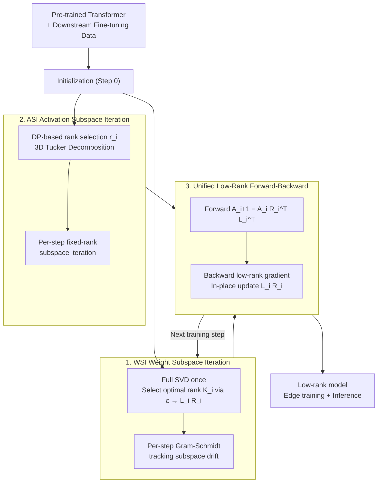

# Efficient Resource-Constrained Training of Transformers via Subspace Optimization

**Conference**: ICLR 2026 Oral  
**arXiv**: [2510.09160](https://arxiv.org/abs/2510.09160)  
**Code**: [https://github.com/Le-TrungNguyen/ICLR2026-WASI.git](https://github.com/Le-TrungNguyen/ICLR2026-WASI.git)  
**Area**: AI Security  
**Keywords**: subspace optimization, transformer compression, SVD, activation compression, edge deployment

## TL;DR

The authors propose WASI (Weight-Activation Subspace Iteration), which leverages the hypothesis that "parameter subspaces remain stable during fine-tuning." It simultaneously compresses Transformer weights (via SVD + Gram-Schmidt subspace iteration) and activations (via Tucker decomposition). Both training and inference are performed within low-rank representations, achieving 62× training memory compression and 1.4× acceleration on Raspberry Pi 5 with negligible accuracy loss.

## Background & Motivation

**Background**: Deploying Transformers on edge devices faces severe memory and computational challenges. While methods like LoRA reduce trainable parameters, inference still occurs in full-rank space; activation maps during forward propagation remain the primary source of memory bottlenecks.

**Limitations of Prior Work**:
   - **LoRA and Variants**: Reduce training parameters, but inference requires merging back to full-rank, resulting in unchanged inference overhead. Training requires storing both frozen weights and adapters, which can actually increase total memory.
   - **ASVD / FWSVD**: Use truncated SVD for compression but lack theoretical links between truncation error and model performance.
   - **SVD-LLM**: Provides a theoretical foundation but is limited to LLMs and does not support Vision Transformers with 4D or higher activation tensors.
   - **AMC**: Uses HOSVD for activation compression, but recomputing HOSVD at every iteration incurs high computational overhead, and rank fluctuations lead to unstable memory usage.
   - **ASI**: Uses subspace iteration instead of HOSVD with fixed activation ranks to reduce computation, but does not compress weights.

**Key Insight**: The essential subspace of parameters remains stable during fine-tuning (low learning rates $\rightarrow$ minute updates per step $\rightarrow$ minimal changes in SVD bases). Therefore, inexpensive subspace iteration can track base changes after an initial SVD without per-step recomputation.

**Core Idea**: Simultaneously compress weights (WSI) and activations (ASI) so that the entire training and inference cycle is executed in low-rank space.

## Method

### Overall Architecture

WASI migrates the entire Transformer training and inference process into a low-rank subspace. Before fine-tuning begins, an initialization is performed: WSI decomposes each layer's weight $\mathcal{W}_i$ into two thin matrices $L_i R_i$ via full SVD, while ASI compresses activations into core tensors using Tucker decomposition. In each subsequent training step, the forward pass computes $\mathcal{A}_{i+1} = \mathcal{A}_i R_i^T L_i^T$ directly in the compressed representation. Backpropagation gradients are calculated in the low-rank space and update $L_i R_i \leftarrow L_i R_i + \eta \cdot \widetilde{\nabla_{\mathcal{W}_i}\mathcal{L}}$ in-place. Simultaneously, WSI uses inexpensive Gram-Schmidt orthogonalization and ASI uses fixed-rank subspace iteration to track slight drifts in weight/activation subspaces, avoiding per-step SVD/HOSVD recomputations. Since tensors are never restored to full-rank, both training and inference memory are reduced.

### Key Designs

**1. WSI (Weight Subspace Iteration): "SVD once" weight compression**

Performing truncated SVD for every layer at every step is too expensive, yet full SVD is the only reliable way to determine optimal low-rank bases. WASI compromises by performing a full SVD on weights $\mathcal{W}_i$ only at Step 0. The optimal rank $K_i$ is chosen based on an energy retention threshold $\varepsilon$, satisfying $\sum_{j=1}^{K_i} \sigma_{i,j}^2 \geq \varepsilon$, resulting in the initial decomposition $\mathcal{W}_i \approx L_i R_i$. Subsequent steps use inexpensive Gram-Schmidt orthogonalization to track minute subspace drifts. This is effective because the small learning rate during fine-tuning ensures that the essential subspace spanned by singular vectors remains nearly constant, allowing lightweight iterative corrections. Empirically, WSI reduces computation by 1.36× compared to per-step SVD, with 35% higher accuracy under the same FLOPs budget.

**2. ASI (Activation Subspace Iteration): Capping memory peaks via DP rank selection**

Forward activation maps are the true memory bottleneck for edge training. While original ASI uses brute-force search for ranks and only supports low-dimensional tensors, WASI introduces two improvements: first, it reformulates rank selection as a dynamic programming problem to minimize total memory under a target perplexity constraint, reducing search complexity to linear. This stabilizes memory and keeps ranks fixed (avoiding fluctuations from HOSVD). Second, it extends Tucker decomposition to support 3D activation tensors $\mathcal{A}_i \in \mathbb{R}^{B \times N_i \times I_i}$ common in Transformers, enabling support for Vision Transformers (ViT/Swin) beyond standard sequence models. Since the first few principal components capture over 90% of the variance, compression ratios can be aggressive (up to 953× activation compression on TinyLlama).

**3. Unified Low-Rank Forward-Backward: Eliminating decompression/compression loops**

The benefits of low-rank computation would be negated if the backward pass required decompressing and re-compressing tensors. WASI closes the loop by performing both forward and backward passes directly on $(L_i, R_i)$ representations. Weight gradients are provided directly by a low-rank function $\widetilde{\nabla_{\mathcal{W}_i}\mathcal{L}} = f_{LR}(\tilde{\mathcal{A}_i}, \widetilde{\nabla_{\mathcal{A}_{i+1}}\mathcal{L}})$, and activation gradients passed to the previous layer are calculated as $\widetilde{\nabla_{\mathcal{A}_i}\mathcal{L}} = \widetilde{\nabla_{\mathcal{A}_{i+1}}\mathcal{L}} \cdot L_i R_i$, while maintaining standard cross-entropy loss. Consequently, the weight never needs to be restored to full-rank for inference, which fundamentally distinguishes WASI from LoRA and makes it naturally suited for edge deployment.

## Key Experimental Results

### Main Results: Multiple Models and Datasets

| Model | Dataset | Training Memory Compression | Inference Memory Compression | Training FLOPs Reduction | Accuracy Delta |
|------|--------|------------|-----------|---------------|--------|
| ViT | CIFAR-10 | **62×** | **62×** | **2×** | -0.5% |
| ViT | Pets | **62×** | **62×** | **2×** | 0% |
| SwinT | CUB | ~50× | ~50× | 1.5× | +2% (Exceeded) |
| SwinT | Flowers | ~50× | ~50× | 1.5× | -1% |
| SwinT | CIFAR-100 | ~50× | ~50× | 1.5× | 0% |
| TinyLlama | BoolQ | **953×**(Act) / **30×**(Weight) | **30×** | **13×** | 0% |

### Ablation Study: WSI vs. Full SVD

| Method | ε=0.4 | ε=0.6 | ε=0.8 | ε=0.9 | Computation Overhead |
|------|-------|-------|-------|-------|-----------|
| Full SVD | Low Acc | Med | High | Near Full | 1.0× |
| WSI | Low Acc | Med | High | Near Full | **0.74× (1.36× saved)** |
| Accuracy @ same FLOPs | — | — | — | — | WSI +**35%** |

### Device Benchmarking: Raspberry Pi 5

| Setup | Training Time/Step | Inference Time/Step | Speedup Gain |
|------|-----------|-----------|-------|
| Vanilla | Baseline | Baseline | 1.0× |
| WASI (ε=0.9) | Faster | Faster | **~1.4×** |
| WASI (ε=0.4) | Fastest | Fastest | **>2×** |

### Key Findings

- Layer rank $K_i$ remains **constant** across 50 epochs—validating the subspace stability hypothesis.
- WSI consumes 1.36× fewer FLOPs than recomputing SVD and yields 35% higher accuracy under the same budget.
- The first few principal components of activations capture >90% variance, making them highly compressible.
- SwinT accuracy **exceeded** vanilla on CUB, suggesting the low-rank constraint acts as a regularizer.
- TinyLlama achieved up to **953×** activation compression, demonstrating potential for LLMs.

## Highlights & Insights

- **Training + Inference both in compressed space**: Fundamentally different from LoRA (which merges back for inference), making it ideal for edge deployment.
- **Experimental validation of subspace stability**: Figure 3(a) visualizes the stability of singular values throughout fine-tuning, aligning theory with experiment.
- **DP-based rank selection instead of brute force**: Optimizes exponential search to linear, significantly improving practicality.
- **Compression can improve performance**: The fact that WASI outperformed vanilla on CUB indicates that low-rank constraints provide regularization effects.
- **62× memory compression** implies that a model originally requiring 62GB could be trained on a 1GB device.

## Limitations & Future Work

- Limited LLM validation: Only tested on the last 5 layers of TinyLlama; efficacy for large-scale LLMs remains unknown.
- Requires pre-tuning the $\varepsilon$ threshold; optimal values may vary by task or model.
- Gram-Schmidt may exhibit numerical instability at extremely small ranks.
- SVD-LLM's use of LoRA adapters gives it a FLOPs advantage; WASI's FLOPs efficiency is less dramatic than its memory efficiency.
- Potential integration with orthogonal techniques (quantization, distillation) remains unexplored.

## Related Work & Insights

- **vs. LoRA**: LoRA only reduces training parameters without compressing inference; WASI compresses both, offering a clear edge in deployment.
- **vs. SVD-LLM**: SVD-LLM is specific to LLMs and can increase memory at low compression ratios due to adapter overhead; WASI is general-purpose and overhead-free.
- **vs. ASI**: ASI only compresses activations; WASI provides an unified compression for both weights and activations.
- **vs. AMC**: AMC incurs massive per-step HOSVD calculation costs; WASI uses initial SVD + subspace iteration for high efficiency.

## Rating

- Novelty: ⭐⭐⭐⭐ Unified framework for weight+activation compression; subspace stability hypothesis is theoretically supported.
- Experimental Thoroughness: ⭐⭐⭐⭐ RPi5 deployment is persuasive; multi-model validation across ViT/SwinT/TinyLlama.
- Writing Quality: ⭐⭐⭐⭐ Solid mathematical derivations and detailed complexity analysis.
- Value: ⭐⭐⭐⭐ Practical solution for edge Transformer deployment; 62× compression offers significant engineering value.

<!-- RELATED:START -->

## Related Papers

- [\[ICLR 2026\] CONCUR: A Framework for Continual Constrained and Unconstrained Routing](concur_a_framework_for_continual_constrained_and_unconstrained_routing.md)
- [\[AAAI 2026\] Resource Efficient Sleep Staging via Multi-Level Masking and Prompt Learning](../../AAAI2026/llm_efficiency/resource_efficient_sleep_staging_via_multi-level_masking_and_prompt_learning.md)
- [\[ICLR 2026\] RMAAT: Astrocyte-Inspired Memory Compression and Replay for Efficient Long-Context Transformers](rmaat_astrocyte-inspired_memory_compression_and_replay_for_efficient_long-contex.md)
- [\[ICLR 2026\] Deep Hierarchical Learning with Nested Subspace Networks for Large Language Models](deep_hierarchical_learning_with_nested_subspace_networks_for_large_language_mode.md)
- [\[ICLR 2026\] Cactus: Accelerating Auto-Regressive Decoding with Constrained Acceptance Speculative Sampling](cactus_accelerating_auto-regressive_decoding_with_constrained_acceptance_specula.md)

<!-- RELATED:END -->
