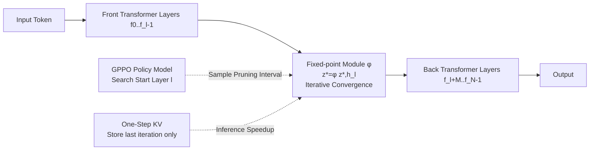

# Equilibrium Language Models

**Conference**: ICLR 2026  
**Code**: [Jyk-122/ELM](https://github.com/Jyk-122/ELM)  
**Area**: LLM Efficiency / Model Compression  
**Keywords**: Layer Pruning, Deep Equilibrium Models, Fixed-point Networks, KV Cache Compression, Policy Optimization

## TL;DR
Replaces a continuous segment of intermediate Transformer layers with a lightweight "fixed-point module" that uses equilibrium state solving to equivalently represent deep stacking. This achieves a 28% parameter reduction while retaining 99% accuracy, specifically designed for low-memory edge deployment.

## Background & Motivation
**Background**: Deploying LLMs on the edge (phones, edge devices) is an inevitable trend, but fitting billions of parameters into RAM during inference often exceeds the memory budget, driving research into compression methods like pruning, quantization, and distillation.

**Limitations of Prior Work**: Existing compression strategies suffer from significant drawbacks: (1) Methods that simultaneously compress computation and parameters (pruning low-contribution layers via statistical metrics or replacing continuous layers with lightweight modules) suffer from severe performance drops in "hard generation tasks" such as code synthesis and mathematical reasoning. (2) Methods using input-adaptive layer skipping only save computation and barely reduce parameters, failing to meet strict memory constraints on edge devices.

**Key Challenge**: To save memory, parameters must be physically removed, but excessive removal leads to a collapse in model capacity—especially in challenging generative tasks. How can parameters be removed while maintaining expressive power close to that of the dense model?

**Goal**: Propose a compression framework that truly reduces parameters (saving memory) while maintaining near-lossless accuracy for edge deployment.

**Core Idea**: Inspired by Deep Equilibrium Models (DEQ)—where a weight-sharing fixed-point network is equivalent to an "infinitely deep" network—the approach leverages minimal parameters to achieve representation power comparable to deep stacking. A continuous segment of intermediate Transformer layers is replaced by a fixed-point module $z^* = \phi(z^*, h^l)$, rewriting "forwarding through M layers" as "iteratively solving for an equilibrium state."

## Method

### Overall Architecture
ELM prunes a sequence of $M$ layers ($M < N$) from the original model $F$. At the position of the $l$-th layer, a fixed-point module $\phi$ is embedded. Its output is the equilibrium solution of the nonlinear system $z^* = \phi(z^*, h^l)$, approximated via iteration $z^{(k+1)} = \phi(z^{(k)}, h^l)$. Three components address three core questions: **Where to prune** (GPPO automatically searches for the start layer using policy optimization), **How to train** (Stochastic Jacobian-Free Backpropagation + Distillation Alignment), and **How to save KV cache during inference** (One-Step KV Cache).

### Key Designs

**1. Replacing Layer Groups with Fixed-Point Modules: Equivalence via Equilibrium.** The fixed-point module consists of two fully connected layers $W_z, W_h \in \mathbb{R}^{d \times d}$ and one Transformer layer $f^*$. The iteration rule is $\phi(z^{(k)}, h^l) = f^*(W_z \cdot z^{(k)} + W_h \cdot h^l)$. A clever initialization ensures a strong starting point: $f^*$ inherits parameters from the first pruned layer $f^l$, $z^{(0)} = 0$, $W_h$ is initialized as an identity matrix, and $W_z$ is random—making the first iteration output exactly equal to the original $f^l$ output. Theoretically, the iteration upper bound is infinite, but in practice, it converges within $M$ steps, achieving parameter compression across $M$ layers without increasing computational complexity. Training employs a dual loss $L_{sft} = \lambda_{ce} L_{ce} + \lambda_{distill} L_{distill}$, where the distillation term uses MSE to align $z^*$ with the original model's hidden state $h^{l+M}$ at layer $l+M-1$.

**2. Stochastic Jacobian-Free Backpropagation (SJFB): Training Fixed-Point Networks without Inversion.** Standard implicit differentiation requires calculating $(I - \partial f / \partial z^*)^{-1}$, which is computationally expensive. This paper adopts Stochastic JFB: uniformly sampling $m \sim U[0, M/2]$ steps of gradient-free iteration + $n \sim U[1, M/2]$ steps of gradient-carrying iteration. Calculating gradients only for the final steps saves training memory and proves more stable in large-scale experiments.

**3. Group Pruning Policy Optimization (GPPO): Automated Pruning Interval Search via RL.** Traditional methods determine layer importance based on statistical metrics like cosine similarity or perplexity, but these cannot capture the "approximation error introduced by replacing multiple layers with a fixed-point formula." GPPO treats each candidate starting layer $f^0, \dots, f^{N-M}$ as an action. Trainable parameters $\theta \in \mathbb{R}^{N-M+1}$ define the layer selection distribution $\pi_\theta$. Each layer is equipped with a LoRA to reduce training overhead. An ELM is constructed by sampling a start layer to act as the reward model, which is updated via SFT loss, using negative cross-entropy $-L_{ce}$ as the reward. Policy updates follow the GRPO approach, utilizing group-normalized advantages $\hat{A} = (R - \text{mean}(R)) / \text{std}(R)$ and the PPO clipping objective $L^{CLIP}$. Training cycles through collecting rewards for $p$ steps and updating the policy for $q$ steps; the $\arg\max \theta$ after convergence is chosen as the optimal start layer.

**4. One-Step KV Cache: Reducing KV Memory from $O(T \cdot M)$ to $O(T)$.** Fixed-point modules require multiple iterations to converge. A naive approach would save the KV cache for all historical tokens at every iteration, leading to $O(T \cdot M)$ storage complexity. A key observation is that intermediate features $z^{(k)}$ converge to the same equilibrium $z^*$. Thus, only the KV cache from the **last round** of iteration needs to be saved and reused: $z^{(k+1)}_{T+1} = \phi(K^*_{1 \cdots T}, V^*_{1 \cdots T}, z^{(k)}_{T+1}, h_{T+1})$. This reduces complexity to $O(T)$ without accuracy loss. An additional benefit is the elimination of "missing KV cache" when different tokens are assigned different iteration steps, enabling efficient deployment of adaptive-stop solvers.

**5. Adaptive Stopping + Accelerated Solvers.** Leveraging One-Step KV, adaptive stopping can be applied to each token based on the residual norm $\|\phi(z^{(k)}, h) - z^{(k)}\|_2 < \delta$, allocating computation based on convergence speed. Classical solvers like Broyden's quasi-Newton method and Anderson acceleration can be stacked to further reduce iteration counts.

## Key Experimental Results

### Main Results
Source models: Qwen2.5-1.5B/7B-Instruct, Llama3.2-3B-Instruct (all 28 layers); 8 layers pruned ($M=8$, ~28.6% non-embedding parameter compression). RP = Relative Retention compared to the dense model.

| Model | Method | Avg Score | RP (Retention) |
| :--- | :--- | :--- | :--- |
| Qwen2.5-1.5B | Dense | 68.9 | 100% |
| Qwen2.5-1.5B | LLM-Streamline(Layer) | 51.9 | 75.4% |
| Qwen2.5-1.5B | Shortened-LLaMA | 60.1 | 87.3% |
| Qwen2.5-1.5B | **ELM(Ours)** | **68.1** | **98.9%** |
| Llama3.2-3B | Dense | 68.6 | 100% |
| Llama3.2-3B | LLM-Streamline(Layer) | 66.5 | 97.0% |
| Llama3.2-3B | **ELM(Ours)** | **67.9** | **99.0%** |
| Qwen2.5-7B | Dense | 75.7 | 100% |
| Qwen2.5-7B | Shortened-LLaMA | 67.3 | 89.0% |
| Qwen2.5-7B | **ELM(Ours)** | **75.0** | **99.0%** |

Key Gap: On GSM8K, ELM for Qwen2.5-7B reaches 99.5% accuracy of the dense model, outperforming Sheared-LLaMA by 17.2%, Shortened-LLaMA by 20.4%, and LLM-Streamline by 34.9%. In contrast, ReplaceMe fails almost entirely (0 score) on math/code tasks.

### Ablation Study
**One-Step KV (Qwen2.5-1.5B, 4K Context, 16-bit):**

| Config | KV (MB) | GSM8K | MATH | Description |
| :--- | :--- | :--- | :--- | :--- |
| Dense | 114.8 | 72.4 | 32.2 | Baseline |
| $M=8$ w/o One-Step | 114.8 | 71.4 | 30.8 | Multi-step KV |
| $M=8$ w/ One-Step | 86.0 | 71.8 | 30.5 | 25% KV Savings |
| $M=14$ w/o One-Step | 114.8 | 63.3 | 24.1 | Multi-step KV |
| $M=14$ w/ One-Step | 61.6 | 63.6 | 24.0 | 46% KV Savings |

**Accelerated Solver (GSM8K, Qwen2.5-1.5B):** Anderson acceleration is the most stable. At $M=14, \delta=0.5$, it saves 38.6% computation compared to naive iteration with almost no accuracy loss. Broyden performs slightly weaker at $M=8$ due to larger approximation errors in the inverse Jacobian.

### Key Findings
- Unlike baselines that collapse on math/code, ELM retains $\ge 90\%$ accuracy even on MATH.
- Advantages are more pronounced at high compression rates: Llama3.2-3B retains 97.7% of MBPP after pruning 50% of its layers, exceeding LLM-Streamline by 43.4%.
- The optimal start layer found by GPPO matches enumeration experiments, and the learned $\theta$ correlates strongly with ELM performance, proving that metric-based criteria are unsuitable for fixed-point replacement.

## Highlights & Insights
- Shifting the mindset from "pruning layers = deleting expressive power" to "pruning layers = changing to an equivalent representation" is a elegant perspective shift, using DEQ's implicit depth to compensate for removed explicit depth.
- One-Step KV captures the essence that "all iterations converge to the same equilibrium," using a single formula to slash iterative KV memory from $O(TM)$ to $O(T)$, providing a real memory dividend for edge deployment.
- Replacing heuristic metrics with RL policy optimization for selecting pruning intervals, using downstream SFT loss as a direct reward, bypasses the fundamental difficulty of metrics being unable to characterize fixed-point approximation errors.

## Limitations & Future Work
- Experiments focused on 1.5B–7B models with 28 layers and $\le 50\%$ pruning ratios; scalability to larger models or deeper architectures remains to be verified.
- GPPO requires attaching LoRA to each candidate layer and multiple rounds of sampling/training, resulting in significant search costs. Optimal layers may also vary by downstream task.
- Fixed-point iterations introduce additional inference steps (saving parameters but increasing serial computation). The trade-off between memory savings and latency increase needs to be measured specifically on compute-constrained devices.

## Related Work & Insights
- **vs Shortened-LLaMA / ReplaceMe / LLM-Streamline**: These use perplexity/cosine similarity for layer selection and replace continuous layers with linear transformations or single modules; ELM uses iterative fixed-point modules and RL search, preventing collapse on hard tasks.
- **vs Sheared-LLaMA**: The latter uses structured pruning (heads/FFN/dims/layers) + L0 regularization; ELM follows the "layer group $\to$ equilibrium module" path, preserving representation while compressing parameters.
- **vs Adaptive Layer Skipping (MoD types)**: Skipping only saves computation; ELM physically removes parameters to save memory, better fitting edge memory bottlenecks.
- **vs DEQ / SJFB**: Successfully migrates implicit depth concepts from DEQ to LLM layer compression and introduces One-Step KV to solve the KV cache challenge in autoregressive inference.

## Rating
- Novelty: ⭐⭐⭐⭐⭐ The combination of "Layer Group $\to$ Fixed-point Module" + One-Step KV + GPPO is highly innovative in LLM compression.
- Experimental Thoroughness: ⭐⭐⭐⭐ Covers 3 models × 8 benchmarks, multiple compression rates, and thorough ablations on KV memory and solvers. Lacks real-world latency measurements for massive models.
- Writing Quality: ⭐⭐⭐⭐ Clear motivation, complete formulas, and effective diagrams.
- Value: ⭐⭐⭐⭐ Provides real memory savings for edge deployment with minimal accuracy loss; open-source code adds high practical value.

<!-- RELATED:START -->

## Related Papers

- [\[ICLR 2026\] Expert Divergence Learning for MoE-based Language Models](expert_divergence_learning_for_moe-based_language_models.md)
- [\[ICLR 2026\] SparseD: Sparse Attention for Diffusion Language Models](sparsed_sparse_attention_for_diffusion_language_models.md)
- [\[ICLR 2026\] Diffusion Language Models Know the Answer Before Decoding](diffusion_language_model_knows_the_answer_before_it_decodes.md)
- [\[ICLR 2026\] DND: Boosting Large Language Models with Dynamic Nested Depth](dnd_boosting_large_language_models_with_dynamic_nested_depth.md)
- [\[ICLR 2026\] The End of Manual Decoding: Towards Truly End-to-End Language Models](the_end_of_manual_decoding_towards_truly_end-to-end_language_models.md)

<!-- RELATED:END -->
