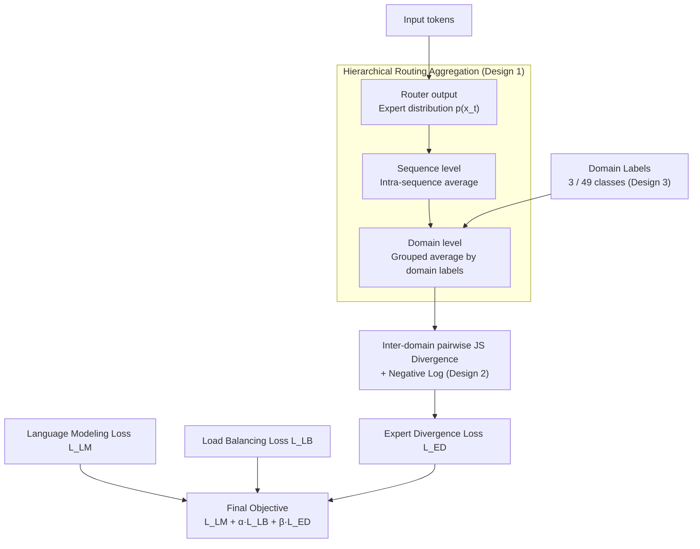

# Expert Divergence Learning for MoE-based Language Models

**Conference**: ICLR 2026  
**arXiv**: [2603.00054](https://arxiv.org/abs/2603.00054)  
**Code**: Not released  
**Area**: LLM Efficiency / MoE  
**Keywords**: Mixture-of-Experts, Expert Homogenization, Routing Diversity, Jensen-Shannon Divergence, Domain Specialization

## TL;DR
This work addresses the expert homogenization problem in MoE training by maximizing the Jensen-Shannon divergence of routing distributions across different data domains. This encourages different domains to activate distinct subsets of experts, improving expert specialization and language modeling performance on models ranging from 3B to 15B parameters.

## Background & Motivation
**Background**: Mixture-of-Experts (MoE) models achieve high parameter counts with low computational costs through sparse activation. However, "expert homogenization" often occurs during training, where different experts learn highly similar functions, wasting total parameter capacity.

**Limitations of Prior Work**: Existing methods, such as load balancing loss, only ensure that experts are used uniformly but do not guarantee that they learn distinct skills. Experts can be used evenly while remaining functionally identical.

**Key Challenge**: Load balancing and functional specialization are distinct concepts—uniform usage does not equate to specialized expertise.

**Core Idea**: Different data domains should activate different combinations of experts. Expert specialization is encouraged by maximizing the JS divergence of routing distributions between domains.

## Method

### Overall Architecture
This paper addresses "expert homogenization" in MoE. While sparse activation is intended to let different experts handle different data, training often results in experts learning redundant functions. This method does not modify the router structure, the number of experts, or the inference path. Instead, it adds an "Expert Divergence Loss" to the standard training objective, explicitly guiding the gradient with the prior that "different data domains should activate different expert combinations."

The pipeline is a bottom-up aggregation and differentiation process: each token yields an expert probability distribution via the router. These distributions are averaged within sequences and then grouped and averaged by domain labels to obtain a representative routing distribution for "which experts each domain prefers." Subsequently, the pairwise JS divergence between domains is calculated (taking the negative log) to form the expert divergence loss $\mathcal{L}_{ED}$. The final objective is the weighted sum of language modeling loss, load balancing loss, and expert divergence loss: $\mathcal{L}_{final} = \mathcal{L}_{LM} + \alpha \mathcal{L}_{LB} + \beta \mathcal{L}_{ED}$.

### Key Designs

**1. Hierarchical Routing Aggregation: Compressing Token-level Noise into Domain-level Signals**

Since routing probabilities for individual tokens exhibit high variance, direct domain comparisons are unreliable. This method uses three-level aggregation to smooth the signal. At the Token level, each token produces a distribution $p(x_t)$ across $N$ experts. At the Sequence level, all token distributions within a sequence are averaged: $\bar{p}_s = \frac{1}{T}\sum_{t=1}^T p(x_t)$. At the Domain level, these are grouped by domain labels and averaged: $\bar{p}_j = \frac{1}{|\mathcal{B}_j|}\sum_{s \in \mathcal{B}_j} \bar{p}_s$. This ensures the comparison relies on stable statistics of domain preferences rather than noisy single-token decisions.

**2. Inter-domain JS Divergence Maximization: Forcing Differentiation with Bounded Divergence**

Once routing distributions per domain are obtained, the loss penalizes distributions that are too close:

$$\mathcal{L}_{ED} = \frac{1}{\binom{M_B}{2}}\sum_{j<k} -\log\big(D_{JS}(\bar{p}_j \,\|\, \bar{p}_k) + \epsilon\big)$$

This averages across all domain pairs $(j,k)$ in a batch. Jensen-Shannon divergence is chosen over KL because it is symmetric and bounded, providing more stable measurement. The negative log amplifies gradients when divergence is small (high homogenization), providing a strong push for differentiation to avoid vanishing gradients, while $\epsilon$ ensures numerical stability.

**3. Two Granularities of Domain Labels: Using Free Source Information as Supervision**

This method reuses source information from pre-training corpora without extra annotation. The 3-Class Coarse-grained labels split by English/Chinese/Math. The 49-Class Fine-grained labels use a classifier to further divide English and Chinese into 24 topics each. Finer granularity provides more diverse "specialization tasks" for experts; experiments show 49-class labels outperform 3-class ones. Replacing domain labels with random partitions (no semantics) drops performance below the baseline, proving semantic meaning is crucial.

**4. Diversity Decomposition: Why $\mathcal{L}_{ED}$ and Load Balancing are Complementary**

Proposition 1 in the paper proves that total routing diversity can be decomposed as $D_{total} = D_{inter} + D_{intra}$. Standard load balancing loss $\mathcal{L}_{LB}$ only aims to increase $D_{total}$ without specifying where diversity should flow, often resulting in redundant experts. Proposition 2 shows that $\mathcal{L}_{ED}$ specifically increases $D_{inter}$, reallocating diversity to inter-domain differences. Thus, $\mathcal{L}_{LB}$ prevents experts from idling, while $\mathcal{L}_{ED}$ directs that diversity toward domain-based specialization.

## Key Experimental Results

### Main Results (Three model scales, 100B tokens pre-training)

| Model | Method | CEval | MMLU | CMMLU | ARC-e | ARC-c | RACE-m | RACE-h | Avg |
|------|------|-------|------|-------|-------|-------|--------|--------|------|
| 15B-A1.5B | Standard MoE | 28.0 | 25.8 | 25.6 | 47.4 | 28.2 | 50.5 | 43.6 | 35.59 |
| 15B-A1.5B | **+ED (49 cls)** | **28.9** | **27.1** | **26.3** | **48.6** | **28.5** | **51.7** | **45.5** | **36.65** |
| 8B-A0.8B | Standard MoE | 25.8 | 24.5 | 25.0 | 43.2 | 23.6 | 42.7 | 36.5 | 31.61 |
| 8B-A0.8B | **+ED (49 cls)** | **26.1** | **25.2** | **25.2** | **44.1** | **24.9** | **44.3** | **38.2** | **32.57** |
| 3B-A0.3B | Standard MoE | 23.8 | 23.1 | 24.2 | 35.0 | 22.6 | 37.8 | 32.1 | 28.37 |
| 3B-A0.3B | +ED (49 cls) | 24.5 | 23.4 | 24.5 | 36.2 | 22.8 | 37.5 | 32.8 | 28.81 |

### Training Dynamics & Expert Analysis

| Analysis Dimension | Key Findings |
|---------|------|
| LM Loss | All ED configurations converge to lower $\mathcal{L}_{LM}$ compared to baseline. |
| Domain Granularity | 49-class > 3-class > baseline; fine-grained labels provide better guidance. |
| Expert Specialization | Specialization in Layer 4 significantly exceeds other layers (most differentiation in middle layers). |
| Compute Overhead | Negligible training overhead (only involves inter-domain divergence calculation per batch). |
| Scaling Law | Performance Gains increase with model scale (15B > 8B > 3B). |

### Key Findings
- Load balancing $\neq$ functional specialization: uniform usage does not guarantee distinct expertise.
- ED loss guides experts to develop domain-specific routing strategies, forming organized expert teams.
- 49-class fine-grained labels are more effective than 3-class, showing that domain information quality directly impacts specialization quality.

## Highlights & Insights
- **Paradigm Shift from Balance to Specialization**: Standard MoE training focuses on load balancing ($D_{total}$), while this work focuses on functional specialization ($D_{inter}$), which is a more fundamental objective.
- **Utilization of Domain Labels**: Leverages existing domain labels in pre-training data as free supervisory signals to guide specialization with zero additional annotation cost.
- **Choice of JS Divergence**: Symmetric and bounded JS divergence is more suitable than KL divergence for measuring differences in routing distributions.
- **Theoretical Clarity**: The diversity decomposition theorem elegantly reveals the complementary relationship between $\mathcal{L}_{LB}$ and $\mathcal{L}_{ED}$.

## Limitations & Future Work
- Requires domain labels; not directly applicable in purely unlabeled scenarios (though classifiers can be used for auto-labeling).
- Validated on 3B/8B/15B scales, but training data was limited to 100B tokens.
- Optimal granularity of domain classification (e.g., 49 vs 3) currently requires manual setting; adaptive determination is an open problem.
- Interaction effects with shared expert architectures (e.g., DeepSeek-MoE) remain unexplored.
- Potential for applying domain-guided specialization during post-training/fine-tuning phases.

## Related Work & Insights
- **vs. DeepSeek-MoE**: DeepSeek uses shared experts to capture commonalities and reduce redundancy; this work uses inter-domain divergence to directly guide expert differentiation. These methods are orthogonal.
- **vs. ERNIE 4.5**: ERNIE uses router weight orthogonality (unsupervised); this work uses domain labels (supervised), which tends to be more effective for specialization.
- **vs. Qiu et al. (global LB)**: Global batch load balancing enhances overall diversity; this work further guides the *direction* of that diversity.
- **Insight**: The "divide and conquer" design of MoE requires explicit support from training objectives; otherwise, it degrades into a set of "redundant generalists."

## Rating
- Novelty: ⭐⭐⭐⭐ Expert specialization via inter-domain divergence is a novel angle with elegant theoretical backing.
- Experimental Thoroughness: ⭐⭐⭐⭐ Multiple model scales, different granularities, and detailed expert behavior analysis.
- Writing Quality: ⭐⭐⭐⭐ Clear problem analysis and complete theoretical motivation.
- Value: ⭐⭐⭐⭐ Provides practical guidance for MoE training with low implementation cost.

<!-- RELATED:START -->

## Related Papers

- [\[ICLR 2026\] Not All Models Suit Expert Offloading: On Local Routing Consistency of Mixture-of-Expert Models](not_all_models_suit_expert_offloading_on_local_routing_consistency_of_mixture-of.md)
- [\[ICLR 2026\] Deep Hierarchical Learning with Nested Subspace Networks for Large Language Models](deep_hierarchical_learning_with_nested_subspace_networks_for_large_language_mode.md)
- [\[ICLR 2026\] Learning to Parallel: Accelerating Diffusion Large Language Models via Learnable Parallel Decoding](learning_to_parallel_accelerating_diffusion_large_language_models_via_learnable_.md)
- [\[ICLR 2026\] Meta-UCF: Unified Task-Conditioned LoRA Generation for Continual Learning in Large Language Models](meta-ucf_unified_task-conditioned_lora_generation_for_continual_learning_in_larg.md)
- [\[ICLR 2026\] Equilibrium Language Models](equilibrium_language_models.md)

<!-- RELATED:END -->
