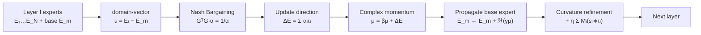

# Expert Merging in Sparse Mixture of Experts with Nash Bargaining

**Conference**: ICLR 2026  
**OpenReview**: [https://openreview.net/forum?id=JLe9xfd0ln](https://openreview.net/forum?id=JLe9xfd0ln)  
**Code**: [https://github.com/anh147/NAMEx](https://github.com/anh147/NAMEx)  
**Area**: LLM Efficiency / Sparse MoE / Expert Merging  
**Keywords**: Sparse MoE, Expert Merging, Nash Bargaining, Game Theory, Complex Momentum, CAMEx  

## TL;DR
The authors reinterpret "expert merging" in Sparse MoE as a cooperative-competitive game between experts. They derive the merging coefficients for each expert from first principles using the Nash Bargaining Solution (NBS) and incorporate complex momentum to accelerate cross-layer propagation. This results in NAMEx, a unified framework that replaces the heuristic weighting used in CAMEx.

## Background & Motivation
**Background**: Sparse MoE (SMoE) utilizes a router to select a small subset of experts for each token, expanding model capacity while maintaining constant computational costs. Beyond the routing mainstream, **expert merging** represents an underrated direction: instead of selecting experts per input, all expert parameters are fused into a unified model. This is particularly suitable for deployment under memory constraints or for auto-regressive and cross-domain transfer scenarios.

**Limitations of Prior Work**: Dominant merging methods (such as soft merging in SMEAR, top-k aggregation, and advanced curvature-aware merging in CAMEx) are essentially **heuristic weighted averages**. They rely either on routing weights or natural gradients for geometric adjustments but lack a **principled weighting mechanism** to characterize "how much effort each expert should contribute." Specifically, the dynamic variant EP-CAMEx, which propagates a base expert across layers to facilitate communication, **underperforms compared to its static version**. The authors attribute this to a lack of coordination between expert contributions.

**Key Challenge**: Experts are not simply additive; they exhibit mixed dynamics of **cooperation** (similar outputs, mutual reinforcement) and **competition/adversarial** behavior (conflicting gradient directions). Paper Figure 1 shows that cosine similarity patterns between experts vary significantly across different architectures and layers, yet linear averaging ignores this structural game.

**Goal**: To provide a coefficient derivation for expert merging based on first principles, ensuring the fusion is both Pareto efficient and capable of distinguishing between cooperation and competition.

**Core Idea**: **[Game Theory Perspective]** The authors treat the domain-vector of each expert (offset relative to the base expert) as "task gradients" in multi-task learning. Expert merging is modeled as a bargaining game, using the Nash Bargaining Solution to find the optimal update direction, superposed with complex momentum to resolve the slow convergence of EP-CAMEx.

## Method

### Overall Architecture
NAMEx is built upon the expert propagation framework of CAMEx. In each layer, it first calculates the domain-vector $\tau_i = E_i - E_m$ for each expert relative to the base expert $E_m$. These are treated as "task gradients" in a mutual game. A Nash bargaining equation is solved to obtain coefficients $\alpha_i$, and $\Delta E = \sum_i \alpha_i \tau_i$ is used to update the base expert and propagate it cross-layer. Complex momentum buffers this accumulated update direction to accelerate convergence. Finally, the curvature-aware term from CAMEx is retained for input-dependent refinement.

### Key Designs

**1. Formulating Merging as a Bargaining Game (BEM Problem).** Following the Nash bargaining framework in multi-task learning by Navon et al., each expert is treated as a player. The utility function is defined as $u_i(\Delta E) = \tau_i^\top \Delta E$. The "disagreement point" is set to 0 (no update to the base expert), and the feasible set is a ball $B_\epsilon$ of radius $\epsilon$. The Nash solution requires maximizing the product of the players' gains relative to the disagreement point under Pareto efficiency (Axiom 3.1), equivalent to solving $\arg\max_{\Delta E \in B_\epsilon} \sum_i \log(\Delta E^\top \tau_i)$. Lemma 3.2 provides a closed-form structure: the optimal direction is $\Delta E^* = \sum_i \alpha_i \tau_i$, where the coefficient vector satisfies
$$G^\top G \alpha = 1/\alpha,$$
where $G = [\tau_1, \dots, \tau_N]$ is the matrix formed by domain-vectors, and $1/\alpha$ is the element-wise reciprocal. This equation marks the watershed between NAMEx and all heuristic weightings—coefficients are products of game equilibrium rather than manual assignment.

**2. How α Encodes Cooperation and Competition.** Expanding Lemma 3.2 for a single expert yields:
$$\alpha_j \|\tau_j\|^2 + \sum_{i \neq j} \alpha_i \tau_i^\top \tau_j = \frac{1}{\alpha_j}.$$
The term $\sum_{i \neq j} \alpha_i \tau_i^\top \tau_j$ represents the interaction between the $j$-th expert and the others. If positive, others are **assisting** $j$ (consistent directions, cooperation), and $\alpha_j$ automatically **decreases** (less individual effort needed). If negative, others are **competing/dragging down** $j$, so $\alpha_j$ **increases** to maintain the equality and preserve its contribution. Notably, when all $\tau_j$ are orthogonal, this reduces to a scale-invariant solution $\alpha_j = 1/\|\tau_j\|$; when domain-vector norms are approximately equal, EP-CAMEx becomes a "trivial solution" that ignores expert interactions.

**3. Complex Momentum for Cross-layer Propagation.** The base expert in EP-CAMEx can only update for as many steps as there are model layers, leading to insufficient convergence. NAMEx introduces **complex momentum** (Lorraine et al., 2022), which is proven to be steadier and faster in cooperative-competitive games. It maintains a complex buffer $\mu^{(j)} \in \mathbb{C}^d$:
$$\mu^{(j+1)} = \beta \mu^{(j)} + \Delta E^{(j)}, \qquad E_m^{(j+1)} = E_m^{(j)} + \Re(\gamma \mu^{(j+1)}),$$
where $\beta \in \mathbb{C}$ is the complex momentum coefficient and $\Re(\cdot)$ takes the real part. The authors prove convergence bounds (Proposition 3.5), showing that a non-zero argument $\phi$ for $\beta$ (truly using complex numbers) is critical for performance.

**4. Budget Allocation: NAMEx vs. NAMEx-Full.** To align with EP-CAMEx training time, the bargaining budget is fixed at 20 iterations per batch. **NAMEx** calculates $\alpha$ once at the first layer and reuses it; **NAMEx-Full** redistributes the budget to solve the Nash equation per layer, which better captures layer-wise expert interactions and performs best in most tasks.

## Key Experimental Results

### Main Results: Language Modeling / Text Classification / Image Classification
- **WikiText-103 LM** (Table 1): NAMEx-Full-Mom achieves the lowest perplexity at both small and medium scales. For the medium scale, Test PPL drops from 35.55 (SMoE Top-2) and 36.53 (CAMEx) to **35.37**.
- **GLUE Text Classification** (Table 2, T5-Base, 8 experts/layer): NAMEx-Full-Mom is **optimal across all 7 tasks**. For instance, SST-2 reaches 95.06 (vs. CAMEx 93.80) and RTE reaches 78.15 (vs. EP-CAMEx 75.81).

| Method | SST-2 | MRPC | CoLA | RTE | MNLI |
|------|------|------|------|-----|------|
| SMoE (Top-2) | 94.35 | 91.04 | 58.43 | 74.98 | 86.72 |
| CAMEx | 93.80 | 91.16 | 58.57 | 74.72 | 86.44 |
| EP-CAMEx | 93.69 | 91.01 | 58.29 | 75.81 | 86.94 |
| NAMEx | 94.46 | 92.01 | 58.81 | 75.09 | 86.96 |
| NAMEx-Full | 94.82 | 92.80 | 59.63 | 77.83 | 87.23 |
| **NAMEx-Full-Mom** | **95.06** | **93.27** | **60.13** | **78.15** | **87.45** |

- **ImageNet-1k Classification & Robustness** (Table 3): NAMEx-Full-Mom achieves Acc@1 **84.52** (vs. CAMEx 83.29). On ImageNet-A (distribution shift), NAMEx-Mom/Full-Mom improves accuracy from 25.45 (CAMEx) to **35.05/35.27**, showing that complex momentum provides the largest gains in corruption scenarios.

### Large-scale Model Experiments
- Integrated into **DeepSeek-MoE (16B)** and **Qwen1.5-MoE (14B)**. Across MMLU/GSM8K/ARC and three routing strategies (Linear/Cosine/Stable-MoE), NAMEx-Full consistently outperforms baselines and EP-CAMEx (e.g., Stable-MoE fine-tuned MMLU 46.42 vs. base 46.17), proving scalability.

### Ablation Study

| Ablation Dimension | Setting | Finding |
|---------|------|------|
| Complex Momentum Angle $\phi$ | $\phi \in \{\pm\pi/6, \pm\pi/12, 0\}$ | $\phi=0$ (real momentum) leads to degradation; **non-zero $\phi$ is critical**; optimal $\phi$ is task-dependent. |
| Update Frequency $\Delta l$ | $\Delta l \in \{1, 2, 5, L\}$ | Frequent $\alpha$ re-solving (small $\Delta l$) is more accurate but increases runtime from 0.69s to 4.70s. |
| Disagreement Point | 0 vs. mean | Minimal difference; the method is insensitive to the choice of the disagreement point. |

### Key Findings
1. **Game structure is inherently beneficial**: Even without momentum, NAMEx-Full matches NAMEx-Mom on clean benchmarks, validating the layer-wise Nash solution.
2. **Complex momentum yields the highest gains in adversarial/distribution-shift scenarios**.
3. Synthetic experiments (Figure 11) show that while average merging may fall outside the Pareto set, NAMEx produces Pareto efficient solutions.

## Highlights & Insights
- **Elegant Perspective Shift**: Mapping the ambiguous "expert merging weights" problem to the mature framework of Nash bargaining gives the coefficients a derivation from first principles.
- **High Interpretability**: Each interaction term directly corresponds to cooperation or competition and automatically adjusts $\alpha_j$. This "bargained merging" is more convincing than black-box weights.
- **Unified Theory and Diagnosis**: By proving EP-CAMEx is a trivial case, the authors explain its performance lag and provide a clear path for improvement.
- **Plug-and-Play**: Compatible with various architectures (Swin-MoE, T5-MoE, DeepSeek-MoE, etc.) and different routing strategies.

## Limitations & Future Work
- **Computational Overhead**: Solving $G^\top G \alpha = 1/\alpha$ per layer requires multiple iterations, creating a trade-off between accuracy and efficiency.
- **Hyperparameter Sensitivity**: The complex momentum angle $\phi$ requires per-task tuning and lacks an automatic selection mechanism.
- **Modest Gains**: Improvements on large models are often within fractions of a percentage point; its value depends on the specific use case complexity.
- **Future Work**: The authors suggest **quaternion momentum** as a promising next step to further enrich the dynamic structure of expert propagation.

## Related Work & Insights
- **CAMEx / EP-CAMEx** (Nguyen et al., 2025): Direct predecessors providing the curvature-aware merging and propagation framework; NAMEx replaces their propagation step with Nash solutions.
- **Nash Bargaining for Multi-Task Learning** (Navon et al., 2022, Nash-MTL): The methodological parent; this work transfers the concept from "tasks" to "experts."
- **Complex Momentum Optimization** (Lorraine et al., 2022): Borrowed to resolve the convergence issues of EP-CAMEx in cooperative-competitive settings.
- **Insight**: Understanding parameter fusion as a multi-agent game is a transferable idea for model merging, LoRA merging, and federated aggregation—wherever multiple direction vectors must be fused.

## Rating
- **Novelty**: ⭐⭐⭐⭐ Introducing Nash bargaining to expert merging is a rare, self-consistent perspective that theoretically subsumes prior work.
- **Experimental Thoroughness**: ⭐⭐⭐⭐ Covering three modalities, robustness, 16B/14B models, multiple routing strategies, and detailed ablations with five random seeds.
- **Writing Quality**: ⭐⭐⭐⭐ Clear logic from motivation to algorithm; theoretical sections are dense but well-connected to interpretability.
- **Value**: ⭐⭐⭐⭐ Provides a principled weighting paradigm for merging that is plug-and-play and extensible to broader model fusion problems.

<!-- RELATED:START -->

## Related Papers

- [\[ICLR 2026\] One-Prompt Strikes Back: Sparse Mixture of Experts for Prompt-based Continual Learning](one-prompt_strikes_back_sparse_mixture_of_experts_for_prompt-based_continual_lea.md)
- [\[ICLR 2026\] Not All Models Suit Expert Offloading: On Local Routing Consistency of Mixture-of-Expert Models](not_all_models_suit_expert_offloading_on_local_routing_consistency_of_mixture-of.md)
- [\[ICLR 2026\] DirMoE: Dirichlet-Routed Mixture of Experts](dirmoe_dirichlet-routed_mixture_of_experts.md)
- [\[ICLR 2026\] Understanding the Mixture-of-Experts with Nadaraya-Watson Kernel](understanding_the_mixture-of-experts_with_nadaraya-watson_kernel.md)
- [\[ICML 2025\] Retraining-Free Merging of Sparse MoE via Hierarchical Clustering](../../ICML2025/llm_efficiency/retraining-free_merging_of_sparse_moe_via_hierarchical_clustering.md)

<!-- RELATED:END -->
