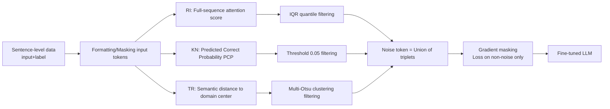

# Explainable Token-level Noise Filtering for LLM Fine-tuning Datasets

**Conference**: ICLR 2026  
**OpenReview**: [https://openreview.net/forum?id=WEEodalWQg](https://openreview.net/forum?id=WEEodalWQg)  
**Code**: TBD  
**Area**: llm_efficiency  
**Keywords**: Fine-tuning data optimization, token-level noise, gradient masking, explainability, attention scoring  

## TL;DR
Addressing the mismatch where "fine-tuning data is sentence-level, but LLM optimization is token-level," this paper proposes XTF. It decomposes the contribution of each token into three explainable attributes: Reasoning Importance (RI), Knowledge Novelty (KN), and Task Relevance (TR). Tokens lacking any of these attributes are identified as noise and masked during training. This approach improves fine-tuning accuracy by up to 13.7% across math, code, and medical tasks on 7 mainstream LLMs.

## Background & Motivation
- **Background**: Fine-tuning is a key method for adapting general LLMs to downstream tasks, with data quality determining the performance ceiling. Existing data optimization follows two paths: data filtering (removing low-quality samples) and data augmentation (expanding samples), both operating at the **sample (sentence) granularity**.
- **Limitations of Prior Work**: LLM training objectives calculate loss and update parameters **per token**, yet fine-tuning datasets use sentence-level labels, treating the entire sentence as the target. Not all tokens in a label are beneficial; training on the whole sentence indiscriminately introduces **token-level noise**, misleading convergence and degrading downstream performance.
- **Key Challenge**: Filtering noise at the token granularity requires solving two difficulties: (1) Existing explainability research focuses on how "input tokens affect generation" but fails to clarify **whether a specific token in the label has value for the fine-tuning task**; (2) Fine-tuning effectiveness depends on both the base model's existing knowledge and the target task's characteristics, meaning **noise detection cannot rely on a single criterion**. Existing token-level training works (e.g., selective LM based on loss change, token rewards for DPO) either rely on the implicit assumption that "high-quality data is noise-free" (which often fails in fine-tuning) or are limited to specific scenarios like preference alignment/distillation.
- **Goal**: Establish an **explainable, computable, and base-model/task-aware** token-level noise detection criterion to remove noise tokens from fine-tuning without modifying the model architecture.
- **Key Insight**: **Attribute decomposition**—instead of providing an ambiguous composite score for token value, "contribution" is decomposed into three orthogonal and quantifiable attributes. **If a token completely lacks any one of these attributes, it is judged as noise**, and gradient masking is used to exclude it from training.

## Method

### Overall Architecture
XTF views fine-tuning as an alignment between a "high-performance base model" and a "task dataset," measuring the value of a label token from three perspectives: **Reasoning Importance (RI)** corresponding to base model cognition, **Knowledge Novelty (KN)** corresponding to the gap between base model and task, and **Task Relevance (TR)** corresponding to task-specific knowledge. The pipeline consists of three steps: first, preprocess data and mask input tokens; second, use three "inference-level" explainable methods to score the RI/KN/TR of output label tokens, defining the noise set as the union of these three filtered categories; finally, label noise tokens as `-100` to mask gradients during training, calculating loss only on the remaining tokens.

### Key Designs
**1. Three-Attribute Noise Criterion: Moving from "Composite Scoring" to "Missing-Is-Noise"**
The authors argue that the three attributes cannot be simply weighted into a single score because they lack clear relationships or natural hierarchies. Instead, they use a more stable logic: rather than calculating how "good" a token is, identify if it **completely lacks a specific attribute**. Intuitively, even if a token affects subsequent generation (has RI) or represents knowledge unknown to the base model (has KN), if it is irrelevant to the task goal (lacks TR), it is useless noise. Formally, the noise set is the union of three missing-data categories:
$$D_{noise} = (D_{RI\downarrow}) \cup (D_{KN\downarrow}) \cup (D_{TR\downarrow})$$
This "disjunctive" criterion transforms the vague problem of "judging useful tokens" into three simple problems of "identifying clear absences from independent perspectives."

**2. Three Inference-level Scorings: Low Cost and Grounded in Base/Data**
Scoring methods are constrained to be computationally efficient and must jointly consider the base model and data, thus reusing forward signals without training reference models. **RI uses attention scores**: The input and label are concatenated and fed into the base model; the attention value for the $k$-th label token is $S_{RI}(O_k)=A(\theta, I+O)[l_I+k]$. Lower attention indicates lower importance in generation logic. **KN uses Predicted Correct Probability (PCP)**: $S_{KN}(O_k)=1-P(O_k\mid I+[O_0,\dots,O_{k-1}])$. A higher prediction probability means the token is old knowledge already mastered by the model, thus low in novelty. **TR uses semantic distance**: The entire dataset is fed into the base model to obtain the average embedding as the "domain vector" $V(Domain)$. The distance between individual token embeddings and the domain center is calculated: $S_{TR}(O_k)=1-\text{Normalize}(D(E(O_k), V(Domain)))$.

**3. Adaptive Distribution Filtering**
The authors observed distinct distribution patterns for the three scores, requiring different threshold methods. RI scores follow an extreme distribution; the **Interquartile Range (IQR)** method is used to remove extremely low scores (below $Q_1-IQR$). KN scores follow a near-**uniform distribution**; a heuristic hard threshold is used where tokens with PCP > 95% ($S_{KN}<0.05$) are treated as noise. TR scores exhibit **clustering characteristics**, and **Multi-Otsu** multi-threshold segmentation is applied, specifically skipping the cluster with the smallest mean (often spaces/placeholders) and filtering the cluster with the second-smallest mean.

**4. Aggressive Union + Conservative Thresholds**
XTF takes the **union** of the three filtered categories (aggressive) but uses **conservative thresholds** within each attribute (only cutting significant outliers). This ensures that removed tokens truly lack the attribute, while the union compensates for misses from any single perspective. The overlap between attributes does not exceed 58.3%, supporting the idea that one perspective's ambiguous noise is often clearly identified by another. The final loss function sums only over non-noise tokens:
$$L_F = -\sum_{O_k \notin N} \log P(O_k \mid I+[O_0,O_1,\dots,O_{k-1}])$$

## Key Experimental Results
- **Settings**: 3 tasks: Math (GSM8K), Code (CodeExercise/HumanEval), Medical (PubMedQA); 7 base models across DeepSeek, Llama-3, and Mistral; both Full-parameter and LoRA tuning. Baselines include Normal fine-tuning, Double Epochs, Sample-level data filtering (DF), Data Augmentation (DA), selective LM (SLM), and token cleaning (TC).

### Main Results (GSM8K Math Task, accuracy %, Excerpts)

| Model | LoRA | CA | Normal | DF | SLM | TC | **XTF** |
|---|---|---|---|---|---|---|---|
| Llama-3.2-3B | × | 3.9 | 25.8 | 36.9 | 38.8 | 38.4 | **40.5** |
| Mistral-7B | × | 8.0 | 15.0 | 21.3 | 22.6 | 24.1 | **29.1** |
| DeepSeek-1.5B | × | 17.6 | 42.9 | 47.0 | 37.3 | 38.5 | **56.2** |
| DeepSeek-7B | × | 37.9 | 63.0 | 65.5 | 63.8 | 61.9 | **69.3** |
| DeepSeek-14B | ✓ | 34.5 | 47.6 | 52.4 | 49.3 | 52.1 | **60.3** |
| **Avg** | – | 16.0 | 37.1 | 41.4 | 40.5 | 41.0 | **45.7** |

- Math Task: XTF averages 8.6% higher than Normal and 4.3% higher than the best baseline (DF). DeepSeek-1.5B (full-parameter) shows a **13.3%** gain.
- Medical Task: Average 6.7% gain over Normal; Llama-3.1-8B (LoRA) shows a **13.7%** gain.
- Code Task: pass@1/5/10 increased by up to 5.6%/5.6%/6.3%.

### Ablation Study (Attribute Combinations, Avg accuracy %)

| Case | RI | KN | TR | Avg |
|---|---|---|---|---|
| Zero | − | − | − | 30.7 |
| I | × | − | − | 32.0 |
| II | − | × | − | 34.5 |
| III | − | − | × | 33.3 |
| IV | × | × | − | 36.1 |
| V | × | − | × | 36.9 |
| VI | − | × | × | 36.3 |
| **XTF** | × | × | × | **40.1** |

- The all-active setting is consistently optimal, proving the necessity and complementarity of all three attributes.
- The **optimal two-attribute combination varies** by model and task, validating the premise that noise detection must consider the base model and task jointly.

### Key Findings
- Stronger and larger base models show more pronounced gains from noise filtering, as noise detection itself relies on the base model's knowledge level.

## Highlights & Insights
- **Explainable Deconstruction of "Token Value"**: Decomposing RI/KN/TR maps to "base cognition / model-task gap / task knowledge," making noise detection transparent rather than a black-box heuristic.
- **"Missing-Is-Noise + Disjunctive Union" is a clever engineering trade-off**: Avoiding difficult-to-calibrate composite weights enables robust, independent judgments.
- **Zero additional training cost**: Reuses existing attention/probability/embedding signals from the base model.
- **Data-centric and plug-and-play**: Only modifies `-100` labels without affecting model structure or training frameworks.

## Limitations & Future Work
- **Inference overhead**: Scoring requires a forward pass of the entire dataset, which is costly for large models.
- **Static attribute system**: Currently limited to three designed attributes; more perspectives could be introduced.
- **Heuristic thresholds**: Thresholds like 0.05 for KN or Multi-Otsu for TR are empirical and lack a more principled adaptive mechanism.

## Related Work & Insights
- **Sample-level Optimization (DF/DA)**: Traditional methods operate at sentence granularity; this work fills the gap at the token level.
- **Token-level Training**: Unlike existing works that assume high-quality data is noise-free, XTF provides a framework that does not rely on this assumption.
- **LLM Explainability**: Extends explainability from "understanding inference" to "guiding training data optimization."

## Rating
- Novelty: ⭐⭐⭐⭐ Clear identification of the token/sentence mismatch with an explainable decomposition framework.
- Experimental Thoroughness: ⭐⭐⭐⭐ Extensive coverage across 3 tasks and 7 models with full/LoRA comparisons.
- Writing Quality: ⭐⭐⭐⭐ Clear logic from motivation to filtering rules; great use of visualizations to justify thresholds.
- Value: ⭐⭐⭐⭐ Directly applicable to data cleaning for fine-tuning; the primary barrier is the one-time inference cost for scoring.

<!-- RELATED:START -->

## Related Papers

- [\[ICLR 2026\] Difficulty–Diversity Collaborative Filtering for Data-Efficient LLM Fine-Tuning](difficultydiversity_collaborative_filtering_for_data-efficient_llm_fine-tuning.md)
- [\[ICLR 2026\] CPQS-Tuning: A Model Self-Perception-Based Data Filtering Algorithm for Efficient Instruction Fine-Tuning](cpqs-tuning_a_model_self-perception-based_data_filtering_algorithm_for_efficient.md)
- [\[ICLR 2026\] Influence-Preserving Proxies for Gradient-Based Data Selection in LLM Fine-Tuning](influence-preserving_proxies_for_gradient-based_data_selection_in_llm_finetuning.md)
- [\[ICLR 2026\] MHLA: Restoring Expressivity of Linear Attention via Token-Level Multi-Head](mhla_restoring_expressivity_of_linear_attention_via_token-level_multi-head.md)
- [\[ICLR 2026\] Unlocking Full Efficiency of Token Filtering in Large Language Model Training](unlocking_full_efficiency_of_token_filtering_in_large_language_model_training.md)

<!-- RELATED:END -->
