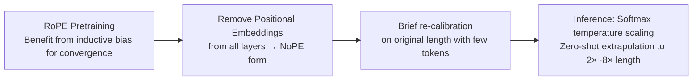

# Extending the Context of Pretrained LLMs by Dropping Their Positional Embedding

**Conference**: ICLR 2026  
**OpenReview**: [https://openreview.net/forum?id=RlPVSeKjoc](https://openreview.net/forum?id=RlPVSeKjoc)  
**Code**: Open-sourced with the submission (as stated in the paper; links to be confirmed)  
**Area**: llm_efficiency / Long-context extrapolation  
**Keywords**: Positional encoding, RoPE, NoPE, Zero-shot context extension, Long context, Post-pretraining processing  

## TL;DR
RoPE is a critical inductive bias for accelerating convergence during pretraining but serves as the root cause hindering length extrapolation. This paper proposes **DroPE**: by directly removing all positional embeddings after pretraining and performing a brief "re-calibration" with a minimal number of tokens, LLMs can zero-shot generalize to sequences far exceeding their training length without any long-context fine-tuning.

## Background & Motivation

**Background**: The quadratic complexity of Transformer attention makes pretraining directly on long sequences prohibitively expensive. Consequently, "zero-shot context extension" (extending sequences beyond the training length without long-context fine-tuning) has become a core requirement for next-generation foundation models. Rotary Positional Embedding (RoPE), which injects positional information via relative rotations of queries and keys, has become the de facto standard.

**Limitations of Prior Work**: When the inference length exceeds the pretraining length, the rotation phases of RoPE fall into Out-of-Distribution (OOD) intervals, leading to sharp performance degradation. While several RoPE frequency scaling methods (PI, NTK-RoPE, YaRN, LongRoPE2) have emerged, they still require expensive long-context fine-tuning and fail to retrieve information across long distances "out-of-the-box." Another direction involves training NoPE (No Positional Encoding) architectures from scratch, but NoPE consistently underperforms RoPE during training and lacks popularity.

**Key Challenge**: Positional encoding poses a fundamental dilemma: it provides a strong inductive bias that significantly accelerates convergence during pretraining (benefit), but the model’s "over-reliance" on this explicit positional information is exactly what prevents it from extrapolating to unseen lengths (drawback). RoPE scaling methods attempt to bridge this gap but inevitably compress low frequencies, thereby distorting attention heads responsible for semantic matching.

**Goal**: Is it possible to enjoy the inductive bias of positional encoding only during the pretraining phase and discard it afterward, achieving both "fast training" and "good extrapolation"?

**Key Insight (Use then Discard)**: This paper provides an affirmative answer. RoPE is a **transient but critical training inductive bias**. By using it to establish position awareness during pretraining and removing it entirely upon completion—followed by a brief re-calibration on original-length tokens—the model retains its original capabilities while unlocking powerful zero-shot length generalization.

## Method

### Overall Architecture
DroPE (Dropping Positional Embeddings) does not change the standard training pipeline. Instead, it performs "removal + re-calibration" on top of a Transformer already pretrained with RoPE: take a RoPE checkpoint → remove positional embeddings from every layer (degrading to a pure causal attention in NoPE form) → continue training briefly on the original context length (re-calibration) → apply softmax temperature scaling during inference for extrapolation. This logic is supported by three progressive observations: PE is beneficial during training (Obs 1), RoPE scaling is destined to fail at extrapolation (Obs 2), and PE can be safely removed after training (Obs 3).

### Key Designs

**1. Root Cause Diagnosis: PE as the root of the trade-off.** The paper quantifies the non-uniformity of attention heads using an attention positional bias functional $A_c(\alpha)=\frac{1}{T}\sum_i\sum_{j\le i}c_{ij}\alpha_{ij}$ (e.g., diagonal heads concentrate mass on the current token, maximizing $A_c$). Theoretically (Theorem 3.4), NoPE embeddings are nearly uniform at initialization, and this uniformity propagates through layers, causing the gradient of $A_c$ to be bounded by a small constant $C\varepsilon$ independent of sequence length. Thus, positional non-uniformity develops slowly in NoPE, leading to slow training. Conversely, RoPE (Prop 3.3) generates non-zero $A_c$ gradients even on constant sequences, explaining its fast training—but once explicit positional information is baked in, it becomes a constraint during extrapolation.

**2. Why RoPE Scaling Fails: Compressing low frequencies shifts semantic heads.** In each $(2m, 2m+1)$ subspace, the RoPE phase for relative distance $\Delta$ is $\phi_m(\Delta)=\omega_m\Delta$. To extend $\Delta$ from $C_{train}$ to $C_{test}=sC_{train}$ without phase overflow, scaling methods must set $\gamma_m \le 1/s$ to compress low frequencies. The problem is that high frequencies are primarily used by **positional heads** (patterns based on relative positions like diagonal/previous tokens), while low frequencies are used by **semantic heads** (content-based retrieval). Methods like YaRN/PI/NTK leave high frequencies intact but compress low frequencies heavily. Positional heads remain unaffected, but semantic heads are severely shifted, with distortion increasing as $\phi_m(\Delta)$ grows. Consequently, perplexity is maintained (positional heads survive), but long-range retrieval fails—empirical tests show YaRN’s zero-shot behavior is effectively a "crop back to training length."

**3. DroPE "Use then Discard": Removal + Short Re-calibration + Temperature Scaling.** Since PE is beneficial for training but harmful for extrapolation, the cleanest approach is to remove it after pretraining. Specifically, RoPE rotations are removed from each layer (converting to NoPE, which still implicitly encodes position via causal masks), and a brief re-calibration is performed on the **original training length**. Because the model has already inherited mature positional awareness from the RoPE phase, it does not need to learn from scratch like NoPE and recovers original performance with very few tokens. This can be integrated into pretraining (e.g., replacing the last 2K steps of a 16K-step RoPE run with DroPE) or applied to existing models (e.g., SMOLLM, LLaMA2-7B) with a budget of only 0.5%~2% of pretraining. To support high learning rates during re-calibration, QKNorm is added (without changing capacity), and softmax temperature scaling is applied during inference to stabilize extrapolation.

## Key Experimental Results

### Main Results

Zero-shot NIAH (2× training context, success rate over 500 trials):

| Method | Multi-Query | Multi-Key | Multi-Value |
|------|------------|-----------|-------------|
| RoPE transformer | 0.0 | 0.0 | 0.0 |
| RoPE + PI | 0.0 | 0.0 | 0.0 |
| RoPE + NTK | 21.1 | 19.4 | 16.5 |
| RoPE + YaRN | 17.8 | 0.5 | 14.6 |
| ALiBi | 5.2 | 0.0 | 1.1 |
| NoPE | 9.2 | 36.2 | 21.4 |
| RNoPE-SWA | 5.2 | 25.6 | 20.6 |
| **DroPE** | **28.0** | **41.6** | **23.3** |

LongBench average scores (SMOLLM, pretrained on 2048 context):

| Method | MultiFieldQA | MuSiQue | GovReport | LCC | NIAH | Avg. |
|------|------|------|------|------|------|------|
| SMOLLM (base) | 4.03 | 0.4 | 4.48 | 5.99 | 0.0 | 2.98 |
| + PI | 13.68 | 2.45 | 5.67 | 11.52 | 0.0 | 6.66 |
| + NTK | 18.87 | 4.89 | 23.71 | 8.26 | 29.84 | 17.11 |
| + YaRN | 20.78 | 4.77 | 15.03 | 10.87 | 48.25 | 19.94 |
| **SMOLLM-DROPE** | **29.33** | **7.93** | 21.87 | **18.56** | **74.92** | **30.52** |

DroPE improves the base SMOLLM average score by **over 10x**.

### Ablation Study

Long NIAH success rate across extrapolation factors:

| Method | 2× | 4× | 8× |
|------|------|------|------|
| SMOLLM + NTK | 29.84 | 14.37 | 7.19 |
| SMOLLM + YaRN | 48.25 | 25.62 | 12.18 |
| SMOLLM + LongRoPE2 | 44.20 | 26.20 | 16.45 |
| **SMOLLM-DROPE** | **74.92** | **55.00** | **52.20** |

Length generalization on larger models (LongBench Avg.):

| Model | Base | NTK | YaRN | DroPE |
|------|------|------|------|------|
| SMOLLM-1.7B | 3.11 | 18.53 | 16.23 | **21.49** |
| LLaMA2-7B | 20.03 | 21.88 | 19.14 | **26.08** |

### Key Findings
- **Zero-cost pretraining integration**: Replacing the last 2K steps of a 16K-step RoPE run with DroPE matches the perplexity of full RoPE training while outperforming NoPE baselines.
- **Fast recovery**: On off-the-shelf SMOLLM, DroPE recovers 95%+ of original performance using <5B tokens (0.8% of budget). Extending re-calibration to 120B tokens can surpass the original model.
- **Scaling advantage**: At 8× extrapolation, YaRN/LongRoPE2 drop to 12–16, while DroPE maintains 52.2. The gap widens with higher extrapolation factors.
- **Scalability**: Successfully applied to SMOLLM-1.7B (2% budget) and LLaMA2-7B (0.5% budget), consistently outperforming SOTA RoPE scaling methods.

## Highlights & Insights
- **Counter-intuitive but Clean**: While the industry assumes PE is a permanent necessity, this paper treats it as a "disposable training scaffold." Dropping it entirely yields better results.
- **Theory-Mechanism Alignment**: Using $A_c$ gradient bounds (Theorem 3.4) to explain NoPE's slow training and the "shifting semantic heads" theory to explain RoPE scaling failures creates a strong logical loop.
- **Practical Utility**: DroPE is easy to integrate into existing pipelines and can upgrade any pretrained LLM for long-context tasks with a minimal (<1%) additional budget.

## Limitations & Future Work
- **Requirement for Re-calibration**: Although the cost is low, the method is not "zero-training"; removing PE requires QKNorm and a short training phase.
- **Temperature Scaling Dependency**: NoPE/DroPE reliance on softmax temperature scaling for extrapolation needs further validation for robustness at extreme lengths (>8×).
- **Maximum Scale**: Experiments are limited to the LLaMA2-7B scale; performance on massive models (>100B) or complex long-context agent tasks is yet to be explored.
- **NoPE Implicit Capacity**: The model relies entirely on causal masks for implicit position encoding after dropping PE. Whether this is sufficient for extreme lengths remains an open question.

## Related Work & Insights
- **RoPE Scaling Family**: PI, NTK-RoPE, YaRN, and LongRoPE2 are the primary baselines. The paper mechanically demonstrates why their extrapolation is structurally limited.
- **RoPE Variants**: p-RoPE, RNoPE-SWA, and SWAN-GPT occupy the middle ground between RoPE and NoPE. This paper returns to NoPE but solves its training dynamics issue via the "RoPE-then-Drop" strategy.
- **NoPE Theory**: Following Kazemnejad and Haviv, who showed NoPE can reconstruct positions via causal masks, this work extends the theory by explaining NoPE’s training slowdown through gradient dynamics.
- **Inspiration**: Inductive biases do not have to be permanent; they can be designed as stage-specific scaffolds to be removed for better generalization.

## Rating
- **Novelty**: ⭐⭐⭐⭐⭐ Fundamentally rethinks the role of PE with strong theoretical backing.
- **Experimental Thoroughness**: ⭐⭐⭐⭐ Solid coverage of multiple scenarios (scratch vs. off-the-shelf), models, and tasks, though model scale is relatively small.
- **Writing Quality**: ⭐⭐⭐⭐⭐ Clear logical progression with well-integrated mechanics and data.
- **Value**: ⭐⭐⭐⭐⭐ Directly applicable training/upgrade paradigm for long-context foundation models.

<!-- RELATED:START -->

## Related Papers

- [\[ICLR 2026\] The Pensieve Paradigm: Stateful Language Models Mastering Their Own Context](the_pensieve_paradigm_stateful_language_models_mastering_their_own_context.md)
- [\[ACL 2025\] Mitigating Posterior Salience Attenuation in Long-Context LLMs with Positional Contrastive Decoding](../../ACL2025/llm_efficiency/mitigating_posterior_salience_attenuation_in_long-context_llms_with_positional_c.md)
- [\[ICLR 2026\] STEM: Scaling Transformers with Embedding Modules](stem_scaling_transformers_with_embedding_modules.md)
- [\[ICLR 2026\] Let's (not) just put things in Context: Test-time Training for Long-context LLMs](lets_not_just_put_things_in_context_test-time_training_for_long-context_llms.md)
- [\[ICLR 2026\] Tactic: Adaptive Sparse Attention with Clustering and Distribution Fitting for Long-Context LLMs](tactic_adaptive_sparse_attention_with_clustering_and_distribution_fitting_for_lo.md)

<!-- RELATED:END -->
