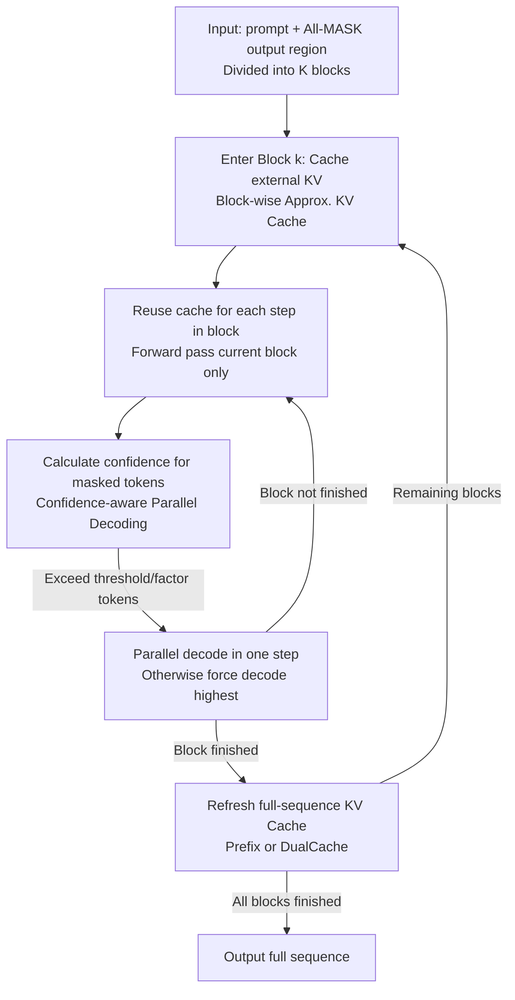

# Fast-dLLM: Training-free Acceleration of Diffusion LLM by Enabling KV Cache and Parallel Decoding

**Conference**: ICLR 2026  
**OpenReview**: [https://openreview.net/forum?id=3Z3Is6hnOT](https://openreview.net/forum?id=3Z3Is6hnOT)  
**Code**: https://nvlabs.github.io/Fast-dLLM  
**Area**: LLM Efficiency / Diffusion LLM  
**Keywords**: Diffusion LLM, KV Cache, Parallel Decoding, Inference Acceleration, Confidence Threshold

## TL;DR
Fast-dLLM accelerates bidirectional Diffusion LLMs without retraining by introducing a block-wise approximate KV Cache and replacing fixed top-K parallel decoding with a "confidence threshold" strategy. It achieves up to a 27.6× end-to-end throughput gain on LLaDA and Dream with almost no loss in accuracy.

## Background & Motivation
**Background**: Diffusion Large Language Models (LLMs) generate text in a non-autoregressive "mask-and-denoise" manner. Theoretically, they can recover multiple tokens in parallel and naturally support bidirectional attention. Commercial systems (e.g., Mercury, Gemini Diffusion) have reached speeds of thousands of tokens per second, raising expectations for their acceleration potential.

**Limitations of Prior Work**: However, the actual inference speed of open-source Diffusion LLMs often lags behind autoregressive (AR) models. This is due to two reasons: ① **Inability to use KV Cache**: AR models cache Key/Value pairs of historical tokens to avoid redundant computation, while diffusion models perform full attention across the entire sequence at every step, lacking a "look-forward only" causal structure for direct cache reuse; ② **Quality degradation in parallel decoding**: Models like LLaDA perform best with token-by-token decoding; once multiple tokens are decoded simultaneously, generation quality collapses rapidly.

**Key Challenge**: The root cause of parallel decoding failure is the conditional independence assumption in $\tau$-leaping: it approximates the true joint distribution $p(x^i_s, x^j_s\mid x_t)$ using the product of marginal probabilities $\prod_j p(x^j_s\mid x_t)$, ignoring token dependencies (e.g., $p(x^j_s\mid x_t, x^i_s)$). When co-dependent tokens are decoded at once, it results in combinations like "high house" that are locally plausible but globally nonsensical. Diffusion LLMs are thus stuck: they must choose between quality (one token per step, slow) or speed (parallel decoding, broken).

**Goal**: To simultaneously solve the lack of KV Cache and quality issues in parallel decoding without retraining, bringing the practical throughput of Diffusion LLMs to competitive levels with AR models.

**Key Insight**: The authors made two critical observations: first, when generation is performed **block-wise**, the cosine similarity of prefix/suffix KV activations between adjacent denoising steps is nearly 1, meaning the cache, while "imprecise," is "good enough" for reuse. Second, quality collapse in parallel decoding primarily occurs with low-confidence tokens. By **only decoding tokens the model is highly certain about**, dependency disruptions can be avoided in most cases.

**Core Idea**: Use "block-wise approximate KV Cache" and "confidence-aware parallel decoding" as two training-free plugins to eliminate redundant computation and unsafe parallel steps in Diffusion LLMs.

## Method

### Overall Architecture
Fast-dLLM is built on Masked Diffusion Models (MDM) and organizes the generation process in a **block-sequential** manner: the output region is divided into blocks of length $B$, solved one by one from left to right. The framework consists of two orthogonal and complementary components: **Block-wise Approximate KV Cache** eliminates redundant cross-step attention, and **Confidence-aware Parallel Decoding** increases the number of tokens decoded per step without sacrificing quality. Both are pure inference-time strategies requiring no weight changes or fine-tuning.

The procedure (Algorithm 1) is as follows: Fill the region following the prompt with `[MASK]` and initialize the KV Cache. Before entering a block, pre-calculate and cache the Keys/Values for all tokens **outside** that block. During each denoising step within the block, reuse this cache to perform a forward pass only on the current block, calculate confidence for each masked token, and decode all tokens exceeding the threshold at once (if none exceed it, the highest confidence token is decoded to ensure progress). After the block is fully decoded, the full-sequence KV Cache is refreshed before proceeding to the next block.

### Key Designs

**1. Block-wise Approximate KV Cache: Trading redundant full attention for "step-invariant" activations.**
The bidirectional nature of Diffusion LLMs prevents **exact** KV Caching as in AR models. However, the authors observed that when localized to block-wise generation, the cosine similarity of Key-Value activations between inference steps $i$ and $j$ remains near 1 for adjacent steps ($i \approx j$). This implies that during the decoding of a block, Key/Values for the prefix (and masked suffix) are nearly invariant. Thus, external KV can be cached once and reused throughout the block's denoising steps, reducing full-sequence attention $O(L)$ to block-length attention. This cache refresh is **fused** with the final decoding step, adding **zero additional computational cost** compared to the baseline.

The authors further proposed **DualCache**, which caches both the prefix and the "all-masked" suffix. This is particularly effective for long prefill (e.g., 8-shot) or long generation (e.g., 1024 tokens), contributing significantly to the observed 27.6× peak speedup.

**2. Confidence-aware Parallel Decoding: Decoding only "certain" tokens to bypass the conditional independence trap.**
Instead of complex auxiliary models, Fast-dLLM calculates confidence $c_i = \max_x p_\theta(x_i\mid\cdot)$ (maximum softmax probability) for each masked token. **Only tokens exceeding a global threshold $\tau$ are decoded simultaneously**, while others remain masked for later steps. This contrasts with LLaDA's fixed top-K approach, which may force-decode uncertain tokens where dependencies are most vulnerable.

This strategy is supported by Theorem 1: If $n$ tokens to be decoded in parallel satisfy high confidence $p_j(x_{i_j}\mid E) > 1-\epsilon$, then for $(n+1)\epsilon \le 1$, **greedy parallel decoding results match greedy sequential decoding exactly**. Intuition: when tokens are sufficiently certain, residual dependencies are insufficient to change the joint optimal solution, making parallel decoding "safe."

**3. Factor-based Parallel Decoding: Converting the theorem into adaptive decoding rules.**
To avoid static hyperparameter tuning of $\tau$, the **factor-based** variant selects the **maximum** $n$ such that $(n+1)(1-c_{(n)}) < f$, where $c_{(n)}$ is the $n$-th highest confidence and $f$ is a fixed decoding factor. This mirrors the $(n+1)\epsilon \le 1$ condition, allowing the degree of parallelism to scale dynamically based on model certainty.

### Loss & Training
The method is **purely inference-time and training-free**. It introduces no new parameters and requires no fine-tuning of pre-trained MDMs like LLaDA or Dream. Primary hyperparameters include cache block size (default 32) and confidence threshold (default 0.9).

## Key Experimental Results

### Main Results
Throughput (token/sec) measured on NVIDIA A100 80GB for LLaDA-Instruct and Dream-Base across several benchmarks.

| Model / Task | Gen Length | Baseline Throughput | +Cache | +Parallel | Fast-dLLM (Cache+Parallel) | Accuracy Change |
|--------------|------------|---------------------|--------|-----------|---------------------------|-----------------|
| LLaDA · GSM8K(5-shot) | 256 | 6.7 (1×) | 21.2 (3.2×) | 16.5 (2.5×) | 54.4 (**8.1×**) | 79.3→78.5 |
| LLaDA · GSM8K(5-shot) | 512 | 3.2 (1×) | 10.4 (3.3×) | 18.6 (5.8×) | 35.3 (**11.0×**) | 77.5→77.2 |
| LLaDA · MBPP(3-shot) | 512 | 4.3 (1×) | 10.1 (2.3×) | 22.3 (5.1×) | 39.5 (**9.2×**) | 14.8→13.8 |
| Dream · MBPP(3-shot) | 512 | 9.4 (1×) | 26.7 (2.8×) | 37.6 (4.0×) | 73.6 (**7.8×**) | 55.6→55.2 |
| Dream · GSM8K(5-shot) | 256 | 9.1 (1×) | 32.5 (3.6×) | 14.2 (1.6×) | 48.2 (**5.3×**) | 75.0→74.8 |

Both components are effective independently, and their combination provides maximal gains with minimal accuracy loss (often within 1-2%). For multimodal LLaDA-V, Fast-dLLM achieves up to **9.9×** speedup on MathVista.

### Ablation Study
DualCache provides the greatest gains in long prefill/generation scenarios (LLaDA, Gen Length 1024):

| Config (8-shot, Len 1024) | Accuracy | Throughput (Gain) | Note |
|---------------------------|----------|-------------------|------|
| Baseline | 77.3 | 0.7 (1×) | Sequential |
| Parallel + No Cache | 78.0 | 9.3 (13.3×) | Confidence-only |
| Parallel + PrefixCache | 75.7 | 13.0 (18.6×) | Prefix only |
| Parallel + DualCache | 76.0 | 19.3 (**27.6×**) | Prefix + Suffix |

### Key Findings
- **Orthogonal Complementarity**: KV Cache reduces computation per step, while Parallel Decoding reduces the number of steps. Their combination yields a multiplicative speedup.
- **Confidence Strategy > Fixed top-K**: At the same "average tokens per step," threshold-based decoding consistently maintains higher accuracy than fixed top-K baselines.
- **Long Sequence Sweet Spot**: Longer prefill and generation lengths allow for more cache reuse, making DualCache increasingly efficient.
- **Block Size Trade-off**: Larger blocks increase approximation errors and decrease accuracy. A block size of 32 provides an optimal balance.

## Highlights & Insights
- **"Approximate but Good Enough" KV Cache**: By demonstrating that bidirectional attention activations are step-invariant in blocks, the authors converted a theoretical impossibility into a practical approximation.
- **Zero-overhead Refresh**: Integrating cache refreshes with decoding steps allows the speedup to be attained with no additional forward pass overhead.
- **Theory-Algorithm Alignment**: Theorem 1 provides a mathematical foundation that translates directly into the factor-based decoding rule.
- **Training-free and Plug-and-play**: The method requires no weight modifications, making it highly attractive for deployment on existing models.

## Limitations & Future Work
- The approximate KV Cache accumulates errors; accuracy drops significantly if the block size is too large, requiring per-task tuning.
- Speedup is highly dependent on sequence and prefill length; gains are more modest (2–3.7×) in short-sequence scenarios.
- The confidence threshold/factor remains a hyperparameter that may need tuning for different tasks.
- Generalizability to other diffusion language model paradigms beyond LLaDA/Dream remains to be verified.

## Related Work & Insights
- **vs. LLaDA Native top-K**: LLaDA's fixed top-K forces decoding of uncertain tokens. Fast-dLLM's dynamic selection based on confidence ensures token safety and higher quality.
- **vs. Auxiliary Dependency Modeling**: While some work trains auxiliary models to capture token dependencies, Fast-dLLM achieves similar goals through a simple confidence criterion and theoretical bounds.
- **vs. Autoregressive KV Cache**: Whereas AR KV Cache is exact, this work successfully ports efficiency logic to the bidirectional diffusion paradigm through "block-wise approximation."

## Rating
- Novelty: ⭐⭐⭐⭐ 
- Experimental Thoroughness: ⭐⭐⭐⭐⭐ 
- Writing Quality: ⭐⭐⭐⭐ 
- Value: ⭐⭐⭐⭐⭐ 

<!-- RELATED:START -->

<!-- RELATED:END -->

## Related Papers

- [\[ICLR 2026\] Dynamic-dLLM: Dynamic Cache-Budget and Adaptive Parallel Decoding for Training-Free Acceleration of Diffusion LLM](dynamic-dllm_dynamic_cache-budget_and_adaptive_parallel_decoding_for_training-fr.md)
- [\[ICLR 2026\] Learning to Parallel: Accelerating Diffusion Large Language Models via Learnable Parallel Decoding](learning_to_parallel_accelerating_diffusion_large_language_models_via_learnable_.md)
- [\[ICLR 2026\] Fast-dLLM v2: Efficient Block-Diffusion LLM](fast-dllm_v2_efficient_block-diffusion_llm.md)
- [\[ICLR 2026\] Attention Is All You Need for KV Cache in Diffusion LLMs](attention_is_all_you_need_for_kv_cache_in_diffusion_llms.md)
- [\[ICLR 2026\] Hierarchy Decoding: A Training-free Parallel Decoding Strategy for Diffusion Large Language Models](hierarchy_decoding_a_training-free_parallel_decoding_strategy_for_diffusion_larg.md)

<!-- RELATED:END -->
