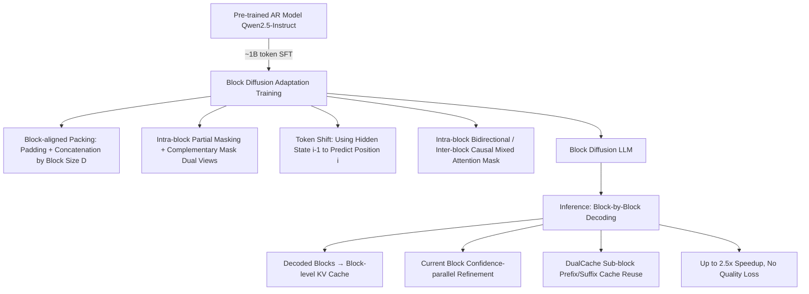

# Fast-dLLM v2: Efficient Block-Diffusion LLM

**Conference**: ICLR 2026  
**OpenReview**: [https://openreview.net/forum?id=1NZ3DHF9nT](https://openreview.net/forum?id=1NZ3DHF9nT)  
**Code**: [https://nvlabs.github.io/Fast-dLLM/v2/](https://nvlabs.github.io/Fast-dLLM/v2/)  
**Area**: LLM Inference Acceleration / Diffusion Language Models  
**Keywords**: Block Diffusion, Parallel Decoding, AR Model Adaptation, Hierarchical Caching, Complementary Masking  

## TL;DR
Fast-dLLM v2 transforms pre-trained autoregressive Qwen2.5 models into block-diffusion language models via lightweight fine-tuning with approximately 1B tokens. Combined with hierarchical caching and confidence-based parallel decoding, it achieves up to 2.5× speedup over AR decoding without performance degradation.

## Background & Motivation
**Background**: Autoregressive (AR) LLMs dominate deployment via next-token prediction, but strict token-by-token left-to-right decoding fails to exploit parallelism, limiting inference efficiency. Diffusion Language Models (dLLMs) allow joint prediction/refinement of multiple tokens or entire blocks, theoretically offering higher parallelism. Representative works like LLaDA (trained from scratch) and Dream (adapted from Qwen2.5) have scaled to 7B parameters.

**Limitations of Prior Work**: Pure diffusion dLLMs face practical issues: bidirectional attention makes KV cache reuse difficult, resulting in inference latency often higher than AR models. Most require fixed sequence lengths, lacking flexibility in generation length. The previously proposed DualCache in Fast-dLLM uses approximate KV caching, which is not equivalent to the original computation and does not fundamentally solve the incompatibility between dLLMs and KV caches. Block Diffusion (BD3-LMs) interpolates between the two paradigms via "inter-block autoregression, intra-block diffusion," gaining flexible lengths and inter-block KV caching, but this has only been validated on small models and traditional LM metrics; its scalability to SOTA large models remains unknown.

**Key Challenge**: The goal is to achieve the parallel decoding efficiency of diffusion without the massive data cost of training a diffusion model from scratch (Dream requires ~500B tokens for fine-tuning), while maintaining the generation quality of the original AR model.

**Goal**: To adapt mature pre-trained AR models into deployable block-diffusion LLMs at a **low cost**, achieving real speedup without quality loss.

**Core Idea**: **[AR-friendly Block Diffusion Design]** Utilizes a block-level attention structure similar to the original AR model, making the adaptation process naturally compatible and data-efficient—achieving lossless adaptation with only ~1B tokens (500× less than Dream). **[Hierarchical Caching + Intra-block Parallelism]** Block-level caching reuses historical context, while sub-block caching supports parallel generation within partially decoded blocks. Together with DualCache, this translates the parallel potential of diffusion into actual throughput gains.

## Method

### Overall Architecture
Fast-dLLM v2 consists of two stages: **Training side**, where Qwen2.5-Instruct (1.5B/7B) is transformed into a block-diffusion model via SFT—sequences are aligned and packed by block size D, performing next-token prediction with partial masking within blocks, using complementary masks to ensure every token is supervised. **Inference side**, decoding proceeds block-by-block autoregressively. Decoded blocks are cached as read-only prefix contexts, while the current block uses confidence-based parallel refinement + DualCache reuse. The key is maintaining consistent mixed attention masks (intra-block bidirectional, inter-block causal) during both training and inference.

### Key Designs

**1. Data-efficient AR-to-Block-Diffusion Adaptation: Maintaining Quality via Block-aligned Packing.** Unlike the full-attention diffusion in Dream, Fast-dLLM v2 deliberately adopts a block-level attention structure similar to the original AR model, significantly reducing data requirements. Specifically, each sample is padded with [MASK] to an integer multiple of the block size D (padding is ignored in the loss), and multiple padded sequences are concatenated into a long stream and cut into training sequences of fixed context length L. Thus, each sequence is naturally divided into $B = L/D$ aligned non-overlapping blocks. This ensures batch efficiency and prevents block boundaries from crossing sample boundaries, which would cause cross-sample information leakage under bidirectional attention.

**2. Complementary Masking + Token Shift: Ensuring Supervision for All Tokens and Preserving AR Representations.** A binary mask $m \in \{0,1\}^D$ is randomly sampled within a block ($m_j=1$ indicates replacement with a learnable [MASK] embedding). Each sample is duplicated into two views in the same batch: one with mask $m$ and one with its complement $\bar{m}=1-m$. This ensures tokens masked in one view are predicted in the other, providing supervision for all tokens. To preserve the representation quality of the pre-trained AR model, a shifted-label strategy is used: the prediction for masked position $i$ uses the logit from its preceding position $i-1$, consistent with the next-token mechanism of causal LMs. Training only calculates cross-entropy on masked tokens:
$$\mathcal{L}_{block}(\theta) = -\mathbb{E}_{x,m}\left[\sum_{i=1}^{L} \mathbb{1}[x_t^i = \text{[MASK]}]\log p_\theta(x_0^i \mid x_{<i}, x_{block(i)})\right]$$
where $x_{block(i)}$ represents all tokens (masked and unmasked) in the block containing position $i$, and $x_{<i}$ are clean tokens from earlier blocks. For attention, the noisy sequence $x_t$ and clean sequence $x_0$ are concatenated along the sequence dimension to a length of $2L$, using a mixed mask $A \in \{0,1\}^{2L\times 2L}$ to support intra-block parallelism and inter-block causality, efficiently implemented via flex-attention.

**3. Hierarchical Caching + Confidence Parallel Decoding: Converting Diffusion Potential into Actual Throughput.** Inference proceeds block-by-block, maintaining left-to-right semantics between blocks. Once a block is decoded, its unmasked tokens are cached as read-only context for subsequent blocks, enabling block-level KV reuse and reducing redundant computation. Within the current block, confidence-aware parallel decoding is used: masked tokens are iteratively refined based on prediction confidence. Tokens exceeding a threshold are decoded in parallel and unmasked, while uncertain ones remain for later. Setting the threshold to 1.0 degrades to standard non-parallel decoding; a threshold of 0.9 on GSM8K increases throughput from 39.1 to 101.7 tokens/s (2.6× speedup) with only a minor accuracy drop. Intra-block DualCache maintains prefix and suffix KV caches for partially decoded blocks, supporting iterative selective decoding without expensive recomputation.

**4. Sub-block Decoding: Decoupling Training-Inference Block Sizes to Avoid Mismatch Degradation.** The training block size is fixed at 32, but changing the block size directly during inference causes significant performance drops due to training-inference inconsistency (e.g., GSM8K drops from 62.0 to 58.5). By introducing sub-block decoding (with a fixed sub-block size of 8), inference granularity can be flexibly controlled without disrupting block structure consistency, achieving better performance across different tasks—optimum sub-block size is task-dependent (GSM8K prefers smaller, HumanEval performs better at 8).

## Key Experimental Results

### Main Results Table
Adapted from Qwen-2.5 1.5B/7B Instruct, trained using LLaMA-Nemotron post-training data on 64× A100 (1.5B trained for ~8h, 7B for ~12h).

| Model | #Params | HumanEval(Base/Plus) | MBPP(Base/Plus) | GSM8K | Math | IFEval | MMLU | GPQA | Avg. |
|---|---|---|---|---|---|---|---|---|---|
| Qwen2.5-1.5B | 1.5B | 42.1/37.2 | 48.1/41.3 | 57.0 | 46.8 | 41.2 | 54.6 | 30.6 | 44.3 |
| Qwen2.5-1.5B-Nemo-FT | 1.5B | 37.2/33.5 | 53.4/44.4 | 58.5 | 43.5 | 39.4 | 58.1 | 31.0 | 44.3 |
| **Ours (Fast-dLLM v2)** | 1.5B | 43.9/40.2 | 50.0/41.3 | 62.0 | 38.1 | 47.0 | 55.1 | 27.7 | **45.0** |
| Dream | 7B | 57.9/53.7 | 68.3/56.1 | 81.0 | 39.2 | 62.5 | 67.0 | 33.0 | 57.6 |
| Qwen2.5-7B-Nemo-FT | 7B | 52.4/48.2 | 57.1/50.0 | 84.1 | 72.0 | 69.5 | 68.6 | 34.2 | 59.6 |
| **Ours (Fast-dLLM v2)** | 7B | 63.4/58.5 | 63.0/52.3 | 83.7 | 61.6 | 61.4 | 66.6 | 31.9 | **60.3** |

The 7B version reaches an Avg. of 60.3, surpassing Qwen2.5-7B-Nemo-FT (59.6) and Dream (57.6), with significant leads in code generation (HumanEval 63.4). The 1.5B version Avg. of 45.0 sets a new SOTA for 1B-class diffusion/AR models. In terms of throughput, Fast-dLLM v2 (7B) is 2.54× faster than Qwen2.5-7B-Instruct and shows +5.2% accuracy over Fast-dLLM-LLaDA.

### Ablation Study
Deconstructing the training recipe (Complementary Masking CM + padding) on the 1.5B model:

| Method | HumanEval(Base/Plus) | MBPP(Base) | GSM8K | Avg. |
|---|---|---|---|---|
| Naive token shift | 38.4/32.9 | 44.4 | 59.0 | 41.3 |
| + pad | 38.4/34.1 | 45.2 | — | — |
| **+ pad + CM (Full Recipe)** | — | — | — | **+3.7 over naive** |

The full recipe improves the average score by +3.7 over the naive version. Padding prevents cross-sample attention leakage during sequence packing (critical for bidirectional attention), and CM ensures all tokens are supervised. Ablations on sub-block/block sizes show that a sub-block size of 8 is generally optimal; altering the block size at inference (mismatching training) significantly degrades performance (GSM8K 62.0→58.5), confirming the importance of training-inference block consistency.

### Key Findings
- **Data Efficiency is the Core Selling Point**: Lossless adaptation with only ~1B tokens of fine-tuning, 500× less than Dream's ~500B tokens, due to the block-level attention's similarity to the original AR model.
- **Confidence Threshold of 0.9 is the Throughput-Quality Sweet Spot**: Achieves 2.6× speedup on GSM8K with minimal accuracy loss; lower thresholds enable more aggressive parallelism and higher throughput.
- **Greater Gains on Newer Hardware**: In batch scaling, diffusion achieves up to 1.5× throughput on A100 and 1.8× on H100, indicating that diffusion decoding better utilizes parallel hardware.

## Highlights & Insights
- **Paradigm of "Adaptation" over "Retraining"**: By leveraging the similarity between block-level attention and original AR structures, diffusion capability is treated as a low-cost "graftable" decoding mode rather than a replacement model, offering high engineering feasibility.
- **Engineering Insights on Training-Inference Consistency**: The paper explicitly identifies block size mismatch as a cause for performance drops and uses sub-block decoding to elegantly decouple inference granularity from training block structure.
- **Hierarchical Cache Design**: The two-level reuse of block-level cache (inter-block) and DualCache (intra-sub-block) bypasses the notorious KV cache incompatibility of dLLMs through engineering solutions.
- **Potential as a Speculative Decoding Draft Model**: The paper notes that Fast-dLLM v2-7B is nearly 10× faster than Dream-7B, making it a promising draft model for speculative decoding.

## Limitations & Future Work
- **DualCache is Still an Approximation**: Intra-block reuse remains an approximate KV cache, not strictly equivalent to original computation, an issue the authors acknowledge as not fundamentally solved.
- **Degradation in Certain Metrics Relative to AR**: The 7B version scores lower than pure AR fine-tuning baselines in Math (61.6 vs Nemo-FT 72.0), MMLU, and GPQA, indicating a quality cost for block diffusion in knowledge-intensive or complex reasoning tasks.
- **Task-dependent Sub-block/Block Sizes**: Optimal granularity varies by task, requiring manual tuning due to the lack of an adaptive selection mechanism.
- **Scaling Upper Bound**: Validated only up to 7B; data efficiency and quality retention at larger scales (e.g., 70B+) remain to be verified.
- **Future Directions**: Integration with speculative decoding, more aggressive adaptive threshold/granularity scheduling, and extension of the adaptation paradigm to MoE and long-context scenarios.

## Related Work & Insights
- **Block Diffusion Foundation**: BD3-LMs (Arriola 2025) first proposed the interpolation paradigm of inter-block AR and intra-block diffusion. This work scales it to large LLMs and resolves training-inference mismatch. SDAR (concurrent work) also fine-tunes AR to block diffusion, but this work distinguishes itself through data efficiency (1B tokens) and decoding robustness (sub-block decoding + complementary masking).
- **Masked Diffusion LLMs**: LLaDA (trained from scratch) and Dream (adapted from Qwen2.5, ~500B tokens) are prominent 7B dLLMs. This work achieves comparable or superior quality with 500× less data.
- **dLLM Acceleration**: Caching methods like DualCache (Fast-dLLM), dKV-Cache, dLLM-Cache, Sparse-dLLM, DPad, and decoding strategies like confidence-parallel decoding, EB-Sampler, WINO, SlowFast Sampling. This work integrates confidence-parallel decoding with DualCache.
- **Insights**: The strategy of "retrofitting" mature AR models into parallel decoders at low cost is valuable for scenarios seeking non-autoregressive acceleration without full retraining. The constraint of training-inference structural consistency is a critical warning for all block-based or segmented generation methods.

## Rating
- **Novelty**: ⭐⭐⭐⭐ — Block diffusion is not new, but the systematic combination of "AR-friendly design + 1B token lossless adaptation + sub-block decoding decoupling" is solid and insightful.
- **Experimental Thoroughness**: ⭐⭐⭐⭐ — Covers coding/math/knowledge/instruction tasks, 1.5B and 7B scales, multi-dimensional ablations on thresholds/sub-blocks/block-sizes/training recipes, and A100/H100 throughput comparisons.
- **Writing Quality**: ⭐⭐⭐⭐ — Motivation, method, cache hierarchy, and training-inference consistency are clearly explained; tables and figures are comprehensive.
- **Value**: ⭐⭐⭐⭐ — 500× data efficiency + 2.5× speedup with no quality drop represents a significant step for practical dLLM deployment; high engineering reproducibility.

## Related Papers

- [\[ICML 2026\] Fast-dLLM++: Fréchet Profile Decoding for Faster Diffusion LLM Inference](../../ICML2026/llm_efficiency/fast-dllm_fréchet_profile_decoding_for_faster_diffusion_llm_inference.md)
- [\[CVPR 2026\] Rejection Mixing: Fast Semantic Propagation of Mask Tokens for Efficient DLLM Inference](../../CVPR2026/llm_efficiency/rejection_mixing_fast_semantic_propagation_of_mask_tokens_for_efficient_dllm_inf.md)
- [\[ICLR 2026\] Dynamic-dLLM: Dynamic Cache-Budget and Adaptive Parallel Decoding for Training-Free Acceleration of Diffusion LLM](dynamic-dllm_dynamic_cache-budget_and_adaptive_parallel_decoding_for_training-fr.md)
- [\[ICLR 2026\] FlashDLM: Accelerating Diffusion Language Model Inference via Efficient KV Caching and Guided Diffusion](flashdlm_accelerating_diffusion_language_model_inference_via_efficient_kv_cachin.md)
- [\[ICLR 2026\] Prima.cpp: Fast 30-70B LLM Inference on Heterogeneous and Low-Resource Home Clusters](primacpp_fast_30-70b_llm_inference_on_heterogeneous_and_low-resource_home_cluste.md)

<!-- RELATED:END -->

<!-- RELATED:START -->

## Related Papers

- [\[ICLR 2026\] Dynamic-dLLM: Dynamic Cache-Budget and Adaptive Parallel Decoding for Training-Free Acceleration of Diffusion LLM](dynamic-dllm_dynamic_cache-budget_and_adaptive_parallel_decoding_for_training-fr.md)
- [\[ICLR 2026\] Prima.cpp: Fast 30-70B LLM Inference on Heterogeneous and Low-Resource Home Clusters](primacpp_fast_30-70b_llm_inference_on_heterogeneous_and_low-resource_home_cluste.md)
- [\[ICLR 2026\] Universal Model Routing for Efficient LLM Inference](universal_model_routing_for_efficient_llm_inference.md)
- [\[ICLR 2026\] Beyond Masks: Efficient, Flexible Diffusion Language Models via Deletion-Insertion Processes](beyond_masks_efficient_flexible_diffusion_language_models_via_deletion-insertion.md)
- [\[ICLR 2026\] Planned Diffusion](planned_diffusion.md)

<!-- RELATED:END -->
