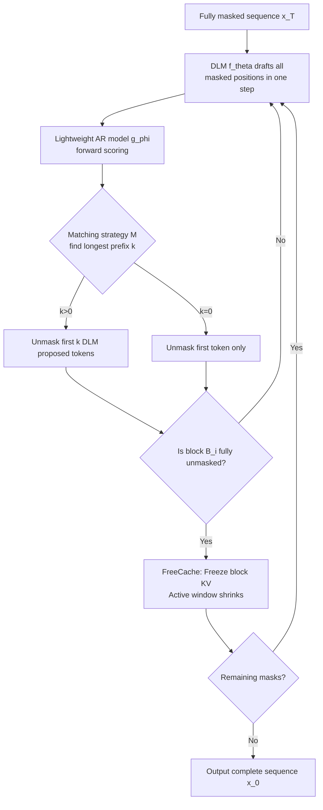

# FlashDLM: Accelerating Diffusion Language Model Inference via Efficient KV Caching and Guided Diffusion

**Conference**: ICLR 2026  
**OpenReview**: [https://openreview.net/forum?id=KUfKvlX3VY](https://openreview.net/forum?id=KUfKvlX3VY)  
**Code**: [https://github.com/ZhanqiuHu/flash-dlm-experimental](https://github.com/ZhanqiuHu/flash-dlm-experimental)  
**Area**: LLM Inference Acceleration / Diffusion Language Models  
**Keywords**: Diffusion Language Model, KV Cache, Guided Diffusion, Speculative Decoding, Training-free Acceleration  

## TL;DR
Two training-free techniques—FreeCache, which reuses stable KV projections, and Guided Diffusion, which uses consistency signals from small AR models to guide parallel demasking—enable a 7B/8B diffusion language model to achieve an average end-to-end speedup of 12x, bringing diffusion LLM latency comparable to or even faster than same-sized autoregressive models for the first time.

## Background & Motivation
**Background**: Diffusion Language Models (DLMs, such as Dream-7B and LLaDA-8B) generate tokens in parallel by iteratively denoising a fully masked sequence. Inherently possessing bidirectional context, their quality has matched same-sized autoregressive (AR) models (e.g., Qwen2.5-7B, Llama3-8B). This is seen as a promising alternative route for language generation beyond AR.

**Limitations of Prior Work**: DLM inference is exceptionally slow. While AR models only compute new tokens and store past ones in a KV cache, DLMs must perform full MHA and FFN forward passes on the **entire sequence of length L** at every denoising step, incurring $O(L)$ additional complexity per module. Multi-step denoising leads to severe latency in long-prompt or long-context scenarios. Furthermore, parallel demasking relies on **factorized independent distributions** for masked positions, failing to model joint dependencies between tokens. Synchronously unmasking multiple semantically related positions introduces token incoherence, causing accuracy to drop sharply when denoise steps are reduced in existing heuristics (MaskGIT, entropy, Top-K margin).

**Key Challenge**: Accelerating inference requires reducing denoising steps or caching KV states, but the irregular denoising process of DLMs is incompatible with mature AR KV caching. Existing Block Diffusion methods require additional fine-tuning and show questionable scalability on large DLMs. Achieving **training-free acceleration of SoTA DLMs without performance degradation** remains unresolved.

**Goal**: Accelerate off-the-shelf DLMs without any training, fine-tuning, or calibration, simultaneously eliminating redundant computation and suppressing incoherence from parallel demasking.

**Core Idea**: (1) **Redundancy is cacheable**: The KV projections of "clean" (determined) tokens undergo negligible changes in subsequent denoising steps, allowing them to be frozen and reused. (2) **Large model drafts, small model monitors**: Use the large DLM to draft all tokens in one step, then use a lightweight AR model as a "consistency judge" to decide how many tokens can be safely unmasked, significantly compressing iterations without the expensive token-by-token correction of speculative decoding.

## Method

### Overall Architecture
FlashDLM consists of two orthogonal, stackable, and training-free modules. FreeCache reduces computation **within a single step**: as sequence blocks are determined, the active computation window shrinks. Guided Diffusion reduces iterations **across steps**: the DLM drafts all masked positions, and a small AR model provides the "longest consistent prefix" to determine the actual number of tokens unmasked in that step.

### Key Designs

**1. FreeCache: Sliding window approximate KV cache.** The authors observed via cosine similarity heatmaps that prompt K/V projections remain stable throughout denoising, while generation area projections become stable immediately after being unmasked. FreeCache partitions the post-prompt sequence into blocks $(B_1,\dots,B_N)$. After the first pass, the KV of the full sequence is saved. When unmasking block $B_i$, the active computation window only includes $B_i$ and subsequent blocks; frozen preceding blocks and the prompt serve only as context KV. Once $B_i$ is fully unmasked, its KV is frozen. This **cascading reduction** in computation yields greater savings as the sequence length increases. On GSM8K (8-shot), FreeCache alone speeds up Dream-7B by 4.42x and LLaDA-8B by 6.32x with only ~2% accuracy loss.

**2. Guided Diffusion: Consistency-guided parallel unmasking.** To address incoherence, the DLM acts as a drafter. In each step, the DLM proposes tokens $t_{\text{DLM}}=\pi(\mathrm{Softmax}(f_\theta(x)))$ for all masked positions. These are fed to a frozen small AR model $g_\phi$ to obtain $\text{logits}_{\text{AR}}$. For masked positions $M=[i_1,\dots,i_m]$, a matching strategy $\mathcal{M}$ determines the longest prefix $k$ where both models agree. If $k>0$, tokens $i_1,\dots,i_k$ are unmasked; otherwise, only $i_1$ is unmasked. This cross-model consistency acts as a **lightweight coherence prior**, enabling confident parallel unmasking without modifying the diffusion process or training.

**3. Paradigm Flip vs. Speculative Decoding.** Unlike Speculative Diffusion Decoding (SDD), where the AR model is the target and the diffusion model is the drafter requiring token-by-token correction, Guided Diffusion flips this: the large diffusion model drafts efficiently, and the small AR model **only provides a consistency signal without generating or correcting tokens**. This avoids the latency collapse seen in speculative decoding when matching rates are low, as there is no expensive backtracking to a large target model. Consequently, output quality is determined by the DLM, and a very small AR model suffices as the "judge."

## Key Experimental Results

Evaluated on a single NVIDIA RTX 6000 Ada (48GB), max new tokens=1024, latency measured via `torch.cuda.Event`. The primary model is Dream-7B-Instruct.

### Main Results: FreeCache + Guided Diffusion (Dream-7B-Instruct)

| Task | Baseline Acc/Lat | FreeCache Only | +Qwen-1.5B Acc/Lat/Gain | +Qwen-7B Acc/Lat/Gain |
|------|------------------|----------------|--------------------------|------------------------|
| MMLU-PRO | 46.92% / 20.73s | 45.18% / 6.68s (3.11×) | 46.64% / 1.66s / 12.48× | 48.20% / 2.77s / 7.48× |
| GSM8K(8-shot) | 79.68% / 48.05s | 77.40% / 10.87s (4.42×) | 80.33% / 2.70s / 17.80× | 81.41% / 2.74s / 17.53× |
| PiQA | 85.56% / 14.62s | 84.83% / 4.21s (3.47×) | 85.15% / 0.43s / 34.1× | 85.85% / 1.05s / 13.92× |
| ARC-C | 80.87% / 10.64s | 80.61% / 4.25s (2.50×) | 80.89% / 3.12s / 3.41× | 80.72% / 4.58s / 2.32× |
| ARC-E | 87.53% / 10.59s | 86.24% / 5.54s (1.91×) | 87.50% / 3.25s / 3.26× | 87.44% / 5.03s / 2.11× |
| GPQA | 39.29% / 21.50s | 43.30% / 9.91s (2.12×) | 49.55% / 12.02s / 1.78× | 49.33% / 15.26s / 1.41× |

Overall end-to-end average: 12.14x for Dream-7B, 13.29x for LLaDA-8B; reaching up to 34.1x on GSM8K.

### Comparison with Autoregressive LLMs (GSM8K 8-shot CoT)

| Guider Model | Standalone AR Acc/Lat | Guided Diffusion (Dream-7B) | Guided Diffusion (LLaDA-8B) |
|-------------|------------------|------------------------------|------------------------------|
| Qwen2.5-1.5B-Instruct | 68.54% / 2.26s | 80.3% / 2.55s | 79.91% / 4.29s |
| Qwen2.5-Math-1.5B | 78.24% / 1.59s | 82.9% / 3.19s | 81.96% / 5.31s |
| Qwen2.5-7B-Instruct | 91.13% / 3.23s | 82.3% / 3.43s | 79.68% / 4.42s |

Latency is now on par with same-sized AR models, while accuracy is primarily preserved by the DLM.

### Key Findings
- **Quality is decoupled from guider size**: A 1.5B guider allows Dream-7B to maintain 80%+ on GSM8K; moving to a 7B guider yields only marginal gains.
- **Small AR models can "boost scores"**: Incoherence suppressed by Guided Diffusion often recovers the accuracy lost due to FreeCache's approximations.
- **Controllable Memory**: Dream-7B + Qwen-1.5B uses 18.7GB, roughly the sum of the models without excessive overhead.

## Highlights & Insights
- **Visual proof of cacheable redundancy**: Using cosine similarity heatmaps to prove the stability of "clean" token KV projections provides a robust empirical foundation for FreeCache.
- **Elegant Paradigm Flip**: Reversing speculative decoding into "large scale draft + small scale judge" avoids regression while capping the quality at the DLM's capacity, allowing the use of domain-specific miniature guiders.
- **Plug-and-play**: Requires no training or calibration, lowering the deployment barrier significantly.
- **Milestone Value**: Effectively demonstrates that DLM inference can be as fast as AR, providing strong evidence for the practicality of the diffusion route.

## Limitations & Future Work
- **FreeCache Trade-offs**: KV approximation introduces minor errors and requires storing full-sequence KV states, increasing VRAM consumption.
- **System Complexity**: Adding an AR guider increases architectural complexity; the guider's alignment with the DLM affects the consistency rate and speedup.
- **DLM Base Performance**: Current 7B/8B DLMs still lag behind top-tier AR models like Qwen2.5-7B in raw reasoning capability.
- **Evaluation Range**: Tested only on Dream-7B and LLaDA-8B due to the scarcity of high-quality billion-parameter DLMs.

## Related Work & Insights
- **Concurrent DLM Acceleration**: dKV-Cache uses heuristic scheduling; Fast-dLLM uses confidence-driven rules requiring per-task hyperparameter tuning. FlashDLM stands out by being **entirely free of heuristic tuning**.
- **Collaborative Generation**: Unlike Medusa or SDD, which rely on target model corrections, FlashDLM’s "judge-only" approach is a more generalizable strategy for model collaboration.

## Rating
- **Novelty**: ⭐⭐⭐⭐ FreeCache's observation is simple yet effective; Guided Diffusion’s paradigm flip is clever.
- **Experimental Thoroughness**: ⭐⭐⭐⭐ Covers 6 benchmarks and multiple guider configurations, though limited by the number of available DLMs.
- **Writing Quality**: ⭐⭐⭐⭐ Logical flow from dynamic heatmaps to architectural decisions is clear.
- **Value**: ⭐⭐⭐⭐⭐ A critical step towards making Diffusion Language Models practical for real-world deployment.

<!-- RELATED:START -->

## Related Papers

- [\[ICLR 2026\] Learning to Parallel: Accelerating Diffusion Large Language Models via Learnable Parallel Decoding](learning_to_parallel_accelerating_diffusion_large_language_models_via_learnable_.md)
- [\[ICML 2026\] dLLM-Cache: Accelerating Diffusion Large Language Models with Adaptive Caching](../../ICML2026/llm_efficiency/dllm-cache_accelerating_diffusion_large_language_models_with_adaptive_caching.md)
- [\[ICLR 2026\] ReFusion: A Diffusion Large Language Model with Parallel Autoregressive Decoding](refusion_a_diffusion_large_language_model_with_parallel_autoregressive_decoding.md)
- [\[ICLR 2026\] Reasoning Language Model Inference Serving Unveiled: An Empirical Study](reasoning_language_model_inference_serving_unveiled_an_empirical_study.md)
- [\[ICLR 2026\] Hierarchy Decoding: A Training-free Parallel Decoding Strategy for Diffusion Large Language Models](hierarchy_decoding_a_training-free_parallel_decoding_strategy_for_diffusion_larg.md)

<!-- RELATED:END -->
