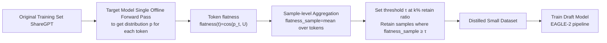

# Flatter Tokens are More Valuable for Speculative Draft Model Training

**Conference**: ICLR 2026  
**OpenReview**: [https://openreview.net/forum?id=wgGJE6Z1B3](https://openreview.net/forum?id=wgGJE6Z1B3)  
**Code**: [https://github.com/fjm9933/Flatness](https://github.com/fjm9933/Flatness)  
**Area**: LLM Inference Acceleration / Speculative Decoding / Data-Efficient Training  
**Keywords**: Speculative Decoding, Draft Model, Knowledge Distillation, Data Selection, Flatness, EAGLE  

## TL;DR
This paper discovers from a data-centric perspective that during speculative decoding draft model training, tokens with "flatter" (closer to uniform) target model prediction distributions are more valuable. Based on this, it proposes a target-model-only, offline-calculable flatness metric and the SFDD data distillation method, achieving over 2× training acceleration with 50% data while incurring less than a 4% loss in inference speedup.

## Background & Motivation
**Background**: Speculative Decoding (SD) is a key technique for accelerating LLM autoregressive inference—using a small draft model to quickly generate $\gamma$ candidate tokens, which are then verified in parallel by a large target model. Higher acceptance rates lead to more significant acceleration. Train-based methods (e.g., the EAGLE series) achieve higher and more stable acceptance rates than train-free methods by training the draft model to align with the target, but at the cost of training on large-scale datasets.

**Limitations of Prior Work**: Train-based SD defaults to using vanilla Knowledge Distillation (KD), which minimizes the KL divergence between student and teacher output distributions. However, what SD actually optimizes is the acceptance rate, which theoretically depends on the L1 norm of the two distributions ($\alpha(h)=1-\frac{1}{2}\|p-q\|_1$). This creates a fundamental mismatch with the KL objective. Prior works attempted to use L1 directly as a loss, but results were inconsistent and sometimes worse than standard KL—indicating that simply changing the loss function is insufficient.

**Key Challenge**: Existing methods focus only on "what loss to use" while ignoring "which parts of the data provide meaningful training signals." Systems like EAGLE treat all tokens equally during training, but the contribution of tokens to the acceptance rate is highly heterogeneous, leading to substantial avoidable training overhead.

**Goal**: Identify and retain high-value samples from a data-centric perspective to significantly cut draft model training costs with almost no loss in inference acceleration.

**Key Insight**: **[Flatter tokens are more valuable]** Theoretical modeling of single-step KD reveals that tokens with flatter target distributions (larger variance, closer to uniform) yield a greater decrease in L1 distance (i.e., greater acceptance rate improvement) per unit of training. Conversely, tokens with sharp peaks saturate quickly and contribute minimally. **[Target-only offline scoring]** This importance criterion depends only on the fixed target distribution and does not require a warmed-up draft model. It can be calculated in a single offline pass, elevating token-level insights to sample-level data filtering.

## Method

### Overall Architecture
The method proceeds in two steps: theoretically proving that "tokens with flatter target distributions have higher training value," and then designing the practical SFDD (Sample-level-flatness-based Dataset Distillation) pipeline. This involves an offline forward pass of the target model through the data to calculate flatness for each token, aggregating these into sample-level scores, retaining high-scoring samples based on a retain ratio, and finally training the draft model only on this distilled subset.

### Key Designs

**1. Budget-constrained update model for single-step KD: Using $\Delta L_1$ to measure true token value.** Directly minimizing the static L1 norm can be misleading—if the draft distribution $q$ is already close to target $p$, the L1 is small and further training yields no gain. Therefore, the authors define token value as the "L1 decrease brought by a single step of training" $\Delta L_1 = \|p-q\|_1 - \|p-r^*\|_1$, where $r^*$ is the draft distribution after an ideal update. This update is modeled as a budget-constrained optimization problem: $r^* = \arg\min_r D_{KL}(p\|r)\ \text{s.t.}\ D_{KL}(r\|q)\le\theta$. This aligns with KD practice (moving towards the teacher) while using budget $\theta$ to constrain the update from deviating too far from $q$ (corresponding to learning rate/optimizer effects). $r^*$ is an analytical tool, not the actual training target.

**2. Gaussian closed-form solution reveals "Higher variance is more valuable."** Solving with KKT conditions after constraining $p, q$ to the Gaussian family yields $r^*=\mathcal{N}(\mu_r^*,\sigma_r^{2*})$, where the updated variance $\sigma_r^{2*}=(1-\tau^*)\sigma_p^2+\tau^*\sigma_q^2+\tau^{*2}(1-\tau^*)(\mu_p-\mu_q)^2$. The path parameter $\tau^*\in[0,1]$ is uniquely determined by budget $\theta$. This shows that the larger the target variance $\sigma_p^2$, the flatter the updated distribution $r^*$. Since the L1 norm is extremely sensitive to peak mismatches and insensitive to point-wise differences in flat distributions, a flat target results in a smaller $\|p-r^*\|_1$ and a larger $\Delta L_1$. Numerical simulations (Figure 1a) confirm that for a fixed mean, $\Delta L_1$ increases monotonically with $\sigma_p^2$, proving flatter tokens yield the highest training gains.

**3. Flatness metric: Transferring continuous variance to discrete vocabularies using cosine similarity.** Since actual LLM outputs are discrete distributions, continuous variance cannot be directly calculated. The authors use "cosine similarity with the uniform distribution" as a proxy: $\text{flatness}(t):=\cos(p_t,U)=\frac{p_t\cdot U}{\|p_t\|_2\|U\|_2}$, where $U$ is the uniform distribution over the vocabulary. The appendix proves and simulations (Figure 1b) verify that this metric is monotonically positively correlated with Gaussian standard deviation. Observing training dynamics on real LLMs sorted by target flatness (Figure 2) shows that draft statistics and $\Delta L_1$ in low-flatness regions barely change in an epoch (already saturated or stubbornly mismatched), while high-flatness regions show significant learnable changes. This empirically confirms flatness as a reliable signal for "remaining improvement space." Comparative experiments also show that at the same retain ratio, flatness removes more saturated low-value tokens than entropy (gap $g=|\Delta L_1|_{\text{low-entropy}}-|\Delta L_1|_{\text{low-flatness}}>0$ holds consistently and increases with sampling size).

**4. SFDD: From token insights to sample-level data distillation.** Token flatness is averaged within a sample to obtain a sample-level score $\text{flatness}_{\text{sample}}(S)=\frac{1}{|S|}\sum_{t\in S}\text{flatness}(t)$. Higher scores indicate higher overall training value. Given a retain ratio $k\%$, the $(1-k)\%$ percentile of all sample scores is taken as the threshold $\tau$, and samples with $\text{flatness}_{\text{sample}}\ge\tau$ form the distilled dataset. The entire process requires only a single offline forward pass of the target model, with no need to warm up the draft model or track its changing predictions, allowing it to be directly plugged into the EAGLE-2 training pipeline.

## Key Experimental Results

### Main Results Table
EAGLE-2 + LLaMA3-8B-Instruct, trained on ShareGPT, fixed 50% retain ratio, evaluated on 5 downstream tasks (GSM8K / Alpaca / MT-Bench / CNN-DM / NQ). Reports Speedup and average acceptance length $l$ ($\gamma=5$, Temperature 1.0):

| Method | Average Speedup | Average $l$ |
|------|------|------|
| No Filter (100% Data) | 2.49× | 2.78 |
| Random | 2.20× | 2.46 |
| Entropy | 2.20× | 2.49 |
| Top-1 Probability | 2.23× | 2.49 |
| Margin | 2.15× | 2.40 |
| Energy Score | 2.21× | 2.49 |
| PPL | 2.20× | 2.48 |
| **SFDD (Ours)** | **2.41×** | **2.56** |

SFDD outperforms all other importance metrics on every downstream task. Its average 2.41× speedup is significantly higher than the runner-up Top-1 Probability (2.23×), and it limits inference speedup loss to within 4% of the full-dataset baseline (2.41× vs 2.49×) using only half the data.

### Ablation Study Table
Comparison of SFDD with Random / Top-1 Probability at different retain ratios (Average Speedup):

| Retain Ratio | Random | Top-1 Prob | SFDD (Ours) |
|------|------|------|------|
| 100% (No Filter) | — | — | 2.49× |
| 70% | 2.19× | 2.35× | **2.44×** |
| 60% | 2.20× | — | Better than baseline |
| 50% | 2.20× | 2.23× | **2.41×** |

At a 70% retain ratio, SFDD's speedup nearly matches "No Filter" and even surpasses the full dataset on Alpaca (2.77× vs 2.71×), suggesting that filtering can sometimes remove noise/redundant data. Even at extreme low ratios (5%/10%/20%), SFDD maintains a steady lead over Random.

### Key Findings
- The advantage of flatness is consistent: it significantly outperforms Random and the second-best Top-1 Probability across all retain ratios, proving the effectiveness of the flatness score itself.
- Flatness is better at "deleting useless tokens" than entropy: at the same retain ratio, it removes more saturated tokens with small $|\Delta L_1|$, an advantage that grows with the number of samples.
- It achieves over 2× training acceleration (including data selection overhead) at a 50% retain ratio, with <4% inference performance loss.

## Highlights & Insights
- **Counter-intuitive yet justifiable**: Low-flatness (highly certain) tokens might seem like "strong label signals" and thus valuable, but the authors argue they are either already aligned (negligible gain) or stubbornly mismatched (harmful/limited contribution). Investing budget in high-flatness tokens hits the spot where acceptance rates can actually be improved.
- **Precise diagnosis of objective mismatch**: The paper identifies the fundamental conflict between SD and vanilla KD (Acceptance Rate $\leftrightarrow$ L1 vs. KD $\leftrightarrow$ KL). It goes beyond "changing the loss," which was disproven by predecessors, and turns to "changing the data"—a novel perspective orthogonal to various train-based methods.
- **Practically deployable with low overhead**: The criterion depends only on the fixed target distribution and can be calculated offline once. It requires no draft warmup or tracking of moving target $q$, making it almost zero-cost to integrate into EAGLE pipelines.
- **Theoretical-Proxy-Empirical Loop**: The logic chain is complete, moving from Gaussian closed-form solutions (higher variance is more valuable) to a cosine similarity proxy (discrete calculability) and finally to verification via training dynamics (target-sorted view).

## Limitations & Future Work
- The theoretical analysis relies on simplified assumptions of Gaussian distributions and ideal single-step updates. $r^*$ is an analytical tool, and there is a gap with actual multi-step SGD dynamics, though empirically supported.
- Experiments were verified only on the EAGLE-2 + LLaMA3-8B-Instruct + ShareGPT configuration. Generalization across target scales, draft architectures, and data distributions needs broader coverage.
- Flatness is a purely target-side static metric and does not account for sample diversity/coverage—at extremely low retain ratios, performance might drop due to homogeneity of high-flatness samples, which the authors observed.
- The method is orthogonal to loss function optimization, but the potential of jointly optimizing "flatness data selection + L1/TVD loss" to surpass the full-data baseline remains unexplored.

## Related Work & Insights
- **Speculative Decoding**: Train-free methods (rejection sampling, target reuse, parallel verification) have limited acceptance rates. Train-based methods (distillation, lightweight heads like EAGLE/Medusa, trainable early-exit, multi-token prediction) offer more stable acceleration. This paper focuses on the data efficiency of the latter.
- **Data Importance Measurement**: Existing methods often revolve around "distribution uncertainty" (Shannon Entropy, Energy Score, PPL) or "logit-based probability" (Top-1 prob, top-2 margin, ground-truth prob), but these serve standard training goals (accuracy/fidelity). This is the first work to systematically study token importance from the unique perspective of SD acceptance rates.
- **Insight**: When a mismatch exists between the training objective and the proxy loss, instead of focusing on the loss function, one should return to the more fundamental question: "Which data actually provides effective gradients?" A lightweight, offline criterion based solely on the fixed teacher is often more practical than complex online difficulty estimation.

## Rating
- **Novelty**: ⭐⭐⭐⭐ First to approach SD draft training from a data-centric view; the "flatter tokens are more valuable" insight is counter-intuitive, theoretically supported, and orthogonal to mainstream "loss-changing" routes.
- **Experimental Thoroughness**: ⭐⭐⭐ Comparison across 5 tasks, multiple metrics, retain ratio ablations, and extreme low-ratio tests are solid, but evidence for generalizability across models/datasets is relatively thin.
- **Writing Quality**: ⭐⭐⭐⭐ The logical progression from theoretical modeling to proxy metrics and empirical validation of training dynamics is clear; figures (target-sorted view, SFDD workflow) effectively support the arguments.
- **Value**: ⭐⭐⭐⭐ Achieving 2× training acceleration with <4% inference loss using 50% data has direct cost-reduction implications for deploying EAGLE-like SD systems. The method is simple and plug-and-play.

<!-- RELATED:START -->

## Related Papers

- [\[ICLR 2026\] RepSpec: Structural Re-parameterized Draft Model Training for Speculative Decoding](repspec_structural_re-parameterized_draft_model_training_for_speculative_decodin.md)
- [\[ICLR 2026\] Learning To Draft: Adaptive Speculative Decoding with Reinforcement Learning](learning_to_draft_adaptive_speculative_decoding_with_reinforcement_learning.md)
- [\[ICLR 2026\] PARD: Accelerating LLM Inference with Low-Cost Parallel Draft Model Adaptation](pard_accelerating_llm_inference_with_lowcost_parallel_draft_model_adaptation.md)
- [\[ICLR 2026\] Speculative Speculative Decoding](speculative_speculative_decoding.md)
- [\[ICLR 2026\] Global Resolution: Optimal Multi-Draft Speculative Sampling via Convex Optimization](global_resolution_optimal_multi-draft_speculative_sampling_via_convex_optimizati.md)

<!-- RELATED:END -->
