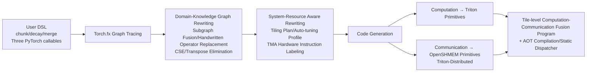

# FlexLinearAttention: Compiling a Unified Abstraction into Scalable Kernels for Linear Attention

**Conference**: ICLR 2026  
**OpenReview**: [https://openreview.net/forum?id=N4jJQvQSiN](https://openreview.net/forum?id=N4jJQvQSiN)  
**Code**: To be confirmed  
**Area**: LLM Efficiency / Operator Compilation / Linear Attention  
**Keywords**: Linear Attention, Domain-Specific Compiler, Chunk-wise Parallelism, Computation-Communication Fusion, Sequence Parallelism, Triton  

## TL;DR
FlexLA unifies various linear attention variants into a three-stage abstraction: "intra-chunk computation / inter-chunk state propagation / output merging." This allows users to describe algorithms in dozens of lines of PyTorch. A domain-specific compiler then automatically generates high-performance Triton kernels fused with computation and communication, achieving or exceeding the expert-handwritten library FLA ($1.01\times \text{--} 4.9\times$) on a single GPU, and up to $7.2\times$ speedup over LASP2 on distributed systems, with near-linear scaling up to 128 GPUs and 16 million tokens.

## Background & Motivation
**Background**: The $O(L^2d)$ complexity of softmax attention is a core bottleneck for long contexts, leading to many linear complexity variants like Mamba, RetNet, RWKV, GLA, HGRN, and Gated DeltaNet. These remove softmax and utilize the associative property to rearrange computation into a linear recurrence $S_t = S_{t-1} + k_t v_t^\top,\ o_t = q_t S_t$, balancing parallelism and FLOPs via chunk-wise parallelism.

**Limitations of Prior Work**: While softmax attention has standardized kernels like Flash-Attention and Ring-Attention, the linear attention ecosystem is highly fragmented. The authoritative Flash-Linear-Attention (FLA) library essentially relies on experts to manually write Triton kernels for each variant. As linear attention variants iterate rapidly, no one-size-fits-all solution exists, forcing researchers into a circle of rewriting kernels for every new variant. Two major issues persist: 1) High-performance kernel development requires deep hardware knowledge, requiring state update rules to be fused into a single kernel while manually tuning low-level details like pipeline scheduling, tile sizes, shared memory limits, and barriers. 2) Current solutions rarely support distributed execution; sequence parallelism is essential for scaling to hundreds of thousands or millions of tokens. Current schemes like LASP/LASP-2 are designed for specific architectures and use generic primitives like NCCL All-Gather, which do not match the dataflow of distributed linear attention, resulting in severe network bandwidth underutilization.

**Key Challenge**: There is a significant gap between the speed of linear attention algorithm evolution and the difficulty of developing scalable, high-performance kernels.

**Goal**: Provide a framework that allows most linear attention variants to be implemented in a few lines of idiomatic PyTorch and automatically scale to distributed systems.

**Core Idea**: The authors observe that these difficulties stem from failing to exploit the common structure shared by linear attention variants. **Most variants share a small set of normalized operators and data exchange patterns.** Based on this, they propose FlexLA: a compiler-driven domain-specific framework that expresses linear attention using three modular functions, completely decoupling algorithm expression from system optimization.

## Method

### Overall Architecture
The FlexLA frontend takes the linear attention logic written by the user in a DSL (three PyTorch callables: `chunk_mode`, `decay_mode`, `merge_mode`). The backend maps this logic, along with potential communication operations, onto GPUs and NICs, applying domain-specific optimizations to generate high-performance distributed kernels. The pipeline is built on chunk-wise parallelism: the sequence is divided into $L/C$ chunks, and computation is split into inter-chunk (state readout from the start to the current chunk, $O_{[i]}^{\text{inter}} = Q_{[i]} S_{[i-1]}$) and intra-chunk (processing within the current chunk, $O_{[i]}^{\text{intra}} = (Q_{[i]} K_{[i]}^\top \odot M) V_{[i]}$) parts, followed by merging.

### Key Designs

**1. Three-Stage Unified Programming Abstraction.** This is the foundation of FlexLA. Although variants like HGRN (vector state + data-dependent vector decay), RetNet (matrix state + scalar decay), Mamba2 (matrix + data-dependent scalar), GLA (matrix + data-dependent vector), and GDN (matrix + data-dependent matrix, including the delta rule $S_t = \alpha_t S_{t-1}(I-\beta_t k_t k_t^\top) + \beta_t v_t k_t^\top$) differ significantly in state types and decay mechanisms, they are unified into three stages: ① **Intra-Chunk Computation**, calculating local states within each chunk, which is embarrassingly parallel across chunks; ② **Inter-Chunk State Propagation**, processing dependencies between chunks by accumulating state summaries into the global state at the current chunk's start (a prefix-sum scan in vanilla linear attention), which is **inherently serial and where cross-device communication occurs**; ③ **Merging and Output Generation**, combining inter and intra results, which is parallelizable again. The callables `chunk_mode / decay_mode / merge_mode` allow users to convert token-level update rules into chunk-level matrix operations. This explicit separation provides the metadata for aggressive optimization.

**2. Domain-Knowledge Driven Graph Compilation.** User functions are traced into a Torch.fx graph as IR. The compiler replaces special ops with custom instructions and runs domain-specific optimization passes: subgraph fusion, handwritten operator replacement (e.g., replacing `torch.inverse` with specialized Triton kernels for GDN's `lower_triangular_inverse`), CSE, and transpose elimination. Subsequently, the IR is rewritten with system-resource awareness, such as labeling load instructions with TMA (Tensor Memory Accelerator) availability.

**3. Tile-Level Computation-Communication Fusion.** Since all cross-device communication is confined to the second stage, FlexLA analyzes data dependencies to determine computation and communication tiling strategies. The final IR is lowered to Triton-Distributed source code, where communication maps to OpenSHMEM-style primitives translated into GPU-initiated operations. This fuses computation and communication at the tile level within a single kernel, reducing data dependency overhead and eliminating frequent GPU-host synchronizations found in traditional overlap strategies.

**4. System-level Bottleneck Optimization: AOT Compilation + Adaptive Parallel Scheduling.** Beyond kernel fusion, the authors address two system bottlenecks. First, **runtime overhead**: Triton runtime overhead of hundreds of microseconds often exceeds kernel execution time for sequences of 2K–4K. FlexLA extends a custom AOT module to pre-compile Triton source code into dynamic libraries, using a profile-guided static dispatcher to call the optimal binary via the CUDA Driver API, completely bypassing the Triton runtime. Second, **parallel strategy trade-offs**: Fusing different stages avoids intermediate state storage in global memory but limits chunk-level parallelism. FlexLA uses a scheduling algorithm to dynamically select the optimal strategy based on input shapes and hardware.

## Key Experimental Results

### Main Results (Single GPU H100 Latency, ms)
Fixed BatchSize=1, NumHeads=32, HeadDim=128, comparing against the general compiler Torch-Compile and the SOTA library FLA.

| Variant | Sequence Length | Torch-Compile | FLA | FlexLA(Ours) |
|------|--------|---------------|-----|--------------|
| HGRN | 16384 | 5.75 | 0.24 | **0.17** |
| Vanilla-LA | 16384 | 41.59 | 0.68 | **0.56** |
| Scalar-GLA | 16384 | 102.37 | 0.93 | **0.74** |
| Scalar-GLA | 262144 | 1507.0 | 10.52 | **9.47** |
| Vector-GLA | 16384 | 100.0 | 1.56 | **1.38** |
| GDN | 262144 | 1781.98 | 23.13 | **22.99** |

### Sequence Parallelism (Weak Scaling, H20 Cluster)
Fixed BatchSize=4, NumHeads=32, HeadDim=128, scaling from 4 GPUs (128K tokens) to 128 GPUs (4M tokens).

| Model | GPU Count | LASP2 Overhead (ms) | FlexLA Overhead (ms) |
|------|--------|-----------------|------------------|
| GDN | 4 | ~13.2 (49.2 total) | ~12.2 |
| GDN | 128 | **345.3** | **14.5** |
| Scalar-GLA | 128 | 11.1 | **6.8** |

### Ablation Study

| Ablation | Setting | Result |
|--------|------|------|
| AOT Static Dispatcher | Scalar GLA, L=1024 | Triton overhead was 207µs (4.4× the 47µs kernel); dispatcher reduced this by 46% → 1.6× end-to-end speedup. |
| Tile-level Comp-Comm Overlap | 8×H800, state 67MB | Serial 873µs / Torch-Pipeline 902µs / **Ours 560µs** (1.56× vs serial) |

## Key Findings
- On HGRN, FlexLA is 1.64–2.02× faster than the expert-written FLA, as the compiler identified more efficient thread allocation opportunities.
- Speedups are most significant for short and medium sequences, where system overhead and scheduling dominate.
- Torch-Pipeline was slower than naive serial execution, indicating that host-managed pipelining suffers from frequent kernel launches and host-device synchronization.

## Highlights & Insights
- **Engineering to Compilation**: The core insight is that while linear attention variants appear different, they share normalized operations. By using a three-stage abstraction, the compiler handles the "how," while the user provides the "what."
- **Communication as a Leverage**: By restricting communication to the inter-chunk stage, the compiler can perform precise dependency analysis and tile-level fusion, bypassing NCCL for $7.2\times$ distributed speedup.
- **Addressing Runtime Overhead**: For short sequences, Triton's runtime overhead is a critical bottleneck. The AOT + static dispatcher approach provides an end-to-end system perspective beyond just kernel performance.

## Limitations & Future Work
- The paper focuses on the **prefill stage** (inference or training forward). The backward pass is mentioned as implementable but not fully evaluated.
- The abstraction relies on chunk-wise parallelism; coverage for novel mechanisms (e.g., some test-time-training variants) that do not fit this paradigm remains to be verified.
- Direct comparison with ZeCO is missing as its implementation is not public.
- The static dispatcher depends on an offline database and constant dimension enumeration, which may require recompilation if dimensions vary frequently.

## Related Work & Insights
- **Linear Attention Variants**: Mamba, RetNet, RWKV, etc., are the targets for FlexLA. FLA provides expert kernels but requires manual development for each.
- **Sequence Parallelism**: LASP used serial send-recv, LASP2 used collective primitives but had low bandwidth utilization.
- **AI Compilers**: Tools like `torch.compile` or TVM optimize general operators but do not cover the specific patterns of linear attention. FlexLA brings the "DSL-to-generated-kernel" paradigm (similar to FlexAttention for softmax attention) to the linear attention and distributed space.

## Rating
- **Novelty**: ⭐⭐⭐⭐ First domain-specific compiler for the linear attention family + distributed systems.
- **Experimental Thoroughness**: ⭐⭐⭐⭐ Covers 5 variants, single-GPU and 128-GPU scaling; missing full backward pass and end-to-end accuracy.
- **Writing Quality**: ⭐⭐⭐⭐ Clear logic from abstraction to optimization.
- **Value**: ⭐⭐⭐⭐ Addresses real engineering pains in kernel development and distributed scaling for long-context models.

<!-- RELATED:START -->

## Related Papers

- [\[ICLR 2026\] Log-Linear Attention](log-linear_attention.md)
- [\[ICLR 2026\] Householder-Diagonalized Linear Attention (HDLA): Utilizing Rank-Enhanced Decay Mechanism for Efficient Sequence Modeling](householder-diagonalized_linear_attention_hdla_utilizing_enhanced_decay_mechanis.md)
- [\[ICLR 2026\] RACE Attention: A Strictly Linear-Time Attention Layer for Training on Outrageously Large Contexts](race_attention_a_strictly_linear-time_attention_layer_for_training_on_outrageous.md)
- [\[ICLR 2026\] MHLA: Restoring Expressivity of Linear Attention via Token-Level Multi-Head](mhla_restoring_expressivity_of_linear_attention_via_token-level_multi-head.md)
- [\[ICLR 2026\] Local Linear Attention: An Optimal Interpolation of Linear and Softmax Attention for Test-Time Regression](local_linear_attention_an_optimal_interpolation_of_linear_and_softmax_attention_.md)

<!-- RELATED:END -->
## Related Papers

- [\[ICLR 2026\] Log-Linear Attention](log-linear_attention.md)
- [\[ICLR 2026\] RACE Attention: A Strictly Linear-Time Attention Layer for Training on Outrageously Large Contexts](race_attention_a_strictly_linear-time_attention_layer_for_training_on_outrageous.md)
- [\[ICLR 2026\] Local Linear Attention: An Optimal Interpolation of Linear and Softmax Attention for Test-Time Regression](local_linear_attention_an_optimal_interpolation_of_linear_and_softmax_attention_.md)
- [\[NeurIPS 2025\] Tiled Flash Linear Attention: More Efficient Linear RNN and xLSTM Kernels](../../NeurIPS2025/llm_efficiency/tiled_flash_linear_attention_more_efficient_linear_rnn_and_xlstm_kernels.md)
- [\[ICML 2026\] Dynamic Linear Attention](../../ICML2026/llm_efficiency/dynamic_linear_attention.md)

<!-- RELATED:END -->
