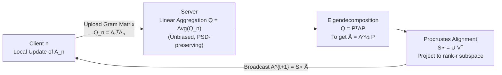

# FLoRG: Federated Fine-tuning with Low-rank Gram Matrices and Procrustes Alignment

**Conference**: ICLR 2026  
**OpenReview**: [https://openreview.net/forum?id=kntrZOm2AQ](https://openreview.net/forum?id=kntrZOm2AQ)  
**Code**: TBD  
**Area**: Efficient Fine-tuning / Federated Learning  
**Keywords**: Federated Fine-tuning, LoRA, Gram Matrix, Procrustes Alignment, Communication Efficiency, Convergence Analysis

## TL;DR
FLoRG reparameterizes the two low-rank matrices of LoRA into a single low-rank matrix and aggregates only its Gram matrix. This transforms server-side aggregation from a "biased bilinear operation" into an "unbiased linear operation." It then employs Procrustes alignment to resolve the drift caused by non-unique decomposition, simultaneously eliminating aggregation errors, reducing communication overhead (up to 2041×), and tightening convergence bounds in federated fine-tuning.

## Background & Motivation
**Background**: LoRA replaces full-parameter fine-tuning with two low-rank matrices $W = W_0 + BA$, becoming a mainstream method for adapting large models. Federated Learning (FL) enables collaborative fine-tuning on decentralized data without exposing raw data. Combining the two—where clients train LoRA locally, upload low-rank updates, and the server aggregates—is a natural solution.

**Limitations of Prior Work**: Directly integrating LoRA into FL encounters two fundamental contradictions. The first is **Aggregation Error**: traditional methods (e.g., FedIT) average $B_n$ and $A_n$ separately, yielding $(\frac{1}{N}\sum_n B_n)(\frac{1}{N}\sum_n A_n)$, whereas the desired update is $\frac{1}{N}\sum_n (B_n A_n)$. This systematic bias accumulates over rounds and degrades performance. The second is **Decomposition Drift**: another approach (e.g., FeDeRA) aggregates the product $B_n A_n$ and then performs matrix decomposition to recover the two matrices. While this eliminates aggregation error, the aggregated matrix is often rank-deficient or has repeated eigenvalues, leading to non-unique decompositions. Different decompositions change the parameter subspace and gradient directions in subsequent rounds, causing cumulative drift; moreover, the decomposed rank might not match the target rank $r$.

**Key Challenge**: As long as LoRA remains a "product of two matrices," one must choose between separate aggregation (producing error) or post-aggregation decomposition (producing drift).

**Goal**: Develop a federated fine-tuning scheme that eliminates aggregation errors and minimizes decomposition drift.

**Core Idea**: **[Reparameterization]** Represent LoRA using a single low-rank matrix and aggregate only its **Gram matrix** (the matrix of column vector inner products). Since Gram matrix aggregation is linear and maintains positive semi-definiteness, the server achieves a truly unbiased aggregation. **[Alignment Stability]** Use **Procrustes Alignment** to project the decomposed matrix onto the direction closest to the previous round while maintaining the Gram matrix, thereby suppressing drift caused by non-unique decomposition.

## Method

### Overall Architecture
FLoRG expresses the fine-tuning increment of each LoRA layer as $\Delta W^t = L Q^t R = L (A^t)^\top A^t R$, where $L\in\mathbb{R}^{d_{out}\times k}$ and $R\in\mathbb{R}^{k\times d_{in}}$ are globally shared, fixed semi-orthogonal bases ($L^\top L = I_k$, $R R^\top = I_k$, $k=\min\{d_{in},d_{out}\}$). Clients only train a single low-rank matrix $A^t\in\mathbb{R}^{r\times k}$. The per-round process involves: local updates of $A^t$ via gradient descent → uploading the Gram matrix $Q_n^{t+1/2}=(A_n^{t+1/2})^\top A_n^{t+1/2}$ → unbiased linear averaging at the server to get $Q^{t+1}$ → eigendecomposition of $Q^{t+1}$ followed by Procrustes alignment to recover $A^{t+1}$ for the next round → broadcasting back to clients.

### Key Designs

**1. Reparameterization with Single Matrix + Shared Bases: Error-free Aggregation.** LoRA uses two matrices to adapt to different weight matrix shapes $W_0\in\mathbb{R}^{d_{out}\times d_{in}}$, which is the root of aggregation bias. FLoRG offloads the shape flexibility to two **fixed and shared** semi-orthogonal bases $L$ and $R$. Only the intermediate square matrix parameter $Q^t=(A^t)^\top A^t$ (represented via a single $A^t$) is trainable. Client gradients are computed only for $A^t$: $\nabla_A F_n(W^t;\xi_n)=A^t\big(H_n^t+(H_n^t)^\top\big)$, where $H_n^t=L^\top \nabla F_n(W^t;\xi_n) R^\top$. Because clients upload the Gram matrix, the aggregation $Q^{t+1}=\frac{1}{N}\sum_n (A_n^{t+1/2})^\top A_n^{t+1/2}$ is a purely linear operation that preserves positive semi-definiteness. The server thus obtains the true aggregated result, structurally eliminating bilinear inconsistency. Additionally, uploading one matrix instead of two reduces uplink communication by more than half.

**2. Procrustes Alignment: Eliminating Decomposition Drift.** The server performs eigendecomposition on the PSD matrix $Q^{t+1}=(P^{t+1})^\top \Lambda^{t+1} P^{t+1}$ to obtain a canonical decomposition $\tilde{A}^{t+1}=(\Lambda^{t+1})^{1/2}P^{t+1}$. However, since $(O\tilde{A}^{t+1})^\top O\tilde{A}^{t+1}=Q^{t+1}$ for any orthogonal column matrix $O$, the decomposition is non-unique. FLoRG solves for a semi-orthogonal alignment matrix $S^t$ to find the decomposition closest to the previous round $A^t$ in Frobenius norm:
$$\min_{S^t}\ \big\|S^t\tilde{A}^{t+1}-A^t\big\|_F^2\quad \text{s.t.}\ (S^t)^\top S^t=I.$$
This is the classic orthogonal Procrustes problem. Taking the SVD of $A^t(\tilde{A}^{t+1})^\top=U^t\Sigma^t(V^t)^\top$ yields the closed-form optimal solution $S^{t,\star}=U^t(V^t)^\top$. This step achieves two goals: it selects the most "stable" decomposition to steady future gradients and uses semi-orthogonal projection to map the rank $r'^{,t}$ of $\tilde{A}^{t+1}$ back to the target rank $r$.

**3. Alignment-tightened Convergence Bound**: Under standard assumptions (L-smoothness, bounded gradients, bounded parameter space), the authors prove that the convergence rate of FLoRG under non-convex loss (Theorem 2) includes a **Procrustes Alignment Drift** term proportional to $\sum_t \Delta_{\text{proc}}^{t+1}/\sigma_{\min}(\cdot)$, where $\Delta_{\text{proc}}^{t+1}=\|S^t\tilde{A}^{t+1}-A^t\|_F^2-\|S^{t,\star}\tilde{A}^{t+1}-A^t\|_F^2\ge 0$. With optimal Procrustes alignment, $\Delta_{\text{proc}}^{t+1}=0$, effectively tightening the convergence bound.

## Key Experimental Results

### Main Results (GLUE Accuracy, N=20, r=4, Non-IID ρ=0.5)

| Base Model | Dataset | Ours (FLoRG) | FedIT | FeDeRA | FFA-LoRA | FedSA-LoRA | FedEx-LoRA |
|---|---|---|---|---|---|---|---|
| OPT-125M | MNLI | **87.35** | 79.42 | 81.15 | 83.54 | 84.61 | 85.83 |
| OPT-125M | WNLI | **65.28** | 58.45 | 59.34 | 62.61 | 62.83 | 64.15 |
| RoBERTa-large | MNLI | **91.27** | 84.91 | 88.06 | 89.28 | 90.75 | 90.96 |
| RoBERTa-large | RTE | **71.26** | 64.25 | 67.12 | 68.49 | 69.93 | 70.98 |
| Llama-3.2-3B | MNLI | **93.15** | 87.24 | 89.83 | 91.05 | 92.38 | 92.74 |
| Llama-3.2-3B | RTE | **73.84** | 67.08 | 69.75 | 71.33 | 72.56 | 73.15 |

FLoRG outperforms five SOTA baselines across most settings, with a gain of approximately 0.3–1.5% over the strongest baseline.

### Communication Overhead (QNLI, Total Parameters Transmitted to Reach Target Accuracy)

| Base | Target Acc | Ours (FLoRG) | FedIT | FedEx-LoRA |
|---|---|---|---|---|
| OPT-125M | 80.00 | **8.2×10⁶** | 3.78×10⁷ | 1.25×10¹⁰ |
| RoBERTa-large | 85.00 | **1.45×10⁷** | 8.12×10⁷ | 2.96×10¹⁰ |

FLoRG achieves a communication reduction of up to **2041×** compared to FedEx-LoRA.

### Ablation Study (Impact of Procrustes Alignment, Accuracy)

| Base | Setting | MRPC | MNLI | QNLI | WNLI | RTE |
|---|---|---|---|---|---|---|
| OPT-125M | w/ Alignment | 86.54 | 87.20 | 89.69 | 65.41 | 68.77 |
| OPT-125M | w/o Alignment | 83.14 | 80.93 | 86.72 | 59.81 | 64.32 |
| RoBERTa-large | w/ Alignment | 89.87 | 91.39 | 92.48 | 66.41 | 71.40 |
| RoBERTa-large | w/o Alignment | 86.50 | 88.93 | 88.62 | 62.07 | 67.09 |

### Key Findings
- **Procrustes Alignment is Critical**: Dropping alignment leads to a performance loss of 2.5–4.3 points on RoBERTa-large, reducing FLoRG to FeDeRA levels.
- **Robustness Across Ranks**: FLoRG consistently outperforms baselines for $r=2, 4, 8$.
- **Scalability**: Server computation scales linearly with LoRA layers and is decoupled from the number of clients.

## Highlights & Insights
- **Structure for Unbiasedness**: Switching from two matrices to a "single matrix + fixed shared bases" makes aggregation naturally linear and unbiased, tackling the root cause (bilinearity) rather than patching it (e.g., FedEx-LoRA's residual matrices).
- **Complementarity**: Gram aggregation ensures unbiasedness but introduces non-unique decomposition; Procrustes alignment exactly negates this side effect.
- **Theoretical Closure**: The alignment term $\Delta_{\text{proc}}$ appears directly in the convergence bound, elevating an engineering trick to a provable convergence improvement.
- **Communication Gains**: The 2041× compression stems from transmitting a single matrix and requiring fewer rounds due to faster convergence.

## Limitations & Future Work
- **Task Diversity**: Experiments are limited to NLU/QA, lacking validation on generative tasks, long-context scenarios, or instruction tuning.
- **Fixed Bases**: The semi-orthogonal bases $L$ and $R$ are frozen. Whether extremely heterogeneous weights require adaptive bases remains unexplored.
- **Server Overhead**: While decoupled from client count, $O(Lk^3)$ computation for large $k$ might become significant for massive models.
- **FL Dynamics**: The study assumes full client participation, leaving performance under partial participation, asynchrony, or Differential Privacy (DP) for future work.

## Related Work & Insights
- **Standard Federated LoRA (FedIT)**: FLoRG structurally eliminates the aggregation bias inherent in FedAvg-style LoRA.
- **Aggregate-then-Decompose (FeDeRA)**: FLoRG addresses and solves the decomposition drift issue using Procrustes alignment.
- **Principle**: A key takeaway for federated design is to transform variables such that they are closed under the aggregation operation (linear/PSD-preserving) before transmission.

## Rating
- **Novelty**: ⭐⭐⭐⭐ — The combination of single-matrix reparameterization and Gram-Procrustes alignment is a clean solution to two major bottlenecks in Federated LoRA.
- **Experimental Thoroughness**: ⭐⭐⭐⭐ — Comprehensive benchmarks across model sizes and baselines, though task variety could be broader.
- **Writing Quality**: ⭐⭐⭐⭐ — Logical progression from error to drift to solution, with clear complexity analysis.
- **Value**: ⭐⭐⭐⭐ — High practical value for bandwidth-constrained federated LLM fine-tuning due to massive communication compression.

<!-- RELATED:START -->

## Related Papers

- [\[ICLR 2026\] Developmental Federated Tuning: A Cognitive-Inspired Paradigm for Efficient LLM Adaptation](developmental_federated_tuning_a_cognitive-inspired_paradigm_for_efficient_llm_a.md)
- [\[ICLR 2026\] Mitigating Non-IID Drift in Zeroth-Order Federated LLM Fine-Tuning with Transferable Sparsity](mitigating_non-iid_drift_in_zeroth-order_federated_llm_fine-tuning_with_transfer.md)
- [\[ICLR 2026\] LoRA-S: An Efficient Low Rank Adaptation scheme via Sylvester equation](lora-s_an_efficient_low_rank_adaptation_scheme_via_sylvester_equation.md)
- [\[ICLR 2026\] BoRA: Towards More Expressive Low-Rank Adaptation with Block Diversity](bora_towards_more_expressive_low-rank_adaptation_with_block_diversity.md)
- [\[ICLR 2026\] Three Forward, One Backward: Memory-Efficient Full-Rank Fine-Tuning of Large Models via Extra Forward Passes](three_forward_one_backward_memory-efficient_full-rank_fine-tuning_of_large_model.md)

<!-- RELATED:END -->
