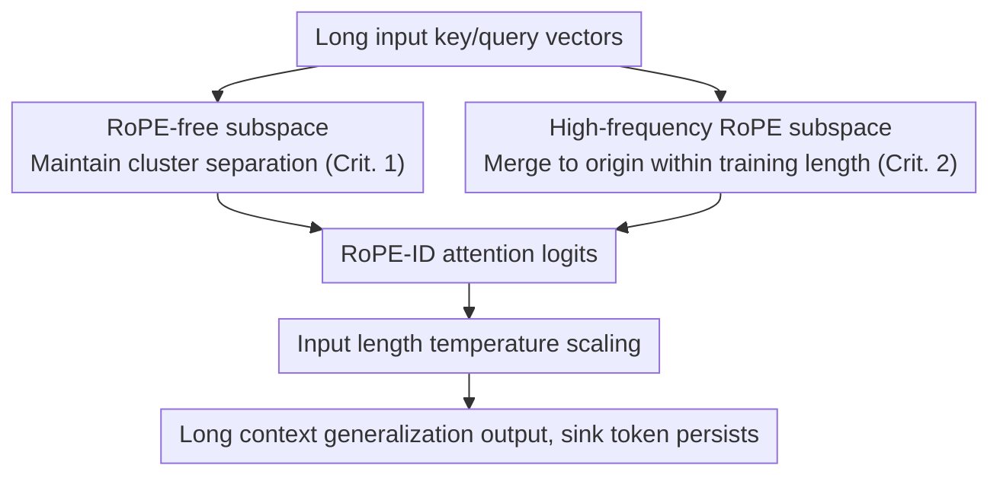

# Frayed RoPE and Long Inputs: A Geometric Perspective

**Conference**: ICLR 2026  
**OpenReview**: [https://openreview.net/forum?id=W8ZXfNaqku](https://openreview.net/forum?id=W8ZXfNaqku)  
**Area**: LLM Efficiency  
**Keywords**: RoPE, Long Context Extrapolation, Attention Sink, Geometric Analysis, Positional Encoding

## TL;DR
This paper explains why RoPE models collapse beyond their training length through a unified geometric perspective: long inputs scatter and overlap the originally distinct key/query clusters, causing sink tokens (attention focal points) to fail. Based on this, the authors propose RoPE-ID, which applies high-frequency rotation to only half of the channels, enabling training-free extrapolation to longer contexts that matches or exceeds YaRN on RULER and LongBench.

## Background & Motivation
**Background**: Rotary Positional Encoding (RoPE) is a standard component in most mainstream LLMs (LLaMA, GPT, DeepSeek). It encodes relative positions as angular displacements between keys and queries, decomposing relative distance into independent transformations for each.

**Limitations of Prior Work**: RoPE has a critical weakness—performance drops precipitously once input length exceeds the training context. The mainstream explanation is that "channels rotate out-of-distribution (OOD)," leading various solutions (PI, NTK, YaRN, LongRoPE) to apply frequency rescaling to mitigate this.

**Key Challenge**: However, "OOD rotation" is merely a descriptive phenomenon and does not clarify the **mechanism through which excessive rotation** leads to pathological behavior. Simultaneously, another widely observed phenomenon—attention sinks (typically the first token, which is semantically poor but absorbs large amounts of attention)—has been proven crucial for long-context generalization, yet it has been studied in isolation from RoPE and the attention mechanism.

**Goal**: To unify "Attention / RoPE / Sink Tokens" into a single geometric framework and answer two sub-questions: (1) What does attention look like in hidden space, and why do sink tokens naturally absorb attention? (2) What specifically does RoPE disrupt under long inputs that causes sinks to fail?

**Key Insight**: The authors move away from the intuitive model of "attention as soft nearest-neighbor search where keys/queries are overlapping point clouds around the origin." Instead, they **physically measure the hidden space geometry** of LLaMA3, Gemma, and OLMo, finding the reality to be quite different: keys and queries are squeezed into tight clusters that are offset from the origin and oriented in opposite directions.

**Core Idea**: The essence of long-context collapse is the **collapse of the sink token**. Beyond the training length, RoPE pulls the key/query clusters toward the origin and scatters them into overlapping regions, causing originally negative dot products to become positive and overwhelm the small but critical logit of the sink token. By ensuring that "cluster separation has a lower bound" and that "this bound is reached within the training length," the sink can continue to function—RoPE-ID is a minimal implementation of these two criteria.

## Method

### Overall Architecture
The core problem addressed in the method section is enabling RoPE models to perform "out-of-the-box" extrapolation to longer contexts without retraining or knowledge of the final sequence length (oracle length). Instead of modifying the frequency scaling curve, this paper redesigns the application of RoPE based on the two derived criteria.

The logic is as follows: divide the channels of each attention head into two. The **RoPE-free half** does not rotate, ensuring that key/query clusters remain separated at any length (satisfying Criterion 1: cluster overlap has a non-trivial lower bound, allowing the sink to survive). The **high-frequency RoPE half** uses a sufficiently high base frequency so that these channels complete full rotations and merge into an uncorrelated spherical shell around the origin **within the training length** (satisfying Criterion 2: the lower bound is reached within the training length, preventing further OOD drift). After merging the logits from both paths, a **length-adjusted temperature scaling** is applied to counteract the over-smoothing effect of the softmax when dealing with many nearly IID logits.

### Key Designs

**1. Two criteria for length generalization: Lower bound on cluster separation reached within training length**

This represents the "diagnostic conclusion" of the paper and serves as the basis for all subsequent designs. Through singular value analysis, the authors characterize two effects of RoPE on key/query matrices $X \in \mathbb{R}^{n \times d}$: first, RoPE reduces the first singular value (FSV, or spectral norm), pulling clusters toward the origin (Lemma 1: as $n \to \infty$, the FSV is reduced by at least $\sqrt{2}$ and at most $\sqrt{d}$); second, RoPE preserves the Frobenius norm (Lemma 2: $\|R(X)\|_F = \|X\|_F$), meaning other singular values must increase to compensate, "flattening" and scattering the cluster. Together, these cause the stable rank to increase monotonically with length:

$$\mathrm{srank}(X) := \frac{\|X\|_F^2}{\|X\|_2^2} = \frac{\sum_{i=1}^{d} \sigma_i^2}{\sigma_1^2}$$

Theorem 1 follows directly from these lemmas: as length increases, RoPE expands the stable rank by at least 2x and at most $d$ times—the point cloud transitions from a "needle-like tight cluster away from the origin" to a "sphere surrounding the origin." This is the root cause of cluster overlap, positive dot products, and sink failure. From this, the authors extract two **necessary** criteria: ① Cluster overlap must have a non-trivial lower bound (preserving sink function at the limit); ② This bound must be reached within the training length (otherwise, it drifts into OOD distributions). The authors also note that PI and YaRN are effective because they "accidentally" satisfy these; meanwhile, simply using "Half-channel RoPE" (HalfRoPE) only satisfies Criterion 1, and "full-channel high-frequency RoPE" only satisfies Criterion 2.

**2. RoPE-ID: Dual subspace division with half-channel high-frequency rotation and half RoPE-free**

Addressing the issue that single criteria are insufficient, this design assigns each criterion to half of the channels. The RoPE-free subspace naturally maintains key/query cluster separation and carries long-term semantic content, ensuring the sink token can still absorb default attention due to its small norm (Criterion 1). The high-frequency RoPE subspace raises the base frequency to "complete full rotations within the training length"—specifically, the lowest frequency is set to **two full rotations per training length** (to avoid residual correlation between low-freq channels), and the highest speed is set to one rotation per 32 tokens to preserve short-window information. This ensures clusters in the high-frequency subspace merge toward the origin within the training length, degrading into predictable, persistent uncorrelated shells; once the rotation arc is "filled," it can no longer rotate out of distribution (Criterion 2). With both criteria satisfied, long-context generalization becomes a natural consequence "by construction" rather than relying on temporary scaling based on oracle sequence lengths.

**3. Input length temperature scaling: Counteracting softmax over-smoothing of IID logits**

High-frequency RoPE turns many logits into approximately IID values. When applying softmax to many IID logits, the denominator grows with length while the numerator remains constant, causing the distribution to be artificially smoothed and weakening retrieval discriminability. Following YaRN, the authors introduce a temperature scale that varies with input length to compensate for this smoothing. Ablations show this is a "safe heuristic": as high-frequency components increase, performance improves gradually until a critical point. RoPE-ID with temperature scaling is significantly stronger than the version without it, so only the scaled version is used in formal experiments.

### Loss & Training
RoPE-ID is a plug-and-play replacement for RoPE and introduces no additional loss terms. To evaluate, the authors pre-trained 1B and 3B decoders from scratch using the LLaMA3 tokenizer and the Dolma v1.7 dataset (reweighted per related work), training on approximately 21 billion tokens. The training context length was 8k for LLaMA/Gemma (2k for OLMo), and they were directly extrapolated to 16k during evaluation.

## Key Experimental Results

### Main Results
Average accuracy on RULER (Needle-in-a-Haystack retrieval, counting, and other synthetic long-context tasks) by sequence length:

| Model | Length | RoPE | HighFreq | HalfRoPE | YaRN | RoPE-ID (Scaled) |
|-------|--------|------|----------|----------|------|------------------|
| Llama-1B | 4k | 39.72 | 16.04 | 43.07 | 40.24 | 39.15 |
| Llama-1B | 8k | 0.01 | 7.60 | 0.14 | 35.55 | **35.64** |
| Llama-1B | 16k | 0.03 | 2.37 | 0 | 30.25 | **30.83** |
| Llama-3B | 8k | 0.14 | 14.31 | 0.4 | **45.09** | 43.39 |
| Llama-3B | 16k | 0.01 | 5.14 | 0.03 | 40.14 | **42.0** |

Vanilla RoPE and HalfRoPE perform best within the 4k training length (HalfRoPE gains slightly from improved semantic encoding), but drop to near zero immediately after 4k. High-frequency RoPE is stable throughout but starts with low performance (information is overly fragmented). RoPE-ID (with scaling) is overall the strongest in the evaluation, slightly outperforming YaRN at long sequences **without requiring the oracle sequence length** (YaRN was provided with the oracle length beyond 4k).

Conclusions on LongBench (average of 14 English tasks) are consistent:

| Model | Length | RoPE | HighFreq | HalfRoPE | YaRN | RoPE-ID (Scaled) |
|-------|--------|------|----------|----------|------|------------------|
| Llama-1B | 16k | 8.73 | 11.04 | 8.86 | 14.09 | **15.80** |
| Llama-3B | 16k | 10.42 | 13.78 | 10.62 | **19.63** | 17.94 |

RoPE-ID outperforms YaRN across the board at the 1B scale. At the 3B scale, it is slightly inferior to YaRN on long sequences but significantly better than all other baselines.

### Ablation Study
| Configuration | Phenomenon | Explanation |
|---------------|------------|-------------|
| Vanilla RoPE | Satisfies 0 criteria | In synthetic experiments, FSV decays toward 0 throughout and does not finish within training length. |
| HalfRoPE (Half channels) | Satisfies Crit. 1 only | FSV has a non-trivial lower bound, but it is not reached within 4k, still resulting in OOD collapse. |
| High-freq full-channel RoPE | Satisfies Crit. 2 only | Lower bound reached within 4k, but the bound is a trivial 0; clusters collapse and lose long-range info. |
| RoPE-ID | Satisfies both | Non-trivial FSV lower bound reached within 4k; best of both worlds. |
| RoPE-ID w/o temp scaling | Significantly weaker | Performance drops on long sequences; thus, only the scaled version is kept. |

Common sense reasoning tasks (ARC-C / HellaSwag / PIQA) served as sanity checks; scores were similar across methods—indicating RoPE frequency and channel counts have minimal impact on model expressivity within the training length.

### Key Findings
- **Failure mechanism precisely located at the sink token**: Fig. 6 shows that with standard RoPE, the attention weight of the sink token fluctuates stably within the 8k training length but drops sharply to 0 once exceeded; meanwhile, the per-query maximum key-query dot product rises continuously with length—quantifying that "cluster overlap $\to$ positive dot products $\to$ overwhelming the sink."
- **Stable rank as a concise global diagnostic**: Compared to 2D PCA projections or pairwise distances, the monotonic increase of stable rank with length provides a holistic and provable characterization of "cluster scattering."
- **Temperature scaling is essential**: Removing it leads to significant performance drops on long sequences because the large number of IID logits introduced by high-freq channels makes the softmax distribution increasingly flat.

## Highlights & Insights
- **Unified three isolated phenomena**: Attention (softmax translation invariance forcing opposing clusters), sink tokens (the first key positioned near the origin with near-zero dot products for all queries, winning by default due to negative average dot products), and RoPE (scattering clusters toward the origin) are linked through a geometric narrative with much more explanatory power than "rotating OOD."
- **Rebutted the common intuition "Attention = Soft Nearest Neighbor"**: Empirical measurement shows keys/queries are not overlapping point clouds around the origin but tight clusters offset from the origin and oriented oppositely (FSV accounts for 75%+ of LLaMA3 cluster variance, near rank-1); this also explains why "allocating a sink" is easier to implement than "defaulting alignment to the current token."
- **Criteria-driven rather than curve-tuning**: While YaRN/PI "happened" to satisfy the two criteria, this paper makes them explicit. The two knobs of RoPE-ID (partial channels + high frequency) correspond to each criterion, making the design clear and transferable—any positional encoding intended for length extrapolation can be self-vetted using these two criteria.

## Limitations & Future Work
- **Theory based on rank-1 assumption**: Lemma 1 / Theorem 1 assume $X=uv^\top$ is strictly rank-1. While empirical measurements show key/query are approximately rank-1, a rigorous proof for "near rank-1" is left for future work.
- **Hyperparameters are "median heuristics"**: Setting low frequency to two rotations per training length and max speed to one rotation per 32 tokens are safe compromises from ablations, not necessarily optimal, and may depend on model/data.
- **Focus on training-free extrapolation, no fine-tuning**: The authors explicitly leave "length extension with fine-tuning" to the future; it is not directly comparable to methods like LongRoPE that require multi-stage long-context fine-tuning.
- **3B scale slightly lags behind YaRN on long sequences**: While dominant at 1B, the advantage at 3B on LongBench is less clear; whether the advantage scales further needs verification.

## Related Work & Insights
- **vs YaRN / NTK / PI**: These apply frequency rescaling during inference, and in these experiments, YaRN was given the oracle sequence length. RoPE-ID modifies the "channels and frequencies applied to RoPE," functioning out-of-the-box without prior length knowledge.
- **vs HalfRoPE (Barbero et al.)**: This paper acknowledges that partial channel methods preserve semantics and stabilize cluster separation (Criterion 1) but points out they satisfy only one criterion; low-frequency channels remain, and long context still collapses. RoPE-ID adds "high frequency" on top of "partial channels" to satisfy Criterion 2.
- **vs Full High-frequency RoPE (Liu et al.)**: They only evaluated using perplexity, which improves due to long-range stability but masks the loss of long-range information caused by many unrelated rotations. This paper reveals this flaw using RULER/LongBench retrieval tasks.

## Rating
- Novelty: ⭐⭐⭐⭐⭐ Unifying attention/RoPE/sinks into a provable geometric framework and precisely attributing failure to sink collapse is highly novel.
- Experimental Thoroughness: ⭐⭐⭐⭐ Multi-model geometric analysis + 1B/3B scales across RULER/LongBench/Reasoning benchmarks; however, training scale is relatively small and extrapolation only goes to 16k.
- Writing Quality: ⭐⭐⭐⭐⭐ Extremely clear logical chain from debunking intuitive models to singular value proofs to the sink mechanism and finally to method criteria.
- Value: ⭐⭐⭐⭐ Provides a transferable "two-criteria" diagnostic tool and a simple, effective plug-and-play solution with practical guidance for long-context positional encoding design.

<!-- RELATED:START -->

## Related Papers

- [\[ICLR 2026\] Revisiting Long-context Modeling from Context Denoising Perspective](revisiting_long-context_modeling_from_context_denoising_perspective.md)
- [\[ICLR 2026\] Randomization Boosts KV Caching, Learning Balances Query Load: A Joint Perspective](randomization_boosts_kv_caching_learning_balances_query_load_a_joint_perspective.md)
- [\[ICML 2026\] CriticalKV: Optimizing KV Cache Eviction from an Output Perturbation Perspective](../../ICML2026/llm_efficiency/criticalkv_optimizing_kv_cache_eviction_from_an_output_perturbation_perspective.md)
- [\[ICLR 2026\] Sparse Attention Adaptation for Long Reasoning](sparse_attention_adaptation_for_long_reasoning.md)
- [\[ICLR 2026\] Extending the Context of Pretrained LLMs by Dropping Their Positional Embedding](extending_the_context_of_pretrained_llms_by_dropping_their_positional_embedding.md)

<!-- RELATED:END -->
