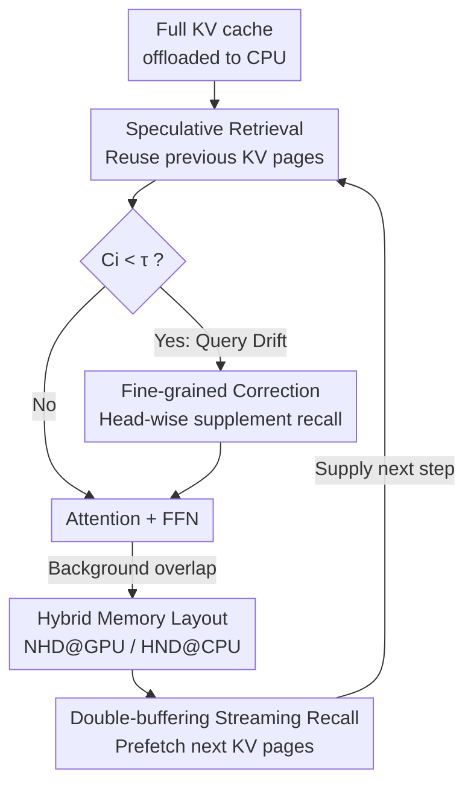

# FreeKV: Boosting KV Cache Retrieval for Efficient LLM Inference

**Conference**: ICLR 2026  
**OpenReview**: [https://openreview.net/forum?id=wXAn7orB1H](https://openreview.net/forum?id=wXAn7orB1H)  
**Code**: https://github.com/sjtu-zhao-lab/FreeKV  
**Area**: LLM Efficiency  
**Keywords**: KV cache, retrieval-based compression, speculative retrieval, long-context inference, algorithm-system co-optimization

## TL;DR
FreeKV is a **training-free algorithm-system co-optimization framework**. It removes KV page selection and recall from the inference critical path via "speculative retrieval," compensates for accuracy loss with "fine-grained correction," and utilizes a hybrid CPU/GPU memory layout with double-buffering streaming recall. This allows retrieval-based KV cache compression to achieve up to **13×** speedup over SOTA retrieval methods with almost no loss in accuracy.

## Background & Motivation

**Background**: LLM context windows are rapidly expanding to 128K or even millions of tokens. However, KV cache size grows linearly with context length (e.g., Llama-3-70B requires 40GB for a single request at 128K), which can exceed VRAM limits and severely slow down decoding due to being memory-bound. To mitigate this, industry practices use attention sparsity for KV cache compression, categorized into: **KV dropping** (permanently discarding unimportant tokens) and **KV retrieval** (retaining the full cache and dynamically selecting a subset for each step).

**Limitations of Prior Work**: Both approaches have significant drawbacks. KV dropping suffers because token importance is **dynamic**—tokens deemed unimportant now may become critical later—leading to accuracy collapse in long-generation tasks like summarization and reasoning. KV retrieval maintains accuracy but suffers from low efficiency: ① Full caches are typically offloaded to the CPU, and retrieving selected KV tensors to the GPU over low-bandwidth PCIe causes high latency; ② Selection overhead across the entire context is substantial. Tests on Llama-3.1-8B with a 32K context show that retrieval/selection accounts for ~94% of total latency in ArkVale and ~73% in ShadowKV. Even with communication/computation overlap in InfiniGen, unhidden recall still accounts for ~53%.

**Key Challenge**: There is a Pareto trade-off between accuracy and efficiency—dropping is efficient but inaccurate, while retrieval is accurate but inefficient. The root cause of retrieval inefficiency is that **selection and recall reside on the inference critical path**, requiring completion before attention computation can proceed.

**Goal**: To eliminate the overhead of selection and retrieval while maintaining retrieval's accuracy advantages, bringing the efficiency of retrieval-based compression close to dropping methods or full cache processing.

**Key Insight**: The authors observe that **query vectors in adjacent decoding steps are highly similar** (cosine similarity > 0.9 for most heads, all heads > 0.84). This implies that selected KV pages remain almost unchanged between steps ($\mathrm{Sel}(q_i, K) \sim \mathrm{Sel}(q_{i-1}, K)$). Consequently, the current step does not need to compute and fetch immediately; it can "gamble" that its selection matches the previous step and **reuse the previously retrieved results**.

**Core Idea**: Move selection/recall off the critical path via "speculative retrieval + fine-grained correction" to hide latency. Simultaneously, use a hybrid memory layout and streaming recall on the system side to speed up the recall process, maximizing retrieval-based compression efficiency from both algorithmic and systemic perspectives.

## Method

### Overall Architecture
FreeKV aims to fully hide the "page selection + KV page recall from CPU" overhead for each decoding step while offloading the full KV cache to the CPU. The framework consists of two axes: the **algorithm side** uses **speculative retrieval** to allow the current step to compute attention using the previous step's KV pages while concurrently performing selection and recall for the next step. When query similarity drops below a threshold, **fine-grained correction** is triggered to fetch missing pages per KV head. The **system side** ensures recall is fast enough to be masked through a **hybrid memory layout** (NHD on GPU, HND on CPU) and **double-buffering streaming recall**.

### Key Designs

**1. Speculative Retrieval: Moving Selection and Recall Off the Critical Path**

Retrieval-based methods are inefficient because each decoding step must "select pages, recall from CPU, and then compute attention," creating a chain that cannot be hidden. FreeKV leverages the observation of high query similarity to let step $i$ **skip current selection/recall**, directly reusing KV pages retrieved in step $i-1$. Meanwhile, selection and recall for the current step are triggered in the background for step $i+1$. This allows selection/recall to overlap with current layer attention, FFN, and next-layer QKV projections. Unlike InfiniGen, which requires extra re-projection for prefetching, speculative retrieval hides latency with **zero additional computation**.

Selection employs **page-wise group-consistent selection**: each KV page is summarized using min-max pooled keys (similar to Quest). After calculating page attention weights $P_h \in \mathbb{R}^{n_{page}}$ for head $h$, mean pooling is applied to $\mathrm{softmax}(P_h)$ within the GQA group to ensure consistent page selection across all heads in the group. The page score for KV head $m$ is $\sum_{j=1}^{G}\mathrm{softmax}(P_{(m-1)\times G+j})/G$. This ensures the retrieved KV space is $O(B \times n_{kv})$ rather than $O(B \times n_{qo})$, avoiding $G$-fold VRAM and memory access overhead.

**2. Fine-grained Correction: On-demand Supplement for Query Drift**

Reusing previous pages is fastest, but similarity analysis shows that **some decoding steps exhibit outlier drops in similarity, which vary by attention head**. Ignoring these causes significant accuracy loss. FreeKV employs a low-overhead correction mechanism with two steps. **Query-based identification**: Comparing selection index differences $\mathrm{Sel}(q_i,K)$ vs $\mathrm{Sel}(q_{i-1},K)$ is expensive and breaks overlap. Instead, the query cosine similarity $C_i$ is used—correction is only triggered if $C_i < \tau$ (threshold set to 0.8/0.9). To maintain group consistency, $C_i$ is mean-pooled within the group before comparison. **Head-wise correction**: Flagged KV heads trigger immediate selection and recall before attention computation, while other heads defer recall to the background. To maintain GPU utilization, if any head requires correction, **selection is performed once for all KV heads**, and non-correction heads reuse these selection results for background recall.

**3. Hybrid Memory Layout: NHD@GPU + HND@CPU to Eliminate Fragmented Transfer**

Efficiency depends on recall speed, which is dictated by memory layout. Common KV cache layouts are NHD $(n_{page}, p, n_{kv}, d)$ and HND $(n_{page}, n_{kv}, p, d)$. Since K/V projections are naturally $(L, n_{kv}\times d)$, NHD is the standard layout in major frameworks to avoid repeated transposition during decoding. However, in NHD, **$p$ tokens of the same KV head are non-contiguous in memory**, limiting the maximum transfer unit to only $d$ elements (single head, 256 bytes in Float16), causing severe fragmentation. FreeKV's solution is a **hybrid layout (NHD on GPU, HND on CPU)**: the GPU maintains NHD for efficiency, while the CPU uses HND to make $p$ vectors of a head contiguous, increasing the transfer unit to $p\times d$ (~8KB for $p=32$). NHD↔HND transposition occurs once during offloading and is amortized. The CPU further uses a $(n_{page}, n_{kv}, 2, p, d)$ shape to allow contiguous transfer of $2\times p\times d$ elements for both key and value.

**4. Double-Buffering Streaming Recall: Pipelined Transfer and Layout Transformation**

While offloading and transposition can overlap with computation, the "HND→NHD layout transformation" during recall typically blocks data transfer and attention. FreeKV uses **double-buffering** to pipeline this: as one KV page transfers to buffer 2, its layout transformation begins immediately, while the next page transfers concurrently into buffer 1. Both buffers and the transformation process reside on the GPU to maximize bandwidth. This ensures recall latency is fully compressed, providing the system foundation for speculative retrieval's "full overlap."

## Key Experimental Results

Experiments covered long input (LongBench v2), long generation (LongGenBench), and long reasoning (MATH500 / AIME24 / GPQA) using models like Llama-3.1-8B, Qwen-2.5-7B/14B, and the DeepSeek-R1 series. Budget $B$ was fixed at 2048 (except RazorAttention at 0.15 sparsity). Efficiency was tested on an A100 40GB (PCIe Gen4).

### Main Results

Accuracy (LongBench v2 Overall, higher is better; gap between FreeKV and Full KV is ≤ 0.6):

| Model | Full | RaaS (dyn-drop) | Quest | ArkVale | ShadowKV | InfiniGen | Ours |
|------|------|------|-------|---------|----------|-----------|--------|
| Llama-3.1-8B | 29.22 | 28.23 | 28.43 | 28.63 | 25.45 | 28.56 | **29.22** |
| Qwen-2.5-7B | 27.44 | 26.24 | 27.63 | 26.84 | 25.84 | 26.44 | 26.84 |
| Qwen-2.5-14B | 33.40 | 32.60 | 33.80 | 34.19 | 34.79 | 32.31 | 34.19 |

Long Reasoning (avg@k, DeepSeek-R1 series, higher is better):

| Model / Dataset | Full | Quest | ArkVale | ShadowKV | InfiniGen | Ours |
|------|------|-------|---------|----------|-----------|--------|
| R1-Llama-8B / AIME24 | 47.08 | 44.17 | 46.67 | 36.50 | 45.83 | **47.50** |
| R1-Qwen-7B / AIME24 | 56.66 | 47.50 | 47.92 | 43.75 | 43.34 | 52.92 |
| R1-Qwen-14B / GPQA | 53.25 | 51.25 | 53.75 | 51.75 | 38.00 | **56.00** |

End-to-end Efficiency (Speedup over SOTA retrieval methods, higher is better):

| Scenario | vs ArkVale | vs ShadowKV | vs InfiniGen |
|------|-----------|-------------|--------------|
| Llama-3.1-8B Gen | **13.7×** | 8.4× | 8.5× |
| Llama-3.1-8B Input | 10.0× | — | 5.1× |
| Qwen-2.5-7B Gen | 7.9× | — | 5.4× |
| Qwen-2.5-7B Input | 5.8× | — | 3.2× |

### Ablation Study

| Configuration | Effect | Description |
|------|------|------|
| Full FreeKV | Near-lossless accuracy + Up to 13× speedup | Both Algorithm and System sides active |
| Pure reuse, no correction | Significant accuracy drop | Outlier query similarity steps uncorrected |
| Max pooling instead of mean (group-consistent) | Inferior to mean pooling | See Appendix B.2/B.3 |
| Prev-layer query recall (vs speculative) | Worse accuracy | Speculative retrieval using prev-step query is superior |

### Key Findings
- **Fine-grained correction is vital for accuracy**: Pure speculative reuse is fast, but head-specific similarity outliers cause accuracy drops; head-wise correction triggered by $C_i < \tau$ restores accuracy with minimal cost.
- **Speedup scales with workload**: Greater batch sizes, longer generation (more recalls), and more KV heads (e.g., Llama-3.1-8B) increase FreeKV's advantage over other methods, reaching up to 13.7× over ArkVale.
- **ShadowKV repeats outputs on Qwen-2.5**: Because it performs SVD once during prefill and never updates low-rank keys during decoding, reconstruction errors lead to logic failures, highlighting the robustness of FreeKV's "full cache retrieval."

## Highlights & Insights
- **Leveraging adjacent query similarity as a latency-hiding lever**: This is the most clever step—rather than optimizing the retrieval speed directly, it moves the operation out of the critical path and uses threshold-based correction as a safety net.
- **Cohesiveness between Algorithm and System**: Speculative retrieval requires fast recall to be fully masked. The hybrid layout (NHD@GPU/HND@CPU) and streaming recall are essential system-side pillars.
- **Transferable paradigm**: The "speculate using adjacent iterations + correct via lightweight signals" pattern is applicable to any scenario requiring expensive per-step subset computation, such as RA-LLM or sparse attention.
- **Training-free**: No model modifications or retraining are required; it acts as a plug-in for existing LLMs.

## Limitations & Future Work
- FreeKV is orthogonal to adaptive/dynamic budget or top-p sparsity, but these were not integrated in this study.
- Page-wise selection may lose effectiveness at **very small budgets**; learnable block-wise sparsity remains a potential direction.
- Speculative retrieval relies on high query similarity; if a model/task has low stability, correction triggers will increase and hiding benefits will decrease. The threshold $\tau$ currently requires manual tuning.
- Efficiency tests were performed on A100 with PCIe Gen4. The speedup ratio in higher-bandwidth environments (NVLink/HBM) remains to be verified.

## Related Work & Insights
- **vs ArkVale**: Both are offload+retrieval methods, but ArkVale's recall is on the critical path (~94% latency); FreeKV achieves up to 13.7× speedup by overlapping it.
- **vs ShadowKV**: ShadowKV saves transfer via SVD but suffers from key reconstruction errors in long-term generation; FreeKV maintains stability by retrieving the full cache.
- **vs InfiniGen**: InfiniGen uses re-projection for partial overlap, but its token-wise recall is inefficient; FreeKV hides selection+recall with zero compute overhead, yielding 3.2×–5.1× speedup in long-input tasks.
- **vs KV dropping (RazorAttention/RaaS)**: Dropping is efficient but suffers from permanent information loss; FreeKV approaches dropping's efficiency while maintaining retrieval's accuracy.

## Rating
- Novelty: ⭐⭐⭐⭐ "Speculative retrieval + fine-grained correction" cleverly converts temporal similarity into hidden latency.
- Experimental Thoroughness: ⭐⭐⭐⭐⭐ Comprehensive coverage across metrics (accuracy/efficiency), tasks, and models.
- Writing Quality: ⭐⭐⭐⭐ Clear logic between algorithm and system, though some system details require the appendix.
- Value: ⭐⭐⭐⭐⭐ Training-free, plug-and-play, up to 13× speedup with near-lossless accuracy makes this highly significant for deployment.

<!-- RELATED:START -->

## Related Papers

- [\[ICLR 2026\] LouisKV: Efficient KV Cache Retrieval for Long Input-Output Sequences](louiskv_efficient_kv_cache_retrieval_for_long_input-output_sequences.md)
- [\[ICLR 2026\] DefensiveKV: Taming the Fragility of KV Cache Eviction in LLM Inference](defensivekv_taming_the_fragility_of_kv_cache_eviction_in_llm_inference.md)
- [\[ICML 2026\] OBCache: Optimal Brain KV Cache Pruning for Efficient Long-Context LLM Inference](../../ICML2026/llm_efficiency/obcache_optimal_brain_kv_cache_pruning_for_efficient_long-context_llm_inference.md)
- [\[ICLR 2026\] IceCache: Memory-Efficient KV-cache Management for Long-Sequence LLMs](icecache_memory-efficient_kv-cache_management_for_long-sequence_llms.md)
- [\[ICLR 2026\] Fast-dLLM: Training-free Acceleration of Diffusion LLM by Enabling KV Cache and Parallel Decoding](fast-dllm_training-free_acceleration_of_diffusion_llm_by_enabling_kv_cache_and_p.md)

<!-- RELATED:END -->
