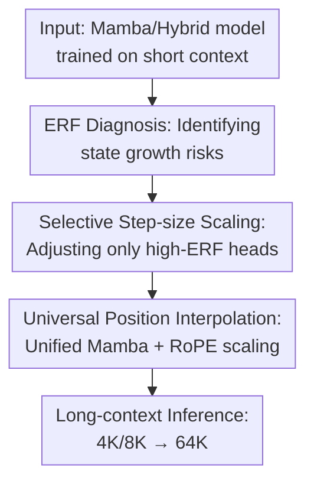

# From Collapse to Control: Understanding and Extending Context Length in Emerging Hybrid Models via Universal Position Interpolation

**Conference**: ICLR2026  
**OpenReview**: [https://openreview.net/forum?id=MjmORKLHUI](https://openreview.net/forum?id=MjmORKLHUI)  
**Code**: None  
**Area**: LLM Efficiency  
**Keywords**: Long Context Extension, Hybrid Mamba-Transformer, State Space Models, Position Interpolation, Training-Free Inference  

## TL;DR
This paper systematically explains why hybrid Mamba-Transformer models suffer from context collapse beyond their training window and proposes Universal Position Interpolation (UPI). By simultaneously scaling Transformer RoPE frequencies and the step size $\Delta_t$ of a few unstable Mamba heads, UPI extends the usable context of Bamba, Nemotron-H, and Mamba2 from 4K/8K up to 64K without retraining.

## Background & Motivation

**Background**: Long-context capability is crucial for LLMs in document understanding, retrieval-augmented generation (RAG), multi-turn dialogue, and codebase analysis. While pure Transformers model long-range dependencies with global attention, their cost scales quadratically. Hybrid Mamba-Transformer architectures (e.g., Bamba, Nemotron-H, Jamba) interleave Transformer layers with Mamba layers to combine the expressivity of attention with the inference efficiency of State Space Models (SSMs).

**Limitations of Prior Work**: While these hybrid models perform strongly within their training context, they are rarely tested for "train at 4K/8K, infer at 32K/64K." Preliminary experiments show that models like Bamba-9B-v2 exhibit a sharp spike in PG-19 perplexity and a crash in RULER needle retrieval accuracy once the input exceeds the training length. Intuition might suggest applying YaRN/PI only to Transformer RoPE, but experiments show this only slightly alleviates the issue and does not prevent collapse.

**Key Challenge**: The long-context bottleneck in hybrid models resides not only in Transformer positional encodings but also in Mamba state dynamics. Mamba recurrence accumulates over time; a small number of heads with forget gates near 1 do not saturate within the training length. During longer inference, these states continue to grow outside the training distribution, suppressing other heads via output gates and GroupNorm, leading to "feature collapse." Thus, extension requires controlling both attention position scales and Mamba state growth scales.

**Goal**: The authors address three questions: First, what causes long-context failure in hybrid models? Second, can it be fixed without fine-tuning, large-scale searches, or modified fused kernels? Third, is the fix applicable to both pure Mamba and hybrid models with stable improvements on benchmarks?

**Key Insight**: By analyzing the Effective Receptive Field (ERF), the authors compare Transformer and Mamba heads on the same scale. They found that while Transformer ERFs scale linearly with length, most Mamba heads saturate quickly, except for a few "high-ERF" heads. These heads correspond to those where the Frobenius norm of the state continuously grows. Controlling these few non-convergent heads by reducing the state increment per token is identified as the core entry point.

**Core Idea**: When the inference length is $n$ times larger than training, the step size $\Delta_t$ is scaled to $\Delta_t/n$ for unstable Mamba heads. Combined with Transformer RoPE frequency scaling, this provides a unified position interpolation perspective to control both types of positional dynamics.

## Method

### Overall Architecture

UPI is not a retrained model but a lightweight calibration and closed-form scaling method for existing hybrid models. It first uses a small calibration set to calculate the ERF of each Mamba head, selecting the top-$K$ high-ERF heads as potential risks. During inference, Transformer layers continue using RoPE scaling (e.g., YaRN), while selected Mamba heads reduce $\Delta_t$ proportionally to the target length. The model maintains its original forward graph without extra parameters or per-generation searches.

The core contributions include: proving the link between collapse and state magnitude explosion in high-ERF Mamba heads, deriving the closed-form step-size scaling for Mamba, and integrating it with RoPE scaling within a "slowed positional progression" framework. ERF diagnosis requires only a few forward passes on a small calibration set; after identifying the heads, inference involves element-wise scaling of $\Delta_t$ for selected heads.

### Key Designs

**1. ERF Diagnosis: Pinpointing Collapse to Unconverged Mamba Heads**

The failure is not attributed to the hybrid architecture itself but analyzed via head-level ERF. For Mamba, the authors use Mamba Mean Distance (MMD):

$$
\mathrm{MMD}=\sum_{j=1}^{L}(L-j)\frac{|M_{L,j}|}{\sum_{i=1}^{L}|M_{L,i}|}
$$

where $M$ is the attention-like lower-triangular matrix derived from unrolling Mamba. $M_{L,j}$ represents the influence of the $j$-th token on the final position. High MMD suggests a head maintains influence over long distances. In Bamba-9B-v2, Transformer ERFs scale linearly, while a subset of Mamba heads also scales extensively. These high-ERF heads show synchronized hidden state Frobenius norm growth. Since Mamba updates as $h_{t+1}=a_t h_t + B_t x_t$, when the forget gate $a_t \approx 1$, the state exceeds the training distribution during long inference, causing feature collapse after projection and normalization.

**2. Selective Step-size Scaling: Controlling Incremental State Growth**

To prevent state explosion, each token's contribution to the state update must be reduced in longer sequences. For a target length $n$ times the training length, the original Mamba update is:

$$
h_{t+1}=\exp(-a\Delta_t)h_t+\Delta_t B_t x_t
$$

The authors derive a closed-form adjustment ensuring that $n$ small steps equal one original large step in terms of cumulative decay and input contribution. The adjusted gates are:

$$
f(a,\Delta_t,n)=\exp(-a\Delta_t/n)
$$

$$
g(B_t,\Delta_t,n)=\Delta_tB_t\cdot\frac{1-\exp(-a\Delta_t/n)}{1-\exp(-a\Delta_t)}
$$

In practice, to avoid numerical noise in the input scaling fraction, the rule is simplified: for high-ERF heads, $\Delta_t$ is replaced by $\Delta_t/n$. This maintains the intuition of "slower state accumulation" without dynamic scaling noise.

**3. Universal Position Interpolation: Unified Scaling Logic**

UPI treats Mamba cumulative decay and Transformer rotary frequencies as two types of position injection. RoPE determines representation rotation speed; PI scales frequencies to stay within the trained phase range. In Mamba, $\Delta_t$ and forget gates determine state progression speed. Scaling $\Delta_t/n$ for selected heads essentially slows down the "clock" for those states. UPI combines both: Transformer layers use RoPE scaling (e.g., YaRN), and Mamba layers use selective $\Delta_t/n$ scaling (typically for the top 20% high-ERF heads, based on the observed bimodal distribution).

### A Complete Example

To extend Bamba-9B-v2 (4K training) to 64K ($n=16$), UPI first constructs 100 calibration samples (16K tokens each) to profile ERF. The top 20% of Mamba heads by ERF are identified. During 64K document inference, Transformer RoPE frequencies are scaled by YaRN, and the 20% high-ERF Mamba heads use $\Delta_t/16$. The remaining 80% (local heads) retain their original $\Delta_t$. This allows high-ERF heads to cover long distances without state explosion, while local heads preserve short-range patterns.

### Loss & Training

UPI requires no new training loss or long-context fine-tuning. The "training" is a 3-minute calibration on an A100 to estimate ERF. Compared to LongMamba, which requires ~10.5 hours of hyperparameter search, UPI is significantly more efficient. Implementation involves element-wise scaling of $\Delta_t$ for selected heads, introducing zero additional inference overhead.

## Key Experimental Results

### Main Results

Evaluations were performed on pure Mamba2-2.7B, hybrid Bamba-9B-v2, and hybrid Nemotron-H-8B. Language modeling results on PG-19 (training window: Mamba2-2K, Bamba-4K, Nemotron-H-8K):

| Model | Method | 8K PPL | 16K PPL | 32K PPL | 64K PPL |
|------|------|--------|---------|---------|---------|
| Bamba-9B-v2 | Base | 9.37 | 14.23 | 32.76 | 127.90 |
| Bamba-9B-v2 | LongMamba + YaRN | 8.83 | 13.02 | 23.68 | 53.14 |
| Bamba-9B-v2 | UPI + YaRN | 9.01 | 9.82 | 14.60 | 18.59 |
| Nemotron-H-8B | Base | 7.59 | 46.57 | 210.30 | 530.31 |
| Nemotron-H-8B | LongMamba | 7.13 | 23.24 | 46.42 | 78.51 |
| Nemotron-H-8B | UPI | 7.39 | 15.58 | 25.72 | 44.01 |
| Mamba2-2.7B | Base | 16.73 | 53.14 | 137.82 | 478.21 |
| Mamba2-2.7B | LongMamba | 9.16 | 14.82 | 23.59 | 42.20 |
| Mamba2-2.7B | UPI | 8.75 | 13.69 | 17.58 | 22.24 |

UPI significantly reduces PPL for all models. For instance, Nemotron-H-8B at 64K dropped from 530.31 to 44.01. On RULER (retrieval) and LongBench-E, UPI consistently outperformed base models and existing extension methods.

### Ablation Study

| Configuration | 8K PPL | 16K PPL | 32K PPL | 64K PPL | Description |
|------|--------|---------|---------|---------|------|
| UPI + YaRN | 9.01 | 9.82 | 14.60 | 18.59 | Unified scaling |
| w/o YaRN | 9.23 | 12.54 | 16.87 | 25.79 | Only Mamba side scaled |
| w/o UPI | 8.97 | 14.85 | 27.29 | 98.01 | Only Transformer side scaled |
| w/o Selective head | 9.47 | 15.73 | 23.85 | 65.92 | Scale all Mamba heads |

Removing selective scaling or one side of the interpolation significantly degrades performance, confirming that hybrid models require dual-side management and that selective scaling is necessary to preserve local biases. The 20% top-K cutoff was found to be the empirical optimum.

### Key Findings

- Mamba heads are not all "local summaries." High-ERF heads cause collapse when their state magnitude exceeds the training distribution.
- UPI yields the greatest gains at the longest context (e.g., Mamba2 @ 64K PPL dropped from 478 to 22).
- Mamba and Transformer scaling are complementary; both are needed to prevent hybrid model collapse.
- Calibration is extremely low-cost (~3 mins vs 10+ hours for search-based methods).
- UPI is compatible with fine-tuned models, acting as a post-hoc stabilizer for even longer contexts.

## Highlights & Insights

- The key insight is diagnosing hybrid collapse as a state dynamics issue. The link between ERF and state norm provides a concrete target for mitigation.
- The selective scaling of the top 20% heads preserves short-range inductive biases while extending long-range capacity, which is superior to global scaling.
- Viewing $\Delta_t$ scaling as the SSM equivalent of RoPE frequency interpolation provides a powerful framework for future hybrid architectures.

## Limitations & Future Work

- **Dependency**: Head selection still depends on a calibration step, though minimal.
- **Empirical Cutoff**: The 20% threshold is empirical; future models might require more adaptive thresholding.
- **Complexity**: Evaluations focused on language modeling and retrieval; long-range complex reasoning (hallucinations, multi-step agents) remains to be fully explored.
- **Intrinsic Capacity**: UPI stabilizes state growth but cannot imbue a model with complex long-range logic never learned during training.

## Related Work & Insights

- **vs YaRN**: UPI highlights that RoPE scaling alone is insufficient for hybrid models due to SSM state dynamics.
- **vs LongMamba**: UPI offers a faster, closed-form solution based on ERF profiling rather than heavy parameter searching.
- **vs Architecture Methods**: While new architectures (e.g., Jamba) build in long-context capability, UPI is a post-hoc solution for existing models like Bamba and Nemotron-H.

## Rating

- **Novelty**: ⭐⭐⭐⭐⭐ First systematic explanation and unified fix for hybrid context collapse.
- **Experimental Thoroughness**: ⭐⭐⭐⭐⭐ Comprehensive coverage across models and benchmarks.
- **Writing Quality**: ⭐⭐⭐⭐☆ Clear logic; some technical SSM details are dense.
- **Value**: ⭐⭐⭐⭐⭐ Highly practical for deploying hybrid models in long-context scenarios.

<!-- RELATED:START -->

## Related Papers

- [\[ICLR 2026\] Understanding and Improving Length Generalization in Hierarchical Sparse Attention Models](understanding_and_improving_length_generalization_in_hierarchical_sparse_attenti.md)
- [\[ACL 2025\] Giraffe: Design Choices for Extending the Context Length of Visual Language Models](../../ACL2025/llm_efficiency/design_choices_for_extending_the_context_length_of_visual_language_models.md)
- [\[ICLR 2026\] Beyond Real: Imaginary Extension of Rotary Position Embeddings for Long-Context LLMs](beyond_real_imaginary_extension_of_rotary_position_embeddings_for_long-context_l.md)
- [\[ICLR 2026\] Distilling to Hybrid Attention Models via KL-Guided Layer Selection](distilling_to_hybrid_attention_models_via_kl-guided_layer_selection.md)
- [\[ICLR 2026\] UltraLLaDA: Scaling the Context Length to 128K for Diffusion Large Language Models](ultrallada_scaling_the_context_length_to_128k_for_diffusion_large_language_model.md)

<!-- RELATED:END -->
## Related Papers

- [\[ICLR 2026\] Understanding and Improving Length Generalization in Hierarchical Sparse Attention Models](understanding_and_improving_length_generalization_in_hierarchical_sparse_attenti.md)
- [\[ICLR 2026\] UltraLLaDA: Scaling the Context Length to 128K for Diffusion Large Language Models](ultrallada_scaling_the_context_length_to_128k_for_diffusion_large_language_model.md)
- [\[ACL 2025\] Giraffe: Design Choices for Extending the Context Length of Visual Language Models](../../ACL2025/llm_efficiency/design_choices_for_extending_the_context_length_of_visual_language_models.md)
- [\[ICLR 2026\] Beyond Real: Imaginary Extension of Rotary Position Embeddings for Long-Context LLMs](beyond_real_imaginary_extension_of_rotary_position_embeddings_for_long-context_l.md)
- [\[ICLR 2026\] Distilling to Hybrid Attention Models via KL-Guided Layer Selection](distilling_to_hybrid_attention_models_via_kl-guided_layer_selection.md)

<!-- RELATED:END -->
