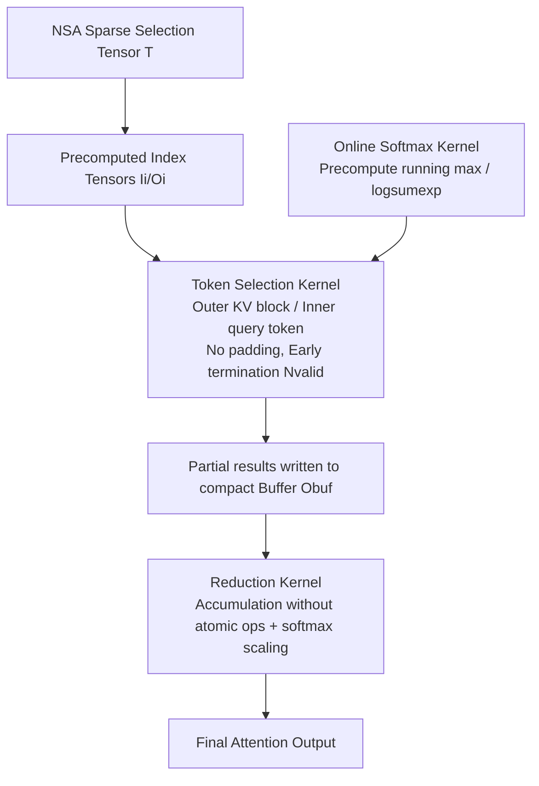

# FSA: An Alternative Efficient Implementation of Native Sparse Attention Kernel

**Conference**: ICLR 2026  
**OpenReview**: [https://openreview.net/forum?id=c5mdo1hWrs](https://openreview.net/forum?id=c5mdo1hWrs)  
**Code**: [https://github.com/Relaxed-System-Lab/Flash-Sparse-Attention](https://github.com/Relaxed-System-Lab/Flash-Sparse-Attention)  
**Area**: Efficient LLM Inference & Training / Sparse Attention GPU Kernel  
**Keywords**: Native Sparse Attention, GQA, Attention Kernel, Long Context, Triton, Loop Reordering  

## TL;DR
FSA reorders the NSA sparse attention kernel from "outer loop query token, inner loop KV block" to "outer loop KV block, inner loop query token." This eliminates padding waste in mainstream LLMs with few query heads per GQA group, reducing kernel latency by up to 3.5× and accelerating end-to-end training by up to 1.25×.

## Background & Motivation

**Background**: Full attention in long-context LLMs grows quadratically with sequence length; at 64k tokens, attention can account for 70–80% of decoding latency. Sparse attention, where each query interacts with only a subset of KV, is a primary direction for cost reduction. Among these, Native Sparse Attention (NSA) organizes KV into blocks and uses a three-way parallel attention (compression, selection, sliding window). It is natively trainable, hardware-aligned, and achieves accuracy close to full attention, making it SOTA.

**Limitations of Prior Work**: The actual system bottleneck in NSA is the token selection path—each query token dynamically selects different $T$ KV blocks across query heads, resulting in irregular HBM access. The vanilla NSA kernel uses two loops: an outer loop for query tokens (batching query heads that share the same KV head) and an inner loop for loading selected KV blocks. This batching strategy is efficient only when the number of query heads per GQA group is large enough to fill the minimum shape of hardware matrix instructions (e.g., each dimension $\ge 8$ on Hopper).

**Key Challenge**: In reality, mainstream LLMs typically have only 1, 2, or 4 query heads per GQA group, which is insufficient to fill matrix instructions. The NSA kernel must perform **padding** on the query head dimension to meet hardware requirements, leading to significant wasted data loading and computation—theoretical FLOP reductions from sparse algorithms fail to translate into real-world wall-clock speedup.

**Goal**: Design an NSA token selection kernel that is efficient across various GQA group configurations (especially with few heads), enabling the benefits of sparse algorithms for widely used existing LLMs.

**Core Idea (Loop Reordering + Decoupled Reduction)**: Since the number of query tokens attending to a single KV block is usually much larger than the minimum hardware shape requirement, the loops are **swapped**. The outer loop iterates over KV blocks, and the inner loop iterates over batches of query tokens attending to that block, naturally eliminating padding. To address the new challenge of partial results for the same query being scattered across different thread blocks, FSA utilizes index tensors and decoupled reduction/online softmax kernels.

## Method

### Overall Architecture
FSA maintains NSA's algorithmic semantics while rewriting the token selection kernel implementation. It reverses the loop order from (outer query token / inner KV block) to (outer KV block / inner query token). Each thread block handles a (Query Head, KV Block) pair, loading the KV block once and iteratively processing non-contiguous batches of query tokens that attend to it. To handle the side effects of reordering—non-contiguous access and cross-thread block accumulation—FSA introduces index tensors for data orchestration and splits "computation" and "reduction/online softmax" into three specialized kernels.

### Key Designs

**1. Loop Order Reversal to Eliminate Padding**: Vanilla NSA requires padding because it processes KV blocks in the inner loop while batching query heads in the outer loop, and the number of heads $g$ in a GQA group is often too small to fill the matrix instruction dimensions. FSA reverses this: the outer grid iterates over KV blocks, and the inner loop batches query tokens attending to that block. Since the number of query tokens per KV block usually exceeds the hardware minimum shape, the "row" dimension of the matrix multiplication is naturally filled, **eliminating the need for padding** and removing redundant memory access and FLOPs. Theoretical analysis (Theorem) proves that under common GQA settings where $g \in \{1, 2, 4, 8\}$, the **total** memory access and FLOPs of FSA's three kernels are lower than the single vanilla NSA kernel, with the advantage increasing as $g$ decreases.

**2. Index Tensor Orchestration for Non-contiguous Access**: After reordering, the indices of query tokens corresponding to a specific KV block are sparse and non-contiguous. FSA precomputes two sets of indices from NSA's selection tensor $T \in \mathbb{R}^{h_K \times N \times T}$: the input index $I_i$ (recording indices of query tokens attending to the $i$-th KV block, where $N_{valid} = |I_i| \le N$) and the output mapping index $O_i$ (writing partial results back to a compact buffer contiguously). The thread block **terminates early** after processing all valid queries in $I_i$, avoiding redundant accesses. $O_i$ ensures contiguous I/O for intermediate results, mitigating the impact of non-contiguous access on L2 cache hit rates. Backpropagation reuses $I_i/O_i$ cached during the forward pass.

**3. Two-stage Decoupled Reduction to Avoid Atomic Operations**: Because partial attention results for the same query are distributed across multiple thread blocks processing different KV blocks, writing directly to the output tensor would require expensive atomic additions. FSA decouples "computation" and "accumulation": (i) the token selection kernel computes partial results without reduction into an intermediate buffer; (ii) a dedicated **reduction kernel** performs accumulation with online softmax scaling to produce the final output. This completely eliminates atomic operations. To manage the increased HBM usage, FSA allocates compact buffers based on $N_{valid}$ (rather than full $N$) for each KV block and uses $O_i$ for contiguous I/O.

**4. Standalone Online Softmax Kernel for Numerical Correctness**: Calculating online softmax statistics locally within the token selection kernel would result in incorrect running max and output values because different thread blocks only see partial data for a query. FSA employs a standalone **online softmax kernel** that precomputes the statistics (running max, log-sum-exp) for each query token using $Q$ and $K$ and stores them in a buffer. These statistics allow both the token selection and reduction kernels to perform correct scaling: partial results are scaled by previous statistics, and the final output is normalized by the log-sum-exp.

## Key Experimental Results

### Main Results: Kernel-level Latency (H20 / H200, Triton Implementation)

| Comparison | Platform | Avg. Speedup | Max Speedup | Strength Zone |
|---|---|---|---|---|
| vs. NSA | H20 | 1.8× | 3.5× | Smaller g, longer sequence |
| vs. NSA | H200 | 1.4× | 2.9× | Sharpest at g∈{1,2}, 32K/64K |
| vs. Full Attention | H20 | 2.4× | 6.4× | Advantage grows with g (6.4× at g=8, 64K) |
| vs. Full Attention | H200 | 2.3× | 4.9× | Consistent lead for long sequences |

> The abstract reports a comprehensive kernel average of 1.6× and a maximum of 3.5×. Notably, vanilla NSA is slower than full attention in several configurations (e.g., g=1, 32K), while FSA consistently outperforms full attention.

### End-to-End Training / Inference (Llama3-8B, Qwen3-14B, Qwen2.5-32B, 32K/64K)

| Scenario | vs. NSA (Avg / Max) | vs. Full Attention (Avg / Max) |
|---|---|---|
| Training | 1.09× / 1.25× | 1.86× / 2.47× |
| Inference Prefill | 1.11× / 1.36× | 1.39× / 1.69× |
| Inference Decode | On par with NSA | — |

### Key Findings
- **Fewer GQA heads lead to greater gains for FSA over NSA**: At g=1, the peak is 3.5×, confirming that "eliminating padding" is the source of efficiency.
- **Benefits scale with sequence length**: The performance gap between FSA and NSA widens significantly at 32K/64K.
- **Overhead of auxiliary kernels is controlled**: The additional memory access introduced by online softmax and reduction is much smaller than the access wasted by NSA on padded data.
- **Cross-GPU Generalization**: Consistently outperforms NSA on A100, H100 (PCIe/NVL/SXM), H200, and H20.

## Highlights & Insights
- **Achieving significant speedup by changing kernel implementation without altering the algorithm**: This is a classic example of "bottleneck identification – hardware constraint analysis – loop reordering." It correctly identifies that token selection is the primary bottleneck and that few GQA heads fail to saturate hardware matrix instructions.
- **Loop reordering is the means; handling the consequences is the challenge**: The engineering value lies in using index tensors, compact buffers, and decoupled kernels to cleanly handle non-contiguous access and cross-block accumulation while avoiding expensive atomic operations.
- **Dual Support from Theory and Empiricism**: The work provides a Theorem proving lower total memory/FLOPs and practical profiling across six types of GPUs.
- **Addressing Deployment Pain Points**: Since mainstream LLMs commonly use small GQA groups, FSA fills the gap where NSA was previously inefficient, making sparse attention benefits accessible to standard models.

## Limitations & Future Work
- **Additional HBM Overhead**: Decoupled reduction requires intermediate buffers. While $N_{valid}$ keeps them compact, memory usage remains higher than single-kernel solutions, which may be a concern for extremely long sequences.
- **No Gains in Decoding**: FSA is on par with NSA during decoding; speedups are primarily in training and prefill stages.
- **Diminishing Returns with More GQA Heads**: At g=8, the advantage over NSA narrows, showing the method is a targeted optimization for specific bottlenecks.
- **Dependency on Triton and NSA Framework**: Performance is currently based on Triton kernels; relative advantages when migrating to other libraries or deeper CUDA/CUTLASS implementations remain to be verified.

## Related Work & Insights
- **NSA (Yuan et al., 2025)**: The direct optimized object, featuring three-way sparse attention.
- **Flash Attention (Dao, 2023)**: The two-layer loop and online softmax design served as the methodological foundation for FSA.
- **Online Softmax (Milakov & Gimelshein, 2018)**: The numerical basis for correct accumulation across thread blocks.
- **GQA (Ainslie et al., 2023)**: The grouped-query structure that defines the key variable (number of heads) for this optimization.
- **Insight**: For sparse algorithms to be effective, "kernel implementation alignment with hardware constraints (min matrix shape, access contiguity)" is often more decisive for wall-clock speed than the algorithm itself. Loop order should be derived from which dimension naturally fills the hardware.

## Rating
- **Novelty**: ⭐⭐⭐⭐ — Loop reordering is straightforward but precisely targets the deployment bottleneck of NSA. The supporting index orchestration and decoupled reduction are solid system innovations.
- **Experimental Thoroughness**: ⭐⭐⭐⭐⭐ — Covers 6 GPUs, 4 GQA settings, 2 sets of NSA hyperparameters, 4 sequence lengths, and 3 real models across training and inference.
- **Writing Quality**: ⭐⭐⭐⭐ — Clearly explains bottlenecks, hardware constraints, and design trade-offs with complete diagrams.
- **Value**: ⭐⭐⭐⭐⭐ — Makes SOTA sparse attention truly usable for mainstream small GQA-head LLMs; high engineering and practical value with open-source code.

<!-- RELATED:START -->

## Related Papers

- [\[ICLR 2026\] Understanding and Improving Length Generalization in Hierarchical Sparse Attention Models](understanding_and_improving_length_generalization_in_hierarchical_sparse_attenti.md)
- [\[ICLR 2026\] InfLLM-V2: Dense-Sparse Switchable Attention for Seamless Short-to-Long Adaptation](infllm-v2_dense-sparse_switchable_attention_for_seamless_short-to-long_adaptatio.md)
- [\[ICLR 2026\] Retrospective Sparse Attention for Efficient Long-Context Generation](retrospective_sparse_attention_for_efficient_long-context_generation.md)
- [\[ACL 2025\] Native Sparse Attention: Hardware-Aligned and Natively Trainable Sparse Attention](../../ACL2025/llm_efficiency/native_sparse_attention.md)
- [\[ACL 2026\] Native Hybrid Attention for Efficient Sequence Modeling](../../ACL2026/llm_efficiency/native_hybrid_attention_for_efficient_sequence_modeling.md)

<!-- RELATED:END -->
