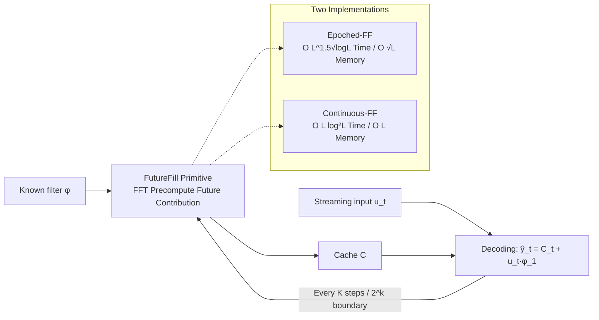

# FutureFill: Fast Generation from Convolutional Sequence Models

**Conference**: ICLR 2026  
**OpenReview**: [https://openreview.net/forum?id=t5GUEuIsxR](https://openreview.net/forum?id=t5GUEuIsxR)  
**Code**: [dshah.io/futurefill](https://dshah.io/futurefill)  
**Area**: Efficient LLM Inference / Convolutional Sequence Models  
**Keywords**: Convolutional Sequence Models, Autoregressive Generation, FFT, Online Convolution, Cache Compression, State Space Models  

## TL;DR
To address the slow autoregressive decoding of convolutional/spectral sequence models (e.g., STU, Hyena), this paper proposes the **FutureFill** primitive. By using FFT to precompute the "contribution of generated tokens to future tokens," it reduces the time to generate $L$ tokens from $O(L^2)$ to quasi-linear $O(L\log^2 L)$. For prompted generation, the cache is reduced from $O(L+K)$ to $O(K)$ (related only to generation length), all while remaining **exact and without approximation**.

## Background & Motivation
- **Background**: Convolutional sequence models (LongConv, SGConv, Hyena, Spectral Transform Unit STU, etc.) leverage FFT to achieve near-linear overhead during **training**, making them strong alternatives to Transformer's quadratic attention, especially for long-range dependency modeling.
- **Limitations of Prior Work**: Fast training does not imply **fast generation**. While SSM/RNN decoding time is independent of sequence length (constant), the best-known result for autoregressive decoding of pure convolutional models remains $O(L^2)$—quadratic like attention. Meanwhile, naive online convolution requires storing all historical inputs, leading to $O(L+K)$ cache. Existing paths like "distilling SSMs from convolutional models" (Massaroli et al.) are **approximations**, with unclear approximation errors.
- **Key Challenge**: Convolutional models naturally possess a structure where "filters are fully known," yet existing decoding naively performs token-wise inner products like attention, failing to utilize this structure to **precompute the future**.
- **Goal**: Simultaneously reduce generation time and cache size without making any approximations, compatible with any convolutional model regardless of training method.
- **Key Insight**: **[Online convolution can be accelerated by "pre-filling the future"]** In convolutional models, since the filter $\phi$ is known, the contribution of current and historical tokens to future outputs can be **calculated without waiting for future tokens to be generated**. By pre-calculating these "future contributions" in batches using FFT and caching them (FutureFill), decoding can be performed via direct lookups plus minor proximal corrections.

## Method

### Overall Architecture
The method centers on a primitive called **FutureFill**: given a known filter $\phi$ and a generated sequence segment, FutureFill uses FFT to calculate the contribution of that segment to **future positions** in the output and writes it into cache $C$. Based on this, two online convolution algorithms are constructed (Epoched for a memory-friendly trade-off, and Continuous for quasi-linear divide-and-conquer). Finally, "prompted generation" is reduced to "one FutureFill on the prompt side + online convolution on the generation side."

### Key Designs

**1. FutureFill Primitive: Converting "Future Contribution" into an FFT.** The convolutional output at position $t_1+s$ receives a contribution from an input segment $v$ of length $t_1$, defined as:
$$[\text{FutureFill}(v,w)]_s = \sum_{i=1}^{t_2-s} v_{t_1-i+1}\, w_{s+i},$$
This represents the contribution of $v$ to $[v*w]$ at various positions after $t_1$. Crucially, this part **depends only on the known $v$ and filter $w$, staying independent of future tokens yet to be generated**. Thus, it can be computed in a single pass in $O((t_1+t_2)\log(t_1+t_2))$ time using standard full-mode FFT convolution (implemented as `numpy.convolve(v,w,'full')[t_1:t_1+t_2-1]`). Proposition 1 provides a splitting identity: any convolution $[a*b]_s$ can be split into a "small proximal convolution + a FutureFill cache segment," serving as the algebraic foundation for all subsequent algorithm stitching.

**2. Epoched-FutureFill: Memory-Friendly Segmented Trade-off.** The generation process is divided into epochs of length $K$ (Algorithm 1). Within an epoch, each step uses only a small inner product of the most recent $\tau$ terms combined with the cache entry $C_\tau$ to obtain $\hat y_t=\sum_{j=1}^{\tau} u_{t+1-j}\phi_j + C_\tau$. Every $K$ steps, FutureFill is triggered to flush the contributions of all tokens from the just-finished epoch for the next $K$ positions into cache $C\in\mathbb{R}^K$. Total time is $O\!\left(\frac{L^2\log L}{K}+KL\right)$. Setting $K=\sqrt{L\log L}$ yields $O(L^{3/2}\sqrt{\log L})$ time and only $O(\sqrt{L\log L})$ memory—this is the practical version highlighted in experiments due to its minimal memory footprint.

**3. Continuous-FutureFill: Divide and Conquer for Quasi-Linearity.** The splitting identity from Proposition 1 naturally leads to divide-and-conquer: split the sequence at the midpoint, recursively calculate the two halves, and use FutureFill to stitch in the "contribution of the first half to the second." Algorithm 2 serializes this divide-and-conquer into an online version—at step $t$, let $k(t)$ be the highest power of 2 that divides $t$. A FutureFill is performed on the segment $u_{t-2^{k(t)}+1:t}$, accumulating the result into $2^{k(t)}$ future cache positions. Decoding then only requires $\hat y_t = C_t + u_t\phi_1$. Total time is $O(L\log^2 L)$ and memory is $O(L)$; the paper notes this is at most a poly-log factor away from optimal.

**4. Prompted Generation: Reduced to "Prompt FutureFill + Generation Online Convolution."** Given a prompt $p$ of length $L$ to generate $K$ tokens, the target output $\hat y_t=\langle \hat y_{1:t-1},\phi_{t-1:1}\rangle+\langle p_{1:L},\phi_{t+L-1:t}\rangle$ is exactly the online convolution of the "prompt prefix + autoregressive output." Thus, one only needs to perform **one** FutureFill on the prompt side ($O(L\log L)$) to compute its contribution to all positions to be generated. The generation side then runs online convolution via Continuous-FF. Total complexity is $O(L\log L + K\log^2 K)$ with a cache of only $O(K)$ (Corollary 5)—a dual improvement over the previous $O(LK+K^2)$ time and $O(L)$ cache, particularly benefiting long-prompt scenarios.

## Key Experimental Results

### Main Results Table (Prompted Generation, STU-only, single H100)

| Configuration (515.46M, 8 layers, 1024 dim) | Cache Type | Avg Prefill (s) | Decode@4096 | Decode@8192 | Decode@16384 |
|---|---|---|---|---|---|
| STU-only | **Epoched-FutureFill** | 21.40 | 13.12 | 26.18 | **52.22** |
| STU-only | Baseline (Naive Conv) | 21.28 | 25.23 | 52.31 | **111.92** |

As generation length doubles, the naive baseline decoding time shows near-quadratic growth, while Epoched-FF maintains near-linearity, being ~2.14× faster at length 16384.

### Ablation Study on LLMs (without prefill)

| Model | Generation Length $L_{gen}$ | Speedup vs Naive |
|---|---|---|
| STU-only 670.75M (12 layers/1024 dim) | 126,976 | **1.7×** |
| Hybrid 689.48M (STU + Local Attention 1:1) | 126,976 | **1.5×** |

### Key Findings
- **Complexity Curves Match Theory**: In controlled experiments, the amortized per-step cost of the naive method is $O(L)$, Epoched-FF is sub-linear, and Continuous-FF is logarithmic. The three curves align perfectly with theory.
- **The Longer, the Better**: Benefits become more pronounced as $L$ increases because the baseline is quadratic; a 1.5–1.7× end-to-end speedup is achieved at maximum generation length.
- **Exact and Lossless**: Text generated with 330M pre-trained FlashSTU-T and tested on downstream tasks shows identical accuracy to naive online convolution (no quality loss).
- **Tunable Cache**: The optimal time-memory trade-off is achieved when the cache $K$ is set to the theoretical optimum $\sqrt{L_{gen}\log L_{gen}}$.

## Highlights & Insights
- **Elegant Structural Insight**: Captures the fundamental difference from attention—convolutional filters are known, allowing future contributions to be pre-calculated. Acceleration is built on an exact identity (Proposition 1) rather than approximation.
- **Theory-Engineering Balance**: Provides both a quasi-linear $O(L\log^2 L)$ lower-bound result and a practical Epoched version with only $O(\sqrt L)$ memory, validated on real STU/Hybrid language models.
- **Decoupling Cache from Sequence Length**: In prompted scenarios, cache is reduced from $O(L+K)$ to $O(K)$, providing tangible VRAM savings for long-context inference.
- **Universality**: Compatible with any convolutional/spectral filtering model regardless of training, allowing plug-and-play replacement of decoding kernels.

## Limitations & Future Work
- **Speedup Limited by Scale**: Real-world end-to-end speedup is only 1.5–1.7×, as non-convolutional overheads like MLPs in STU/attention blocks dilute the asymptotic gains of the convolutional part. For short sequences, FFT constant factors may offset the advantages.
- **Coverage Limited to Linear Convolution Core**: It is unclear how to fully integrate non-linear structures like Hyena’s element-wise gated multiplications into the framework; the paper only states it is extendable in principle without providing end-to-end complexity analysis.
- **No Comparison with Approximate Methods**: The authors explicitly categorize lossy methods like cache compression and sparse attention as "another class," leaving the trade-off between exactness and lossy precision to the reader.
- **Continuous-FF Memory $O(L)$**: Memory for the quasi-linear version still grows linearly with length; ultra-long generation requires a choice between Epoched (memory-saving) and Continuous (time-saving).

## Related Work & Insights
- **Contrast with SSM Distillation**: While Massaroli et al. distill convolutional models into SSMs for fast decoding, the approximation error is unknown; this paper provides an **exact** alternative path.
- **Independent Concurrent Work**: Oncescu et al. (2024) achieved a similar $O(L\log^2 L)$ result using relaxed polynomial interpolation; the FutureFill approach is more intuitive and yields more memory-efficient and simpler-to-implement variants.
- **Inspiration**: Any scenario where the "operator is known and output is generated in a stream" (not limited to sequence models) can leverage the "precalculate future contributions with FFT + divide-and-conquer serialization" paradigm to break the naive quadratic decoding bottleneck.

## Rating
- **Novelty**: ⭐⭐⭐⭐⭐ — The FutureFill primitive + divide-and-conquer serialization reduces exact decoding of convolutional models from quadratic to quasi-linear, offering a clean solution to a key gap in convolutional model inference.
- **Experimental Thoroughness**: ⭐⭐⭐⭐ — Successfully verified complexity with controlled experiments and demonstrated lossless speedup on 670M+ STU/Hybrid models; however, end-to-end speedup is moderate and lacks coverage of larger scales and non-linear structures.
- **Writing Quality**: ⭐⭐⭐⭐ — Theoretical derivations are clear, and propositions/theorems correspond well with algorithms. Notation is somewhat dense, requiring some background in FFT/convolutions.
- **Value**: ⭐⭐⭐⭐ — Provides a plug-and-play, exact, and lossless fast decoding kernel for convolutional/spectral sequence models with clear VRAM benefits for long contexts, significant for the deployment of such models.

<!-- RELATED:START -->

## Related Papers

- [\[ICLR 2026\] Meta-UCF: Unified Task-Conditioned LoRA Generation for Continual Learning in Large Language Models](meta-ucf_unified_task-conditioned_lora_generation_for_continual_learning_in_larg.md)
- [\[ICLR 2026\] Gumbel Distillation for Parallel Text Generation](gumbel_distillation_for_parallel_text_generation.md)
- [\[ICLR 2026\] MoM: Linear Sequence Modeling with Mixture-of-Memories](mom_linear_sequence_modeling_with_mixture-of-memories.md)
- [\[ICLR 2026\] Fast-dLLM v2: Efficient Block-Diffusion LLM](fast-dllm_v2_efficient_block-diffusion_llm.md)
- [\[ICLR 2026\] Retrospective Sparse Attention for Efficient Long-Context Generation](retrospective_sparse_attention_for_efficient_long-context_generation.md)

<!-- RELATED:END -->
