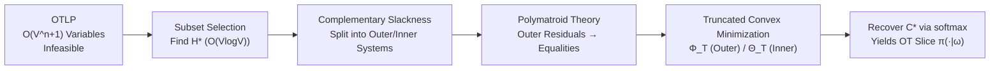

# Global Resolution: Optimal Multi-Draft Speculative Sampling via Convex Optimization

**Conference**: ICLR 2026  
**OpenReview**: [https://openreview.net/forum?id=gpsczXOsHn](https://openreview.net/forum?id=gpsczXOsHn)  
**Code**: To be confirmed  
**Area**: LLM Inference Acceleration / Speculative Sampling  
**Keywords**: Speculative sampling, multi-draft, optimal transport, convex optimization, polymatroid, max-flow  

## TL;DR
This paper provides the first efficient algorithm for the **exact solution of the Optimal Transport (OT) verification criterion** in multi-draft speculative sampling. It simplifies the exponential-scale Optimal Transport Linear Programming (OTLP) into a convex minimization problem with at most $V$ variables, achieving a 90% acceptance rate with a per-token overhead under 100 ms under the i.i.d. draft setting.

## Background & Motivation
**Background**: Speculative sampling uses a cheap draft model to guess tokens and a verification criterion to decide acceptance or resampling, thereby accelerating the autoregressive decoding of large models without changing the target distribution. Multi-draft extensions generate $n$ draft tokens per step, which theoretically can further increase the acceptance rate—when the verification criterion maximizes the probability that "at least one draft token is accepted," it constitutes an **Optimal Transport (OT)** problem.

**Limitations of Prior Work**: OT is a solution to an Optimal Transport Linear Programming (OTLP) problem, but this LP contains $O(V^{n+1})$ variables (where $V$ is the vocabulary size), making it infeasible even to write down for large vocabularies. Two recent theoretical works reframed this as **importance sampling / canonical decomposition** (Khisti et al., 2025) and **subset selection** (Hu et al., 2025). These works can calculate the optimal acceptance rate $\alpha^*$, **but neither can actually solve for the OT verification criterion itself**. The only known exact method is using an LP solver with exponential complexity; existing approximation algorithms (K-SEQ, MSS, RSD, vocabulary truncation) either have only $(1-1/e)$ approximation guarantees or no theoretical guarantees at all.

**Key Challenge**: Being able to calculate "the optimal acceptance rate" $\neq$ being able to calculate "the verification criterion to use." There is a lack of an efficient path from $H^*$ (the optimal set for subset selection) to full OT.

**Goal**: Under the practical setting where "$n$ draft tokens are sampled i.i.d. from a single draft model," provide the first exact OT algorithm that is **tunable to any precision and efficient for large vocabularies**.

**Core Idea** (**Reverse Engineering + Polymatroids**): Reverse the derivation of subset selection to reduce the OTLP to a **max-flow problem**; then use polymatroid theory to compress the exponential-scale network into a convex minimization problem with at most $V$ variables, where the solution in softmax form can be solved via truncation.

## Method

### Overall Architecture
The Global Resolution approach first uses existing methods to find the optimal subset $H^*$ in $O(V \log V)$ time. Then, using "complementary slackness," it decomposes the relaxed OTLP into two independent max-flow problems: the **outer system** and the **inner system**. Under the i.i.d. draft structure, polymatroid theory is applied to solve for the outer system residuals, turning inequality constraints into equalities, thus parameterizing the solution of each system as a set of softmax functions. These are obtained by minimizing a **truncated convex function**—wider truncation leads to smaller error bounds, allowing for any desired precision.

### Key Designs
**1. From OTLP to Max-Flow: Translating exponential LP into a flow network.** The paper first proves that Khisti's canonical decomposition ($\beta$-optimization) and Hu's subset selection derivation are essentially **equivalent to the same relaxed OTLP** (Theorem 4.1). Thus, canonical decomposition offers no additional computational advantage over the relaxed OTLP—unifying previous SOTA theories. A bipartite network $\Omega$ is then constructed: source $s$ to left vertex $i\in V$ with capacity $p(i)$, left vertex to right vertex $\mathbf{i}\in V^n$ (if $i\in\mathrm{set}(\mathbf{i})$) with capacity $\infty$, and right vertex to sink $t$ with capacity $p_{\text{draft}}(\mathbf{i})$. Treating slack variables $S_{i,\mathbf{i}}$ as flow on $\infty$ edges, the capacity constraints exactly match the OTLP inequalities, making max-flow the optimal solution $S^*$. This step replaces general LP solvers with much faster max-flow solvers.

**2. Complementary Slackness Partitioning: Shrinking the network with $H^*$.** A direct max-flow network remains expensive due to the $V^n$ right vertices. The paper uses **complementary slackness** to reverse the dualization (Theorem 5.1), proving that any optimal $S^*$ must satisfy a system of equations/inequalities that naturally decouple after eliminating zero variables: an **outer system** containing only $i\notin H^*, \mathbf{i}\notin(H^*)^n$ and an **inner system** containing only $i\in H^*, \mathbf{i}\in(H^*)^n$. Both are smaller max-flow problems restricted by $H^*$. Remarkably, when recoverying OT slices $C^*_{\cdot,\omega}$, draft tuples $\omega\in(H^*)^n$ only require solving the inner system, while others only require the outer system (Eq. 8). When $H^*$ is large, the outer network is much smaller than the original, yielding significant speedups.

**3. Polymatroid Closed-form for Outer Residuals: Forcing inequalities into equalities.** To parameterize the system as softmax, one must first find the outer residuals $p^{\text{res}}(i)=p(i)-p_i$ such that constraints involving $p(i)$ become equalities. The residuals are characterized by an "outer residual LP" (Theorem 6.1), which has up to $2^V$ constraints. When the set function $\psi$ is submodular (guaranteed for i.i.d. drafts), polymatroid theory provides a closed-form solution: $p_{v_i}=p(v_i)+\min_{T\supseteq H_{i+1}}\psi(T)-\min_{T\supseteq H_i}\psi(T)$ (Theorem 6.2). Combined with the i.i.d. q-convexity lemma (Lemma 6.3)—ranking by $q(x)/p(x)$ and selecting elements in increasing order—all $\min\psi$ terms can be computed in $O(V\log V)$ total time.

**4. Truncated Convex Solver: Softmax solution + tunable error bounds.** Once residuals are determined, the global solution for the outer system is expressed as a softmax: $S_{i,\mathbf{i}}=\frac{e^{\alpha_i}}{\sum_{j\in\mathrm{set}(\mathbf{i})\setminus H^*}e^{\alpha_j}}\,p_{\text{draft}}(\mathbf{i})$. The parameters $\alpha_i$ are found by minimizing the convex function $\Phi_T$ (Theorem 6.4), which is non-constant only over the truncated set $T$. The gradient norm satisfies $\|\nabla\Phi_T\|_1\le\epsilon+\epsilon_T$, where $\epsilon_T=1-(\sum_{i\in H^*\cup T}q(i))^n$. The inner system is solved similarly using $\Theta_T$ (Theorem 6.5). As $T$ increases, $\epsilon_T, \gamma_T \to 0$, approaching the true solution at any precision. Runtime is controlled by early termination based on $|T|$ thresholds or iteration limits. The final approximation guarantee (Lemma 6.6) translates the tunable error of $\Phi_T/\Theta_T$ directly: $L_1$ deviation from the target distribution is at most $15\tau$, and acceptance rate deviation is at most $10\tau$.

## Key Experimental Results
Settings: Target/Draft model pairs Gemma-2 27B/2B and Llama-3 70B/8B, $n\le 10$, top-$k$ draft sampling $k\in\{10,100,\dots,V\}$; i.i.d. single-step multi-draft.

### Main Results: Solving Time (Llama-3, ms/token)

| $(k,n)$ | General LP | Max-Flow | Opt. Max-Flow | G.R. ($\tau{=}10^{-3}$) | G.R. ($\tau{=}10^{-4}$) |
|---|---|---|---|---|---|
| (10, 2) | 4.07 | 2.45 | 2.51 | 5.27 (98%) | 7.62 (93%) |
| (10, 4) | 4000+ | 74.21 | 74.37 | **40.30** (97%) | 54.84 (86%) |
| (10, 5) | 400000+ | 10000+ | 10000+ | **70.75** (96%) | 94.79 (85%) |
| (100, 2) | 4000+ | 72.28 | 63.03 | **23.92** (38%) | 25.47 (23%) |
| (1000, 2) | OOM | 400000+ | 400000+ | **34.94** (31%) | 47.46 (15%) |

Global Resolution (G.R.) is over 10,000 times faster than other methods for large $k, n$, and its runtime consistently remains below 100 ms/token (success rate after early termination in parentheses).

### Best Acceptance Rate under Time Budget

| Budget (ms/tok) | Llama-3 Gen.LP | Llama-3 M.F. | Llama-3 G.R.($10^{-3}$) | Gemma-2 G.R.($10^{-3}$) |
|---|---|---|---|---|
| 10 | 82.53% | 83.94% | **85.65%** | **81.90%** |
| 100 | 83.94% | 89.01% | **90.04%** | **86.60%** |

Under a 100 ms/token budget, G.R. achieves an acceptance rate ~1.0% higher than general LP and ~1.0% higher than Max-Flow, reaching >90% acceptance rate with <100 ms overhead for the first time in multi-draft settings; general OTLP solvers reach only 84% under the same constraints.

### Key Findings
- Top-$k$ sampling truncates the vocabulary to $k$. As $k$ increases from 10 to 1000, the acceptance rate rises significantly (e.g., 0.8→0.95, representing ~10% more tokens generated for free). Benefits diminish for $k \ge 10000$, indicating top-$k$ is an effective way to reduce OTLP complexity with minimal loss in acceptance rate.
- Increasing the number of drafts $n$ consistently improves the acceptance rate at larger $k$, validating the intuition that "multi-draft is indeed worth it."
- For $k \ge 100$, i.i.d. draft acceptance rates are higher than the greedy construction in Hu et al., by nearly 2% at large $k, n$, showing that i.i.d. sampling with replacement is superior to greedy methods under optimal verification.
- General LP returns OOM at $(1000, 2)$ and takes several seconds starting from $(10, 4)$, while G.R. remains <100 ms, demonstrating a fundamental shift in complexity from exponential to near-linear.
- The two $\tau$ settings ($10^{-3}$ vs $10^{-4}$) reflect the "precision-speed" tradeoff: smaller $\tau$ yields lower error but larger truncation sets, higher time consumption, and lower success rates.

### Complexity Comparison

| Method | Solver | Complexity Scale | Remarks |
|---|---|---|---|
| General LP | LP solver | Exponential (OTLP scale) | Large $k$ leads to OOM |
| Max-Flow | Max-Flow | Depends on $|V^n|$ | Faster than LP but still exponential |
| Opt. Max-Flow | Opt. Max-Flow | Determined by $H^*$ | Complementary slackness shrinks network |
| Global Resolution (excl. Step 3) | Convex Minimization | $O(V\log V)$ | Softmax truncation, tunable precision |

## Highlights & Insights
- **Theoretical Unification**: Proved that canonical decomposition and subset selection are both equivalent to the same relaxed OTLP, clarifying their shared limitation of "not being able to solve for OT."
- **Reverse Engineering Ingenuity**: reversed the derivation of "subset selection for optimal values" to back-solve for a compact, solvable max-flow system via complementary slackness—the crucial step from "knowing the optimum" to "knowing how to verify."
- **Polymatroid + Softmax Parameterization**: Compressed the exponential LP into a $\le V$-dimensional convex problem where the solution is naturally a softmax. The error is controlled by a single $\tau$ knob with clean theoretical bounds ($15\tau$ / $10\tau$).
- **Practical Engineering**: Presented the first multi-draft scheme achieving 90% acceptance rate at <100 ms for standard open-source models; it can be directly integrated into tree frameworks like SpecTr to replace their single-step OTLP solvers.

## Limitations & Future Work
- **Constraint on Settings**: Efficiency relies heavily on the submodularity and q-convex structure of "i.i.d. sampling from a single draft model." Non-i.i.d. settings, like "independent sampling from different draft models" or "sampling without replacement," are only discussed in the appendix (inner residuals remain hard to find) and remain open problems.
- **Cost of Early Termination**: At large $k$ (e.g., 100, 1000), the success rate of Global Resolution drops significantly (38%, 31%). Failures require falling back to slower methods like Max-Flow, diluting gains in high-$k$ regimes.
- **General Submodular $\psi$ Unsolved**: Efficient OT solvers for general submodular $\psi$ are left for future work; currently, only i.i.d. cases are covered.
- **No End-to-End Wall-Clock Speedup**: Experiments primarily measured OTLP solving time and acceptance rates, without reporting overall throughput/latency gains in a complete multi-step decoding framework.

## Related Work & Insights
- **Speculative Sampling Foundations**: Single-draft sampling from Chen et al. (2023) and Leviathan et al. (2023); multi-step settings utilize smarter drafts (retrieval, cascading, layer skipping) or new verification protocols (Tree MCMC, block verification).
- **Multi-Draft Theory**: Sun et al. (2023) first introduced OTLP and the SpecTr framework; canonical decomposition by Khisti et al. (2025); subset selection by Hu et al. (2025). This work builds upon the latter two to fill the "gap from $H^*$ to OT."
- **Inspiration**: When a combinatorial optimization problem has an "easy-to-compute value but hard-to-find solution," the paradigm of **reverse-engineering the value derivation + convexification using problem structures (submodularity/matroids)** is highly reusable. Softmax parameterization + tunable truncation provides a practical interface for continuous precision-speed tradeoffs.

## Rating
- **Novelty**: ⭐⭐⭐⭐⭐ First exact and efficient algorithm for multi-draft OT, unifying existing paths and providing a new route via polymatroids/max-flow.
- **Experimental Thoroughness**: ⭐⭐⭐⭐ Solid comparison of solving time and acceptance rates across mainstream models and multiple $k, n$; however, lacks end-to-end decoding wall-clock benchmarks, and success rate is low at high $k$.
- **Writing Quality**: ⭐⭐⭐⭐ Logical progression with clear links between theorems and algorithms, though the high theoretical density and reliance on appendix details make for a high barrier to entry.
- **Value**: ⭐⭐⭐⭐ Directly applicable to existing multi-draft frameworks, moving LLM decoding acceleration from "approximation" to "provable optimality" with practical significance for inference systems.

<!-- RELATED:START -->

## Related Papers

- [\[ICLR 2026\] NI Sampling: Accelerating Discrete Diffusion Sampling by Token Order Optimization](ni_sampling_accelerating_discrete_diffusion_sampling_by_token_order_optimization.md)
- [\[ICLR 2026\] Cactus: Accelerating Auto-Regressive Decoding with Constrained Acceptance Speculative Sampling](cactus_accelerating_auto-regressive_decoding_with_constrained_acceptance_specula.md)
- [\[ICLR 2026\] Flatter Tokens are More Valuable for Speculative Draft Model Training](flatter_tokens_are_more_valuable_for_speculative_draft_model_training.md)
- [\[ICLR 2026\] RepSpec: Structural Re-parameterized Draft Model Training for Speculative Decoding](repspec_structural_re-parameterized_draft_model_training_for_speculative_decodin.md)
- [\[ACL 2025\] Tetris: Optimal Draft Token Selection for Batch Speculative Decoding](../../ACL2025/llm_efficiency/tetris_optimal_draft_token_selection_for_batch_speculative_decoding.md)

<!-- RELATED:END -->
