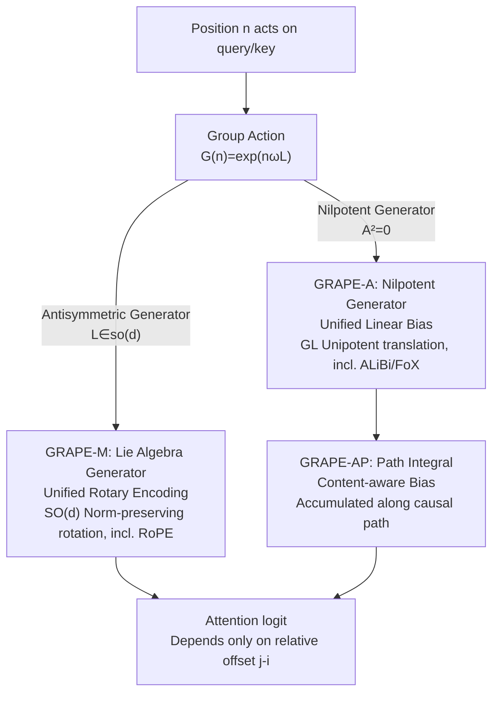

# Group Representational Position Encoding (GRAPE)

**Conference**: ICLR 2026  
**arXiv**: [2512.07805](https://arxiv.org/abs/2512.07805)  
**Code**: [github.com/model-architectures/GRAPE](https://github.com/model-architectures/GRAPE)  
**Area**: Signal Communication  
**Keywords**: Position Encoding, Group Theory, RoPE, ALiBi, Lie Groups, Rotary Encoding, Long Context  

## TL;DR

Ours proposes the GRAPE framework to unify the multiplicative (RoPE) and additive (ALiBi/FoX) position encoding families in Transformers based on group actions. It proves RoPE and ALiBi are exact special cases and introduces a path-integral additive variant, GRAPE-AP, which outperforms existing methods on downstream tasks.

## Background & Motivation

**Fragmentation of Position Encodings**: Existing methods, including absolute (sinusoidal/learned), relative (RoPE), linear bias (ALiBi), and forgetting mechanisms (FoX), are designed independently and lack a unified theoretical framework.

**RoPE Limitations**: RoPE uses fixed coordinate planes and log-uniform spectra, which prevents cross-subspace coupling and context-dependent phase warping.

**Absolute Encodings Break Translation Invariance**: Relative encodings based on tables introduce additional window-dependent overhead.

**Lack of Theoretical Guarantees**: Existing methods disperse key properties such as stability, monotonic distance penalty, and expressivity; a unified framework is needed to integrate these properties.

**Long-Context Modeling Needs**: Long-sequence models require principled positional geometric design spaces.

## Method

### Overall Architecture

GRAPE addresses the fragmentation of position encodings like RoPE, ALiBi, and FoX by providing a common theoretical foundation. The core abstraction treats position encoding as a **group action** acting on queries/keys: $\mathbf{G}(n) = \exp(n\omega\mathbf{L})$. Here, position $n$ is transformed into a matrix via the Lie group exponential map, and the generator $\mathbf{L}$ determines the nature of the transformation. The design space converges on the choice of the generator, naturally bifurcating into two families.

When $\mathbf{L}$ is an antisymmetric matrix, $\mathbf{G}(n)$ is a norm-preserving rotation in $\mathrm{SO}(d)$, corresponding to the **multiplicative GRAPE-M** (where RoPE is a precise special case). When the generator is a nilpotent matrix, the exponential map reduces to a first-order shift, adding a distance-varying bias to the attention logit, corresponding to the **additive GRAPE-A** (where ALiBi and FoX are precise special cases). The additive branch further evolves from "fixed per-step bias" to "content-aware bias accumulated along the causal path," resulting in **GRAPE-AP**. Both branches ensure strict relativity as attention scores depend only on the relative offset $j-i$.

### Key Designs

**1. Multiplicative GRAPE-M: Unifying Rotary Encodings via Lie Algebra Generators**

This branch justifies and unifies rotary encodings. RoPE is effective because rotation matrices naturally satisfy relativity—encoding positions as rotations ensures attention scores depend only on $j-i$. GRAPE-M abstracts this by using a rank-2 antisymmetric generator $\mathbf{L} = \mathbf{ab}^\top - \mathbf{ba}^\top \in \mathfrak{so}(d)$ to create a rotation $\mathbf{G}(n) = \exp(n\omega\mathbf{L}) \in \mathrm{SO}(d)$. This satisfies the exact relative property $\mathbf{G}(n+m) = \mathbf{G}(n)\mathbf{G}(m)$ and norm preservation $\mathbf{G}(n)^\top\mathbf{G}(n) = \mathbf{I}$. Computation uses the Rodrigues closed-form:

$$\exp(\mathbf{L}) = \mathbf{I} + \frac{\sin s}{s}\mathbf{L} + \frac{1-\cos s}{s^2}\mathbf{L}^2$$

The complexity is $O(d)$, matching RoPE and maintaining KV-cache compatibility. Setting $d/2$ rank-2 generators on orthogonal 2D subspaces with standard coordinate pairs and log-uniform frequencies recovers RoPE. Using learnable bases and non-commutative mixing enables cross-subspace coupling and context-aware phase warping, which RoPE cannot achieve.

**2. Additive GRAPE-A: Including Linear Biases via Nilpotent Generators**

Methods like ALiBi apply distance-based penalties to logits. GRAPE incorporates this by lifting dimensions to $\mathrm{GL}(d+k)$ using homogeneous coordinates and a nilpotent generator $\mathbf{A}$ (where $\mathbf{A}^2=\mathbf{0}$). The exponential map $\mathbf{G}_\mathrm{add}(n) = \exp(n\omega\mathbf{A}) = \mathbf{I} + n\omega\mathbf{A}$ results in a translational term growing linearly with position. A rank-1 nilpotent generator in $\mathrm{GL}(d+2)$ yields the logit $\mathbf{q}_i^\top\mathbf{k}_j + (j-i)\beta_h$, identical to ALiBi. Replacing fixed slopes with content-aware gated slopes yields the GRAPE-A-QK variant:

$$\text{logit} = \mathbf{q}_i^\top\mathbf{k}_j + (j-i)\,\omega\,[\text{softplus}(\mathbf{v}^\top\mathbf{q}_i/\sqrt{d}) + \text{softplus}(\mathbf{u}^\top\mathbf{k}_j/\sqrt{d})]$$

This allows each token to determine its decay rate, where softplus ensures non-negativity and monotonic distance penalty. When slopes reduce to per-token scalars $\omega_t = \log f_t$, it recovers the forgetting bias of Forgetting Transformer, showing FoX is a path-dependent special case of GRAPE-A.

**3. Path-Integral Variant GRAPE-AP: Evolving to Content-Aware Cumulative Bias**

Standard additive biases use fixed per-step penalties. GRAPE-AP makes each step's **edge potential function** dependent on content:

$$\psi_h(t,\ell) = \alpha_h \cdot g\!\left(\frac{1}{d}\langle\mathbf{p}_{t,h},\, \mathbf{R}_\ell\mathbf{p}_{\ell,h}\rangle\right) \leq 0$$

Using a monotonic 1-Lipschitz link function $g$ (e.g., $g(z)=\log\mathrm{Sigmoid}(z)$) ensures non-positive edge potentials. Summing these potentials along the causal path yields the total bias $b_h(t,j) = \sum_{\ell=j+1}^{t}\psi_h(t,\ell)$. This maintains monotonic distance penalties while dynamically adjusting the penalty strength based on intermediate tokens—a feature missing in fixed-slope GRAPE-A. It is causal-compliant, supports incremental KV-cache updates, and can be combined with GRAPE-M.

## Key Experimental Results

### Experimental Settings

- Based on nanoGPT / Llama architectures, replacing only the position encoding.
- Dataset: FineWeb-Edu 100B (trained on 50B tokens).
- Model Scales: Medium (350M, 24 layers, 8 heads) / Large (770M, 36 layers, 10 heads).
- Context length 4096, batch size 480.
- Baselines: RoPE, ALiBi, FoX.

### Main Results (Medium 350M, 0-shot, Average of 7 tasks)

| Method | ARC-E | ARC-C | HellaSwag | PIQA | SciQ | **Avg.** |
|------|-------|-------|-----------|------|------|----------|
| RoPE | 56.36 | 30.38 | 44.65 | 68.77 | 74.40 | 51.73 |
| ALiBi | 58.21 | 29.78 | 45.38 | 70.08 | 78.50 | 52.87 |
| FoX | 58.38 | 30.89 | 45.80 | 69.37 | 78.40 | 52.96 |
| GRAPE-A-QK | 57.95 | **32.00** | 45.77 | 69.37 | 79.00 | 53.00 |
| **GRAPE-AP** | **59.26** | 31.31 | 45.42 | 68.17 | **79.70** | **53.25** |
| GRAPE-AP+KV-shift | 57.32 | 30.55 | **46.18** | 69.10 | 79.60 | **53.46** |

### Main Results (Large 770M, 0-shot, Average of 7 tasks)

| Method | ARC-E | ARC-C | HellaSwag | PIQA | SciQ | **Avg.** |
|------|-------|-------|-----------|------|------|----------|
| RoPE | 62.63 | 32.76 | 51.01 | 71.33 | 80.50 | 55.76 |
| ALiBi | 62.67 | 34.39 | 51.33 | 71.11 | 82.70 | 56.44 |
| FoX | 61.07 | 33.11 | 51.85 | 71.27 | 83.70 | 56.30 |
| **GRAPE-AP** | **63.89** | 34.22 | 51.52 | **71.98** | **84.40** | **56.91** |
| FoX+KV-shift | 63.55 | 33.96 | **52.72** | 71.71 | 83.20 | 57.09 |
| GRAPE-AP+KV-shift | 63.72 | 33.11 | 52.29 | 71.65 | 83.50 | 56.86 |

### Key Findings

1. **GRAPE-AP is globally optimal without KV-shift**: 350M Avg. 53.25 > FoX 52.96 > RoPE 51.73; 770M Avg. 56.91 > ALiBi 56.44.
2. **Training Stability Advantage**: RoPE showed loss spikes in 770M training, while GRAPE remained stable.
3. **GRAPE-M yields parity with RoPE**: Confirmed theoretical equivalence; GRAPE-M itself does not significantly outperform RoPE.
4. **Additive variants are the core source of Gain**: GRAPE-A and GRAPE-AP consistently outperform purely multiplicative methods.
5. **Complementarity of KV-shift and GRAPE-AP**: 350M performance improved to 53.46 with KV-shift.

## Highlights & Insights

- **Elegant Theoretical Unification**: Uses the Lie group framework to unify RoPE, ALiBi, and FoX as special cases of the same mathematical object, providing rigorous proof.
- **High Utility**: The Rodrigues closed-form formula keeps computational complexity at $O(d)$ (same as RoPE), fully compatible with streaming inference and KV-cache.
- **Extensible Design Space**: The framework naturally suggests extensions like learnable orthogonal bases, content-gated slopes, and path-integral biases.
- **Rigorous Mathematical Formulation**: The group-theoretic perspective provides clear geometric intuition (rotation planes, unipotent translation) for position encoding.

## Limitations & Future Work

- **Limited Experimental Scale**: Validated only on 350M/770M models; lacks >1B parameter experiments and 50B token limit might be low.
- **GRAPE-M Performance**: Theoretical advantages (learnable subspaces, non-commutative mixing) did not translate to significant gains over RoPE in experiments.
- **Lack of Long-Context Evaluation**: Trained on 4096 context without testing extrapolation, which is critical for ALiBi/RoPE comparisons.
- **GRAPE-AP Overhead**: Edge potentials require step-wise inner products; actual inference latency is not reported in detail.
- **Task Coverage**: Limited to 0-shot LM evaluations; lacks generation quality and fine-tuning assessments.

## Related Work & Insights

- **RoPE** (Su et al., 2021): Exact special case of GRAPE-M (standard coordinate pairs + log-uniform spectrum).
- **ALiBi** (Press et al., 2021): Exact special case of GRAPE-A in $\mathrm{GL}(d+2)$.
- **Forgetting Transformer (FoX)** (Lin et al., 2025): Proven as a path-dependent form of GRAPE-A.
- **PaTH Attention** (Yang et al., 2025): Analyzed as contractive and near-singular, potentially harming long-context modeling.
- **NoPE / No Position Encoding**: Not discussed within the framework.

## Rating

- Novelty: ⭐⭐⭐⭐⭐ — Elegant unification via group theory; exact recovery of RoPE/ALiBi/FoX is a highlight.
- Experimental Thoroughness: ⭐⭐⭐ — Small model scales; lacks long-context and LLM validation.
- Writing Quality: ⭐⭐⭐⭐ — Mathematical derivations are clear and rigorous, though abstract.
- Value: ⭐⭐⭐⭐ — Significant theoretical contribution providing a principled framework for position encoding design.

<!-- RELATED:START -->

## Related Papers

- [\[ACL 2025\] LaMPE: Length-aware Multi-grained Positional Encoding for Adaptive Long-context Scaling Without Training](../../ACL2025/llm_efficiency/adaptive_grouped_pe_context_window.md)
- [\[ICLR 2026\] Extending the Context of Pretrained LLMs by Dropping Their Positional Embedding](extending_the_context_of_pretrained_llms_by_dropping_their_positional_embedding.md)
- [\[ICLR 2026\] Understanding and Improving Length Generalization in Hierarchical Sparse Attention Models](understanding_and_improving_length_generalization_in_hierarchical_sparse_attenti.md)
- [\[ICML 2026\] RePo: Language Models with Context Re-Positioning](../../ICML2026/llm_efficiency/repo_language_models_with_context_re-positioning.md)
- [\[ICLR 2026\] Test-Time Training Done Right](test-time_training_done_right.md)

<!-- RELATED:END -->
