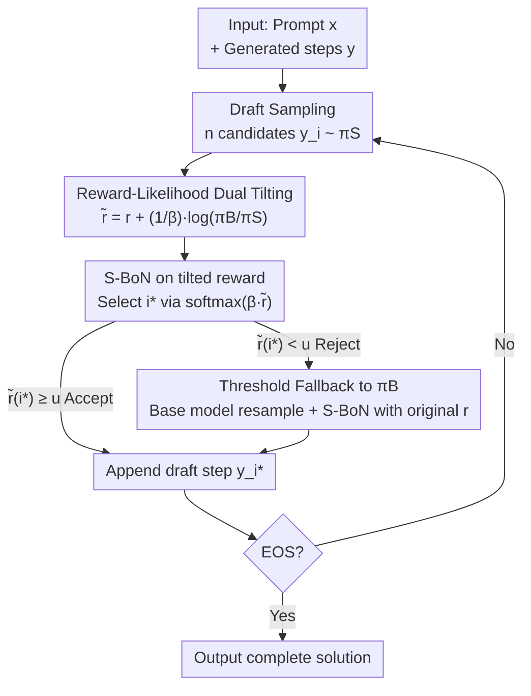

# Guided Speculative Inference for Efficient Test-Time Alignment of LLMs

**Conference**: ICLR 2026  
**OpenReview**: [https://openreview.net/forum?id=miNzDqDENd](https://openreview.net/forum?id=miNzDqDENd)  
**Code**: https://github.com/j-geuter/GSI  
**Area**: LLM Efficiency / Test-Time Alignment / Speculative Decoding  
**Keywords**: Speculative Decoding, Reward-Guided Decoding, Soft Best-of-n, Test-Time Scaling, Distribution Guarantee

## TL;DR
GSI utilizes a small draft model to sample reasoning steps and performs soft best-of-n using a "tilted reward" corrected by reward and log-likelihood ratios. It falls back to the target model for resampling when scores are too low. On mathematical reasoning benchmarks, GSI approaches or even exceeds the precision of the large model's best-of-n while reducing end-to-end latency by up to 28%. It is the first speculative test-time expansion method with distribution guarantees for the optimal tilted policy.

## Background & Motivation
**Background**: As the marginal gains from training-time scaling (increasing parameters and data) diminish, "test-time scaling" has become a major direction for enhancing LLM capabilities. Parallel sampling methods like best-of-n or soft best-of-n are effective—they sample $n$ candidates and select the best one based on a reward model $r(x,y)$, essentially aligning with a "reward-tilted" optimal policy $\pi_{\beta,B}(y\mid x)\propto \pi_B(y\mid x)\exp(\beta r(x,y))$.

**Limitations of Prior Work**: To truly approximate this tilted distribution via soft best-of-n, one must perform autoregressive generation for $n$ complete candidates from the large model $\pi_B$, which becomes prohibitively expensive as $n$ increases. While speculative decoding can accelerate sampling using a draft model $\pi_S$, it typically guarantees sampling from the **original** $\pi_B$ distribution without reward alignment. Recent reward-guided speculative decoding (RSD, Liao et al., 2025) combines alignment and speculation but only provides guarantees for "expected reward"—it offers no improvement over the small model $\pi_S$ in the worst-case scenario and lacks distribution guarantees for the final policy itself.

**Key Challenge**: There is a missing link between "aligning to the optimal tilted policy of a reward model" and "saving computation via a draft model." The tilted distribution is defined over $\pi_B$, while draft samples originate from $\pi_S$. Due to this distribution mismatch, simply applying reward weighting to samples from $\pi_S$ does not converge to $\pi_{\beta,B}$.

**Goal**: Design a test-time algorithm that leverages a small draft model $\pi_S$ for acceleration while provably approximating the optimal tilted policy $\pi_{\beta,B}$ (rather than just the expected reward).

**Key Insight**: The authors observe that the tilted distribution can be identically rewritten as a form "based on $\pi_S$ but tilted by a modified reward." By adding a term $\frac{1}{\beta}\log\frac{\pi_B}{\pi_S}$ to the reward, the dependency on $\pi_B$ is folded into the reward, allowing for valid soft best-of-n using samples from $\pi_S$.

**Core Idea**: Use a **tilted reward** composed of "reward + log-likelihood ratio" to perform soft best-of-n on draft samples, transforming the objective of aligning to $\pi_B$ into a weighting of $\pi_S$ samples, supplemented by threshold fallback. This results in reward-guided speculative inference that is both fast and has distribution guarantees.

## Method

### Overall Architecture
GSI decomposes reasoning tasks into individual "reasoning steps" (delimited by double newlines `\n\n`). Within **each step**, a cycle of draft-verification-fallback is executed to build the complete solution until an EOS is generated. The process within a single step is: the draft model $\pi_S$ samples $n$ candidate steps in parallel; a tilted reward $\tilde r$ is calculated for each candidate (adding the likelihood ratio correction $\frac{1}{\beta}\log\frac{\pi_B}{\pi_S}$ to the original reward $r$); one candidate $y^S_{i^*}$ is soft-selected according to $\mathrm{softmax}(\beta\tilde r)$. If its tilted reward exceeds a threshold $u$, it is **accepted** and appended to the answer. Otherwise, it is **rejected**, and the large model $\pi_B$ resamples $n$ candidates to perform soft best-of-n with the original reward $r$. Crucially, $\log\pi_B(y^S_i\mid x)$ only requires a **single** forward pass (parallel scoring) of $\pi_B$ on draft samples rather than autoregressive generation, which is the source of latency gains.

### Key Designs

**1. Reward-Likelihood Dual Tilting: Folding "Alignment to $\pi_B$" into Draft Rewards**

This is the mathematical pivot of the paper, addressing the fundamental contradiction that the tilted distribution is defined on $\pi_B$ while draft samples come from $\pi_S$. The authors rewrite the optimal tilted policy as a form based on $\pi_S$:

$$\pi_{\beta,B}(y\mid x)=\frac{\pi_S(y\mid x)\exp\!\big(\beta\,\tilde r(x,y)\big)}{Z_{\beta,B}(x)},\qquad \tilde r(x,y)=r(x,y)+\frac{1}{\beta}\log\frac{\pi_B(y\mid x)}{\pi_S(y\mid x)}.$$

By replacing the reward $r$ with the tilted reward $\tilde r$, one can perform soft best-of-n (weighted sampling by $\exp(\beta\tilde r_i)$) on $n$ candidates sampled from $\pi_S$ to approximate sampling from $\pi_{\beta,B}$. Intuitively, the term $\frac{1}{\beta}\log\frac{\pi_B}{\pi_S}$ "compensates" for the distribution difference between the draft and target models—candidates favored by the draft model but disliked by the target model receive a lower score, and vice versa. This ensures weighted samples appear to be tilted from $\pi_B$. Unlike RSD, which only uses the original reward for thresholding, this likelihood ratio correction is why GSI can provide guarantees for the **policy itself**.

**2. Distribution Guarantee: First Speculative Method with KL Bound for the Optimal Tilted Policy**

Addressing the flaw in RSD (which only guarantees expected reward and may not outperform $\pi_S$ in the worst case), the authors prove a KL guarantee for the GSI-induced distribution $\tilde\pi_{\mathrm{GSI}}$ (Theorem 1). Under a mild **coverage assumption**—$C_\infty(x):=\sup_{y:\pi_B(y\mid x)>0}\frac{\pi_B(y\mid x)}{\pi_S(y\mid x)}<\infty$ (where the draft model covers the support of the target model)—as long as the number of candidates 

$$n\ \ge\ \big(\chi^2(\pi_B\,\|\,\pi_S)+1\big)\cdot\frac{e^{2\beta\|r\|_\infty}-1}{e^\epsilon-1},$$

then $\mathrm{KL}\big(\pi_{\beta,B}\,\|\,\tilde\pi_{\mathrm{GSI}}\big)\le\epsilon$. This demonstrates that as $n$ increases, the GSI sampling distribution **provably** converges to the optimal tilted policy. Unlike the concurrent work SPECS (Cemri et al., 2025), which requires reasoning steps to approach infinity and treats $n$ and the threshold $u$ as random variables, GSI's bound does not rely on such assumptions.

**3. Threshold Fallback: Using Rejection Sampling to Mitigate Insufficient Draft Coverage**

While dual tilting is theoretically sufficient, draft models may have poor coverage for certain steps in practice. GSI adds a rejection-sampling-like threshold $u$: if the selected draft step has $\tilde r_{i^*}<u$, it is rejected, and the large model $\pi_B$ resamples $n$ candidates to perform soft best-of-n with the **original** reward $r$ (degenerating to $\pi^n_{\beta,B}$ at this step). This does not affect the distribution guarantee of Theorem 1 (which refers to the acceptance path) but significantly improves empirical scores. Ablations show that GSI with fallback consistently outperforms the version without it.

### Detailed Example: Acceptance and Rejection on MATH500
Consider the problem: "What is the first term greater than 125 in the sequence 0, 1, 1, 3, 6, 9, 27, ...?" 
In step 1, the draft model proposes building a table; the tilted reward is $0.719$, which is higher than the threshold, so it is **accepted**. In step 2, the draft model miscalculates the recurrence (wrongly setting $a_5=9$, leading to $a_9=497$); the PRM gives a tilted reward of only $0.067$, which is below $u=0.5$ and thus **rejected**. The large model $\pi_B$ resamples and provides the correct recurrence ($a_{10}=129$) with a reward of $0.979$. In step 3, the final answer $129$ is obtained. This example illustrates that GSI uses the draft when possible (saving time) but corrects errors via the large model when the draft fails (ensuring quality).

## Key Experimental Results

### Main Results
Evaluated using Qwen2.5-Math (Draft 1.5B / Target 7B) and Qwen3 (Draft 1.7B / Target 14B), with Qwen2.5-Math-PRM-7B as the PRM. Parameters: $\beta=20,\ u=0.5,\ \text{temp}=0.7$. Benchmarks include MATH500, OlympiadBench, Minerva Math, MMLU-STEM, and GSM8K.

| Comparison | Precision (Trend) | Note |
|--------|------|------|
| GSI vs RSD | Significantly higher | RSD accepts almost all draft samples, performing similarly to small model S-BoN |
| GSI vs S-BoN (Draft) | Significantly higher | Tilted reward + fallback leads to quality improvements |
| GSI vs S-BoN (Base) | Competitive / Partial Exceedance | GSI approaches or exceeds $\pi^n_{\beta,B}$ on some datasets, validating Theorem 1 |
| GSI vs SPECS | Leads on MATH500 | MATH500: +11.5% at $n=4$, +2.9% at $n=16$; SPECS slightly better on OlympiadBench |

### Key Experimental Results (Table 1)
| Model Family | $n$ | Method | s/step ↓ | Acceptance Rate % | steps/sec ↑ |
|------|----|------|------|------|------|
| Qwen2.5-Math (H100) | 16 | GSI | 0.72 | 82.0 | 1.39 |
| | 16 | S-BoN(base) | 0.94 | – | 1.06 |
| Qwen3 (A100) | 16 | GSI | 1.21 | 91.5 | 0.83 |
| | 16 | S-BoN(base) | 1.82 | – | 0.55 |

GSI is significantly faster than Base S-BoN: for Qwen3 at $n=16$, throughput increases by ~51% with only a 3% relative performance loss. End-to-end latency is reduced by up to 28%. GSI is slightly slower than RSD because it has a lower acceptance rate (more frequent fallback), which is the price for higher quality.

### Key Findings
- **Fallback drives score improvements but decays with $n$**: GSI with fallback is consistently better; as $n$ increases and draft coverage improves, the gap narrows.
- **Trade-off between acceptance rate and speed/quality**: RSD is fast due to 95%+ acceptance but quality mimics small models. GSI (76%–92% acceptance) is slower but consistently outperforms Base S-BoN while approaching its precision.
- **PRM is the latency bottleneck**: PRM accounts for a significant portion of end-to-end time; using a smaller PRM would further highlight GSI's latency advantages.

## Highlights & Insights
- **Identity rewriting transforms cross-distribution alignment into same-distribution weighting**: Using $\frac{1}{\beta}\log\frac{\pi_B}{\pi_S}$ to correct the reward allows the "alignment to $\pi_B$" to be legally moved to $\pi_S$ samples—a clean mathematical trick that achieves speculative decoding and alignment with distribution guarantees simultaneously.
- **Parallel $\log\pi_B$ scoring instead of autoregressive generation**: Obtaining log-likelihoods via a single forward pass of the target model bypasses expensive autoregressive steps, forming the engineering foundation for latency gains.
- **Mechanism Transferability**: The "tilted reward = original reward + likelihood ratio correction" framework can be generalized to any scenario where one wants to approximate an expensive tilted distribution using samples from a cheaper distribution (e.g., distillation or importance-sampling-based alignment).

## Limitations & Future Work
- **Reliance on Coverage Assumptions**: If the draft model cannot cover high-reward regions of the target model's support, $C_\infty$ and the required $n$ explode, causing guarantees to fail.
- **Fixed $n$ for Draft and Target**: The algorithm allows for different $n$ values, but this was not explored in the paper.
- **False Rejections**: If the PRM is sensitive to phrasing, it might reject correct draft steps that differ too much from the target model's style, causing unnecessary fallbacks.
- **High PRM Overhead**: In the current implementation, PRM verification and $\pi_B$ log-likelihood calculations are not parallelized, leaving room for further latency compression.

## Related Work & Insights
- **vs RSD (Liao et al., 2025)**: RSD uses $\pi_S$ sampling and reward thresholds but only guarantees expected reward and performs similarly to the small model. GSI uses titled rewards for KL guarantees on the **policy distribution**, yielding significantly higher quality.
- **vs SPECS (Cemri et al., 2025)**: Also derives a KL bound but relies on unrealistic assumptions (steps approaching infinity, random $n$). GSI's bound is more robust and shows significant performance leads on MATH500.
- **vs Standard Speculative Decoding (Leviathan et al., 2023)**: Standard SD ensures sampling from the original $\pi_B$ without alignment; GSI targets the reward-tilted $\pi_{\beta,B}$, acting as a "reward-aligned" version of speculative inference.

## Rating
- Novelty: ⭐⭐⭐⭐⭐ First speculative test-time alignment with distribution guarantees for the optimal tilted policy.
- Experimental Thoroughness: ⭐⭐⭐⭐ Five benchmarks across two model families; comprehensive latency/ablation studies.
- Writing Quality: ⭐⭐⭐⭐⭐ Clear logical chain from motivation to theory and experiment.
- Value: ⭐⭐⭐⭐ Provides a theoretically grounded and practical solution for "fast and aligned" test-time scaling.

<!-- RELATED:START -->

## Related Papers

- [\[ICLR 2026\] Scaling Up, Speeding Up: A Benchmark of Speculative Decoding for Efficient LLM Test-Time Scaling](scaling_up_speeding_up_a_benchmark_of_speculative_decoding_for_efficient_llm_tes.md)
- [\[ICLR 2026\] In-Place Test-Time Training](in-place_test-time_training.md)
- [\[ICLR 2026\] Test-Time Training Done Right](test-time_training_done_right.md)
- [\[ICLR 2026\] Let's (not) just put things in Context: Test-time Training for Long-context LLMs](lets_not_just_put_things_in_context_test-time_training_for_long-context_llms.md)
- [\[ICLR 2026\] FlashDLM: Accelerating Diffusion Language Model Inference via Efficient KV Caching and Guided Diffusion](flashdlm_accelerating_diffusion_language_model_inference_via_efficient_kv_cachin.md)

<!-- RELATED:END -->
