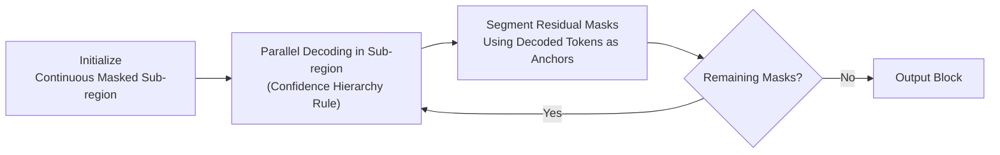

# Hierarchy Decoding: A Training-free Parallel Decoding Strategy for Diffusion Large Language Models

**Conference**: ICLR 2026  
**OpenReview**: [https://openreview.net/forum?id=ZsIQUjQtdW](https://openreview.net/forum?id=ZsIQUjQtdW)  
**Code**: [https://github.com/inclusionAI/dInfer](https://github.com/inclusionAI/dInfer)  
**Area**: LLM Inference Acceleration / Parallel Decoding for Diffusion Language Models  
**Keywords**: diffusion LLM, parallel decoding, divide-and-conquer, training-free, inference acceleration  

## TL;DR
Addressing the performance degradation issue in diffusion Large Language Models (dLLMs) when decoding multiple tokens per step, this paper proposes the training-free **Hierarchy-dLLM**. It employs a divide-and-conquer approach to recursively partition continuous masked regions into sparse sub-regions for parallel decoding. By maintaining a sparse distribution of undecoded tokens to suppress distribution drift, it achieves up to a 17× speedup (approximately 1.5× faster than Fast-dLLM) while maintaining or even slightly improving accuracy.

## Background & Motivation
- **Background**: Autoregressive (AR) LLMs generate tokens sequentially, which limits efficiency. Diffusion Language Models (dLLMs, primarily Masked Diffusion Models) utilize bidirectional attention for iterative denoising, naturally supporting parallel decoding of multiple tokens per step. They are considered a promising route to break the AR serial bottleneck.
- **Limitations of Prior Work**: Open-source dLLMs (e.g., LLaDA, Dream) have single-step computations significantly slower than AR models of the same scale due to bidirectional attention; they must rely on throughput gains from parallel decoding to compensate. However, they default to greedy decoding—outputting only one token per step—making them less efficient than AR. Blindly increasing parallelism triggers the "Curse of Parallel Decoding," where tokens predicted in the same step fail to satisfy conditional independence assumptions, leading to semantic collapse (e.g., "pens, pens, and pens").
- **Key Challenge**: Parallel decoding requires the **joint distribution** $p(x^1,\dots,x^k\mid X_t)$, but single-step sampling only provides the **marginal distribution** $p(x^i\mid X_t)$ for each position. Approximating the joint distribution with marginals is the central difficulty. Existing methods focus on confidence thresholds for token selection but ignore the impact of the **spatial distribution of undecoded positions** on decoding.
- **Goal**: To design a parallel decoding strategy that significantly accelerates inference without retraining the model while maintaining accuracy.
- **Key Insight**: Through preliminary experiments using KL divergence approximation, the authors found that when undecoded tokens are **sparsely scattered**, the distribution of one-step decoding aligns closely with step-by-step decoding. Conversely, when undecoded tokens form **contiguous segments**, distribution drift increases sharply with segment length. **[Core Hypothesis]** If a decoding strategy can structurally maintain undecoded regions in a sparse distribution, it can achieve both speed and accuracy. Thus, the authors propose **[Divide-and-Conquer Decoding]** Hierarchy-dLLM: recursively partitioning continuous masked regions into independent sparse sub-regions for parallel decoding.

## Method

### Overall Architecture
Hierarchy-dLLM treats the decoding of each generation block as a recursive divide-and-conquer process: **Initialize** a continuous masked sub-region $\rightarrow$ **Parallelly decode** at least one token within each sub-region based on confidence $\rightarrow$ Use decoded tokens as "anchors" to **re-partition** remaining continuous masked areas into smaller independent sub-regions $\rightarrow$ Iterate within each sub-region until no masks remain. Decoded anchors naturally break undecoded tokens into a sparse layout, suppressing distribution drift. Simultaneously, multiple sub-regions can be processed in parallel, ideally achieving $O(\log n)$ acceleration.

### Key Designs

**1. Divide-and-Conquer Structure: Partitioning Continuous Masks into Sparse Sub-regions.** This is the framework of the paper, directly implementing the "sparse layout is more stable" insight. Each block begins as a continuous masked segment of length $l$. After decoding, tokens generated in the current step act as anchors, splitting residual masks into smaller independent sub-regions for the next round. Since sub-regions are independent and processed in parallel, and decoding creates dispersed anchors, undecoded tokens always tend toward a sparse distribution. This aligns with the "sparse mask KL drift is low" finding. This recursion transforms the difficult problem of "decoding a large area of highly coupled tokens" into a series of manageable sub-problems of "decoding a few nearly independent tokens in small, sparse sub-regions," ideally compressing steps logarithmically.

**2. Intra-sub-region Hierarchical Confidence Decoding: High Threshold Selection + Low Threshold Fallback + Global Guarantee.** The challenge within a sub-region is to decode as many tokens as possible without introducing propagating errors. Position confidence is defined as $c_i=\max_{v\in V}p_\theta(x^i_s=v\mid X_t)$, using a three-tier rule: (i) **High Threshold** $\tau_{high}$—Commit tokens where $c_i \ge \tau_{high}$, allowing multi-position parallel decoding when evidence is strong; (ii) **Low Threshold** $\tau_{low}$—If no position exceeds the high threshold (flat vocabulary distribution), relax the rule to decode only the most confident position $i^*=\arg\max_{i\in A}c_i$, provided $c_{i^*}\ge\tau_{low}$, to prevent sub-region stagnation; (iii) **Global Fallback**—If no position meets the low threshold, force-decode the overall most confident position in the sequence, ensuring at least one token per step. This "strict-to-relaxed" best-effort process dynamically balances efficiency, reliability, and coherence.

**3. Remasking: Correcting Early Predictions Disproven by Later Context.** As decoding progresses, tokens committed early may conflict with the emerging context, causing their confidence to drop. **Before** re-partitioning sub-regions in each round, a check is performed on all decoded tokens: any token with $c_i < \tau_{remask}$ is reverted to $[\text{MASK}]$ for re-decoding. This step transforms irreversible token commitment into a rollable process, preventing error accumulation and maintaining global consistency. It serves as a safety valve for maintaining accuracy under aggressive parallel decoding.

Overall, the method is **completely training-free**—modifying only the inference-stage decoding schedule without changing model weights, allowing it to be plug-and-play for any open-source MDM-style dLLM.

## Key Experimental Results

### Main Results
Evaluated on LLaDA-Instruct-8B / LLaDA-1.5-8B / Dream-7B across five benchmarks (GSM8K, MATH500, HumanEval, MBPP, IF-Eval), compared against Vanilla, Fast-dLLM, and WINO. Efficiency is measured by TPF (Tokens Per Forward) and TPS (Tokens Per Second).

| Task (LLaDA-1.5-8B) | Method | Score↑ | TPF↑ | TPS↑ |
|---|---|---|---|---|
| GSM8K | Vanilla | 83.17 | 0.65 | 1.99 |
| | Fast-dLLM | 83.32 | 3.10 (4.77×) | 9.54 (4.79×) |
| | **Hierarchy-dLLM** | **83.70** | **4.25 (6.54×)** | **14.83 (7.45×)** |
| MATH500 | Vanilla | 39.80 | 0.84 | 7.96 |
| | **Hierarchy-dLLM** | **41.60** | **3.99 (4.75×)** | **42.25 (5.31×)** |
| HumanEval | Vanilla | 43.29 | 0.93 | 8.56 |
| | **Hierarchy-dLLM** | **45.12** | **4.20 (4.52×)** | **44.18 (5.16×)** |
| MBPP | Vanilla | 40.20 | 0.16 | 0.80 |
| | **Hierarchy-dLLM** | 40.40 | **2.29 (14.31×)** | **12.70 (15.88×)** |

- Achieved up to **17.23×** TPS acceleration on MBPP with LLaDA-Instruct-8B. Mathematical reasoning tasks showed improved accuracy (~1 point), suggesting divide-and-conquer decoding mitigates error accumulation in long reasoning chains.

### Ablation Study

| Dimension | Conclusion |
|---|---|
| Block Length 16/32/64 | Accuracy remains stable; Hierarchy-dLLM shows significantly higher TPF/TPS, with the advantage widening as block size increases. |
| Generation Length | Long sequences increase per-step computation due to bidirectional attention, reducing TPS; however, Hierarchy-dLLM slows down much less than Vanilla, with the acceleration ratio increasing with length. |

### Key Findings
- **Sparse vs. Contiguous Masking**: Preliminary experiments show KL drift in contiguous masks increases rapidly with the number of hidden tokens, while sparse masks remain low. This validates that "sparse layouts allow bidirectional attention to utilize both left and right anchor contexts" as the root cause of effectiveness.
- **Cross-architecture**: Dream-7B (derived from an AR base) also gains substantial speedup, but accuracy maintenance is weaker than LLaDA. The authors attribute this to AR-trained models having weaker inherent support for parallel decoding.

## Highlights & Insights
- **New Perspective**: Expanding parallel decoding from a one-dimensional "who to decode (confidence)" problem to the neglected dimension of "spatial layout of undecoded tokens," backed by clear KL approximation evidence, is the paper's most valuable insight.
- **Training-free, Plug-and-Play**: Modifying only the inference schedule without touching weights ensures low deployment costs for existing open-source dLLMs.
- **Elegance of Divide-and-Conquer**: Using "decoded tokens as anchors to split residual masks" simultaneously achieves "creating sparse layouts" and "generating parallelizable sub-regions."

## Limitations & Future Work
- **Dependency on Multiple Thresholds**: $\tau_{high}, \tau_{low}, \tau_{remask}$ require grid search tuning. Optimal values may vary across tasks/models, and a self-adaptive mechanism is lacking.
- **Constraints on AR-based Models**: Accuracy retention on Dream-7B is noticeably weaker than on LLaDA, indicating a dependency on the model's inherent parallel capabilities.
- **Idealized $O(\log n)$ Bound**: Actual speedup is constrained by flat confidence distributions and forced global fallbacks, making the theoretical logarithmic bound difficult to reach consistently.
- **Evaluation Scale**: Verified primarily on 7-8B scale models across five standard benchmarks; performance on larger models or open-ended long-form generation requires further investigation.

## Related Work & Insights
- **Fast-dLLM** (Wu et al. 2025): The most direct baseline; focuses on confidence thresholding for parallel decoding but ignores spatial layout. Hierarchy-dLLM is ~1.5× faster.
- **WINO** (Hong et al. 2025): Multistage decoding; more complex and shows more significant accuracy drops on several tasks.
- **SADD / Semi-autoregressive Diffusion Decoding**: Partitions sequences into blocks generated left-to-right with intra-block parallelism (used by LLaDA/MMaDA). Hierarchy-dLLM's divide-and-conquer can be seen as introducing further recursive sparsification within blocks.
- **Insight**: For any parallel generation task using marginals to approximate joint distributions (e.g., speculative decoding, parallel token prediction), "actively maintaining a sparse/low-coupling layout of predicted positions" may be a universal strategy for improving quality.

## Rating
- **Novelty**: ⭐⭐⭐⭐ — The perspective that spatial layout affects parallel decoding is novel; the combination of divide-and-conquer and sparsification is the first position-based dLLM decoding framework.
- **Experimental Thoroughness**: ⭐⭐⭐⭐ — Comprehensive metrics (TPF/TPS) across three models and five benchmarks; block/sequence length ablations are solid, though model scale and scenarios are somewhat narrow.
- **Writing Quality**: ⭐⭐⭐⭐ — Clear logical flow from preliminary observations to methodology; well-supported by formulas and diagrams.
- **Value**: ⭐⭐⭐⭐ — Training-free, plug-and-play, up to 17× speedup without accuracy loss; provides immediate engineering value for dLLM deployment.

<!-- RELATED:START -->

## Related Papers

- [\[ICLR 2026\] Learning to Parallel: Accelerating Diffusion Large Language Models via Learnable Parallel Decoding](learning_to_parallel_accelerating_diffusion_large_language_models_via_learnable_.md)
- [\[ICLR 2026\] Fast-dLLM: Training-free Acceleration of Diffusion LLM by Enabling KV Cache and Parallel Decoding](fast-dllm_training-free_acceleration_of_diffusion_llm_by_enabling_kv_cache_and_p.md)
- [\[ICLR 2026\] Diffusion Language Models Know the Answer Before Decoding](diffusion_language_model_knows_the_answer_before_it_decodes.md)
- [\[ICLR 2026\] ReFusion: A Diffusion Large Language Model with Parallel Autoregressive Decoding](refusion_a_diffusion_large_language_model_with_parallel_autoregressive_decoding.md)
- [\[ICLR 2026\] Dynamic-dLLM: Dynamic Cache-Budget and Adaptive Parallel Decoding for Training-Free Acceleration of Diffusion LLM](dynamic-dllm_dynamic_cache-budget_and_adaptive_parallel_decoding_for_training-fr.md)

<!-- RELATED:END -->
