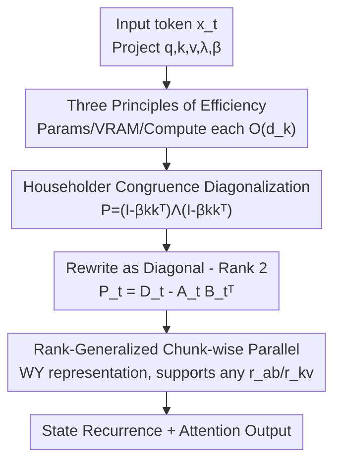

# Householder-Diagonalized Linear Attention (HDLA): Utilizing Rank-Enhanced Decay Mechanism for Efficient Sequence Modeling

**Conference**: ICLR 2026  
**OpenReview**: [https://openreview.net/forum?id=HVFjzaQeig](https://openreview.net/forum?id=HVFjzaQeig)  
**Code**: https://github.com/Zhangjiefu777/HDLA-Impl  
**Area**: LLM Efficiency  
**Keywords**: Linear Attention, Decay Matrix, Householder Transform, Chunk-wise Parallelism, Sequence Modeling

## TL;DR
HDLA utilizes generalized Householder matrices to achieve congruence diagonalization of the decay matrix in linear attention, extending the structure from the prevalent "diagonal + rank-1" to a more expressive "diagonal + rank-2" form. Combined with a chunk-wise parallel algorithm supporting arbitrary ranks, HDLA outperforms existing linear attention baselines across language modeling perplexity, MQAR/RULER retrieval, and MAD synthetic tasks with lower computational overhead.

## Background & Motivation

**Background**: Linear attention reduces the $O(n^2)$ complexity of Softmax attention to $O(n)$ by compressing the infinite KV sequence into a fixed-size hidden state $S_t \in \mathbb{R}^{d_k \times d_v}$. Its core recurrence is $S_t = P_t S_{t-1} + k_t v_t^\top$, where the decay matrix $P_t$ determines the relative weighting between historical information $S_{t-1}$ and new information $k_t v_t^\top$. Recent performance improvements in linear attention have largely stemmed from increasingly complex designs of $P_t$: from no decay (original version) $\rightarrow$ constant decay (RetNet) $\rightarrow$ input-dependent diagonal decay (GLA, Mamba, HGRN2) $\rightarrow$ input-dependent non-diagonal decay (DeltaNet, Gated DeltaNet, RWKV-7).

**Limitations of Prior Work**: While current state-of-the-art methods (DeltaNet, Gated DeltaNet, TTT-Linear, RWKV-7) introduce non-diagonal structures, the structural complexity of $P_t$ remains bottlenecked at the "Diagonal-Plus-Rank-1" level. Diagonal decay is limited to "partial forgetting" and lacks inter-row interactions, making negative erasure impossible. Although rank-1 non-diagonal corrections allow for erasure, their expressivity is limited. Gated DeltaProduct attempts to stack "diagonal + rank-$n_h$" higher-rank decays through $n_h$ iterations, but the resulting fused decay matrix **lacks strong structural properties**, doubling computational costs while providing marginal performance gains.

**Key Challenge**: Stronger hidden state management requires more complex, higher-rank decay matrices; however, arbitrary high-rank matrices escalate parameter counts, VRAM usage, and computational costs. The fundamental problem is **how to construct a more expressive and well-structured decay matrix without sacrificing efficiency**.

**Goal**: Break the "diagonal + rank-1" ceiling by extending the decay matrix to a broader, more structured, and expressive class while satisfying constraints on parameters, memory, and computation.

**Key Insight**: The authors leverage the theory of congruence diagonalization for real symmetric matrices—any real symmetric matrix can be written as $P_t = H_t \Lambda_t H_t^\top$. By selecting a **parameter-efficient** invertible transform $H_t$, a complex $O(d_k^2)$ decay matrix can be controlled with $O(d_k)$ parameters. The generalized Householder matrix $I - \beta_t k_t k_t^\top$ perfectly fits this criteria: it adds only an $O(d_k)$ projection compared to diagonal decay.

**Core Idea**: Use generalized Householder matrices to "sandwich" an input-dependent diagonal eigenvalue matrix via congruence diagonalization, resulting in a structured "diagonal + rank-2" decay matrix ($P_t = (I-\beta_t k_t k_t^\top)\Lambda_t(I-\beta_t k_t k_t^\top)$). Furthermore, a universal chunk-wise parallel algorithm is derived to accommodate arbitrary rank decay and KV updates.

## Method

### Overall Architecture

HDLA aims to upgrade the linear attention decay matrix from "diagonal + rank-1" to a structured "diagonal + rank-2" with minimal overhead. The framework operates on two levels: The **modeling layer** reparameterizes the decay matrix using congruence diagonalization $P_t = H_t \Lambda_t H_t^\top$, splitting it into two sub-problems—learning a diagonal eigenvalue matrix $\Lambda_t$ (controlling forgetting intensity) and choosing an efficient invertible transform $H_t$ (controlling inter-row interactions). The **algorithm layer** rewrites the resulting $P_t = (I-\beta_t k_t k_t^\top)\Lambda_t(I-\beta_t k_t k_t^\top)$ into a "diagonal minus rank-2" form $P_t = D_t - A_t B_t^\top$, and derives a rank-generalized chunk-wise parallel training algorithm based on a generalized WY representation.

Input token $x_t$ is linearly projected to obtain query $q_t$, key $k_t$, value $v_t$, forgetting gate $\lambda_t$, and Householder coefficient $\beta_t$ for state recurrence. During training, the sequence is sliced into chunks of size $C$; hidden state checkpoints are computed serially across chunks, while attention outputs within each chunk are computed in parallel.

### Key Designs

**1. Three Principles of Efficiency: Narrowing the Design Space**

Given the vast design space for complex decay matrices, the authors impose three strict constraints: ① **Parameter Efficiency**: The $O(d_k^2)$ decay matrix must be generated using only $O(d_k)$ parameters, balanced with $\theta_Q, \theta_K, \theta_V$ to avoid training overhead explosion; ② **Memory Efficiency**: Each $O(d_k^2)$ decay matrix or their cumulative products must occupy $O(d_k)$ memory on average, comparable to the footprint of $q_t, k_t, v_t$; ③ **Computational Efficiency**: Cumulative products of the decay matrix must maintain reasonable costs, and hidden state updates across chunks must be completed in a one-pass matrix multiplication. These principles lead directly to the Householder transform as the ideal solution.

**2. Householder Congruence Diagonalization: Breaking the Rank-1 Ceiling**

For the eigenvalue matrix $\Lambda_t$, the model follows the input-dependent diagonal decay of GLA where $\Lambda_t = \mathrm{Diag}(\lambda_t)$ and $\lambda_t = \sigma(W_\Lambda x_t)$, providing dynamic forgetting. For the invertible transform $H_t$, it adopts the generalized Householder matrix $I - \beta_t k_t k_t^\top$. The combination yields:

$$P_t = (I - \beta_t k_t k_t^\top)\,\Lambda_t\,(I - \beta_t k_t k_t^\top) \in \mathbb{R}^{d_k \times d_k}$$

where $\beta_t \in (0,2)$ and $\sigma$ is the sigmoid function. This $P_t$ is a specific instance of the "diagonal + rank-2" class. Compared to GLA's pure diagonal decay, the dual Householder projections introduce inter-row interactions and negative erasure. Compared to the "diagonal + rank-1" of DeltaNet, it is more expressive. From a Test-Time Training perspective, the update equates to: penalizing high inner-product similarity between $k_t$ and $S_{t-1}$ columns (erasing redundancy), applying diagonal forgetting, and finally using the delta rule for gradient descent—effectively "erase redundancy, then write new values."

**3. Rank-Generalized Chunk-wise Parallel Algorithm: Efficient Training for High-Rank Decay**

The authors rewrite $P_t$ as a "diagonal minus rank-2" form $P_t = D_t - A_t B_t^\top$ ($A_t, B_t \in \mathbb{R}^{d_k \times 2}$) and generalize the objective to a universal recurrence accommodating arbitrary rank $r_{ab}$ decay and arbitrary rank $r_{kv}$ KV updates:

$$S_t = (D_t - A_t B_t^\top)S_{t-1} + K_t V_t^\top, \quad A_t,B_t \in \mathbb{R}^{d_k \times r_{ab}},\; K_t \in \mathbb{R}^{d_k \times r_{kv}}$$

The algorithm uses a two-stage scheme: ① Serial computation of hidden state checkpoints $S_{[0]}, \dots, S_{[N-1]}$; ② Parallel computation of attention outputs $O_{[0]}, \dots, O_{[N-1]}$. The key innovation is eliminating cumulative summation ($\Sigma$) and product ($\prod$) operators within the intra-chunk representation using a **rank-generalized WY representation**. By introducing a custom operator $\mathrm{triu}_{r_1 \times r_2}$ (treating each $r_1 \times r_2$ sub-block as a single element), $P_{[n]}$ and $H_{[n]}$ are expressed in compact forms without cumulative operators.

### Loss & Training
The model uses standard autoregressive language modeling (next-token prediction), trained on 10B/50B tokens sampled from FineWeb-Edu across 0.4B, 1.45B, and 2.8B parameter scales. HDLA sets $r_{ab}=2, r_{kv}=1$, with $\beta_t \in (0,2)$ derived from input projections and sigmoid scaling.

## Key Experimental Results

### Main Results

Language modeling perplexity (Wikitext / Lambada, lower is better):

| Model | 0.4B Avg ppl | 1.45B Avg ppl | 2.8B Avg ppl |
|------|------|------|------|
| **HDLA** | **36.06** | **22.32** | **18.58** |
| GDP2 (Gated DeltaProduct, $n_h{=}2$) | 41.28 | 24.65 | 20.38 |
| Gated DeltaNet | 43.06 | 24.83 | 19.60 |
| DeltaNet | 44.54 | 27.44 | 22.69 |
| GLA | 43.75 | 26.42 | 21.45 |
| Mamba2 | 40.63 | 25.73 | 22.78 |
| Llama (Softmax) | 37.60 | 23.68 | 20.71 |

HDLA significantly outperforms all linear attention baselines and **surpasses Softmax-based Llama** in perplexity across all scales.

MAD Synthetic Benchmark (average of 6 tasks, higher is better):

| Model | Compression | ICR | Mem. | AVG |
|------|------|------|------|------|
| Softmax Attention | 48.85 | 95.98 | 84.41 | 76.02 |
| **HDLA** | **51.01** | 99.73 | **89.34** | **72.97** |
| Gated DeltaNet | 41.41 | 99.73 | 55.64 | 68.17 |
| DeltaNet | 42.27 | 99.88 | 42.46 | 66.80 |
| GDP2 | 39.40 | 99.29 | 49.84 | 65.31 |
| Mamba | 48.20 | 86.90 | 89.48 | 68.58 |

HDLA maintains a score of 89.34 in Memorization, while other non-diagonal baselines drop below 60, narrowing the gap with Softmax.

RULER Retrieval (S-NIAH, 1.45B / 50B tokens, accuracy):

| Model | S-NIAH-3 @1024 | S-NIAH-3 @2048 | S-NIAH-2 @2048 |
|------|------|------|------|
| **HDLA** | **82.0%** | **65.2%** | **52.2%** |
| Gated DeltaNet | 50.6% | 7.0% | 45.8% |

On S-NIAH-3, HDLA leads Gated DeltaNet by 31.4% and 58.2% at different lengths.

### Ablation Study

Single-step recurrence computational cost:

| Method | $r_{ab}$ | $r_{kv}$ | State Update Computation |
|------|------|------|------|
| **HDLA** | 2 | 1 | $d_k(8d_v+5)$ |
| GDP2 | 2 | 2 | $d_k(12d_v+6)$ |
| GDP3 | 3 | 3 | $d_k(18d_v+9)$ |

Despite GDP3 having ~2x the computation of HDLA, it trails HDLA across language modeling and retrieval tasks.

### Key Findings
- **Memorization is the Divide**: Rank-1 non-diagonal baselines fail the MAD Memorization task (<60), while HDLA's rank-2 structure preserves memory at 89.34, suggesting rank-1 erasure mechanisms excessively damage stored information.
- **Stronger does not mean more Expensive**: HDLA achieves better performance with lower computation than GDP2/GDP3, validating that "structure" is more important than "blindly increasing rank."
- **Retrieval Upper Bound**: HDLA still lags behind Softmax in Fuzzy In-Context Recall due to the inherent recency bias of linear attention—diagonal coefficients decay over time, making it difficult to aggregate sparse, distant tokens into a finite hidden state.

## Highlights & Insights
- **Applying Matrix Decomposition to Attention**: Frameworking parameterization via $P=H\Lambda H^\top$ decouples the design into "choosing eigenvalues" and "choosing transformations," making it highly transferable.
- **Rank-Generalized WY Representation as a Foundation**: The introduction of the $\mathrm{triu}_{r_1\times r_2}$ block operator provides a universal training substrate for future linear attention models with arbitrary rank structures.
- **"Erase then Write" from TTT perspective**: The update is interpreted as penalizing redundancy before writing new values, providing an optimization-centric explanation for the effectiveness of rank-2 structures.

## Limitations & Future Work
- **Bottlenecked by Hidden State Size**: Linear attention's fixed-size state limits cross-step retrieval, maintaining a gap with Llama on RULER.
- **Structural Ceiling**: While this work raises the ceiling from rank-1 to rank-2, the benefits of rank-3+ structured decay remain systematically unexplored.
- **Future Directions**: Mitigating recency bias through sliding windows or global attention biases (e.g., ATLAS) could further close the retrieval gap with Softmax.

## Related Work & Insights
- **vs Gated DeltaNet / DeltaNet**: These use "diagonal + rank-1" structures. HDLA utilizes dual Householder transforms to reach "diagonal + rank-2," leading in memory and retrieval with minimal additional $O(d_k)$ overhead.
- **vs Gated DeltaProduct**: GDP stacks rank via iterations without strong structure; HDLA achieves better performance at half the computational cost of GDP3.
- **vs ParallelFlow**: ParallelFlow supports "Identity + rank-n" partial parallelism but does not accommodate arbitrary diagonal terms common in linear attention; HDLA's algorithm supports both.

## Rating
- Novelty: ⭐⭐⭐⭐⭐ Systematically advances linear attention decay from rank-1 to structured rank-2 with a universal algorithm.
- Experimental Thoroughness: ⭐⭐⭐⭐⭐ Covers multiple tasks (MAD, Zoology, RULER), scales, and rigorous computational comparisons.
- Writing Quality: ⭐⭐⭐⭐ Theoretically rigorous, though some core derivations are dense and moved to the appendix.
- Value: ⭐⭐⭐⭐⭐ Provides both a high-performance model and a reusable rank-generalized training foundation.

<!-- RELATED:START -->

## Related Papers

- [\[ICLR 2026\] MoM: Linear Sequence Modeling with Mixture-of-Memories](mom_linear_sequence_modeling_with_mixture-of-memories.md)
- [\[ACL 2026\] Native Hybrid Attention for Efficient Sequence Modeling](../../ACL2026/llm_efficiency/native_hybrid_attention_for_efficient_sequence_modeling.md)
- [\[ICLR 2026\] FlexLinearAttention: Compiling a Unified Abstraction into Scalable Kernels for Linear Attention](flexlinearattention_compiling_a_unified_abstraction_into_scalable_kernels_for_li.md)
- [\[ICLR 2026\] Log-Linear Attention](log-linear_attention.md)
- [\[ICLR 2026\] RACE Attention: A Strictly Linear-Time Attention Layer for Training on Outrageously Large Contexts](race_attention_a_strictly_linear-time_attention_layer_for_training_on_outrageous.md)

<!-- RELATED:END -->
