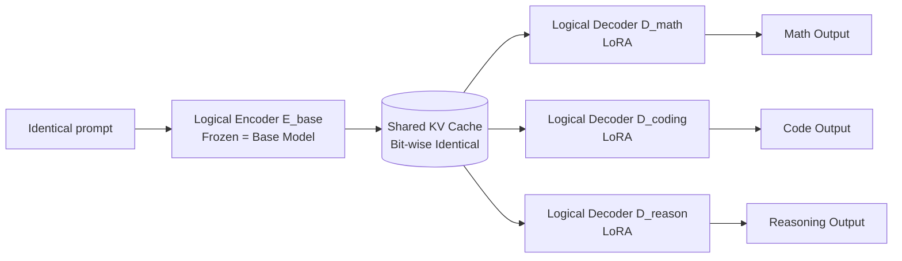

# ICaRus: Identical Cache Reuse for Efficient Multi-Model Inference

**Conference**: ICLR 2026  
**OpenReview**: [https://openreview.net/forum?id=qrMo6R7lOS](https://openreview.net/forum?id=qrMo6R7lOS)  
**Code**: To be confirmed  
**Area**: LLM Efficient Inference / KV Cache Optimization / Multi-model Serving  
**Keywords**: KV Cache Sharing, Multi-model Inference, Agentic AI, Prefix Caching, LoRA, Decoder Transformer  

## TL;DR
ICaRus conceptually splits a decoder-only Transformer into a "logical encoder (generating KV cache) + logical decoder (predicting tokens)." By fine-tuning only the logical decoder and freezing the logical encoder, a suite of task-specialized models can share the same bit-wise identical KV cache. This eliminates cache explosion and redundant prefill in multi-model serving, reducing P95 latency by 11.1× and increasing throughput by 3.8× in 8-model agentic workflows.

## Background & Motivation
**Background** — Multi-model inference is becoming the mainstream paradigm for agentic AI, where multiple task-specialized models (planning, execution, summarization, etc.) collaborate to solve complex tasks. Workflows like ReAct, Reflexion, LATS, and LLMCompiler orchestrate different models into a single pipeline, achieving higher accuracy than single general-purpose models.

**Limitations of Prior Work** — This paradigm introduces significant overhead in KV cache management. **Each model must maintain its own KV cache even when facing identical prompts**, causing memory usage to scale linearly with the number of models. Once GPU memory is saturated, serving systems (e.g., vLLM, SGLang) are forced to evict existing caches, triggering costly recomputation and dropping throughput. Furthermore, mature optimizations like prefix caching cannot naturally be shared across models because KV caches from different models are incompatible.

**Key Challenge** — Existing KV cache optimizations (pruning, quantization, inter-layer sharing) and workflow-based scheduling (e.g., KVFlow) only address cache management within a **single model**, avoiding the two major challenges of "cache explosion" and "lack of cross-model sharing" in multi-model scenarios. DroidSpeak attempts to share "non-sensitive layers" between a base model and its fine-tuned variants, but sensitive layers still require individual recomputation, resulting in incomplete sharing.

**Goal** — To design an architecture where multiple specialized models generate **identical** KV caches for the same prompt, enabling true **full-layer, cross-model** cache sharing and prefix reuse.

**Core Idea** — **Decouple the "producer" and "consumer" of the KV cache**: View the decoder-only Transformer as a special case consisting of a "logical encoder $E$ (generates KV from tokens) + logical decoder $D$ (predicts the next token using current tokens and accumulated KV)." By **training only the logical decoder and freezing the logical encoder**, all specialized models share the same frozen encoder. Consequently, the KV caches they produce for the same prompt are identical and can be directly shared.

## Method

### Overall Architecture
ICaRus reinterprets the decoder-only Transformer: next-token generation $x_{i+1}=F(x_1,\dots,x_i)=F(x_i, K_{1:i}, V_{1:i})$ is split into two steps. The logical encoder $K_{1:i}, V_{1:i}=E(x_{1:i})$ transforms the input sequence into a KV cache, and the logical decoder $x_{i+1}=D(x_i, K_{1:i}, V_{1:i})$ decodes the next token. Standard Transformers are a degenerate case where $E \equiv D$. ICaRus fixes the logical encoder as the base model $E_{\text{base}}$ across all tasks and only replaces the logical decoder with task-specific $D_{\text{task}}$ (implemented via LoRA).

### Key Designs

**1. Logical Encoder-Decoder Decomposition: Embedding "Sharing" into Training**
Instead of forcing independent models to share caches post-hoc, ICaRus **explicitly models the "full KV sharing" constraint during training**. Both the logical encoder and decoder are initialized with base model parameters ($F_{\text{base}}\equiv E_{\text{base}}\equiv D_{\text{base}}$). During training, the same input is fed to both: the frozen $E_{\text{base}}$ generates KV representations $K_{1:i},V_{1:i}=E_{\text{base}}(x_{1:i})$, while the trainable $D_{\text{task}}$ performs attention on these KV pairs to calculate loss and backpropagate gradients (Eq. 4-5). Since the encoder is frozen, specialized decoders are forced to reuse the same sequence representations, expressing task differences solely through the decoder. This constraint acts as implicit regularization; empirical results show ICaRus training loss curves closely match standard fine-tuning, suggesting no loss in convergence and reduced overfitting risk.

**2. Shared Logical Encoder ⇒ Full Cross-Model KV and Prefix Reuse**
Because the encoders of all specialized models are identical to the base ($E_{\text{math}}\equiv E_{\text{coding}}\equiv E_{\text{reason}}\equiv E_{\text{base}}$), the KV caches they generate for the same prompt are **bit-wise identical**. Thus, only **one copy** of the KV cache needs to be stored in GPU memory regardless of the number of models $N$. This prevents evictions and recomputations caused by memory saturation. Furthermore, this allows prefix caching to work **across models** for the first time: in an agentic workflow, the prompt cache generated by one agent (e.g., Planner) can be directly loaded and reused by subsequent agents (Executor, Summarizer), eliminating redundant prefill. Complexity-wise, baseline multi-model memory is $O(M+NL_t)$ and prefill is $O(N(ML_t+L_t^2))$; ICaRus reduces both to single-model scales of $O(M+L_t)$ and $O(ML_t+L_t^2)$.

**3. LoRA Adapters + Parallel Encoding/Decoding: Handling 2× Decoding Overhead**
A naive sequential execution of the encoder and decoder would double decoding latency as weights and KV pairs are read twice. ICaRus addresses this by inserting lightweight LoRA adapters into the logical decoder rather than full fine-tuning. Consequently, the encoder and decoder **share almost all parameters except for the adapters**, requiring the base weights to be loaded only once. Simultaneously, the query representations of the encoder and decoder are **concatenated along the head dimension**, allowing them to perform attention on the same KV cache in parallel. While the nominal computation doubles ($O(2M+2L_t)$), the fact that decoding is memory-bound—and memory access remains nearly identical to a single model—means the actual added latency is negligible.

## Key Experimental Results

### Main Results
Accuracy (LLaMA-3.1-8B / Qwen3-8B-Base, evaluated after specialization on three tasks, ICaRus shares KV throughout):

| Base | Method | Shared KV | GSM8K | GSM+ | HEval | HEval+ | GPQA |
|------|------|:---:|---|---|---|---|---|
| LLaMA3.1-8B | Multi Model | ✗ | 69.7 | 48.5 | 48.2 | 41.5 | 27.3 |
| LLaMA3.1-8B | **ICaRus** | ✓ | 67.9 | 45.8 | 48.2 | 43.9 | **28.8** |
| Qwen3-8B-Base | Multi Model | ✗ | 85.4 | 66.1 | 81.7 | 75.6 | 34.3 |
| Qwen3-8B-Base | **ICaRus** | ✓ | **87.3** | **67.5** | **86.6** | **79.9** | 33.8 |

ICaRus maintains or improves accuracy compared to independently fine-tuned models while sharing KV (e.g., +1.4% improvement in Math/Code on Qwen3-8B).

Multi-model serving performance (LLaMA-3.1-8B, ReAct mode, relative to baseline):

| Model Count N | Max Throughput Gain | P95 Latency Reduction |
|:---:|:---:|:---:|
| 2 | 1.4× | 3.8× |
| 4 | 2.3× | 5.1× |
| 8 | 3.8× | 11.1× |

### Ablation Study
Model scaling (Qwen3-Base, trained on MetaMathQA-40K):

| Metric | 1.7B Base | 1.7B ICaRus | 8B Base | 8B ICaRus | 14B Base | 14B ICaRus |
|------|:---:|:---:|:---:|:---:|:---:|:---:|
| GSM8K | 73.2 | 74.0 | 85.4 | 87.3 | 85.6 | **88.8** |
| GSM+ | 53.7 | 54.1 | 66.1 | 67.5 | 66.7 | 68.8 |

Advantages become more pronounced as model size increases, with Qwen3-14B outperforming standard fine-tuning by +3.2% on GSM8K.

### Key Findings
- **Sharing without Degradation**: The implicit regularization from the frozen encoder reduces overfitting; accuracy is comparable or superior to independent fine-tuning, with larger models showing greater benefits.
- **Benefits Amplify with Load**: Baseline systems trigger recomputation due to KV explosion as QPS increases, while ICaRus throughput continues to scale due to shared cache.
- **Latency Gains Scale Exponentially**: The P95 latency gain of 11.1× at 8 models is significantly higher than the 3.8× at 2 models.

## Highlights & Insights
- **Conceptual Decoupling Yields Engineering Dividends**: Reinterpreting the Transformer as a "logical encoder + logical decoder" is a simple yet powerful perspective that transforms KV sharing from a post-hoc compatibility issue into a constraint addressed during training.
- **Modeling Sharing at Training Time**: Unlike DroidSpeak, which attempts partial layer sharing on independently trained models, ICaRus ensures bit-wise identity across all layers, removing the need to identify "sensitive layers."
- **"Free Lunch" in Memory-Bound Scenarios**: Since decoding is memory-bound, ICaRus hides doubled computation behind nearly unchanged memory traffic using parameter sharing and query concatenation.

## Limitations & Future Work
- **Restricted to Same Base Model Family**: All specialized decoders derive from the same base. The paper does not explore KV sharing across heterogeneous base models.
- **Base Model Bottleneck**: The frozen logical encoder determines the quality of KV representations. If the base model is weak, it may cap the performance of specialized decoders.
- **Double Computation during Decoding**: Although hidden by memory traffic, the 2× computation might become a bottleneck in compute-bound scenarios (e.g., very short sequences or small batches).

## Related Work & Insights
- **KV Cache Optimization**: Traditional prefix caching (vLLM, SGLang) is limited to single-model reuse; ICaRus extends this to cross-model scenarios for the same prompt.
- **vs. DroidSpeak**: DroidSpeak shares only non-sensitive layers, while ICaRus achieves full-layer identity through training constraints.
- **vs. KVFlow**: KVFlow uses workflow prediction to schedule cache eviction/prefetching; ICaRus eliminates the redundancy at the source.
- **Insight**: Embedding inference-time system constraints (like cache compatibility) into training objectives is a valuable strategy applicable to quantization-aware sharing and cross-device cache alignment.

## Rating
- **Novelty**: ⭐⭐⭐⭐⭐ Efficiently conceptually decoupling the Transformer to enable full-layer KV sharing is novel and elegant.
- **Experimental Thoroughness**: ⭐⭐⭐⭐ Covers multiple base models, tasks, and agent patterns with real-world serving metrics (vLLM).
- **Writing Quality**: ⭐⭐⭐⭐⭐ Clear mathematical abstraction and logical flow.
- **Value**: ⭐⭐⭐⭐⭐ Directly addresses the critical pain point of multi-model agentic AI serving with massive latency and throughput gains.

<!-- RELATED:START -->

## Related Papers

- [\[ICLR 2026\] Universal Model Routing for Efficient LLM Inference](universal_model_routing_for_efficient_llm_inference.md)
- [\[ICLR 2026\] FreeKV: Boosting KV Cache Retrieval for Efficient LLM Inference](freekv_boosting_kv_cache_retrieval_for_efficient_llm_inference.md)
- [\[ICLR 2026\] Scaling Laws Meet Model Architecture: Toward Inference-Efficient LLMs](scaling_laws_meet_model_architecture_toward_inference-efficient_llms.md)
- [\[ICLR 2026\] Semantic Parallelism: Redefining Efficient MoE Inference via Model-Data Co-Scheduling](semantic_parallelism_redefining_efficient_moe_inference_via_model-data_co-schedu.md)
- [\[ICLR 2026\] FlashDLM: Accelerating Diffusion Language Model Inference via Efficient KV Caching and Guided Diffusion](flashdlm_accelerating_diffusion_language_model_inference_via_efficient_kv_cachin.md)

<!-- RELATED:END -->
