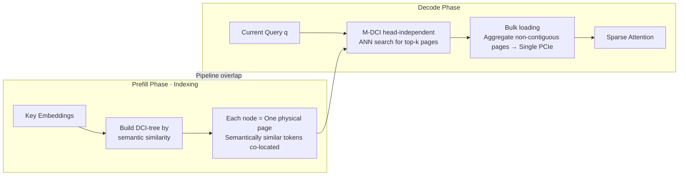

# IceCache: Memory-Efficient KV-cache Management for Long-Sequence LLMs

**Conference**: ICLR 2026  
**OpenReview**: [https://openreview.net/forum?id=yHxSKM9kdr](https://openreview.net/forum?id=yHxSKM9kdr)  
**Code**: [https://yuzhenmao.github.io/IceCache/](https://yuzhenmao.github.io/IceCache/)  
**Area**: LLM Inference Acceleration / KV-cache Management / Long-sequence Generation  
**Keywords**: KV-cache offloading, PagedAttention, semantic clustering, approximate nearest neighbor search, multi-level DCI, long-context inference  

## TL;DR
IceCache integrates "clustering tokens by semantic similarity" with the paging mechanism of PagedAttention. By utilizing an incrementally updatable multi-level DCI tree, it packs semantically similar tokens into the same physical memory pages. This ensures that relevant tokens are highly co-located during query-aware retrieval, significantly improving hit rates and maintaining near-full cache accuracy with lower latency while using only 25% of the KV-cache budget.

## Background & Motivation

**Background**: KV-cache is essential for accelerating LLM autoregressive generation, but its memory footprint grows linearly with sequence length, often exhausting GPU memory in long-context or long-generation scenarios. Two main research lines exist: (1) Eviction (e.g., H2O, StreamingLLM, SnapKV), which discards unimportant tokens—fast but uses static strategies that struggle with dynamic contexts; (2) Offloading (e.g., MagicPiG, OmniKV, PQCache, ArkVale), which offloads KV-cache to CPU and dynamically moves important pages back to GPU based on the query—more accurate but introduces GPU–CPU transfer latency.

**Limitations of Prior Work**: Existing offloading methods suffer from **imprecise token selection**. They follow the paging approach of PagedAttention, where **pages are partitioned based on the original token order**. Consequently, tokens relevant to a specific query are often **scattered across multiple pages**. During retrieval, entire pages (containing many irrelevant tokens) must be moved to the GPU, wasting bandwidth and reducing selection precision (low hit rate). Furthermore, most methods **lack mechanisms to dynamically update the cache pool during decoding**, leading to performance degradation in long-generation tasks like CoT reasoning or long-document summarization.

**Key Challenge**: Memory paging is organized by "physical position/chronological order," whereas attention relevance is organized by "semantics." This misalignment makes it impossible to align the "fine-grained retrieval of relevant tokens" with the "granularity of paged memory transfer."

**Goal**: Achieve precise retrieval with high hit rates and low-latency memory transfer under constrained GPU memory budgets, while maintaining dynamic updates during long generation.

**Key Insight**: <u>Organize memory pages based on "semantic similarity" rather than "token order."</u> By clustering semantically similar tokens into the same page, relevant tokens naturally co-locate. Thus, "selecting top-k pages" becomes approximately equivalent to "selecting top-k relevant tokens," aligning transfer granularity with retrieval objectives. This is supported by a multi-level DCI tree that allows for incremental updates.

## Method

### Overall Architecture
The IceCache workflow consists of three steps: **(1) Indexing**: During the prefill phase (or when offloading new window tokens to the CPU), a DCI tree is constructed for each attention head. Tokens are clustered into "nodes" based on key embedding semantic similarity, where each node maps directly to a physical memory page. **(2) Page Selection**: During decoding, M-DCI performs approximate nearest neighbor (ANN) search for each head to independently select the top-k pages most relevant to the current query. **(3) Bulk Loading**: Selected (non-contiguous) pages are aggregated into a contiguous buffer for a single high-throughput PCIe transfer back to the GPU. A pipeline overlapping prefill, offloading, and indexing hides CPU-side overhead behind GPU computation.

### Key Designs

**1. Semantic Clustering Paging: Making "page selection" equivalent to "relevant token selection."** This is the foundation of the work. PagedAttention and its successors (Quest, ArkVale) partition pages by original token order, scattering relevant tokens and forcing the transfer of irrelevant data. IceCache ignores token order and builds a DCI tree for each attention head. It clusters tokens into nodes based on key embedding semantic similarity, where **each node maps directly to a physical memory page**, preserving semantic locality at the storage level. Consequently, tokens relevant to query $q$ are concentrated in a few pages, improving hit rate and bandwidth utilization simultaneously. Since attention is sparse—where in $a_{i,j}=\frac{s_{i,j}\exp(q_i^\top k_j/\sqrt{d})}{\sum_{j'}s_{i,j'}\exp(q_i^\top k_{j'}/\sqrt{d})}$, only a few $j$ are non-negligible—semantic paging covers these significant items with minimal pages.

**2. Multi-level DCI Tree (M-DCI): Efficient and incrementally updatable hierarchical index for high dimensions.** The underlying structure is Prioritized Dynamic Continuous Indexing (P-DCI), which avoids space partitioning (combating the curse of dimensionality) by projecting points along random vectors. IceCache extends this into a **multi-level hierarchy**: points are randomly promoted to higher levels, where each lower-level point adopts the nearest "parent node," forming clusters. Retrieval starts from the top level using P-DCI to find $k$ nearest points and recursively searches sub-nodes, narrowing the search space. This structure is effective for high intrinsic dimensionality and naturally supports **incremental insertion**. Newly offloaded tokens in a sliding window are inserted into appropriate nodes; nodes that exceed the page size limit are dynamically split, ensuring the index remains semantically valid and balanced during long generation.

**3. Head-independent Fine-grained Page Selection + GQA Sharing.** During decoding, IceCache performs M-DCI **independently for each attention head**, as different heads focus on different semantics. For Group-Query Attention (GQA), IceCache takes the union of pages selected by queries within the same group, respecting the GQA structure while avoiding redundant retrieval.

**4. Bulk Loading + Three-stage Pipeline: Hiding transfer and indexing overhead.** Selected pages are non-contiguous in both main and GPU memory, making page-by-page PCIe transfers inefficient. IceCache uses CPU/GPU backload buffers to aggregate all selected pages into a contiguous CPU buffer for a **single high-throughput PCIe transfer**. These are then scattered to exact slots in the KV-cache table. Simultaneously, a pipeline overlaps prefill computation, KV offloading, and DCI indexing. Once a layer's KV reaches CPU memory, indexing begins in parallel with the next layer's GPU prefill, masking latency.

## Key Experimental Results

### Main Results (LongBench, average accuracy across 16 sub-tasks)
Llama-3.1-8B-Instruct and Mistral-7B-Instruct-v0.2 (GQA) models, compared against 6 SOTA KV-cache methods, full cache (FULL), and ground-truth top-k (TOP-k).

| Budget | Method | Llama-3.1-8B Avg. | Mistral-7B Avg. |
|---|---|---|---|
| N/A | FULL | 49.5 | 42.2 |
| 256 | TOP-k (Upper Bound) | 49.8 | 42.6 |
| 256 | SnapKV (SKV) | 40.8 | 31.8 |
| 256 | StreamingLLM (SLM) | 33.5 | 27.8 |
| 256 | OmniKV (OKV) | 46.3 | 33.0 |
| 256 | MagicPiG (MPG) | 44.6 | 39.1 |
| 256 | PQCache (PQC) | 47.3 | 37.4 |
| 256 | ArkVale (AKV) | 42.8 | — |
| **64** | **IceCache (ICE)** | **47.8** | — |
| **128** | **IceCache (ICE)** | **48.6** | — |
| **256** | **IceCache (ICE)** | **49.0** | — |

Key comparison: IceCache with **budget=64** (47.8) **outperforms all baselines with budget=256** (the strongest, PQC, achieves 47.3). At budget=256, it achieves 49.0, approaching the 49.5 of FULL cache. The abstract notes that with a 256-token budget, it maintains **99%** of the full-cache accuracy.

### Efficiency (A100, 36k sequence length)
IceCache achieves the **best trade-off** between CUDA memory footprint and TPOT (Time Per Output Token). It is more memory-efficient than high-precision baselines and more accurate/faster than low-memory baselines. Using only **25%** of the KV-cache budget, it delivers latency and accuracy comparable to or better than other offloading methods.

### Key Findings
- **Passkey Retrieval**: Maintains **100%** retrieval accuracy across context lengths from 10k to 100k and budgets $\in \{256, 128, 64\}$, proving that semantic clustering reliably recalls critical offloaded pages.
- **No Long-generation Degradation**: The incrementally updatable DCI tree allows IceCache to avoid the performance collapse common in baselines during tasks like GSM8K CoT reasoning.
- **High Fidelity at Small Budgets**: Maintaining near-oracle performance even at a 64-token budget demonstrates that aligning "page selection" with "relevant token selection" significantly boosts retrieval precision.

## Highlights & Insights
- **Unity of Memory Systems and Retrieval**: The core insight is that the boundaries of PagedAttention (physical/chronological) are inherently misaligned with attention relevance (semantic). IceCache reorders the page layout using semantic clustering to align the minimum unit of memory transfer (the page) with the retrieval target (relevant tokens)—an elegant alignment strategy.
- **Dynamic Data Structures as the Key for Long Generation**: Most previous works treat page layout as a static allocation problem. IceCache uses an incrementally updatable DCI tree to make it a dynamic, semantic-aware structure, which is the root cause of its robustness in long generation.
- **Solid Systems Engineering**: Bulk loading converts scattered small copies into single large PCIe transfers, and the three-stage pipeline hides indexing and offloading overhead, translating algorithmic advantages into end-to-end latency gains.

## Limitations & Future Work
- **DCI Indexing Overhead**: Building a DCI tree for every head and sequence may become a bottleneck when the number of heads or batch size is large, potentially straining CPU threads (the experiment fixed 64 threads).
- **Approximation Error of Randomized ANN**: M-DCI is an approximate method and might miss critical pages under extreme query distributions. While it achieved 100% on passkey tasks, its robustness boundaries are not fully explored.
- **Reliance on Semantic Clustering**: If certain layers or tasks exhibit weak semantic locality in the key space, the paging benefit may diminish. The exclusion of the first two layers due to low sparsity suggests this assumption is not universally applicable.
- **Future Work**: Orthogonal integration with page reuse and quantization (like Product Quantization in PQCache), and implementation in serving frameworks like vLLM.

## Related Work & Insights
- **Eviction Methods**: H2O (importance sampling), StreamingLLM (attention sinks), SnapKV (observation-based)—fast but static, prone to degradation in long generation.
- **Offloading Methods**: MagicPiG (LSH sampling), OmniKV (cross-layer reuse), PQCache (vector quantization)—more accurate but incur GPU–CPU transfer costs.
- **Paged + Query-aware**: Quest and ArkVale estimate page importance on top of PagedAttention but still use sequential paging. IceCache addresses this specific limitation by restructuring paging based on semantics.
- **Algorithmic Heritage**: The use of P-DCI for high-dimensional k-NN retrieval and its initial application to sparse attention (Mao et al., 2024) serve as the foundation for M-DCI. The insight is: the retrieval structure (ANN index) and the memory layout (paging) can be the same thing.

## Rating
- **Novelty**: ⭐⭐⭐⭐ — "Semantic clustering paging + multi-level DCI tree" successfully unifies retrieval and memory layout, representing a substantial restructuring of the PagedAttention paradigm rather than incremental tuning.
- **Experimental Thoroughness**: ⭐⭐⭐⭐ — Covers 4 models, various benchmarks (Passkey/LongBench/GSM8K/RULER), 6 strong baselines, and provides a clear memory-latency trade-off analysis.
- **Writing Quality**: ⭐⭐⭐⭐ — Clearly articulated motivation regarding the misalignment of sequential paging and semantic relevance. Methodological visuals are effective.
- **Value**: ⭐⭐⭐⭐ — Inference for long-sequence LLMs under memory constraints is a high-demand area. Achieving better-than-baseline results with 25% of the memory budget has high practical value.

 <!-- RELATED:START -->
 

 

 <!-- RELATED:END -->

## Related Papers

- [\[ICLR 2026\] Cache What Lasts: Token Retention for Memory-Bounded KV Cache in LLMs](cache_what_lasts_token_retention_for_memory-bounded_kv_cache_in_llms.md)
- [\[ICLR 2026\] LouisKV: Efficient KV Cache Retrieval for Long Input-Output Sequences](louiskv_efficient_kv_cache_retrieval_for_long_input-output_sequences.md)
- [\[ICLR 2026\] ThinKV: Thought-Adaptive KV Cache Compression for Efficient Reasoning Models](thinkv_thought-adaptive_kv_cache_compression_for_efficient_reasoning_models.md)
- [\[ICLR 2026\] QuoKA: Query-Oriented KV Selection for Efficient LLM Prefill](quoka_query-oriented_kv_selection_for_efficient_llm_prefill.md)
- [\[ICML 2026\] OBCache: Optimal Brain KV Cache Pruning for Efficient Long-Context LLM Inference](../../ICML2026/llm_efficiency/obcache_optimal_brain_kv_cache_pruning_for_efficient_long-context_llm_inference.md)

<!-- RELATED:END -->
