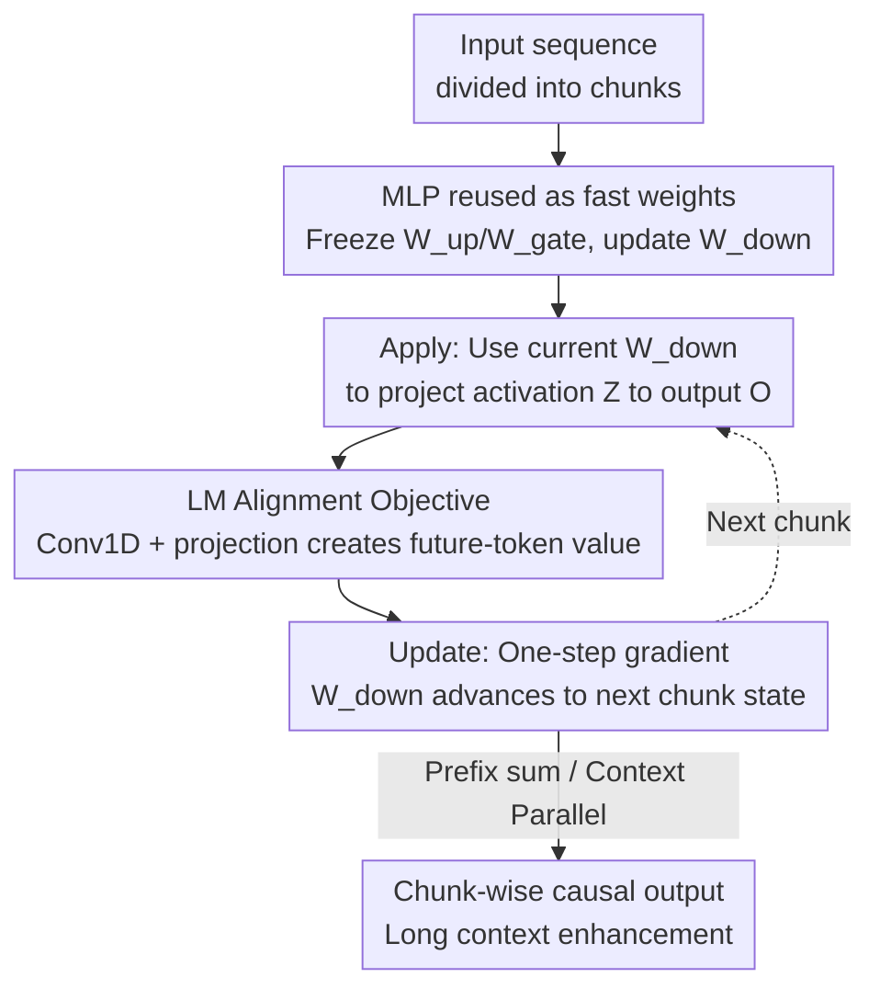

# In-Place Test-Time Training

**Conference**: ICLR 2026  
**OpenReview**: [https://openreview.net/forum?id=dTWfCLSoyl](https://openreview.net/forum?id=dTWfCLSoyl)  
**Code**: None  
**Area**: LLM Efficiency / Long Context / Test-Time Training  
**Keywords**: Test-Time Training, Fast Weights, Long Context, MLP Reuse, Next-Token Alignment Objective

## TL;DR
This paper treats the down-projection matrix $W_{down}$ of the MLP block in Transformers as "fast weights" that can be updated during inference. By combining an alignment objective for Next-Token Prediction with a chunk-based update mechanism, existing pre-trained LLMs can achieve "plug-and-play" Test-Time Training (TTT) capabilities without changing the architecture or training from scratch. This approach consistently outperforms the original models and competitors like GLA / DeltaNet / LaCT on long contexts ranging from 128k to 256k.

## Background & Motivation
**Background**: Current LLMs follow a static "train-then-deploy" paradigm—weights are frozen after being trained on massive corpora and remain unchanged during inference. To enable models to handle ultra-long and evolving tasks, two main paths exist: first, in-context learning, which fits all historical tokens into the context window but is limited by the quadratic complexity of attention; second, Test-Time Training (TTT), which introduces a small set of "fast weights" that undergo gradient descent updates for each new input during inference, effectively compressing context information into this dynamic memory online.

**Limitations of Prior Work**: While TTT is conceptually elegant, it faces three hurdles in the LLM ecosystem. First, **Architectural Incompatibility**: Existing TTT methods typically replace attention with specialized recurrent layers. These randomly initialized new layers conflict with billions of pre-trained parameters, making training from scratch almost mandatory—a cost prohibitive for large models. Second, **Computational Inefficiency**: Classical TTT relies on token-by-token serial updates, which severely wastes the parallel processing power of GPUs/TPUs; even with chunked acceleration, TTT as the primary token mixer is forced to use small chunks to maintain performance, still failing to saturate modern accelerators. Third, **Objective Mismatch**: TTT commonly uses a generic reconstruction objective to associate $(k,v)$ of the same token, essentially "remembering the current token," which is not aligned with the true goal of language modeling—"predicting the next token."

**Key Challenge**: The "ambition" of TTT to replace attention is the very root of its difficulty in deployment—once positioned as the core token mixer replacing attention, it inherits the triple burden of training from scratch, strict token-wise causality, and small chunk sizes.

**Goal**: To equip existing LLMs with TTT capabilities without modifying attention or training from scratch, while simultaneously solving efficiency and objective alignment issues.

**Key Insight**: The authors observe that there are no constraints on the choice of fast weights; any parameter can serve as a fast weight. Since MLP blocks in Transformers can be viewed as key-value memories storing "slow weight" general knowledge from pre-training, the same MLP can naturally "moonlight" as fast weights to dynamically absorb context during inference.

**Core Idea**: Update the MLP's down-projection matrix in-place as fast weights using an NTP-aligned objective and large-chunk parallel updates, transforming TTT from a "destructive reconstruction" into a lightweight, plug-and-play enhancement.

## Method

### Overall Architecture
The core idea of In-Place TTT is as follows: **do not add new layers or replace attention**, but instead repurpose the ubiquitous gated MLP in each Transformer block for dual use. Its input projections $W_{up}$ and $W_{gate}$ remain frozen as slow weights for general knowledge, while the down-projection $W_{down}$ is released as fast weights to be updated in-place during inference across context chunks. The data flow follows a strictly causal "apply-then-update" loop: the sequence is divided into chunks. For each chunk, the **current** fast weights are first used to project intermediate activations into outputs (Apply). Then, using the activations of this chunk as keys and a target containing **future token information** as values, a single step of gradient descent updates the fast weights to the next state for the subsequent chunk (Update). The attention layer remains completely unchanged, making the TTT module **complementary** to attention rather than a replacement—the fundamental reason it can utilize large chunks and achieve plug-and-play compatibility.

### Key Designs

**1. In-place reuse of MLP down-projection matrix as fast weights: TTT without architectural changes**

To address the hurdle of "architectural incompatibility and the need for training from scratch," the authors refuse to create another randomly initialized specialized TTT layer. Instead, they directly reuse the existing gated MLP. The output of a gated MLP is $O = \big(\phi(HW_{gate}^\top) \odot (HW_{up}^\top)\big)W_{down}^\top$. In this work, $W_{up}$ and $W_{gate}$ are treated as frozen slow weights (maintaining pre-trained knowledge), while only the final down-projection $W_{down}$ is treated as fast weights updated in-place during inference. This is feasible because there are no formal restrictions on which parameters can be fast weights, and MLPs have been argued to be a form of key-value memory; letting them double as dynamic memory is a natural extension. The benefit is total "drop-in" compatibility: the model structure and pre-trained weights remain intact, and TTT can be added to existing LLMs through relatively inexpensive continued training, avoiding the astronomical costs of pre-training from scratch.

**2. Large-chunk updates: Moving beyond token-by-token processing to saturate accelerators**

To address the "token-by-token serial efficiency" hurdle, this work replaces token-wise updates with chunk-wise updates. Intermediate activations $Z = \phi(HW_{gate}^\top)\odot(HW_{up}^\top)$ and corresponding value/output targets are divided into non-overlapping chunks of size $C$. For each chunk, the model first performs an Apply step ($O_{[i]} = Z_{[i]}(W_{down}^{(i)})^\top$) and then an Update step (a single gradient step to update $W_{down}^{(i)}$ to $W_{down}^{(i+1)}$). Crucially, because only the MLP is updated and the attention layer remains untouched, TTT no longer carries the burden of "strict token-wise causality" and "small chunks for performance"—attention already handles fine-grained token mixing, while TTT provides complementary context compression. Consequently, large chunks (e.g., 512–1024) can be safely processed in parallel, maximizing throughput. Ablations confirm that the method is naturally suited for large chunks, with optimal performance at $C \in [512, 1024]$.

**3. LM alignment objective: Storing "useful for next-token prediction" information in fast weights**

To address the "mismatch between reconstruction and language modeling," this work replaces the value target of "the current token itself" with a target "containing future token information." Specifically, the target is defined as $\hat{V} = \mathrm{Conv1D}(X_0)W_{target}$, where $X_0$ is the token embedding. The 1D convolution aggregates information from proximal future tokens according to learnable weights, and $W_{target}$ is a trainable projection. If the convolution kernel only selects the next token and $W_{target}$ is an identity matrix, it reduces to a standard Next-Token target. Generally, it learns a **combination of local future tokens**, consistent with the Multi-Token Prediction approach in advanced LLMs. The simple similarity loss $L(\cdot,\cdot) = -\langle\cdot,\cdot\rangle_F$ is used, resulting in a clean closed-form update for chunk-based fast weights: $W_{down}^{(i)} = W_{down}^{(i-1)} + \eta\,\hat{V}_{[i]}^\top Z_{[i]}$. The authors provide a theoretical guarantee (Theorem 1) under an induction head setting: after one update step using the LM alignment target, the expected logit for the correct next token $v^*$ **increases** (bounded by $\lambda_{lr}c_{norm}^2 c_{align}$), while other tokens remain mostly unchanged. Meanwhile, the logit improvement for the correct token using a reconstruction target is negligible, intuitively showing that the alignment objective truly compresses "predictively useful" information into the fast weights.

**4. Context-Parallel causal implementation: Strict serial equivalence under parallel scan**

To maintain speed on long sequences without violating causality, the update rule is adapted for Context Parallelism. Since the update $\Delta W_{down}^{(i)} = \hat{V}_{[i]}^\top Z_{[i]}$ satisfies the associative property, it can be parallelized in three steps: (i) all chunks compute their respective activations and increments in parallel; (ii) a prefix sum (parallel scan) is performed over the increment sequence to obtain the cumulative update $\Delta S_i$ for each chunk; (iii) each chunk's output is computed in parallel using $W_{down}^{(i-1)} = W_{down}^{(0)} + \eta\Delta S_i$. Combined with causal padding for the 1D convolution (ensuring a chunk's increment does not contain its own future information) and resetting fast weights to the pre-trained state at document boundaries (to prevent cross-sequence leakage), this parallel scan is mathematically **strictly equivalent** to step-by-step serial updates. The result is a CP-native, fully causal module that can directly replace standard MLP blocks.

### Loss & Training
The inner objective for fast weights is the similarity loss $L = -\langle\cdot,\cdot\rangle_F$, corresponding to the update formula $W_{down}^{(i)} = W_{down}^{(i-1)} + \eta\hat{V}_{[i]}^\top Z_{[i]}$. For outer training: the drop-in experiments involve two stages of continued training on Qwen3-4B-Base (first $\sim$20B tokens at 32k context, then $\sim$15B tokens at 128k context) with YaRN to extend RoPE. From-scratch experiments were conducted on 32k context (500M/1.5B models) or 8k context at 120B tokens (4B model).

## Key Experimental Results

### Main Results
Using In-Place TTT as a drop-in for Qwen3-4B-Base, the performance advantage on the RULER long-context benchmark increases as the context length grows, with successful extrapolation to 256k:

| Context | Baseline | In-Place TTT | Gain |
|---------|----------|--------------|------|
| 16k | 92.1 | 92.7 | +0.6 |
| 32k | 88.7 | 89.3 | +0.6 |
| 64k | 74.3 | 78.7 | +4.4 |
| 128k | 74.8 | 77.0 | +2.2 |
| 256k (extrapolated) | 41.7 | 43.9 | +2.2 |

The method is also effective across model families (RULER, with gains most significant at 64k):

| Model | Method | 32k | 64k |
|-------|--------|-----|-----|
| LLaMA-3.1-8B | Baseline | 91.1 | 81.6 |
| LLaMA-3.1-8B | In-Place TTT | 91.7 | **83.7 (+2.1)** |
| Qwen3-14B | Baseline | 90.7 | 67.9 |
| Qwen3-14B | In-Place TTT | 91.2 | **70.6 (+2.7)** |

From-scratch training comparison (4B, Commonsense Reasoning + Long Context): In-Place TTT shows comprehensive improvements under both Full Attention and SWA backbones, with particularly large gains in long context:

| Architecture | Config | MMLU | RULER-8k | RULER-16k |
|--------------|--------|------|----------|-----------|
| Full Attn. | Baseline | 36.43 | 38.09 | 6.58 |
| Full Attn. | In-Place TTT | **37.42** | **43.82** | **19.99** |
| SWA | Baseline | 36.06 | 9.91 | 5.07 |
| SWA | In-Place TTT | 36.48 | **26.80** | **7.57** |

At 500M and 1.5B scales, the Sliding Window Perplexity of In-Place TTT remains lower than all competitors (SWA / GLA / DeltaNet / LaCT) across 2k~32k, and perplexity continues to decrease as context extends.

### Ablation Study
| Config | Key Metric | Description |
|--------|------------|-------------|
| State size 4× vs 1× vs 0.5× | RULER ↑ | Larger state leads to better performance |
| Chunk size C=256/512/1024/2048 | 512~1024 Optimal | Both too small and too large drop, showing a trade-off |
| w/ Conv, Proj (Full) | Best | Full version of LM alignment objective |
| w/o Conv | Drop | Removing convolution (future token aggregation) |
| w/o Proj | Drop | Removing trainable projection $W_{target}$ |
| w/o Conv, Proj (Reduced to Reconstruction) | Worst | Reverting to generic reconstruction objective |

### Key Findings
- **Both convolution and projection are essential** in the LM alignment objective: long-context scores drop significantly when both are removed (reverting to reconstruction), confirming that "objective alignment" rather than just "having an objective" is crucial.
- **Large chunks are not just viable but optimal** (512~1024). This is the opposite of traditional TTT, where small chunks are required for performance; the root cause is that attention handles fine-grained mixing while TTT provides complementary compression.
- **Gains scale monotonically with context length**: performance is nearly identical on short contexts, with significant gaps opening at 64k/128k, indicating that it truly improves long-range context utilization rather than short-text ability.

## Highlights & Insights
- **Taking the "no constraints on fast weights" insight to the extreme**: Since any parameter can be a fast weight, don't build new layers—just commandeer the pre-trained MLP down-projection. This one move bypasses both architectural incompatibility and the cost of training from scratch, providing a beautiful "free lunch" insight.
- **Attributing the roots of efficiency shackles to "positioning"**: The authors point out that TTT's inefficiency isn't inherent to the algorithm but stems from the ambition to "replace attention," which imposes constraints like token-wise processing and small chunks. By switching to "complementary to attention," large-chunk parallelism becomes straightforward. This reframing is transferable to other works seeking to replace core components.
- **Theoretical backing for objective alignment**: Providing a lower bound for monotonic logit increases using induction heads elevates the "reconstruction vs. NTP alignment" debate from empirical intuition to something provable, naturally transitioning to Multi-Token Prediction in practice.

## Limitations & Future Work
- The paper primarily uses language modeling/perplexity and RULER as proxies for "long-range evolving tasks." **Real-world continual learning / streaming experience learning scenarios** were not directly evaluated, leaving a gap before the vision of "learning from an unbounded experience stream like a human" is realized.
- The loss function and optimizer only used the simplest similarity + one-step gradient. The authors admit the core framework is **orthogonal** to specific losses/optimizers; stronger inner optimizers (e.g., with momentum or more complex memory parameterization) are left for future work, meaning the current version might not fully exploit potential performance.
- Fast weights are only applied to the MLP down-projection; whether they should be expanded to more matrices/layers and how to balance state size vs. computational cost remains an open question (ablations show larger states are better, but cost boundaries are not fully discussed).
- Drop-in still requires $\sim$35B tokens of continued training, so it is not truly "zero-cost" plug-and-play.

## Related Work & Insights
- **vs. Classic TTT (Sun et al. 2020/2024)**: Classic TTT uses specialized layers to replace attention, token-wise updates, and reconstruction objectives; this work reuses MLPs, keeps attention, uses large-chunk parallelism, and aligns with NTP—reversing all three points to gain plug-and-play capability and high throughput.
- **vs. LaCT (Large Chunk TTT)**: Both utilize large chunks; however, LaCT still functions as an independent TTT layer built on SWA. This work reuses MLPs in-place and achieves lower perplexity under the same SWA backbone.
- **vs. Linear Attention (GLA / DeltaNet)**: These are sub-quadratic attention replacements for token mixing. This work does not replace attention but adds online updates to standard Transformer MLPs, achieving superior perplexity at 500M/1.5B scales.
- **vs. YaRN / RoPE Extrapolation**: YaRN modifies positional encodings, while this work modifies weight dynamics. The two are orthogonal and stackable (gains were still observed with 64k+YaRN in experiments).

## Rating
- Novelty: ⭐⭐⭐⭐⭐ The combination of "reusing MLP down-projection as fast weights" + "NTP alignment objective" is a clean and rare pairing that transforms TTT from a structural overhaul into a plug-and-play enhancement.
- Experimental Thoroughness: ⭐⭐⭐⭐ Drop-in (three models 4B~14B) + from-scratch (500M~4B) + extensive ablations, though lacking real-world continual learning scenarios and larger-scale validation.
- Writing Quality: ⭐⭐⭐⭐⭐ The logical chain from three hurdles → three design choices → theoretical guarantees is very clear; the desiderata framework is especially readable.
- Value: ⭐⭐⭐⭐⭐ Enables existing LLMs to acquire long-context/online adaptation capabilities at low cost, making it highly practical for deployment and pointing towards the major direction of continual learning in LLMs.

<!-- RELATED:START -->

## Related Papers

- [\[ICLR 2026\] Test-Time Training Done Right](test-time_training_done_right.md)
- [\[ICLR 2026\] Let's (not) just put things in Context: Test-time Training for Long-context LLMs](lets_not_just_put_things_in_context_test-time_training_for_long-context_llms.md)
- [\[ICLR 2026\] MesaNet: Sequence Modeling by Locally Optimal Test-Time Training](mesanet_sequence_modeling_by_locally_optimal_test-time_training.md)
- [\[ICLR 2026\] Guided Speculative Inference for Efficient Test-Time Alignment of LLMs](guided_speculative_inference_for_efficient_test-time_alignment_of_llms.md)
- [\[ICLR 2026\] RACE Attention: A Strictly Linear-Time Attention Layer for Training on Outrageously Large Contexts](race_attention_a_strictly_linear-time_attention_layer_for_training_on_outrageous.md)

<!-- RELATED:END -->
