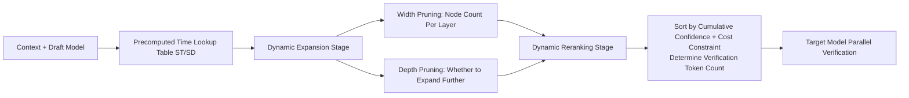

# Inference-Cost-Aware Dynamic Tree Construction for Efficient Inference in Large Language Models

**Conference**: ICLR 2026  
**OpenReview**: [https://openreview.net/forum?id=iaWyRYthFf](https://openreview.net/forum?id=iaWyRYthFf)  
**Code**: [https://github.com/EAGLE-Research/sglang-eagle4](https://github.com/EAGLE-Research/sglang-eagle4)  
**Area**: LLM Efficient Inference / Speculative Decoding  
**Keywords**: Speculative Decoding, Dynamic Draft Tree, Inference-Cost-Aware, EAGLE, Batch Acceleration  

## TL;DR
CAST introduces the overlooked system variable of "inference cost" (GPU model, batch size) into the dynamic draft tree construction of EAGLE-2/3. By modeling tree width, depth, and the number of verification tokens as a utility maximization problem of "acceptance gain vs. inference cost," it achieves slight improvements in single-sample scenarios and significant gains in batch scenarios over existing SOTA, reaching up to 5.2× acceleration.

## Background & Motivation
**Background**: Speculative decoding accelerates LLM inference without losing output distribution quality through "lightweight draft model proposal + large target model parallel verification." The EAGLE series upgraded chain drafts to tree drafts, and EAGLE-2/3 further utilized confidence scores to dynamically build draft trees, selecting top-K and reranking top-m tokens for verification, representing the current SOTA.

**Limitations of Prior Work**: The tree construction rules in EAGLE-2/3 are purely heuristic, focusing only on "token acceptance rate" while **completely ignoring two key system variables: GPU hardware and batch size**. The implicit assumption is "the more draft tokens, the better," which only holds when batch size=1 and GPU utilization is unsaturated.

**Key Challenge**: When batching is enabled, GPU utilization is already high. Blindly increasing the depth and width of the draft tree causes competition for GPU resources between the draft and verification stages, **actually slowing down the overall speed**. In empirical tests, EAGLE-2 dropped to 0.84× on CNN/DM with batch=8 (slower than original autoregressive inference). Thus, "more tokens ≠ faster speed"; there exists a critical point beyond which returns become negative.

**Goal**: Explicitly incorporate "inference cost" into draft tree construction to dynamically determine tree depth, tokens per layer, and the final number of tokens for verification, ensuring robust acceleration across different GPUs and batch sizes.

**Key Insight**: **[Cost-Aware Utility Maximization]** Borrowing from economic utility theory, where utility functions are concave and marginal utility diminishes. Taking "cumulative confidence of accepted tokens" as utility $u$ and "normalized draft inference time relative to the target" as cost $c$, only nodes where the **marginal utility $\frac{u_k-u_{k_0}}{c_k-c_{k_0}}$ exceeds a threshold** are retained. EAGLE-2/3 then becomes a special case of this method under specific parameters.

## Method

### Overall Architecture
CAST (Cost-Aware Speculative Tree) does not retrain any models. Instead, it reformulates the two stages of EAGLE-2/3 draft tree construction—**expansion** and **reranking**—as "cost-aware utility maximization." It utilizes an offline precomputed inference time lookup table $f(B,c,n)$ (batch, context length, sequence length → time). During tree construction, the "cost of generating more tokens" is calculated in real-time to balance against the "acceptance gain."

### Key Designs

**1. Precomputed Inference Cost Table: Quantifying Hardware Overhead**  
The foundation of the method is measuring the "inference time $f(B,c,n)$ for input length $n$, context $c$, and batch $B$" offline. To save storage, samples are taken at grid points $c=kL, n=1{\cdots}N$, and a quantization operator $\text{select}(c)=(\max(\lfloor c/L\rfloor, M-1)+1)L$ maps any context length to the nearest grid. Target model tables $S_T(B)$ and draft model tables $S_D(B)$ are maintained for each batch size. During construction, an $O(1)$ lookup provides the "actual time cost for calculating $k$ additional tokens."

**2. Dynamic Expansion - Width Pruning: Using Marginal Utility for Layer Selection**  
For the $i$-th layer, candidate nodes are sorted by confidence as $v_i^{(j)}(s)$ ($j$ is the sample within the batch). The average cumulative utility for the top $k$ nodes is:
$$u_k^{(i)}=\frac{1}{B}\sum_{j=1}^{B}\sum_{s=1}^{k}v_i^{(j)}(s).$$
The corresponding normalized cost is calculated via the lookup table: $c_k^{(i)}=\frac{S_D(B)[\text{select}(\sum_{j<i}n_j)][k]}{S_T(B)[\text{select}(\sum_{j<i}n_j)][1]}$. Given that marginal utility diminishes, a threshold $C_1$ is set, retaining $n_i$ nodes where the **marginal utility $\frac{u_k-u_{k'}}{c_k-c_{k'}}>C_1$**. Theorem 4.1 proves that when $c_j=\lambda j+\delta$ and $C_1=\frac{\sum_j v_i^{(j)}(K)}{B\lambda}$, the fixed top-K selection of EAGLE-2/3 is a special case.

**3. Dynamic Expansion - Depth Pruning: Using Predicted Gain to Decide Layer Expansion**  
After determining width, the system decides **whether to generate the $(i+1)$-th layer**. A sliding buffer $A_i$ tracks the "confidence gain ratio" $\phi_i=\frac{u_{n_{i+1}}^{(i+1)}}{u_{n_i}^{(i)}}$ over the last $R$ layers, denoted as $\alpha_i=\text{Avg}(A_i)$. Expansion continues only when:
$$\alpha_i\cdot\frac{u_{n_i}^{(i)}}{c_{n_i}^{(i)}}\ge C_2$$
This ensures the tree depth adapts to context difficulty and hardware cost.

**4. Dynamic Reranking: Determining Verification Token Count Under Cost Constraints**  
After expansion, the draft tree may have too many nodes. Empirically, the **accept length is approximately linearly correlated with the cumulative confidence $v$** (Figure 3). Algorithm 1 is reused: setting $u_k=\sum_{j=1}^{k}v_{(j)}$, $c_k=\frac{S_T(B)[\text{select}(n_0)][k]}{S_T(B)[\text{select}(n_0)][1]}$, and threshold $C_3$ to select the number of tokens $m$ for verification. Speedup actually **decreases** if $m$ is too large (Figure 4), so the authors focus on measured speedup rather than average acceptance length.

## Key Experimental Results

### Main Results (batch size = 1, speedup ratio, T=0)

| Model | Method | MT-bench | HumanEval | GSM8K | Alpaca | CNN/DM | NatQ |
|------|------|----------|-----------|-------|--------|--------|------|
| V 13B | EAGLE-3 | 3.70× | 4.73× | 4.00× | 3.86× | 3.68× | 3.31× |
| V 13B | **Ours** | **3.98×** | **5.18×** | 3.98× | 3.80× | **3.76×** | **3.40×** |
| L33 70B | EAGLE-3 | 4.13× | 4.98× | 4.63× | 4.66× | 3.50× | 3.61× |
| L33 70B | **Ours** | **4.23×** | **5.23×** | **4.65×** | **4.83×** | **3.56×** | **3.67×** |
| L31 8B | EAGLE-3 | 3.60× | 4.27× | 3.82× | 4.00× | 3.22× | 3.06× |
| L31 8B | **Ours** | **3.77×** | **4.51×** | **3.95×** | 3.98× | **3.32×** | **3.22×** |

Ours generally leads EAGLE-3 slightly at $BS=1$, with the advantage becoming more pronounced as the target model size increases, reaching 5.23× on HumanEval.

### Batch Inference Results (batch size = 8, speedup ratio, T=0)

| Model | Method | MT-Bench | HumanEval | GSM8K | Alpaca | CNN/DM | NatQ |
|------|------|----------|-----------|-------|--------|--------|------|
| Q2 7B | EAGLE-2 | 1.25× | 1.49× | 1.40× | 1.48× | 1.11× | 1.10× |
| Q2 7B | **Ours** | **1.86×** | **2.16×** | **2.19×** | **2.06×** | **1.70×** | **1.72×** |
| L31 8B | EAGLE-3 | 1.72× | 1.97× | 1.92× | 2.16× | 1.34× | 1.72× |
| L31 8B | **Ours** | **2.16×** | **2.62×** | **2.41×** | **2.62×** | **1.76×** | **2.11×** |

Batch processing is the primary advantage for Ours: While EAGLE-2 drops to 1.11× on Q2 7B / CNN/DM, Ours remains stable at 1.7–2.6×, with a relative Gain often reaching 40–60%.

### Key Findings
- **"More tokens ≠ faster" is empirically validated**: When $m$ increases, accept length rises monotonically, but speedup declines after a critical point. Cost-awareness finds this point.
- **Larger batches and models lead to more significant cost-aware gains**, as GPU resource contention is most severe.
- Entirely lossless: No fine-tuning or modification of acceptance conditions; output distribution matches the target model.

## Highlights & Insights
- **Integrating system cost into algorithmic construction**: Quantifying hardware variables (GPU, batch size) via lookup tables to drive tree structure decisions.
- **Unified framework via utility theory**: The perspective of concave utility and diminishing returns provides a rigorous proof that EAGLE-2/3 are special cases.
- **Metric reflection**: Explicitly avoids "average acceptance length" in favor of actual speedup for system-level evaluation.
- **Plug-and-play**: Compatible with EAGLE-2/3 and integrated into SGLang.

## Limitations & Future Work
- **Dependency on offline lookup tables**: $f(B,c,n)$ must be calibrated for each GPU type and batch size.
- **Threshold tuning**: While theoretically grounded, automatically determining optimal thresholds $C_1, C_2, C_3$ across tasks remains an open problem.
- **Linearity assumption**: The reranking relies on the linear relationship between accept length and cumulative confidence, which may not hold at extreme temperatures.
- **Continuous batching**: Experiments assume uniform length within batches via padding; real-world dynamic batching needs further study.

## Related Work & Insights
- **EAGLE / EAGLE-2 / EAGLE-3** (Li et al. 2024b/2024c/2025): Direct foundations for this work.
- **Speculative Decoding Origins** (Leviathan et al. 2023; Chen et al. 2023): Core proposal/verification and residual fallback mechanisms.
- **Batching x Speculative Decoding** (Su et al. 2023; Qian et al. 2024): This work fills the gap in "tree-based draft + batching."
- **Insight**: Optimization is shifting from "pure algorithmic acceptance rate" to "algorithm x hardware co-design."

## Rating
- **Novelty**: ⭐⭐⭐⭐ — Quantifies ignored hardware costs within a utility-theoretic framework.
- **Experimental Thoroughness**: ⭐⭐⭐⭐ — Comprehensive across tasks and models, particularly convincing in batch scenarios.
- **Writing Quality**: ⭐⭐⭐⭐ — Clear logical flow and robust discussion of metrics.
- **Value**: ⭐⭐⭐⭐ — Lossless, plug-and-play, and practical for batch inference services.

<!-- RELATED:START -->

## Related Papers

- [\[ICLR 2026\] PARD: Accelerating LLM Inference with Low-Cost Parallel Draft Model Adaptation](pard_accelerating_llm_inference_with_lowcost_parallel_draft_model_adaptation.md)
- [\[ICLR 2026\] DND: Boosting Large Language Models with Dynamic Nested Depth](dnd_boosting_large_language_models_with_dynamic_nested_depth.md)
- [\[ICLR 2026\] FlashDLM: Accelerating Diffusion Language Model Inference via Efficient KV Caching and Guided Diffusion](flashdlm_accelerating_diffusion_language_model_inference_via_efficient_kv_cachin.md)
- [\[ICLR 2026\] Neuron-Aware Data Selection in Instruction Tuning for Large Language Models](neuron-aware_data_selection_in_instruction_tuning_for_large_language_models.md)
- [\[ICLR 2026\] Reasoning Language Model Inference Serving Unveiled: An Empirical Study](reasoning_language_model_inference_serving_unveiled_an_empirical_study.md)

<!-- RELATED:END -->
