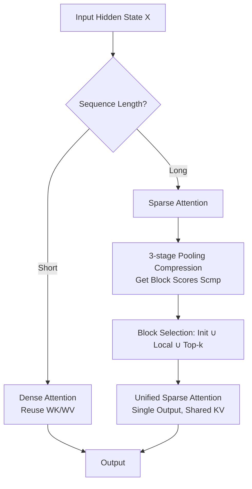

# InfLLM-V2: Dense-Sparse Switchable Attention for Seamless Short-to-Long Adaptation

**Conference**: ICLR 2026  
**OpenReview**: [https://openreview.net/forum?id=ZzF9V0H6Vi](https://openreview.net/forum?id=ZzF9V0H6Vi)  
**Code**: [https://github.com/OpenBMB/infllmv2_cuda_impl](https://github.com/OpenBMB/infllmv2_cuda_impl)  
**Area**: Efficient LLM Inference / Trainable Sparse Attention / Long Context  
**Keywords**: Trainable Sparse Attention, Long Context, Short-to-Long Adaptation, Block-Sparse Attention, GQA, FlashAttention, MiniCPM4.1  

## TL;DR
InfLLM-V2 utilizes a trainable sparse attention with "zero extra parameters and reused dense attention weights," allowing the model to switch seamlessly between dense and sparse modes based on sequence length. This aligns with the "short pre-training → long fine-tuning" paradigm and is implemented via hardware-friendly block selection, achieving 4× speedup over dense attention while retaining 98.1% / 99.7% of performance in long-context understanding and reasoning.

## Background & Motivation
**Background**: Long sequence processing is a fundamental requirement for modern LLMs (deep research, long-memory dialogue, code repository understanding, long-chain reasoning). However, standard Transformer self-attention faces severe computational and memory bottlenecks on long sequences. Sparse attention is a recognized solution, where **trainable sparse attention** (incorporating sparsity into the training phase) can achieve higher sparsity without performance degradation compared to training-free methods, with NSA being a representative work.

**Limitations of Prior Work**: To accelerate both prefill and decode, NSA designs three attention modules: Compressed / Selected / Sliding, introducing **three independent sets of KV projection parameters + a gating MLP**. This complex architecture is **poorly matched** with the mainstream "short pre-training, long fine-tuning" workflow: (1) Switching from single-output dense attention to multi-output sparse architecture erases learned capabilities, causing severe loss jittering and slow convergence during long-context fine-tuning. (2) The extra sets of KV and gating are forced to compute even for short sequences, slowing them down. (3) Extra parameters cannot be initialized with pre-trained weights, making it difficult to smoothly transform dense models.

**Key Challenge**: Sparse attention strives for long-sequence efficiency, but its architectural changes break short-sequence performance and the smoothness of short-to-long adaptation—**the efficiency gains from sparsity are offset by architectural mismatch and block selection overhead**.

**Goal**: Design a sparse attention mechanism that is efficient for both long and short sequences, enables seamless transition from dense models, and introduces no extra parameters.

**Core Idea**: **[Parameter Reuse]** Eliminate NSA's three sets of KV and gating, using **a single shared KV projection** (directly reusing pre-trained dense weights) to support both sparse and dense modes. **[Mode Switching]** Assign mode selection to sequence length—short sequences use dense, while long sequences smoothly switch to sparse, aligning the computational flow of both. **[Hardware Implementation]** Fuse the bottlenecked block selection (compression score computation) into the FlashAttention SRAM calculation loop to eliminate I/O bottlenecks.

## Method

### Overall Architecture
InfLLM-V2 is built upon the training-free block-sparse method InfLLM. Its core is simplifying NSA's multi-output architecture into a **single-output, zero-extra-parameter, length-switchable** unified attention. It reuses $W_K, W_V$ from dense attention as the only set of KV projections; merges Selected Attention and Sliding Attention into a unified Sparse Attention; discards the output of Compressed Attention, keeping only its attention scores for block selection; uses a non-parametric multi-stage pooling for block representation; and employs a Fused Head Group Summation CUDA kernel to minimize block selection overhead.

### Key Designs

**1. Shared KV Projection: Aligning Dense and Sparse with One Set of Parameters.** InfLLM-V2 identifies that NSA's three sets of KV projections are unnecessary—they complicate short-to-long adaptation and slow down short sequences. Thus, it retains only one set of $W_K, W_V$, initialized directly from pre-trained dense attention weights and fine-tuned on long sequences. This ensures sparse and dense attention inherently share the same K and V representations. Switching from dense to sparse becomes an "attention mask change" rather than an "architecture change," minimizing loss jittering. Training curves (Fig. 5) show NSA has a significant loss cliff during switching, while InfLLM-V2 remains close to FullAttn.

**2. Aligned Computation + Single Output: Merging Three Modules into One.** Beyond sharing parameters, the computational flow must also align with dense attention. NSA's three modules produce separate outputs for gated aggregation, forcing full computation even for short sequences. InfLLM-V2 takes the union of Selected and Sliding Attention and **completely removes the Compressed Attention output**, keeping only its score $S^{cmp}$ for block selection. For a query token $i$ (in block $b_i$), it consistently attends to initial blocks $I_{init}$ and local blocks $I_{local}(i)$, then selects top-k from remaining blocks based on $S^{cmp}$:

$$I(i) = I_{init} \cup I_{local}(i) \cup I_{topk}(i)$$

Since Selected local blocks and Sliding windows naturally overlap, expanding local blocks to $N_{local} \geq \lceil w/B \rceil + 1$ strictly covers the sliding window, merging the two. This results in a **single-output** sparse module with the same shape as dense attention, allowing the model to switch modes dynamically based on input length.

**3. 3-Stage Non-Pharametric Compression: Coarse-to-Fine Block Scoring.** After removing the Compressed Attention output, the MLP previously used for compression loses its gradient path, so it is replaced with non-parametric pooling. Since single-step compression of large block $B$ loses fine-grained information, the paper adopts a 3-stage, coarse-to-fine approach: first, use stride $s_{C1}$ and block length $l_{C1}$ for mean-pooling to get coarse representation $K^{C1}$ and scores $S^{C1} = \mathrm{Softmax}(Q(K^{C1})^\top)$; then sum across all heads within a GQA head group to get shared importance $S^{shared} = \sum_{h=1}^{G} S^{C1}(h)$, forcing all heads in a group to select the same blocks; finally, use max-pooling to extract the most significant features $S^{cmp}_i = \mathrm{Max}(S^{shared}_{i \cdot s : i \cdot s + l})$. Setting $l_{C1} = B/2, s_{C1} = B/4, l=5, s=4$ preserves finer intra-block information under equivalent compression ratios.

**4. Fused Head Group Summation + LSE Approximation: Breaking the Block Selection I/O Wall.** Even with sparse attention, calculating $S^{cmp}$ itself becomes a new bottleneck: writing the first-stage scores $S^{C1}$ (size $h_q n^2 / s_{C1}$) back to HBM is extremely expensive. Inspired by FlashAttention, the paper fuses "head group summation" directly into the FlashAttention SRAM calculation loop, writing only the dimension-reduced $S^{shared}$ (size $h_q n^2 / (s_{C1}G)$) back to HBM. However, head group summation and online-softmax on the sequence dimension are not commutative, so a two-pass approach is used: the first pass calculates the log-sum-exp required for softmax normalization in SRAM; the second pass uses it to compute final scores, sums them within the group, and writes back. To avoid doubling the computation, **LSE Approximation** is added—using a coarser $S^{C2}$ ($s_{C2}=4s_{C1}, l_{C2}=4l_{C1}$) to estimate LSE, reducing overhead from 2× to 1.25×.

## Key Experimental Results

Model: 8B GQA backbone ($d=4096, h_q=32, h_{kv}=2$), pre-trained on 8T tokens at 4k length, then fine-tuned on 5B tokens (mixed 1:1:1:1 for 0-4k / 4-12k / 12-24k / 24-32k).

### Main Results: Long Context Understanding

RULER (32k) per-task average (best among sparse methods in bold):

| Method | RULER Avg. | LongBench ↑ | LongPPL ↓ |
| :--- | :--- | :--- | :--- |
| FullAttn (Fine-tuned) | 84.26 | 42.30 | 2.06 |
| Short + YaRN | 40.63 | 37.86 | 5.28 |
| InfLLM (training-free) | 27.94 | 32.30 | 12.01 |
| MInference (training-free) | 73.22 | 41.55 | 2.62 |
| NSA | 59.92 | 37.10 | 4.24 |
| **InfLLM-V2 (Sparse, w/ LSE)** | **82.62** | **42.54** | **2.12** |
| InfLLM-V2 (Dense) | 88.32 | 42.49 | 2.00 |

While NSA has low training loss, its LongPPL is high (4.24), indicating it hasn't truly learned long-range dependencies. InfLLM-V2 (Sparse) significantly outperforms all sparse baselines and stays close to FullAttn; switching back to Dense mode even exceeds FullAttn's performance.

### Long Reasoning & General Tasks

| Method | Long Reasoning Avg. (MATH-500/AIME/LCB) | General Avg. (MMLU/HumanEval/BBH etc.) |
| :--- | :--- | :--- |
| FullAttn | 42.79 | 67.41 |
| NSA | 37.28 | 60.63 |
| InfLLM-V2 (Sparse) | 42.66 | — |
| InfLLM-V2 (Dense) | 40.53 | 66.76 |

After long-context fine-tuning, switching back to Dense mode shows almost no loss in short-sequence general tasks (66.76 vs FullAttn 67.41), whereas NSA drops to 60.63.

### Ablation Study

- **LSE Approximation is Lossless**: On RULER, w/ LSE (82.62) vs w/o LSE (82.09), performance slightly improves, so it is enabled by default.
- **Speed**: On A100 at seqlen=32k, InfLLM-V2 achieves ~4× speedup relative to dense attention. Short sequences can switch to dense without extra parameter overhead.

### Key Findings
1. NSA performs poorly under the "short training, long tuning" paradigm; its excessive extra parameters are the primary cause—this is precisely the pain point InfLLM-V2 addresses.
2. Zero extra parameters + shared KV allow short-to-long adaptation to surpass NSA with minimal fine-tuning.
3. "Switching dense/sparse by length" is not just a compute-saving option; the Dense mode sometimes even outperforms FullAttn.

## Highlights & Insights
- **"Subtractive" Innovation**: Compared to NSA's "additive" approach (three modules, three sets of parameters), InfLLM-V2 performs "subtraction" (merging modules, sharing parameters, removing redundant outputs), making it better aligned with mainstream training paradigms and easier to implement.
- **Value of Aligning Architecture and Workflow**: The paper explicitly points out that NSA's failure isn't in the algorithm itself, but in its mismatch with the "short pre-training, long tuning" workflow—an often overlooked yet practical perspective.
- **Truly Open Source and Reproducible**: Trained and released the MiniCPM4.1-8B hybrid reasoning model + CUDA kernel, rather than just publishing a paper.
- **Hardware-Software Co-design**: Fused Head Group Summation + LSE Approximation eliminates the "hidden tax" of block selection in sparse attention, marking a key step from "theoretical sparsity" to "actual speedup."

## Limitations & Future Work
- Max-pooling and top-k are not yet fused into the kernel; the authors leave this for future work, meaning block selection still has optimization room.
- Experiments were primarily validated on 32k length at 8B scale; performance on longer context (128k+) and larger scales remains to be tested.
- Hyperparameters for 3-stage compression ($l_{C1}, s_{C1}, l, s$ and LSE block size) are set empirically; robustness across different models/tasks is not fully explored.
- Dependency on GQA with a group size of 16 for block-sparse compatibility limits transferability to MHA or other attention variants.

## Related Work & Insights
- **Training-free Sparsity** (InfLLM, MInference, StreamingLLM): Relies on inherent attention sparsity for inference speedup, but sparsity levels and acceleration are limited—InfLLM-V2 is the trainable upgrade of InfLLM.
- **Trainable Sparsity** (NSA, MoBA, SeerAttention): Incorporates sparsity into training. MoBA/SeerAttention only accelerate prefill; NSA accelerates both but with high parameter overhead. InfLLM-V2 balances both with zero extra parameters.
- **Hardware-Friendly Attention** (FlashAttention): InfLLM-V2's Fused Head Group Summation directly borrows the SRAM/online-softmax insight.
- **Insight**: When embedding a new module into an existing training paradigm, the "alignment with existing weights/workflow" often determines success more than "module strength"; think about subtraction before addition.

## Rating
- **Novelty**: ⭐⭐⭐⭐ — Zero extra parameters + length-based dense/sparse switching is simple yet effective; the "alignment with workflow" perspective and subtractive simplification are insightful.
- **Experimental Thoroughness**: ⭐⭐⭐⭐ — Covers long understanding, long reasoning, and general benchmarks; includes training curves, ablations, and efficiency on A100/4090. Scalability to longer context/larger models is slightly lacking.
- **Writing Quality**: ⭐⭐⭐⭐ — Clear motivation, intuitive diagrams (Fig 1-4), and a progressive methodology from architecture to kernel implementation.
- **Value**: ⭐⭐⭐⭐⭐ — Releases MiniCPM4.1-8B + CUDA kernel with 4× lossless acceleration; high practical value for industrial long-context model deployment.

<!-- RELATED:START -->

## Related Papers

- [\[ICLR 2026\] Sparse Attention Adaptation for Long Reasoning](sparse_attention_adaptation_for_long_reasoning.md)
- [\[ICLR 2026\] Short Window Attention Enables Long-Term Memorization](short_window_attention_enables_long-term_memorization.md)
- [\[ICLR 2026\] FSA: An Alternative Efficient Implementation of Native Sparse Attention Kernel](fsa_an_alternative_efficient_implementation_of_native_sparse_attention_kernel.md)
- [\[ICLR 2026\] Tactic: Adaptive Sparse Attention with Clustering and Distribution Fitting for Long-Context LLMs](tactic_adaptive_sparse_attention_with_clustering_and_distribution_fitting_for_lo.md)
- [\[ICLR 2026\] SparseD: Sparse Attention for Diffusion Language Models](sparsed_sparse_attention_for_diffusion_language_models.md)

<!-- RELATED:END -->
