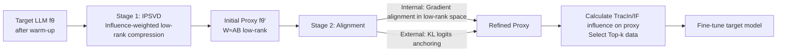

# Influence-Preserving Proxies for Gradient-Based Data Selection in LLM Fine-Tuning

**Conference**: ICLR 2026  
**OpenReview**: [https://openreview.net/forum?id=PDNpRLxDlI](https://openreview.net/forum?id=PDNpRLxDlI)  
**Code**: [https://github.com/csr16/IProX](https://github.com/csr16/IProX)  
**Area**: LLM Efficiency / Data Selection  
**Keywords**: Gradient Data Selection, Influence Function, TracIn, Proxy Models, Low-Rank Compression, SVD, Supervised Fine-Tuning  

## TL;DR
IPROX abandons off-the-shelf small models as proxies for gradient-based influence data selection. Instead, it "distills" a low-rank proxy that preserves influence information directly from the target LLM—combining influence-weighted SVD compression with gradient-alignment fine-tuning. This allows a smaller proxy to outperform larger off-the-shelf models in data selection tasks.

## Background & Motivation
**Background**: The performance of Supervised Fine-Tuning (SFT) is highly dependent on the choice of training data; blindly increasing data volume can harm downstream performance. Gradient-based data selection is a leading approach as it is "model-aware," estimating each sample's contribution to validation performance using gradients. Representative methods include TracIn (accumulating inner products of training and validation gradients along training trajectories) and Influence Function (using inverse Hessian scaling to approximate leave-one-out effects).

**Limitations of Prior Work**: Both methods incur extreme computational overhead, requiring either storage of numerous checkpoints for repeated backpropagation or expensive inverse Hessian-vector products. These costs scale drastically with model size, making them infeasible for LLMs with billions of parameters. A common compromise is using **off-the-shelf small models as proxies** (e.g., using Llama3-8B to select data for Llama3-70B). However, the paper identifies three major flaws: (1) Their learning dynamics are unclear, and proxy selection relies on the heuristic assumption that "large models behave like small ones"; (2) Fixed sizes within model families limit flexibility regarding computational budgets; (3) **There is no systematic way to align the proxy with the target model specifically for influence estimation.**

**Key Challenge**: A proxy must be small enough to save computation yet "similar" enough to the target model to select correct data—current off-the-shelf proxies are uncontrollable in both aspects.

**Goal**: Construct a size-adjustable proxy directly from the target model that **explicitly preserves the target model's gradient influence**, offloading influence computation to this cost-efficient surrogate.

**Core Idea**: **Rather than selecting a small model with hypothetical preferences, derive a small model from the target model itself to inherit its gradient characteristics.** The key insight is that standard SVD compression minimizes weight reconstruction error (Frobenius norm), which is misaligned with the "influence preservation" goal (experiments show that as compression sparsity increases, influence retention drops much faster than loss retention). Therefore, a compression method explicitly targeting **influence preservation** is required.

## Method

### Overall Architecture
IPROX is a two-stage framework: **Stage One** utilizes "Influence-Preserving SVD (IPSVD)" to perform layer-wise low-rank compression on the target model, resulting in an initial size-controllable proxy that retains influence information. **Stage Two** further refines this proxy through gradient alignment and logits anchoring to compensate for errors accumulated during layer-wise compression. Finally, this proxy is used to calculate influence scores and select Top-k data for fine-tuning the target model.

### Key Designs
**1. Influence-Preserving SVD (IPSVD): Re-weighting with second-order moments to align "influence" instead of "reconstruction error."** The issue lies in the standard SVD objective, which provides the optimal low-rank approximation under the Frobenius reconstruction error, failing to ensure influence preservation. The paper provides a theoretical foundation: the influence of a layer's weights $W_\ell$ can be written as $I_{W_\ell}(z,z')=\langle\delta_\ell(z),\delta_\ell(z')\rangle_F\,\langle h_{\ell-1}(z),h_{\ell-1}(z')\rangle_F$ (where $h_{\ell-1}$ is the layer input and $\delta_\ell$ is the upstream gradient). A small perturbation $E_\ell$ affects influence primarily through the local directional effect $e_\ell(z)\triangleq\delta_\ell(z)^\top E_\ell\, h_{\ell-1}(z)$. Proposition 4.1 proves that, under local smoothness assumptions, the expected change in influence is bounded by $\sqrt{\mathbb{E}_z[e_\ell(z)^2]}$. Thus, preserving influence translates to minimizing $\mathbb{E}_z[e_\ell(z)^2]$, which under K-FAC approximation is equivalent to a **weighted Frobenius norm**:

$$\min_{\widehat{W}_\ell}\ \big\|\,C_{\delta,\ell}^{1/2}(W_\ell-\widehat{W}_\ell)\,C_{h,\ell}^{1/2}\,\big\|_F^2$$

where $C_{h,\ell}=\mathbb{E}[h_{\ell-1}h_{\ell-1}^\top]$ and $C_{\delta,\ell}=\mathbb{E}[\delta_\ell\delta_\ell^\top]$ are the second-order moments of inputs and upstream gradients. These matrices act as **re-weighting** mechanisms—penalizing errors more heavily in directions where input magnitudes are large or loss sensitivity is high, thereby prioritizing weight components critical for influence. Practically, this is achieved by performing SVD on the re-weighted matrix $S_\ell=C_{\delta,\ell}^{1/2}W_\ell C_{h,\ell}^{1/2}$, truncating to top-$r_\ell$, and transforming back to the original space to obtain $\widehat{W}_\ell=A_\ell B_\ell$. The rank $r_\ell$ directly determines the proxy size.

**2. Bypassing large matrices with "Skinny SVD" for efficient compression.** Directly constructing and computing the square roots and inverses of $C_{h,\ell}$ and $C_{\delta,\ell}$ is prohibitively expensive for large models ($O(n_\ell^3+m_\ell^3)$). IPROX uses a small probe set of $N$ samples; a single forward and backward pass collects the input matrix $H_\ell\in\mathbb{R}^{n_\ell\times N}$ and gradient matrix $\Delta_\ell\in\mathbb{R}^{m_\ell\times N}$. By performing skinny SVD on these "tall and thin" matrices and constructing an SVD of a kernel matrix of size at most $N\times N$, the complexity is reduced to $O(N^3+n_\ell N^2+m_\ell N^2)$ (where $N\ll n_\ell,m_\ell$). This allows IPROX to construct proxies in minutes.

**3. Gradient alignment in low-rank space: Aligning influence without sacrificing efficiency.** While the initial proxy from Stage One satisfies the bounds of Proposition 4.1, layer-wise approximation errors accumulate. A naive approach would be reconstructing proxy gradients back to the high-dimensional weight space for comparison, but this would negate efficiency during influence estimation. IPROX instead **projects the target model's gradients down into the low-rank proxy space**. Since the proxy layer is $W_\ell\approx A_\ell B_\ell$, the chain rule is used to project $\nabla_{W_\ell}L$ onto $A_\ell$ and $B_\ell$ ($\nabla_{A_\ell}L=\nabla_{W_\ell}L\,B_\ell^\top$, $\nabla_{B_\ell}L=A_\ell^\top\nabla_{W_\ell}L$), resulting in the alignment loss:

$$\mathcal{L}_{GA}=\frac{1}{|L|}\sum_{\ell\in L}\Big(d\big(\nabla_{A_\ell}L,\ \mathrm{sg}(\nabla_{W_\ell}L)B_\ell^\top\big)+d\big(\nabla_{B_\ell}L,\ A_\ell^\top\mathrm{sg}(\nabla_{W_\ell}L)\big)\Big)$$

where $\mathrm{sg}(\cdot)$ denotes stop-gradient. Alignment is completed entirely within the proxy parameter space, ensuring influence calculations require no high-dimensional reconstruction.

**4. External logits anchoring to prevent proxy collapse.** Relying solely on gradient alignment might lead to proxy degradation. IPROX incorporates knowledge distillation, using forward KL divergence to anchor the proxy output distribution to the target (teacher) model: $\mathcal{L}_{KL}=\tau^2\frac{1}{|B|}\sum_z \mathrm{KL}(\mathrm{softmax}(f_\theta(z)/\tau)\,\|\,\mathrm{softmax}(f_{\theta'}(z)/\tau))$. The final Stage Two objective is $\min_{\theta'}\mathcal{L}_{GA}+\lambda_{KL}\mathcal{L}_{KL}$, where the KL term provides a stable alignment base and the gradient alignment term refines influence consistency.

## Key Experimental Results
**Setup**: DOLLY is used as the candidate training set; evaluations are performed on TyDiQA (multilingual QA), MMLU (multiple choice), and BBH (reasoning). Target models include Llama3.2-3B, Gemma3-4B, Qwen3-4B, and Qwen2-7B. Target models are warmed up on 5% of the data, and Top-5% data selected by influence is used for full fine-tuning (4 epochs). IPROX uses only 1% of the source data for proxy construction (10% of which is the probe set). $\rho$ represents compression sparsity (percentage of parameters removed).

### Main Results (vs. Off-the-shelf Proxies, TracIn, Selected Avg.)

| Target Model | Proxy | #Params | MMLU | BBH | TyDiQA | Avg. |
|---|---|---|---|---|---|---|
| Qwen3-4B | Off-the-shelf Qwen3-1.7B | 1.7B | 69.65 | 74.44 | 47.35 | 63.81 |
| Qwen3-4B | **IPROX ρ=0.7** | **1.5B** | 69.94 | 74.62 | 47.98 | **64.18** |
| Qwen3-4B | IPROX ρ=0.3 | 3.1B | 70.15 | 75.18 | 50.63 | 65.32 |
| Llama3.2-3B | Off-the-shelf Llama3.2-1B | 1B | 55.89 | 47.31 | 38.84 | 47.35 |
| Llama3.2-3B | IPROX ρ=0.3 | 2.5B | 56.77 | 49.16 | 40.98 | 48.97 |
| Gemma3-4B | Off-the-shelf Gemma3-1B | 1B | 59.61 | 47.31 | 25.43 | 44.12 |
| Gemma3-4B | IPROX ρ=0.3 | 3B | 59.36 | 49.63 | 32.19 | 47.06 |

Highlights: **On Qwen3-4B, the 1.5B IPROX (64.18) surpasses the 1.7B off-the-shelf proxy (63.81)**—smaller yet stronger. In some cases (BBH for Qwen3-4B ρ=0.3, TyDiQA for Qwen2-7B ρ=0.3), data selected by IPROX even outperforms data selected by the target model itself.

### Key Findings
- **Task Specificity**: Gains are most significant on TyDiQA (open-domain QA, close to Dolly's distribution) and more limited on MMLU (complex reasoning, distant distribution)—consistent with Proposition 4.1 (larger distribution shifts loosen the error bound).
- **Proxy Size Correlation**: Across all families, performance increases monotonically with proxy size, confirming a controllable "computation vs. performance" trade-off.
- **Cross-Scorer Consistency**: When using Influence Function (K-FAC implementation), IPROX continues to outperform off-the-shelf proxies on BBH/TyDiQA and remains competitive on MMLU.
- **Mechanism of Action**: Low-sparsity proxies (ρ=0.3) exhibit higher Subspace Affinity (SA) (closer to target task directions), while high-sparsity proxies (ρ=0.7) show larger Nearest Neighbor Distance (1-NND) (selecting more diverse data)—IPROX directs selection toward task-relevant directions while maintaining diversity through sparsity.
- **Probe Set**: Returns saturate as size increases beyond 3× and diminish at 5×; decreasing probe diversity (redundancy) monotonically degrades performance.

## Highlights & Insights
- **Paradigm Shift**: Replacing the assumption-based "off-the-shelf small model" with an "influence-preserving proxy derived from the target model" provides the first systematic method to align proxies for influence estimation.
- **Objective Correction**: Identifies the misalignment between standard SVD (reconstruction-optimal) and influence preservation. By using second-order moment re-weighting and K-FAC, it reframes "influence preservation" as a solvable weighted low-rank approximation.
- **Engineering Elegance**: Aligning gradients in low-rank space (avoiding high-dimensional reconstruction) and using skinny SVD probes ensures that aligning influence does not come at the cost of computational efficiency.
- **Counter-intuitive "Small Beats Large"**: An influence-preserving small proxy can select data that generalizes better than data selected by larger off-the-shelf models or even the target model itself.

## Limitations & Future Work
- **Compression Ceiling**: The embedding layer and LM head are not easily compressed, and model quality drops sharply when rank falls below ~10% of the original size, meaning proxies cannot be reduced indefinitely without severe influence degradation.
- **Sensitivity to Distribution Shift**: Both theory and experiments show limited gains when training/validation distributions differ significantly (e.g., MMLU), suggesting the method is best suited for scenarios where training data resembles the target task.
- **Requirement for Model Access**: IPSVD and gradient alignment require access to target model weights and gradients, making it inapplicable to purely black-box models.

## Related Work & Insights
- **Gradient-Based Data Selection**: While TracIn and Influence Function are the targets for acceleration, IPROX is orthogonal to works simplifying influence calculation itself (e.g., DataInf, LESS)—it accelerates the model *carrying* the influence calculation.
- **LLM Decompositional Compression**: Unlike ASVD (activation-aware) or CALDERA (low-rank + quantization), which focus on "performance preservation," IPROX reorients compression toward "influence preservation."
- **Insight**: When a downstream objective (influence/data selection) differs from the default compression objective (reconstruction error), that objective should be explicitly integrated into the loss. Second-order moment re-weighting provides a general, solvable path for customizing compression proxies for specific tasks.

## Rating
- **Novelty**: ⭐⭐⭐⭐ Reimagining the proxy as a derived influence-preserving model is a fresh perspective with solid theoretical backing.
- **Experimental Thoroughness**: ⭐⭐⭐⭐ Covers 4 model families, 2 influence estimators, and 3 tasks, including multi-dimensional analysis of efficiency and diversity.
- **Writing Quality**: ⭐⭐⭐⭐ Clear logic from motivation to theory to experiment; the transition between propositions and weighted objectives is natural.
- **Value**: ⭐⭐⭐⭐ Makes gradient data selection scalable for multi-billion parameter LLMs (reducing influence computation from ~90min to ~40min while improving accuracy), offering significant engineering value for SFT data curation.

<!-- RELATED:START -->

## Related Papers

- [\[ICLR 2026\] Difficulty–Diversity Collaborative Filtering for Data-Efficient LLM Fine-Tuning](difficultydiversity_collaborative_filtering_for_data-efficient_llm_fine-tuning.md)
- [\[ICLR 2026\] Neuron-Aware Data Selection in Instruction Tuning for Large Language Models](neuron-aware_data_selection_in_instruction_tuning_for_large_language_models.md)
- [\[ICLR 2026\] Explainable Token-level Noise Filtering for LLM Fine-tuning Datasets](explainable_token-level_noise_filtering_for_llm_fine-tuning_datasets.md)
- [\[ICLR 2026\] CPQS-Tuning: A Model Self-Perception-Based Data Filtering Algorithm for Efficient Instruction Fine-Tuning](cpqs-tuning_a_model_self-perception-based_data_filtering_algorithm_for_efficient.md)
- [\[ICLR 2026\] Mitigating Non-IID Drift in Zeroth-Order Federated LLM Fine-Tuning with Transferable Sparsity](mitigating_non-iid_drift_in_zeroth-order_federated_llm_fine-tuning_with_transfer.md)

<!-- RELATED:END -->
