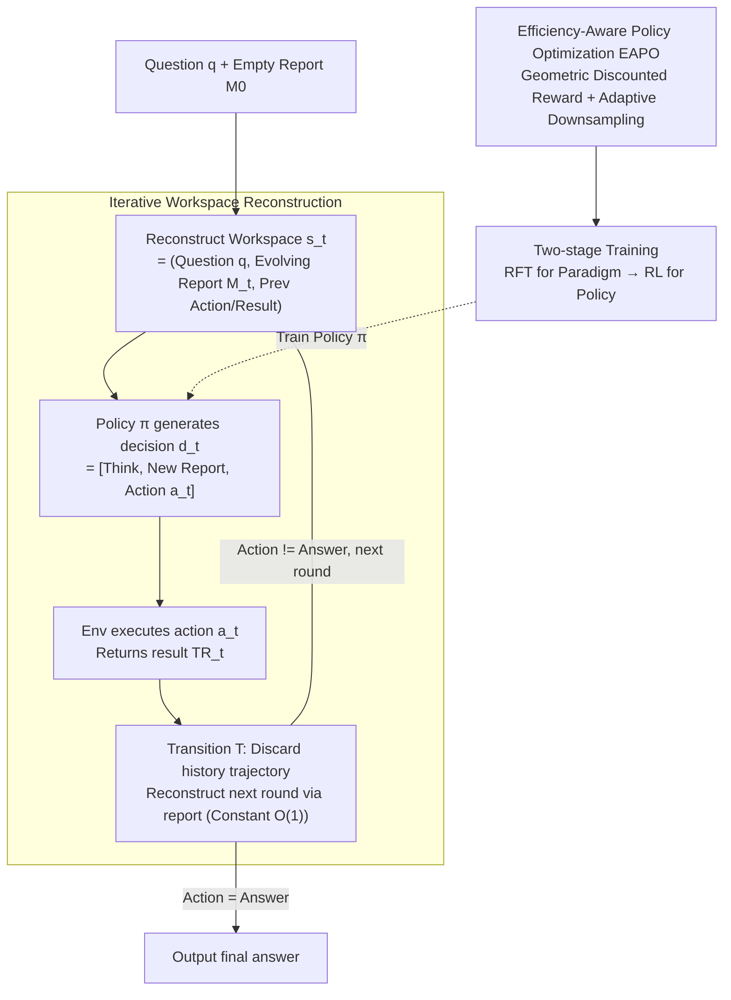

# IterResearch: Rethinking Long-Horizon Agents with Interaction Scaling

**Conference**: ICLR 2026  
**arXiv**: [2511.07327](https://arxiv.org/abs/2511.07327)  
**Code**: Available  
**Area**: LLM Efficiency  
**Keywords**: Deep Research Agents, Iterative Workspace, MDP Framework, Interaction Scaling, Reinforcement Learning

## TL;DR
IterResearch proposes an MDP-based iterative deep research paradigm. By replacing linear context accumulation with periodic workspace reconstruction, the agent scales to 2048 interactions within a 40K context limit (improving performance from 3.5% to 42.5%), outperforming open-source agents by 14.5 percentage points on average across six benchmarks.

## Background & Motivation
Deep research agents (e.g., OpenAI Deep Research, Gemini Deep Research) construct knowledge through autonomous reasoning and retrieval. However, existing open-source methods adopt a "mono-contextual paradigm"—appending all retrieved information and reasoning steps into a continuously expanding context window. This leads to two fundamental issues:

**Context Suffocation**: As the context fills up, the space available for model reasoning shrinks, forcing responses to become increasingly brief and eventually degrading into premature or superficial conclusions.

**Noise Contamination**: Irrelevant search results and early exploration errors are permanently embedded in the context, creating cascading interference.

**Core Idea**: Effective long-horizon research requires **periodic synthesis and strategic forgetting**—regularly compressing findings into an evolving report and continuing exploration based on that report rather than the full history. This reduces the state dimension from $O(t)$ to $O(1)$.

## Method

### Overall Architecture
IterResearch addresses the "performance decay" of deep research agents during long-range tasks. The root cause is that mainstream mono-contextual paradigms append every retrieval result and reasoning step to a single expanding window. The solution re-models deep research as a Markov Decision Process (MDP) $\langle\mathcal{S},\mathcal{D},\mathcal{E},\mathcal{T},R\rangle$, allowing the agent to restart each round with a constant-sized "workspace" rather than carrying the entire history.

The process is a closed loop. At the start of each round, the agent receives a reconstructed workspace state $s_t = (q, \mathcal{M}_t, \{a_{t-1}, \text{TR}_{t-1}\})$, containing only three components: the fixed question $q$, an evolving report $\mathcal{M}_t$, and the previous action with its return result. Based on this, the policy $\pi$ produces a structured decision $d_t = [\text{Think}_t, \mathcal{M}_{t+1}, a_t]$, which includes reasoning, updating the report with new findings, and issuing an action. After the environment executes the action and returns result $\text{TR}_t$, the transition function discards the entire historical trajectory and reconstructs the next workspace $s_{t+1}$ using only the new report. This continues until the action becomes "provide final answer." To ensure efficiency, the system utilizes EAPO to apply "fast and accurate" pressure and a two-stage training process (RFT then RL) using Qwen3-30B-A3B.

### Key Designs

**1. Iterative Workspace Reconstruction: Collapsing state dimension from $O(t)$ to $O(1)$**

To address context suffocation and noise, IterResearch reconstructs a constant-sized workspace each round. Round $t$ state $s_t = (q, \mathcal{M}_t, \{a_{t-1}, \text{TR}_{t-1}\})$ includes only the fixed question $q$, the evolution report $\mathcal{M}_t$ (a dynamic document compressing historical findings), and the last action/result. The agent outputs $d_t = [\text{Think}_t, \mathcal{M}_{t+1}, a_t]$, and the transition function discards history to form $s_{t+1} = (q, \mathcal{M}_{t+1}, \{a_t, \text{TR}_t\})$. Linear expansion $|s_t| \propto O(t)$ is thus compressed into $|s_t| \approx O(1)$. "Strategic forgetting" is achieved as valuable findings are rolled into the report while expired trajectories are discarded.

**2. Efficiency-Aware Policy Optimization (EAPO)**

EAPO imposes efficiency pressure via two components. First, a geometric discounted reward $r_t = \gamma^{T-t} \cdot R_T$ ensures that earlier correct answers receive higher rewards, creating implicit pressure to conclude quickly. Second, adaptive downsampling handles varying trajectory lengths by truncating sample counts to multiples of the Data Parallel (DP) size $|\mathcal{C}_{\text{train}}| = \lfloor|\mathcal{C}|/\text{DP}_{\text{size}}\rfloor \times \text{DP}_{\text{size}}$ for load balancing. Optimization is implemented via the GSPO algorithm with PPO-style clipping and advantage normalization.

**3. Two-stage Training**

The model is trained in two steps. Stage 1: Rejection Sampling Fine-Tuning (RFT) enables the Qwen3-30B-A3B backbone to master basic iterative actions (reading/updating reports, issuing actions). Stage 2: RL uses EAPO to optimize search strategies and reasoning depth. The Qwen3-30B-A3B MoE backbone balances performance and inference efficiency.

## Key Experimental Results

### Main Results

| Model | HLE | BC | BC-zh | GAIA | Xbench-DS | SEAL-0 |
|------|-----|-----|-------|------|-----------|--------|
| WebSailor-72B | 9.8 | 12.0 | 30.1 | 55.4 | 55.0 | 19.8 |
| MiroThinker-32B | 19.1 | 17.2 | 29.4 | 64.1 | 56.0 | — |
| **IterResearch-30B-A3B (Ours)** | **28.8** | **37.3** | **45.2** | **72.8** | **71.0** | **39.6** |
| Gain | +8.8 | +20.1 | +15.8 | +8.7 | +15.0 | +18.9 |
| OpenAI DeepResearch | 26.6 | 51.5 | 42.9 | 67.4 | — | — |

### Interaction Scaling

| Max Interactions | BrowseComp Accuracy |
|------------|-----------------|
| 2 | 3.5% |
| 32 | ~15% |
| 128 | ~28% |
| 512 | ~35% |
| 2048 | **42.5%** |

### Key Findings
- Outperforms the best open-source agents by 14.5pp on average across 6 benchmarks.
- Surpasses OpenAI DeepResearch on HLE and BC-zh benchmarks.
- Scaling interactions to 2048 achieves a 12x performance improvement, suggesting long-horizon difficulty results from insufficient exploration capacity.
- Cross-paradigm knowledge transfer: Training a mono-contextual agent with IterResearch-generated trajectories also improves its performance.
- Effective as a zero-shot prompting strategy: Using it with GPT-4o on BrowseComp yielded +19.2pp, proving the general value of the paradigm.

## Highlights & Insights
- The "strategic forgetting" concept in MDP modeling is elegant—evolving reports act as compressed state representations, matching the Markov property perfectly.
- Interaction scaling discoveries are significant—indicating current agent failures may stem more from limited exploration than inherent capability deficits.
- Findings in cross-paradigm transfer and zero-shot prompting expand the application boundaries of the method.

## Limitations & Future Work
- Report quality is a critical bottleneck—if vital information is lost during summarization, subsequent reasoning suffers.
- Round-based reconstruction implies repeated report reading, potentially leading to redundant computation.
- Training limited to Qwen3-30B-A3B; performance on smaller or larger models requires verification.
- Selection of $\gamma$ for geometric discounted rewards may be a sensitive hyperparameter.

## Related Work & Insights
- **vs WebThinker/WebDancer**: These utilize mono-contextual paradigms and inevitably encounter context suffocation.
- **vs InftyThink**: Shares similar iteration and summarization ideas but applies them to pure reasoning tasks, whereas IterResearch focuses on information retrieval agents.

## Rating
- Novelty: ⭐⭐⭐⭐⭐ MDP modeling and iterative workspace reconstruction represent major breakthroughs in research agent paradigms.
- Experimental Thoroughness: ⭐⭐⭐⭐⭐ Comprehensive validation across 6 benchmarks, interaction scaling, cross-paradigm transfer, and zero-shot prompting.
- Writing Quality: ⭐⭐⭐⭐⭐ Clear motivation and rigorous formalization.
- Value: ⭐⭐⭐⭐⭐ Directly advances SOTA for deep research agents with high practical utility.

<!-- RELATED:START -->

## Related Papers

- [\[ICLR 2026\] Demystifying and Enhancing the Efficiency of Large Language Model Based Search Agents](demystifying_and_enhancing_the_efficiency_of_large_language_model_based_search_a.md)
- [\[ICLR 2026\] Scaling Attention via Feature Sparsity](scaling_attention_via_feature_sparsity.md)
- [\[ICLR 2026\] Scaling Up, Speeding Up: A Benchmark of Speculative Decoding for Efficient LLM Test-Time Scaling](scaling_up_speeding_up_a_benchmark_of_speculative_decoding_for_efficient_llm_tes.md)
- [\[ICLR 2026\] STEM: Scaling Transformers with Embedding Modules](stem_scaling_transformers_with_embedding_modules.md)
- [\[ICML 2026\] STAR: Rethinking MoE Routing as Structure-Aware Subspace Learning](../../ICML2026/llm_efficiency/star_rethinking_moe_routing_as_structure-aware_subspace_learning.md)

<!-- RELATED:END -->
