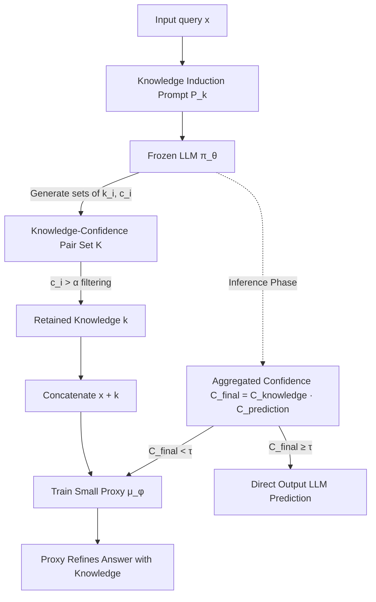

# KnowProxy: Adapting Large Language Models by Knowledge-guided Proxy

**Conference**: ICLR 2026  
**OpenReview**: [https://openreview.net/forum?id=14f18NoEqO](https://openreview.net/forum?id=14f18NoEqO)  
**Code**: [https://github.com/2gukhyeon/KnowProxy](https://github.com/2gukhyeon/KnowProxy)  
**Area**: LLM Efficient Adaptation / Proxy-tuning / Black-box LLMs  
**Keywords**: proxy-tuning, knowledge-guided, black-box LLM, adaptive routing, uncertainty  

## TL;DR
KnowProxy uses a small proxy model to "digest" textual knowledge generated by a frozen large model for downstream adaptation. This approach moves away from the traditional proxy-tuning dependency on LLM probability distributions, enabling efficient fine-tuning for black-box LLMs while using dynamic routing to invoke the proxy only when the large model is uncertain.

## Background & Motivation
**Background**: Directly fine-tuning LLMs with billions of parameters is both expensive and often impossible, especially for closed-source models. A promising compromise is "proxy-tuning"—freezing the large model and training a small model to adjust its output. Typical examples include Proxy-tuning (re-weighting LLM probability distributions with a lightweight model) and CombLM (training an independent small model and merging its prediction distribution with the LLM).

**Limitations of Prior Work**: These methods treat **probability distributions** as the communication medium, which introduces two rigid constraints. First, they require access to the full output distribution of the LLM and the sharing of the same vocabulary between the large and small models, which cannot be satisfied by black-box APIs (e.g., ChatGPT, GPT-5) that only return text. Second, recent studies indicate that the probability distributions generated by LLMs are often **unstable and unreliable**; on benchmarks like QASC and BoolQ, distribution-based proxy methods can even underperform the large model's own zero-shot reasoning.

**Key Challenge**: The appeal of proxy-tuning lies in "adaptation without touching large model parameters," but its chosen communication channel (probability distribution) is precisely what is unavailable in black-box scenarios and questionable in quality—this fragility limits the applicability and stability of the entire paradigm.

**Goal**: Design a proxy adaptation framework that does **not depend on probability distributions**, making it compatible with black-box LLMs while avoiding performance degradation caused by distribution instability, all while controlling the additional inference overhead of "running the proxy every time."

**Core Idea (Knowledge instead of Distribution)**: Replace the communication medium from probability distributions to **textual knowledge**. Use prompts to induce textual knowledge and reasoning required for problem-solving from the frozen LLM, then perform standard supervised training for a small proxy model on "original query + induced knowledge" to learn to map the large model's reasoning to the target task distribution. During inference, use **confidence-aggregated dynamic routing** to wake up the proxy only when the large model is unreliable.

## Method

### Overall Architecture
KnowProxy rewrites the traditional proxy-tuning objective $\min_\phi -\mathbb{E}_{(x,y)\sim D}[\log \mu_\phi(y\mid x)\pi_\theta(y\mid x)]$ (which depends on the LLM distribution $\pi_\theta(y\mid x)$) into a knowledge-guided objective $\min_\phi -\mathbb{E}_{(x,y)\sim D}[\log \mu_\phi(y\mid x, k)]$, where $k\sim\pi_\theta(k\mid x)$ is the knowledge output by the LLM in text form. The pipeline consists of three steps: pre-training (batch-inducing knowledge and confidence for each sample using prompts and filtering), training (concatenating knowledge into proxy input for supervised fine-tuning), and inference (using aggregated confidence to decide between the LLM and the proxy).

### Key Designs

**1. Textual Knowledge Induction and Confidence Filtering: Replacing distribution channels with readable, filterable knowledge channels.** For each query $x$, KnowProxy uses a knowledge induction prompt $P_k$ to let the LLM output knowledge fragments and their confidence $k, c = \pi_\theta(P_k, x)$. Here, "knowledge" is broadly defined as problem-solving clues—underlying principles, reasoning steps, or relevant facts. Crucially, it **does not take a single output**; it generates multiple knowledge-confidence pairs to cover different reasoning paths and avoid over-reliance on a single extraction. Since LLM-generated knowledge may contain hallucinations or irrelevant content, the framework performs confidence filtering $k = \{k_i \mid (k_i, c_i)\in K,\ c_i > \alpha\}$, retaining only knowledge with confidence higher than threshold $\alpha$. This step replaces the black-box "probability distribution" with text—a medium returned by any API and capable of explicit review—ensuring black-box applicability and stability.

**2. Knowledge-guided Proxy Optimization: Internalizing reasoning rather than imitating distributions.** After obtaining the knowledge-enhanced dataset, the query $x$ is concatenated with the filtered knowledge $k$ as enhanced input to train a small proxy $\mu_\phi$ via standard supervision. The design intent is to let the proxy learn to "read and reuse" the reasoning written by the LLM and align it with the output distribution of the specific task, effectively performing task specialization based on the large model's thought process. Ablation shows this is the most critical link: removing adaptation (only inserting knowledge during inference without training the proxy to digest it) leads to the largest performance drop (Avg. 81.0 → 75.1). Notably, authors found that feeding the **LLM's predicted answer** (w/ LLM answer) during training was worse (81.0 → 77.5), as incorrect LLM predictions propagate and contaminate the proxy during training—hence KnowProxy deliberately uses only knowledge, not the final answer.

**3. Multi-granularity Confidence Aggregated Dynamic Routing: Switching from "always call proxy" to "call as needed."** A common issue with proxy paradigms is the extra overhead of running the small model for every query. KnowProxy introduces routing during inference: it first reuses the knowledge induction prompt to let the LLM provide a prediction and its confidence $C_\text{prediction}$, and then aggregates the confidence of all generated knowledge using a product $C_\text{knowledge} = \prod_{k=1}^{K} c_k$ to find the final reliability $C_\text{final} = C_\text{knowledge}\cdot C_\text{prediction}$. The routing criterion is:
$$
y = \begin{cases} \pi_\theta(y\mid x), & \text{if } C_\text{final}\ge\tau \\ \mu_\phi(y\mid x, k\sim\pi_\theta(k\mid x)), & \text{if } C_\text{final}<\tau \end{cases}
$$
If aggregated confidence exceeds threshold $\tau$, the LLM is trusted directly, saving proxy overhead; otherwise, the proxy is invoked to refine the answer using knowledge. The ingenuity lies in monitoring uncertainty **per knowledge item** rather than just at the prediction level—low-confidence knowledge serves as an early signal that "LLM reasoning might be slipping," providing finer granularity than single prediction confidence. Confidence from filtered-out knowledge is also included to reflect the LLM's overall understanding of the query.

## Key Experimental Results

### Main Results
Using Llama-3.2-3B as the frozen LLM and Llama-3.2-1B as the proxy, accuracy (%) across 9 reasoning benchmarks:

| Method | OBQA | ARCh | PIQA | CSQA | QASC | SIQA | WNGR | StrategyQA | BoolQ | Avg. |
|---|---|---|---|---|---|---|---|---|---|---|
| Fine-tuning LLM (Upper Bound) | 82.2 | 76.2 | 87.7 | 79.5 | 82.9 | 80.5 | 87.3 | 71.5 | 86.9 | 81.6 |
| Fine-tuning SLM | 73.2 | 60.9 | 80.3 | 72.0 | 68.0 | 74.9 | 75.4 | 66.5 | 85.4 | 73.0 |
| Chain-of-Thought | 77.6 | 80.0 | 75.6 | 73.1 | 79.0 | 68.6 | 57.8 | 69.0 | 76.7 | 73.1 |
| Proxy-tuning | 77.2 | 69.6 | 80.1 | 70.8 | 69.9 | 72.6 | 65.7 | 64.6 | 76.2 | 71.9 |
| CombLM | 78.6 | 72.6 | 81.1 | 72.5 | 76.9 | 73.7 | 69.3 | 67.2 | 76.8 | 74.3 |
| BBox-Adapter | 76.2 | 68.6 | 73.8 | 73.3 | 73.8 | 72.7 | 53.7 | 69.0 | 70.5 | 70.2 |
| **KnowProxy (Ours)** | **80.2** | **75.2** | **83.4** | **75.0** | **78.1** | **76.3** | **77.8** | **72.9** | **85.1** | **78.2** |

KnowProxy achieves an average of 78.2%, outperforming all proxy baselines (best CombLM 74.3%) and approaching or even matching direct LLM fine-tuning on tasks like OBQA/ARCh/StrategyQA/BoolQ (even surpassing fine-tuning on StrategyQA with 72.9 vs 71.5).

Cross-backbone performance (including black-box and quantized), with proxy fixed at Llama-3.2-1B:

| LLM | Zero-shot Avg. | KnowProxy Avg. | Fine-tuning Avg. |
|---|---|---|---|
| Mistral-7B | 67.0 | 76.6 | 81.0 |
| Llama-2-13B (4-bit quantization) | 57.1 | 73.4 | 79.9 |
| ChatGPT (gpt-3.5-turbo, black-box) | 76.9 | 80.9 | — |

On black-box ChatGPT, KnowProxy (80.9) exceeds BBox-Adapter (79.4), proving adaptation is possible without distribution access.

### Ablation Study
Contribution of components under ChatGPT backbone (Accuracy %):

| Variant | OBQA | PIQA | StrategyQA | SIQA |
|---|---|---|---|---|
| **KnowProxy** | **85.0** | **87.2** | **74.7** | **77.0** |
| w/o routing | 82.0 | 87.2 | 74.7 | 76.8 |
| w/o filtering | 85.0 | 86.2 | 72.1 | 76.0 |
| w/o adaptation | 80.6 | 85.1 | 59.4 | 75.3 |
| w/ LLM answer | 76.8 | 83.7 | 72.9 | 76.4 |

### Key Findings
- **Knowledge Adaptation is Vital**: Removing adaptation causes the largest drop (81.0 to 75.1 on average); StrategyQA crashes from 74.7 to 59.4.
- **Routing Incurs Minimal Accuracy Loss**: Removing routing only slightly improves average from 80.2 to 81.0, suggesting it primarily buys efficiency—easy queries go to the LLM, hard ones go to the proxy.
- **Do Not Feed Large Model Answers**: Performance drops to 77.5 with "w/ LLM answer" because incorrect LLM predictions propagate errors to the proxy.
- **Routing Reliability**: As the confidence threshold increases, the accuracy of samples routed to the LLM by KnowProxy rises monotonically, whereas single prediction-level confidence (Tian et al.) is nearly flat—multi-granularity knowledge confidence aggregation provides meaningful routing signals.
- **Swappable and Scalable Proxies**: Using LaMini-GPT-0.7B or Qwen2.5-0.5B still consistently improves zero-shot performance, with gains positively correlated with the small model's capability, aligning with scaling law intuitions.

## Highlights & Insights
- **Medium Shift**: The fundamental insight is changing the "communication protocol" of proxy-tuning from fragile, private probability distributions to robust, public textual knowledge, simultaneously enabling black-box adaptation and avoiding distribution instability.
- **Knowledge-level Routing**: Lowering uncertainty estimation to the knowledge granularity allows signals of "LLM reasoning slippage" to be captured earlier and more finely, making routing truly reliable.
- **Learning Logic, Not Answers**: Deliberately excluding LLM final predictions avoids error propagation, reflecting a refined choice of "what to distill."

## Limitations & Future Work
- **Dependency on LLM Knowledge Quality**: If the large model's generated knowledge is systematically biased or its self-assessed confidence is poorly calibrated, both filtering and routing are compromised.
- **Additional Induction Overhead**: Generating multiple knowledge sets per sample via prompting adds cost to both pre-training data construction and inference-time knowledge generation; routing only mitigates proxy calls, not induction overhead.
- **Empirical Threshold Tuning**: Filtering threshold $\alpha$ and routing threshold $\tau$ are set empirically; robustness and self-adaptation across different tasks are natural next steps.
- **Task Scope**: Experiments focus on reasoning QA benchmarks; performance on generative and long-context tasks is only briefly touched upon in the appendix.

## Related Work & Insights
- **Proxy-tuning Lineage**: Proxy-tuning (re-weighting distributions) and CombLM (merging distributions) are direct counterparts. KnowProxy's use of textual knowledge is a key decoupling of this lineage. BBox-Adapter represents another black-box adaptation route via answer selection.
- **LLM Uncertainty Induction**: Builds on work by Tian et al. and Xiong et al. that estimates confidence from text outputs, but innovates by refining uncertainty from prediction-level to knowledge-level for routing rather than just evaluation.
- **Insight**: When a paradigm's bottleneck stems from its choice of "interface/medium" rather than the task itself, switching to a more universal and robust medium (like text vs. distribution here) is often more effective than patching the original medium—this has methodological significance for black-box distillation and model adaptation in the API era.

## Rating
- **Novelty**: ⭐⭐⭐⭐ — Clear and essential decoupling of a mature paradigm by replacing probability distributions with textual knowledge and adding multi-granularity routing.
- **Experimental Thoroughness**: ⭐⭐⭐⭐ — Covers 9+ reasoning benchmarks, various open/black-box/quantized backbones, and multiple small models; solid ablation and reliability analysis.
- **Writing Quality**: ⭐⭐⭐⭐ — Clear problem motivation, objective rewriting, and methodological derivation; good coordination between formulas and text.
- **Value**: ⭐⭐⭐⭐ — High practical value for low-cost adaptation of closed-source black-box LLMs without distribution access.

<!-- RELATED:START -->

## Related Papers

- [\[ICML 2026\] Proxy Compression for Language Modeling](../../ICML2026/llm_efficiency/proxy_compression_for_language_modeling.md)
- [\[ICLR 2026\] DND: Boosting Large Language Models with Dynamic Nested Depth](dnd_boosting_large_language_models_with_dynamic_nested_depth.md)
- [\[ICLR 2026\] SinkTrack: Attention Sink based Context Anchoring for Large Language Models](sinktrack_attention_sink_based_context_anchoring_for_large_language_models.md)
- [\[ICLR 2026\] Deep Hierarchical Learning with Nested Subspace Networks for Large Language Models](deep_hierarchical_learning_with_nested_subspace_networks_for_large_language_mode.md)
- [\[ICLR 2026\] UltraLLaDA: Scaling the Context Length to 128K for Diffusion Large Language Models](ultrallada_scaling_the_context_length_to_128k_for_diffusion_large_language_model.md)

<!-- RELATED:END -->
