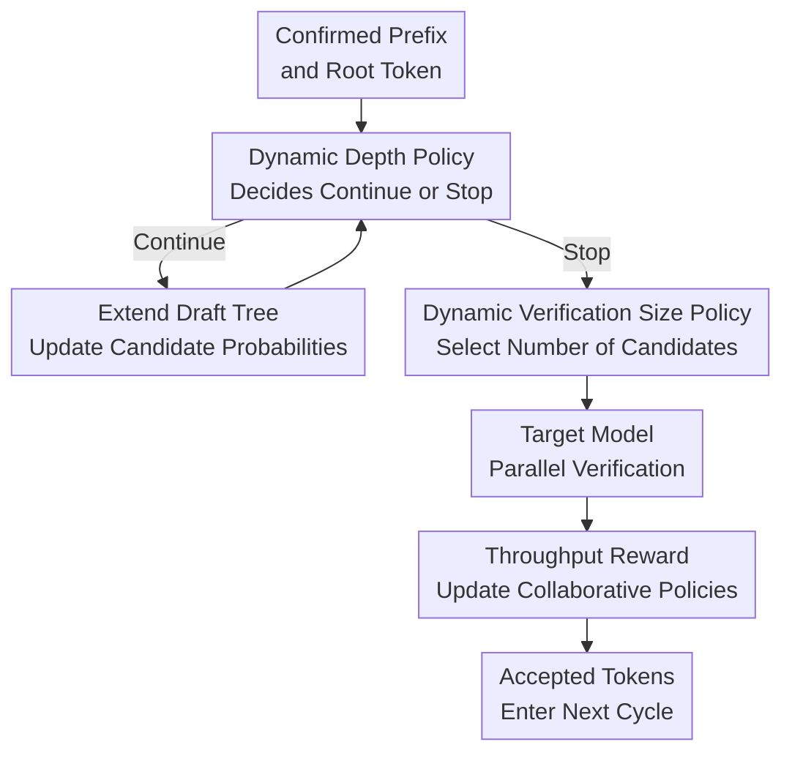

# Learning To Draft: Adaptive Speculative Decoding with Reinforcement Learning

**Conference**: ICLR 2026  
**OpenReview**: [https://openreview.net/forum?id=IK9cbzzXLt](https://openreview.net/forum?id=IK9cbzzXLt)  
**Code**: https://github.com/zhzihao/Learning-to-Draft  
**Area**: LLM Efficiency / Inference Acceleration / Speculative Decoding  
**Keywords**: speculative decoding, LLM inference acceleration, draft tree, PPO, throughput optimization  

## TL;DR
LTD models "how deep to draft" and "how many candidate tokens to verify" in tree-based speculative decoding as two collaborative reinforcement learning policies. By directly using the throughput of each draft-and-verify cycle as the reward, it consistently improves LLM inference speed on Eagle3.

## Background & Motivation
**Background**: Large Language Model (LLM) inference increasingly relies on long-chain and multi-step reasoning. While output quality improves, it introduces significant latency. Speculative decoding is a practical category of lossless acceleration methods: a smaller and faster draft model predicts a batch of candidate tokens, which the target model then verifies in parallel, thereby reducing the number of expensive target model forward passes.

**Limitations of Prior Work**: The speed of speculative decoding is not solely determined by how many tokens are predicted correctly. Tree-based drafting methods like Eagle3 can generate large candidate trees to increase the average acceptance length $L_A$. However, deeper draft trees and more candidate tokens increase both the sequential generation time of the draft model and the verification time of the target model. Many methods still use fixed depth and fixed verification size, or pursue longer acceptance lengths based only on signals like probability, entropy, or hidden states. This leads to a bottleneck where the gains from predicting more tokens are offset by the increased verification time.

**Key Challenge**: The actual objective to optimize is throughput, not just draft quality or verification scale. The paper defines the throughput of each draft-and-verify cycle as $\lambda_c=L_A/T_{total}$, where $T_{total}=T_{draft}+T_{verify}$. Increasing draft depth linearly adds $T_{draft}$; increasing verification size causes $T_{verify}$ to grow in steps; reducing both may waste the parallel verification capability of the target model. The core challenge is how to dynamically allocate the time budget between the draft and verify stages given the current context.

**Goal**: The authors aim to enable the system to answer two questions during each generation cycle: Is it still worth extending the candidate tree with the draft model? How many candidate tokens should the target model verify? These questions cannot be answered in isolation, as a deeper draft tree changes the quality and quantity of candidates, while the verification budget determines whether continuing to grow the tree is worthwhile.

**Key Insight**: The paper observes that draft depth, verification size, context length, and candidate probabilities can predict the benefit and cost of the current cycle. However, the relationship between these signals and the final wall-clock throughput is difficult to capture with hand-crafted rules. Therefore, instead of using heuristics, the authors treat the interaction between the draft and target models as a reinforcement learning environment, allowing a lightweight policy network to learn "when to stop" and "how many to verify" from real throughput rewards.

**Core Idea**: Replace the static draft/verify hyperparameters of Eagle3 with two collaboratively trained, lightweight PPO policies to enable adaptive scheduling of speculative decoding directly based on the cycle throughput $L_A/(T_{draft}+T_{verify})$.

## Method
### Overall Architecture
LTD is built upon the tree-based speculative decoding framework of Eagle3. It does not change the output distribution of the target model but only modifies the generation depth and verification scale of the candidate tree in each cycle. Starting from the last confirmed token, the draft model expands a draft tree in a beam-search-like manner. The depth policy decides whether to continue or stop after each draft forward pass. Once stopped, the size policy determines the number of candidate tokens to be sent to the target model based on the entire tree. After parallel verification, the system uses the cycle throughput as the reward to update the policies.

The critical hyperparameters in standard Eagle3 are fixed: draft depth defaults to 8, and verification size is set by model defaults or grid search. LTD's modifications focus on two learnable decisions. The depth policy has a binary action space $\{0, 1\}$, representing whether to continue or stop at the current depth. The size policy has a discrete action space for verification size, ranging roughly from $[20, 240]$. Both are implemented as small MLPs, with an overhead reported in the appendix to be less than ~1.5%, ensuring the policy execution does not offset inference gains.

### Key Designs
**1. Throughput Reward: Shifting Objective from "Length" to "Speed"**

The most critical shift in this paper is moving away from using acceptance length as the sole objective. The reward for each cycle is directly set as $R_t=L_A/(T_{draft}+T_{verify})$, where $L_A$ is the number of tokens accepted by the target model, $T_{draft}$ is the draft tree generation time, and $T_{verify}$ is the target model verification time. Consequently, the policy does not blindly prefer deeper trees or larger sets; it is only rewarded if additional tokens provide an acceptance gain that exceeds the additional time cost.

This design addresses biases in previous dynamic methods. When using acceptance length as a reward, policies tend to submit too many candidates, increasing $\tau$ but dragging down verification speed. When using time cost, policies become overly conservative, wasting the parallel advantages of speculative decoding. Throughput reward unifies these on the same scale, learning "shorter but more cost-effective" allocations.

**2. Dynamic Depth Policy: Early Exit for Low-Yield Draft Trees**

Draft depth determines how many consecutive forward passes the draft model performs. A deeper tree provides more paths, potentially increasing acceptance length, but draft expansion happens sequentially. The depth policy observes the current depth $D$, context length $L$, and the probabilities of the latest layer of candidates to output a "continue" or "stop" signal. It only considers the final layer's probability to minimize latency during frequent policy calls.

This policy is particularly skilled at handling varying context difficulty. If candidate probabilities collapse, continuing to expand the tree is likely to produce low-quality candidates that the target model will reject at a shallow mismatch; stopping early saves $T_{draft}$. Conversely, if the distribution is stable, the policy can extend further to leverage the target model's capacity. It does not simply select "deep" or "shallow" but treats depth as a per-step conditional action.

**3. Dynamic Verification Size Policy: Verifying Only Worthwhile Candidates**

Once a draft tree is generated, not all candidates are worth verification. While Eagle3 selects a fixed number of tokens by probability, LTD's size policy observes the depth $D$, context length $L$, and all candidate probabilities $P_1, \ldots, P_{V_{all}}$ to select the verification size $V$. Candidates are flattened into a sequence with a tree attention mask for target model verification.

This strategy turns the verification budget into context-aware resource allocation. If high-probability candidates are concentrated, a larger $V$ utilizes the target model's parallel capacity for a longer $L_A$. If the probability tail is poor, adding low-quality tokens only increases $T_{verify}$. Results on Qwen3-32B show that LTD’s average acceptance length is actually lower than grid-searched Eagle3, yet the speedup is significantly higher due to reduced verification time.

**4. Iterative Collaborative Training: Avoiding Local Optima**

The depth and size policies are interdependent: the depth selected affects the candidate set available to the size policy, while the verification budget determines if a deeper tree is worthwhile. The paper first trains initial policies separately before performing iterative optimization: fixing the size policy to train the depth policy, then fixing the depth policy to train the size policy. Experiments demonstrate that a naive combination of independent policies is inferior to LTD’s collaborative approach.

This training allows the two policies to form a "common language." Distribution analysis shows that while initial combinations cluster in shallow/small budget regions, LTD eventually learns to adapt based on sequence difficulty. For easy-to-accept sequences, it favors deeper trees with larger budgets; for difficult positions, it adopts a "shallow but wide" strategy to reduce sequential costs while buffering uncertainty with more candidates.

### Loss & Training
Both policies are trained using PPO. Given state $s_t$ and action $a_t$, the clipped PPO objective is used:

$$
J(\theta)=\hat{E}_t\left[\min\left(r_t(\theta)\hat{A}_t,\mathrm{clip}(r_t(\theta),1-\epsilon,1+\epsilon)\hat{A}_t\right)\right],
$$

where $r_t(\theta)=\pi_\theta(a_t|s_t)/\pi_{\theta_{old}}(a_t|s_t)$ and $\hat{A}_t$ is the advantage estimate. The size policy's actor and critic are two-layer MLPs with hidden dimensions $[1024, 256]$ and a discount factor $\gamma=0.9$. For the depth policy, to reduce overhead, the actor uses a single hidden layer of 1024 and a higher $\gamma=0.999$ to prevent the policy from prematurely bias towards stopping.

HumanEval is used for training because code generation contains diverse complex contexts. Initially, the size policy is trained on random draft depths $[1, 12]$ for 100k steps, and the depth policy is trained with a fixed verification size of 60 for 1M steps. This is followed by iterative collaborative training.

## Key Experimental Results
### Main Results
Evaluation was conducted on Llama-3.1-8B-Instruct, Vicuna-13B-v1.3, DeepSeek-R1-Distill-LLaMA-8B, Qwen3-14B, and Qwen3-32B across MT-bench, GSM8K, Alpaca, and Natural Questions. Experiments report relative speedup and average acceptance length $\tau$.

| Model | Baseline | Baseline Speedup | LTD Speedup | Gain | LTD $\tau$ |
|------|----------|------------------|-------------|------|------------|
| Llama-3.1-8B | Eagle3 | 3.68 | 3.92 | +6.5% | 6.56 |
| Vicuna-13B | Eagle3 | 4.11 | 4.32 | +5.1% | 7.00 |
| DeepSeek-R1-8B | Eagle3 | 3.80 | 4.16 | +9.5% | 6.08 |
| Qwen3-14B | Eagle3 + Grid | 2.28 | 2.37 | +4.0% | 3.19 |
| Qwen3-32B | Eagle3 + Grid | 1.81 | 2.47 | +36.4% | 3.13 |

Crucially, LTD is more stable across models. For Qwen3-32B, LTD's $\tau$ (3.13) is lower than the grid-search baseline (3.26), but the speedup improves from 1.81 to 2.47. This supports the claim: verifying fewer, high-yield candidates can be faster than pursuing maximum length.

### Ablation Study
The ablation study addresses the individual utility of policies, the necessity of collaborative training, and the choice of reward.

| Configuration | Vicuna-13B Speedup | Average $\tau$ | Note |
|---------------|-------------------|----------------|------|
| Eagle3 | 4.11 | 6.35 | Fixed depth and size |
| LTD - Depth | 4.13 | 6.84 | Only size policy; marginal gain |
| LTD - Size | 4.29 | 6.57 | Only depth policy; shows importance of early exit |
| LTD - Indep. | 4.20 | 7.06 | Independent policies; high $\tau$ but sub-optimal speed |
| LTD | 4.32 | 7.00 | Collaborative training yields highest speed |

| Reward Design | Vicuna-13B Speedup | Average $\tau$ | Conclusion |
|---------------|-------------------|----------------|------------|
| Acceptance Length | 3.59 | 6.89 | High $\tau$ but slow due to over-verification |
| Time Cost | 3.45 | 5.66 | Too conservative; misses parallel gains |
| Throughput | 4.13 | 6.84 | Best balance between length and cost |

### Key Findings
- **Depth policy is the primary contributor**. Removing the size policy still yields a 4.29 speedup, indicating that stopping ineffective draft expansion is a major source of gain.
- **Collaborative training is essential**. While independent combinations may produce higher $\tau$, they result in lower speedup than LTD, proving that "accepting more tokens" $\neq$ "running faster."
- **Observation space**: Combining candidate probability $P$, depth $D$, and context length $L$ is sufficient. Adding hidden states or entropy creates overhead without significant gain.
- **Generalization**: LTD outperformed Eagle3 in 54 out of 57 MMLU tasks, suggesting that policies trained on HumanEval do not merely "memorize" code tasks.

## Highlights & Insights
- LTD correctly aligns the optimization objective with wall-clock throughput rather than surrogate metrics like acceptance length. This explains why many "better guessers" are unstable in practice.
- The collaborative design is natural. Draft depth and verification size are two sides of the same per-cycle resource allocation; optimizing them together prevents wasting effort in one stage.
- The approach is engineering-friendly: overhead is minimal, and features are low-cost, making it easy to integrate into existing inference stacks.
- The counter-intuitive Qwen3-32B result (shorter $\tau$, higher speedup) highlights that in large-scale model inference, reducing high-cost verification is often more important than "betting" on more tokens.

## Limitations & Future Work
- **Framework integration**: Currently validated on Eagle3. Further testing is needed for Medusa, self-speculative decoding, or multi-draft models.
- **Hardware sensitivity**: Since throughput reward depends on execution time, policies may need re-calibration for different GPUs, kernels, or batch sizes.
- **Context scenarios**: Distributions for extremely long context or agent-based reasoning might differ from the training data.
- **Batch serving**: The study focuses on single-request throughput. In production environments, optimal single-request scheduling might not equate to optimal system-level throughput or tail latency.

## Related Work & Insights
- **vs Eagle3**: Inherits the drafting capability of Eagle3 but replaces static hyperparameters with context-aware policies.
- **vs Dynamic Length/Depth methods**: Whereas prior works often optimize using entropy heuristics or acceptance length, LTD uses throughput as a direct reward and controls both sides of the process.
- **vs SpecDec++/Disco**: Unlike supervised methods or those using surrogate targets, LTD uses PPO to learn directly from environment feedback, avoiding the trap of treating acceptance as the end goal.

## Rating
- Novelty: ⭐⭐⭐⭐ Shifting the objective to throughput and using collaborative RL for scheduling is a valuable problem definition.
- Experimental Thoroughness: ⭐⭐⭐⭐⭐ Comprehensive coverage of models, tasks, and sampling temperatures.
- Writing Quality: ⭐⭐⭐⭐ Clear motivation and execution; excellent visual explanations of policy interaction.
- Value: ⭐⭐⭐⭐⭐ Highly practical improvement for speculative decoding stacks with low implementation friction.

<!-- RELATED:START -->

## Related Papers

- [\[ICLR 2026\] Speculative Speculative Decoding](speculative_speculative_decoding.md)
- [\[ICLR 2026\] RepSpec: Structural Re-parameterized Draft Model Training for Speculative Decoding](repspec_structural_re-parameterized_draft_model_training_for_speculative_decodin.md)
- [\[ACL 2025\] Tetris: Optimal Draft Token Selection for Batch Speculative Decoding](../../ACL2025/llm_efficiency/tetris_optimal_draft_token_selection_for_batch_speculative_decoding.md)
- [\[ICLR 2026\] Flatter Tokens are More Valuable for Speculative Draft Model Training](flatter_tokens_are_more_valuable_for_speculative_draft_model_training.md)
- [\[ACL 2025\] Accelerating Speculative Decoding via Efficient Context-Aware Draft Generation](../../ACL2025/llm_efficiency/accelerating_speculative_decoding_via_efficient_context-aware_draft_generation.md)

<!-- RELATED:END -->
