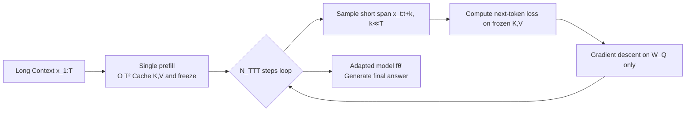

# Let's (not) just put things in Context: Test-time Training for Long-context LLMs

**Conference**: ICLR 2026  
**OpenReview**: [https://openreview.net/forum?id=H0bcEdPCoc](https://openreview.net/forum?id=H0bcEdPCoc)  
**Code**: To be confirmed  
**Area**: Efficient LLM Inference / Long Context / Test-time Training  
**Keywords**: Long Context, Test-time Training, Inference-time Compute, KV cache, score dilution, query-only TTT  

## TL;DR
This paper identifies that retrieval failure in long-context LLMs stems from the **score dilution** of static self-attention (distractor tokens dilute the attention quality on the target) and demonstrates that "thinking tokens" cannot fix this issue. It proposes **query-only Test-time Training (qTTT)**—caching KV during a single prefill, then performing a few gradient updates solely on the query projection matrix with fixed KV. Under an equivalent FLOP budget, qTTT significantly outperforms thinking tokens by redistributing inference-time compute from "generating more tokens" to "a few targeted query updates."

## Background & Motivation

**Background**: Advances in pre-training and architecture have pushed context windows to the million-token scale. However, models can "fit in" much more than they can "reliably use"—classic failures like lost-in-the-middle and needle-in-a-haystack persist. Concurrently, inference-time compute (thinking tokens, best-of-n, self-consistency) has been shown to improve performance on multi-step reasoning tasks.

**Limitations of Prior Work**: Through two controllable sandbox tasks (code repository bug localization and transaction log anomaly detection, where a fixed "needle" is placed in a growing "haystack"), the authors observed that: (i) as context length $T$ increases, pure in-context accuracy drops sharply and monotonically; (ii) increasing compute with thinking tokens only helps in short contexts and quickly saturates in long contexts with near-zero gains—thinking tokens still rely on the same static attention that "cannot distinguish evidence."

**Key Challenge**: All decoding-based inference-time strategies "use the same static attention kernel to generate more tokens," but the kernel itself is the problem. The authors formalize this as **score dilution**: when many distractor tokens have logits "near-tied" with the target, the softmax denominator expands. Even if the target logit is the unique maximum, its attention quality tends to 0 as $T \to \infty$. They prove that to prevent target quality from vanishing, the target–distractor logit gap must grow at $\Omega(\log T)$ (logarithmic gap requirement). Static models struggle to meet this, and generating more tokens does not change the $q_i^\top k_j$ similarity.

**Goal**: To find a more effective way to spend inference-time compute such that long-context retrieval/reasoning truly benefits, without modifying pre-training, architecture, or data.

**Core Idea**: **Instead of stuffing more into the context (generating more tokens), perform a small amount of training on the existing context**—update only the query projections and reuse the KV cache. This directly increases the target–distractor gap and addresses score dilution at its root.

## Method

### Overall Architecture
The qTTT workflow consists of two steps: first, a **single** $O(T^2)$ prefill is performed on the long context $x_{1:T}$ to cache and freeze the Key/Value tensors $K^{(\ell)}, V^{(\ell)}$ for each layer. Subsequently, with fixed KV, several steps of standard next-token prediction gradient descent are performed on randomly sampled short spans (length $k \ll T$). Gradients are applied **only** to the query projection matrices $\{W_Q^{(\ell)}\}$, while all other parameters (including the entire KV cache) remain frozen. Finally, the adapted model is used to generate the answer. This ensures the expensive full-context forward pass happens only once, while subsequent updates are cheap.

### Key Designs

**1. Why "query-only": Naive TTT is infeasible in long context.** The most natural approach is full-parameter TTT—updating FFNs along with $W_Q, W_K, W_V$. However, if keys or values are modified, the entire sequence's KV cache becomes invalid, requiring a full-context forward and backward pass at every step, causing compute and activation memory to explode. FLOP estimations (Appendix C) show that at $T \approx 10^5$, **one step** of full-parameter TTT equals decoding $1.2 \times T \approx 120\text{K}$ tokens, which is unacceptable. qTTT shrinks the trainable parameters to just $W_Q$, allowing the reuse of frozen $\{K, V\}$ after a single prefill and performing cheap updates on short spans, retaining TTT benefits while eliminating the overhead of repeated full-context traversals. The loss is standard autoregressive: $L_{\text{TTT}}(\theta;x_s)=-\sum_{i=t}^{t+k-1}\log p_\theta(x_{i+1}\mid x_{1:i};\{K^{(\ell)},V^{(\ell)}\})$, with gradients computed and applied only to $\{W_Q^{(\ell)}\}$.

**2. Why query-only training cures score dilution: Query gradients naturally point to the "needle".** This is the theoretical pillar of the paper. For a single-layer retrieval loss $\ell_i=-\log\alpha_{i,j^\star}$ with fixed $K$, the paper proves the query gradient is $\nabla_{q_i}\ell_i=\frac{1}{\sqrt{d_k}}\big(\underbrace{\sum_\ell \alpha_{i,\ell}k_\ell}_{\mu_i}-k_{j^\star}\big)$, which is the attention-weighted mean (distractor centroid) $\mu_i$ minus the target key. Thus, one step of descent $q_i \leftarrow q_i - \eta\nabla_{q_i}\ell_i$ **pushes $q_i$ toward the target key $k_{j^\star}$ and away from the distractor centroid $\mu_i$**, directly reshaping the similarity $q_i^\top k_j$ rather than re-encoding the context. Crucially, the Gap Improvement Lemma states: $M_i(q_i-\eta\nabla_{q_i}\ell_i)=M_i(q_i)+\eta\|\nabla_{q_i}\ell_i\|_2^2+O(\eta^2)$. The gap strictly increases as long as the gradient is non-zero, and the gain is proportional to $\|k_{j^\star}-\mu_i\|_2^2$—meaning the **improvement is larger when attention is more dispersed (more severe dilution in long context)**. Conversely, thinking tokens are limited by the needle-signal upper bound (Prop 2.4/Cor 2.5): any signal a generated token can carry about the target is bounded by its own attention quality on the target, which is already minimal when the gap is small.

**3. FLOP Equality: Translating "thinking budget" into "query update budget".** To fairly compare the two ways of spending compute, the authors derive an empirical equivalence: $T_{\text{think}} \approx 2 N_{\text{qTTT}} k$ (for large $T$, $k \ll T$). For an 8B dense model at $T=10^5$, a budget of 8K thinking tokens is equivalent to $N_{\text{qTTT}}=16$ steps at $k=128$, or 8 steps at $k=512$. The difference is: thinking tokens expand the KV cache by thousands of positions without changing attention allocation; qTTT keeps the cache at $T$ and uses the same FLOPs to reshape how the query accesses existing keys/values, directly attacking the gap bottleneck.

## Key Experimental Results

Settings: Qwen3 models (1.7B / 4B / 8B) covering all 6 subsets of LongBench-v2 and 8 datasets from ZeroScrolls (15+ real-world datasets). Defaults: $T_{\text{think}}=8192$, $k=128$, $N_{\text{qTTT}}=32$, with 512 tokens reserved for final generation. Three-way comparison: In-Context (no intermediate tokens), Thinking (FLOP-aligned thinking tokens), and qTTT.

### Main Results (Summary)

| Benchmark / Task | Setting | Key Numbers |
|---|---|---|
| LongBench-v2 + ZeroScrolls Mean | Qwen3-4B | qTTT avg +12.6 / +14.1 pts over ICL |
| Long Dialogue History (Most dispersed) | Qwen3-4B | 30.8 → 43.6 |
| Multi-Document QA | Qwen3-4B | 40.0 → 46.0 |
| Code Repositories (Scale-up) | Qwen3-8B | 30.0 → 44.0 → 52.0 |
| Various Tasks | 8B | >20% gain in code understanding/multi-doc/multi-hop |

Under FLOP-aligned budgets, qTTT consistently outperforms both In-Context and Thinking across model scales and context types, with larger models often showing more significant gains.

### Mechanism Analysis

| Analysis | Setting | Conclusion |
|---|---|---|
| Target Attention Quality (App. E, Tab 2) | Avg target token attention across lengths | Vanilla quality drops with $T$; qTTT maintains quality across lengths |
| Sandbox Task vs. Length (Fig 1a/b) | Bug localization / Transaction logs | ICL mono-descends; Thinking saturates; qTTT gain is stable |
| FLOP Equality Calibration (§3.3) | $T_{\text{think}} \approx 2N_{\text{qTTT}}k$ | 8K thinking tokens ≈ 16 steps at $k=128$ or 8 steps at $k=512$ |
| Extra Inference Baselines (App. G) | best-of-N, beam search | Still outperformed by qTTT under unified FLOP budget |
| Latency/Wall-clock Time (App. H) | Comparison across methods | qTTT does not grow KV cache; time is controlled in long context |

These analyses link the accuracy gains back to "target attention quality improvement," empirically confirming the causal chain from score dilution to gap improvement established in §2/§3.2.

### Key Findings
- **Retrieval-driven tasks benefit most**: Large leads in Long Dialogue, Multi-Document QA, and multi-hop QA (MuSiQue/QASPER/NarrativeQA) validate the score dilution diagnosis.
- **Limited gains in summarization**: On GovReport/QMSum/SQuALITY, qTTT is comparable to thinking—when the bottleneck is generation quality rather than retrieval, reallocating attention has lower marginal utility.
- **Attention quality evidence** (Appendix E): As input tokens increase, vanilla attention quality on the target token drops alongside accuracy, while qTTT significantly preserves target attention quality across lengths.
- **Thinking tokens are not a reliable substitute**: Sometimes helpful, but can even perform worse than In-Context in very long contexts.

## Highlights & Insights
- **Diagnosis—Theory—Method Closed Loop**: Observing phenomena in sandboxes (thinking token saturation) → formalizing as score dilution + $\Omega(\log T)$ gap requirement → proving thinking tokens are limited by needle-signal upper bounds → concluding one must modify $q^\top k$ rather than sampling more → proving query gradients point to the needle. Very clean logic.
- **"Training a bit" beats "Thinking a bit"**: This counter-intuitive conclusion provides a new axis for inference-time compute allocation: beyond the decoding dimension, there is a micro-TTT dimension.
- **Engineering Lightness**: Reuses KV cache, updates only one small matrix class, and context length does not grow. It can be stacked on existing long-context techniques like sliding window, RoPE scaling, or RAG.

## Limitations & Future Work
- Only evaluated a single point on the $(k, N_{\text{TTT}})$ trade-off; budget scheduling across span sizes/steps is unexplored.
- FLOP-aligned baselines mostly compare with thinking tokens; self-consistency and best-of-n are only in the appendix.
- Gains are highly task-dependent (minimal in summarization); lacks a simple predictor for when to use qTTT vs. decoding scaling.
- Theoretical analysis is mostly in single-layer/single-needle settings; gap guarantees for multi-needle or multi-hop evidence combinations remain intuitive approximations.

## Related Work & Insights
- **Long-context LLMs**: RoPE scaling (Position Interpolation, LongRoPE) and sparse attention (Longformer, BigBird) expand windows, but lost-in-the-middle persists; this work targets "how attention quality is allocated" rather than window expansion itself.
- **Inference-time Compute**: CoT, self-consistency, and best-of-n belong to decoding scaling and face diminishing returns; this work identifies their limitation by the static attention upper bound.
- **Test-time Training (TTT)**: Previously used for distribution shifts (Sun 2020, Hardt & Sun 2024, Akyürek 2024); this work redirects TTT to the "micro-distribution of a single input" and designs an efficient query-only variant for long context.
- **Insight**: Using the "$\Omega(\log T)$ gap requirement" as a theoretical yardstick can evaluate whether any new mechanism truly addresses long-context retrieval rather than just artificially extending the sequence.

## Rating
- **Novelty**: ⭐⭐⭐⭐⭐ — The formalization of score dilution and query-only TTT is a rare example of problem diagnosis and solution aligning on the same mathematical object ($q^\top k$ gap). The view of TTT for single-input micro-distributions is very fresh.
- **Experimental Thoroughness**: ⭐⭐⭐⭐ — Covers 15+ datasets, 3 model scales, and strict FLOP alignment between sandbox and real benchmarks. However, only one model family (Qwen3) was tested, and benchmarks like best-of-n are relegated to the appendix.
- **Writing Quality**: ⭐⭐⭐⭐⭐ — Catchy title, linear progression from empirical → theory → method, clear alignment between lemmas/propositions and illustrations (query moving toward the needle).
- **Value**: ⭐⭐⭐⭐⭐ — Provides a practical takeaway that inference compute should be redistributed from thinking tokens to query updates. The method is lightweight and stackable, offering direct guidance for long-context applications.

<!-- RELATED:START -->

## Related Papers

- [\[ICLR 2026\] Test-Time Training Done Right](test-time_training_done_right.md)
- [\[ICLR 2026\] MesaNet: Sequence Modeling by Locally Optimal Test-Time Training](mesanet_sequence_modeling_by_locally_optimal_test-time_training.md)
- [\[ICLR 2026\] Tactic: Adaptive Sparse Attention with Clustering and Distribution Fitting for Long-Context LLMs](tactic_adaptive_sparse_attention_with_clustering_and_distribution_fitting_for_lo.md)
- [\[ICML 2026\] Training-Inference Consistent Segmented Execution for Long-Context LLMs](../../ICML2026/llm_efficiency/training-inference_consistent_segmented_execution_for_long-context_llms.md)
- [\[ICLR 2026\] Cartridges: Lightweight and General-Purpose Long Context Representations via Self-Study](cartridges_lightweight_and_general-purpose_long_context_representations_via_self.md)

<!-- RELATED:END -->
