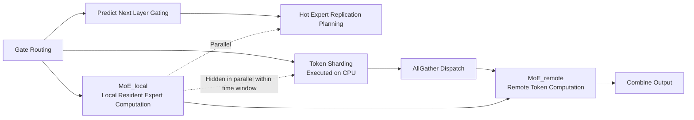

# Libra: Effective yet Efficient Load Balancing for Large-scale MoE Inference

**Conference**: ICLR 2026  
**OpenReview**: [https://openreview.net/forum?id=WhxNwgGkAS](https://openreview.net/forum?id=WhxNwgGkAS)  
**Code**: [https://github.com/SNU-ARC/Libra](https://github.com/SNU-ARC/Libra)  
**Area**: LLM Efficient Inference / MoE Systems / Load Balancing  
**Keywords**: Mixture-of-Experts, Expert Parallelism, Expert Load Balancing, Hot Expert Replication, Token Sharding, Speculative Execution  

## TL;DR
Libra achieves near-perfect load balancing for Qwen3MoE and GLM-4.5 on 8 H200 GPUs by combining "speculative execution to predict next-layer expert activation" with a "two-stage locality-aware execution flow," completely hiding the overhead of expert replication and token sharding behind MoE computation. It improves prefill throughput by up to 19.2%.

## Background & Motivation
**Background**: MoE maintains controllable inference computation while enabling model parameters to reach the trillion-level through sparse activation, serving as a cornerstone for SOTA LLMs such as DeepSeek-V3, Qwen3MoE, and GLM-4.5. The standard practice for multi-GPU serving is to use Expert Parallelism (EP) for MoE layers and Data Parallelism (DP) for non-MoE layers.

**Limitations of Prior Work**: To pursue expert specialization, next-generation MoE models have abandoned strong load-balancing losses during training. Consequently, **expert load imbalance has significantly intensified** during inference—a small number of "hot experts" receive a disproportionate number of tokens, causing the GPUs hosting them to become stragglers. Since MoE layers execute synchronously, all GPUs must wait for the most heavily loaded one. The imbalance ratio (max load / average load) has worsened from nearly 1.0 in older models to over 2.5, directly degrading end-to-end latency and throughput.

**Key Challenge**: Existing system-level solutions struggle to be both "effective" and "efficient." EPLB replicates experts periodically based on historical statistics; while efficient, it **fails to capture instantaneous request-level fluctuations**, and tokens are randomly distributed among replicas. Lina uses expert selection path lookup tables to predict hot experts in the next layer for advance replication, but its **prediction accuracy is extremely low** (only 43.7% for Qwen3MoE and 11.8% for GLM-4.5), and token distribution remains uniform. HarMoEny makes decisions only after obtaining precise routing results, which is **effective but introduces new bottlenecks** as the complex synchronous algorithm sits on the critical path.

**Goal**: To be "both effective and efficient" in both expert replication and token sharding—achieving near-optimal balance while ensuring the balancing mechanism itself incurs nearly zero overhead.

**Core Idea**: **[Prediction]** Leveraging the property that LLM hidden states evolve slowly across layers, Libra uses the current layer's hidden states to speculatively execute the next layer's gating, predicting hot experts with high accuracy for advance replication. **[Hiding Overhead]** It reconstructs the execution flow into a two-stage "local experts first, remote experts second" process, overlapping the overhead of token sharding and replication planning within the time window of local computation.

## Method

### Overall Architecture
The core innovation of Libra is **Two-Stage Locality-Aware Execution**: it splits MoE computation into MoE_local (tokens routed to resident experts on the current GPU) and MoE_remote (tokens requiring dispatch to other GPUs) based on token locality. By executing MoE_local first, the system removes the dependency on token sharding results at the start of the layer—computation begins as soon as gating is finished. This allows expensive operations like token sharding, replication planning, and metadata transmission to be executed in parallel within the MoE_local execution window. Combined with Lina-style lookahead prediction and HarMoEny-style fine-grained token sharding (offloaded to the CPU), Libra achieves both effectiveness and efficiency.

### Key Designs

**1. Two-Stage Locality-Aware Execution: Offloading Balancing Overhead to the Local Window** 
Traditional execution flows with load balancing must wait for token sharding to complete before starting MoE computation, placing sharding overhead directly on the critical path. By splitting computation into MoE_local and MoE_remote, the MoE_local phase has **zero dependency** on token sharding and can start immediately after the gating function. Only MoE_remote depends on sharding and dispatch results. This creates a time window where complex token sharding mechanisms can run in parallel with MoE_local. To further increase parallelism, Libra executes token sharding on the **CPU** rather than the GPU and uses **AllGather** (broadcasting all tokens to all GPUs) instead of All2All for dispatch. Although this increases raw communication volume, the latency impact is negligible; the key benefit is removing dispatch from the critical path, as AllGather allow dispatch to proceed in parallel with sharding.

**2. Locality-Aware Hot Expert Replication: Speculative Prediction + Dual-Objective Planning** 
For prediction, Libra employs a **lookahead predictor**: utilizing the slow evolution of Transformer hidden states, it uses the current layer's hidden states to **speculatively execute the next layer's gating function**. This runtime prediction accuracy ($70\text{-}90\%$) is significantly higher than Lina’s offline lookup tables ($11\text{-}44\%$), with negligible overhead. Regarding planning, Libra pursues both load balance and **locality enhancement**—extending the MoE_local window as much as possible to hide overhead. Planning occurs in two stages: the first stage introduces $N\times\alpha$ experts that are most frequently activated by the local tokens but are not yet resident, converting remote tokens into local computation. The second stage performs iterative load balancing, moving the hottest experts from the most heavily loaded GPU to the lightest GPUs that have not yet reached the $N$ extra expert limit. $N$ is determined by HBM capacity and the available time window, while $\alpha$ controls the proportion of the first stage. Implementation uses PyTorch SymmetricMemory for P2P transfers with an even/odd double-buffering pipeline to overlap expert loading for layer $i{+}1$ with Grouped-GEMM computation for layer $i$.

**3. Adaptive Token Sharding: Iterative Greedy Rebalancing** 
Libra adopts a fine-grained sharding algorithm similar to HarMoEny but with two key differences: it only shards **remote tokens** and the process is **offloaded to the CPU**. The main loop checks if any GPU load exceeds the target threshold. If balanced, it terminates; otherwise, it selects the most heavily loaded GPU $g_s$ and finds its hottest remote expert $e$. It then identifies the lightest GPU $g_d$ that **holds a replica of $e$ and still has capacity**. After finding a pair, it calculates the number of tokens to transfer, updates the loads for $g_s$ and $g_d$, and **immediately returns to the main loop to re-evaluate global balance**. This greedy strategy, calculated on the CPU, is entirely hidden by the MoE_local computation window.

## Key Experimental Results

**Settings**: 8×NVIDIA H200-SXM5 (141GB HBM3e, NVSwitch 900GB/s), BF16, based on SGLang v0.4.10 (core mechanisms implemented in Cython). Models: Qwen3MoE (235B) and GLM-4.5 (355B). 8 datasets used (BookCorpus, Codeforces, DeepSeek-Prover, FineWeb, GSM8K, HellaSwag, HumanEvalPlus, LMSYS-Chat-1M). Metrics: prefill throughput (tokens/s) and imbalance ratio. Baselines: vanilla SGLang, EPLB, Lina (re-implemented). Note: Experiments were designed to favor baselines (Lina used in-distribution lookup tables and 8 extra experts per GPU; EPLB used in-distribution profiling).

### Main Results: Prefill Throughput and Stability
- **Throughput**: Libra achieved the highest throughput across all models and datasets, with a maximum improvement of **19.2%** over SOTA. Even under favorable conditions for baselines, Libra remained significantly ahead for Qwen3MoE and GLM-4.5.
- **Dynamic Workload Stability**: Mixed datasets simulated workloads where imbalance drifts rapidly. While Lina/SGLang throughput fluctuated significantly as the imbalance ratio spiked, Libra kept the imbalance ratio near **1.0**, maintaining high and stable throughput decoupled from input distribution.

### Key Findings: Prediction Accuracy (Table 1, Accuracy %)

| Model | Dataset | Lina | Libra |
|------|--------|------|-------|
| Qwen3MoE | BookCorpus | 47.3 | **91.7** |
| Qwen3MoE | DeepSeek-Prover | 45.4 | **86.5** |
| Qwen3MoE | HellaSwag | 37.5 | **86.6** |
| Qwen3MoE | HumanEvalPlus | 44.5 | **87.0** |
| GLM-4.5 | BookCorpus | 11.7 | **79.6** |
| GLM-4.5 | DeepSeek-Prover | 12.7 | **72.9** |
| GLM-4.5 | HellaSwag | 11.5 | **76.6** |
| GLM-4.5 | HumanEvalPlus | 11.2 | **72.7** |

### Ablation Study: Latency Breakdown (Table 2, Qwen3MoE, seq=1024, bs=32, Units are approx. relative latency)

| Method | Token sharding | Repl. planning | MoE | Total |
|------|----------------|----------------|-----|-------|
| SGLang | 0 | 0 | 10.99 | 13.61 |
| Lina | 0.15 | 0.08 | 8.11 | 11.33 |
| **Ours** | 0.57 (Hidden) | 0.26 (Hidden) | 2.77(Local)+4.55(Remote) | **9.07** |

### Key Findings
- Libra's prediction accuracy significantly outperforms Lina, especially on GLM-4.5 where Lina predicts fewer than 1 out of the top-8 experts correctly, while Libra remains stable at 72-92%.
- Breakdown analysis shows: Although Libra introduces additional costs for metadata transmission, broadcasting, and balancing logic, these are **effectively hidden** by MoE_local/MoE_remote and do not enter the critical path. Consequently, total MoE computation time decreases significantly due to high-precision prediction, reducing Total latency by ~20% compared to Lina and ~33% compared to SGLang.

## Highlights & Insights
- **Clean perspective on the "Effective vs. Efficient" trade-off**: The paper decomposes load balancing into "expert replication" and "token sharding," each with dimensions of effectiveness and efficiency. It clearly maps where EPLB, Lina, and HarMoEny fall and how Libra picks the best of each.
- **Execution flow reconstruction is the key move**: Rather than optimizing the balancing algorithm itself, Libra reshapes the execution flow so that balancing overhead has "nowhere to hide but is hidden anyway"—the observation that MoE_local does not depend on sharding is the pivot of the design.
- **Speculative execution for expert prediction**: Exploiting the slow evolution of hidden states to speculate on the next layer's gating upgrades prediction from "history-based lookup" to "current-state-based runtime computation," jumping accuracy from 20-40% to 70-90%.
- **Trading Bandwidth for Latency**: Counter-intuitively using AllGather instead of All2All to free the critical path reflects a sound engineering judgment that latency is more scarce than bandwidth in high-speed interconnect systems.

## Limitations & Future Work
- **Prefill phase focus**: This work assumes prefill-decode disaggregated serving and only optimizes/measures the prefill stage. The imbalance characteristics and potential benefits for the decode stage (small batch, KV cache-dominated) are not addressed.
- **Single-node 8-GPU environment**: The system relies on 900GB/s high-speed P2P and SymmetricMemory. In multi-node environments (constrained NVLink or IB), the overhead of AllGather dispatch and P2P replication may no longer be negligible.
- **Predictive accuracy is not 100%**: When lookahead prediction fails, required experts are not pre-replicated. While token sharding provides a fallback, worst-case behavior under extreme drifting workloads is not deeply analyzed.
- **Hyperparameters $N$ and $\alpha$**: Currently manually configured based on VRAM and bandwidth. Adaptive selection strategies for different models and hardware are lacking.

## Related Work & Insights
- **vs. EPLB**: EPLB uses periodic static replication based on historical stats, failing to catch instantaneous fluctuations; Libra uses runtime speculative prediction for dynamic replication.
- **vs. Lina**: Both use one-layer-ahead prediction, but Libra replaces offline tables with speculative execution, increasing accuracy by an order of magnitude, and adds locality-aware planning.
- **vs. HarMoEny**: Both pursue fine-grained sharding, but HarMoEny's synchronous algorithm blocks the critical path; Libra offloads sharding to the CPU and hides it behind the MoE_local window.
- **Insight**: For any system problem where decision-making overhead sits on the critical path, instead of just compressing the algorithm, one should look for "computation independent of the decision" to parallelize and hide the cost. MoE_local provides exactly such a window in MoE inference. This idea could migrate to KV cache scheduling or speculative decoding verification.

## Rating
- **Novelty**: ⭐⭐⭐⭐ The combination of two-stage locality-aware execution and speculative prediction for expert activation is a novel execution flow reconstruction. While individual components (prediction = Lina, sharding = HarMoEny) have precedents, the "using local computation windows to hide balancing overhead" paradigm is truly innovative.
- **Experimental Thoroughness**: ⭐⭐⭐⭐ Evaluated on two SOTA LLMs, 8 datasets, and multiple dimensions (throughput, imbalance, accuracy, latency breakdown). Leading even under favorable conditions for baselines is persuasive. Deducted slightly for only measuring prefill and single-node environments.
- **Writing Quality**: ⭐⭐⭐⭐ Problem decomposition is clear, the quadrant positioning of baselines is accurate, and diagrams (execution flow, replication planning) are intuitive.
- **Value**: ⭐⭐⭐⭐ Load balancing in large-scale MoE inference is a major pain point. 19.2% throughput improvement, open-source code, and integration with SGLang provide high engineering value for immediate adoption in serving systems.

<!-- RELATED:START -->

## Related Papers

- [\[ICLR 2026\] Scaling Large Vision-Language Model RL Training via Efficient Load Balancing](scaling_large_vision-language_model_rl_training_via_efficient_load_balancing.md)
- [\[ICLR 2026\] Semantic Parallelism: Redefining Efficient MoE Inference via Model-Data Co-Scheduling](semantic_parallelism_redefining_efficient_moe_inference_via_model-data_co-schedu.md)
- [\[ICLR 2026\] DualMap: Enabling Both Cache Affinity and Load Balancing for Distributed LLM Serving](dualmap_enabling_both_cache_affinity_and_load_balancing_for_distributed_llm_serv.md)
- [\[ICLR 2026\] Inference-Cost-Aware Dynamic Tree Construction for Efficient Inference in Large Language Models](inference-cost-aware_dynamic_tree_construction_for_efficient_inference_in_large_.md)
- [\[ICLR 2026\] Wide-In, Narrow-Out: Revokable Decoding for Efficient and Effective DLLMs](wide-in_narrow-out_revokable_decoding_for_efficient_and_effective_dllms.md)

<!-- RELATED:END -->
