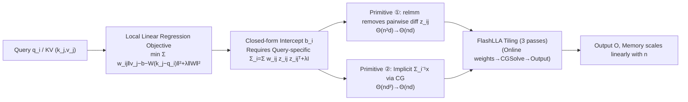

# Local Linear Attention: An Optimal Interpolation of Linear and Softmax Attention for Test-Time Regression

**Conference**: ICLR 2026  
**OpenReview**: [https://openreview.net/forum?id=WGpzi489XY](https://openreview.net/forum?id=WGpzi489XY)  
**Code**: TBD  
**Area**: Efficient Attention / Sequence Modeling Architectures  
**Keywords**: Local Linear Attention, Test-Time Regression, Non-parametric Statistics, Bias-Variance Tradeoff, FlashLLA, Associative Memory  

## TL;DR
Viewing attention as a "test-time regression solver," the authors upgrade Softmax attention using **local linear regression** from statistics to derive Local Linear Attention (LLA). LLA combines the asymptotic convergence of linear attention with the strength of Softmax. Additionally, a hardware-efficient FlashLLA tiling algorithm is designed to reduce the memory complexity of a naive implementation from quadratic back to linear.

## Background & Motivation
**Background**: Research on efficient attention (Linear Attention, SSMs like Mamba) has focused on reducing costs for long sequences by using fixed-size hidden states to lower complexity from quadratic to linear. however, design elements like gating and forgetting factors are mostly heuristic. The recent **test-time regression** perspective (Wang et al., 2025) unifies attention variants as "test-time optimizers solving a regression problem layer-by-layer": keys $k_j$ are features, values $v_j$ are labels, and queries $q_i$ are test points.

**Limitations of Prior Work**: Under this perspective, linear attention families solve a **global linear regression** (parametric model), which suffers from irreducible approximation errors when the true mapping is not globally linear. Softmax attention is equivalent to **Nadaraya-Watson (NW) kernel regression** (local constant model), which is non-parametric and asymptotically converges but suffers from severe "boundary bias" at the edge of data support—a frequent occurrence in autoregressive prediction. Both sides have performance ceilings.

**Key Challenge**: While research is focused on efficiency, few have explored directions that are "statistically more accurate, even if more expensive"—does there exist an attention mechanism more accurate than Softmax that continuously improves as in-distribution data increases?

**Goal**: Systematically analyze the design space of attention from a test-time regression framework, propose an attention mechanism that is **strictly superior** to Linear and Softmax in the bias-variance tradeoff, and solve its computational/memory challenges.

**Core Idea**: **Replace the local constant regression of Softmax with local linear regression**. In statistics, the standard remedy for "boundary bias" is upgrading local constant (NW) to local polynomials. LLA is the natural application of this upgrade to attention. Formally, it results in "linear prediction + local kernel regression for residual correction," effectively **interpolating** between Linear and Softmax.

## Method

### Overall Architecture
Instead of fitting a constant $\theta$ at each query $q_i$, LLA fits a **local linear function centered at $q_i$**: $f(x)=b+W(x-q_i)$, taking the intercept $\hat f(q_i)=\hat b_i$ as the prediction. This upgrades Softmax's "locally weighted average" to a "locally weighted linear fit." The cost is the need to maintain a **query-specific** preconditioning matrix, preventing it from being compressed into a fixed-size recursive state like linear attention; thus, it inherently requires $\Theta(nd)$ KV cache (similar to Softmax). The paper subsequently uses two memory primitives plus the FlashLLA tiling algorithm to reduce naive $\Theta(n^2d)$ and $\Theta(nd^2)$ memory to $\Theta(nd)$.

### Key Designs

**1. Closed-form Solution for Local Linear Regression: Transforming "Intercept Extraction" into Computable Attention.** At query $q_i$, solve the ridge-regularized local linear objective: $\min_{f}\frac12\sum_j w_{ij}\lVert v_j-b-W(k_j-q_i)\rVert^2+\lambda\lVert W\rVert_F^2$, where $w_{ij}$ is the kernel weight. Since the test value is only $\hat f(q_i)=\hat b_i$, only the intercept needs derivation. Defining $z_{ij}=k_j-q_i$ and query-specific statistics $\omega_i=\sum_j w_{ij}$, $\mu_i=\sum_j w_{ij}z_{ij}$, and $\Sigma_i=\sum_j w_{ij}z_{ij}z_{ij}^\top+\lambda I$, with $\rho_i=\Sigma_i^{-1}\mu_i$, the intercept has the closed form $\hat b_i=\sum_j s_{ij}v_j$, where $s_{ij}=w_{ij}\frac{1-z_{ij}^\top\rho_i}{\omega_i-\mu_i^\top\rho_i}$. The key difference from MesaNet (which maintains a global preconditioning matrix $H_i$) is that $\Sigma_i$ is **centered around the current query $q_i$**; every position is different, which is the root of its superior expressivity and higher cost.

**2. Interpolation Perspective: LLA as "Linear Prediction + Residual Kernel Regression."** Rewriting the closed-form solution into a more interpretable form: given weight $\hat W_i$, then $\hat b_i=\sum_j s_{ij}(v_j-\hat W_i k_j)+\hat W_i q_i$, where $s_{ij}=w_{ij}/\sum_{j'}w_{ij'}$ are standard Softmax weights. The first term is a local constant (Softmax-style) regression on the **residuals** $v_j-\hat W_i k_j$, and the second term is a **linear prediction** based on $\hat W_i$. When $\hat W_i$ is optimally solved, it recovers LLA; if $\hat W_i$ is allowed to degenerate into a recursive state like linear attention, it slides between the two ends. This formula explains why LLA contains traces of both Linear and Softmax and provides a template for new algorithms (e.g., plugging DeltaNet/Mamba into the $\hat W_i$ term).

**3. Two Memory Primitives: Compressing Naive Bottlenecks to Linear.** A naive implementation has two bottlenecks. First, materializing pairwise differences $z_{ij}=k_j-q_i$ for all $j \le i$ requires $\Theta(n^2d)$. The authors observe that $\mu_i, \Sigma_i$ and the inner product $z_{ij}^\top x_i$ allow the **algebraic separation** of $k_j$ and $q_i$. By computing query-independent $\tilde\mu_i=\sum_j w_{ij}k_j$ and $\tilde\Sigma_i=\sum_j w_{ij}k_jk_j^\top+\lambda I$ first, then shifting to centered statistics $\mu_i=\tilde\mu_i-\omega_i q_i$ and $\Sigma_i=\tilde\Sigma_i-\tilde\mu_i q_i^\top-q_i\tilde\mu_i^\top+\omega_i q_i q_i^\top$, memory is reduced to $\Theta(nd)$, abstracted as the operator `relmm(X,Q,K)=XKᵀ-brsum(X⊙Q)`. Second, solving the linear system $\Sigma_i^{-1}x_i$ for each $i$ via direct inversion takes $\Theta(nd^2)$. Following MesaNet, the authors use **Conjugate Gradient (CG)**. Leveraging the rank-one sum structure of $\Sigma_i$, only matrix-vector products $\Sigma_i p$ are needed. $\Sigma_i$ is never materialized, maintaining $\Theta(nd)$ memory.

**4. FlashLLA: A Hardware-Efficient 3-Pass Tiling Algorithm.** Representing the forward pass in matrix form and utilizing online kernel weights, FlashLLA tiles by query blocks $B_r$ and KV blocks $B_c$, similar to FlashAttention. It executes **three passes** over KV blocks for each query block: the first pass accumulates statistics $M_r, \omega_r$ (using running max $m_r$ for numerical stability); the second pass uses `CGSolve` to solve all $\Sigma_i^{-1}\mu_i$ in parallel; the third pass computes output $O_r$ using results and $V_c$, writing intermediate variables back to HBM for the backward pass. Implemented in ~500 lines of Triton, it reduces the quadratic memory of the naive method on an H200 to linear growth with sequence length.

## Key Experimental Results
Experiments focus on synthetic tasks to isolate test-time adaptation capabilities (not large-scale LLMs).

### Main Results

| Task | Setup | Key Findings |
|------|------|----------|
| Test-time Regression (Piecewise Linear, Non-stationary) | Single layer, no projection training, $L=1024$, scanning segment length $S$ and dimension $d$ | LLA **continuously improves** as in-distribution data increases within each segment, outperforming all baselines. MesaNet performs best only in the first segment and degrades for later segments. Softmax does not benefit from more in-distribution data. |
| Dimension Scalability | MSE Ratio $\sum\ell^{\text{Model}}/\sum\ell^{\text{LLA}}$ | LLA's relative advantage expands as dimension $d$ increases, suggesting potential for larger models/datasets. |
| In-context Regression (Parametric Projection) | Two layers, no MLP, $d_x=d_y=32$ | LLA consistently outperforms Softmax / Mamba / GLA / Hyena / Gated DeltaNet across all segment lengths, with greater advantages at smaller $S$. |
| Associative Recall MQAR (Zoology) | Fair comparison without short conv, $\lVert A_k\cup A_v\rVert=8\text{k}$ | LLA's advantages transfer to discrete token prediction, leading in recall accuracy. |
| Permutation State Tracking | Swapped instruction sequences, scanning position $N$ | LLA is **on par** with Softmax—aligning with theoretical expectations: constant-depth Softmax is limited by $\text{TC}^0$, and LLA only adds constant circuit layers. |

### Memory & Efficiency

| Metric | Naive LLA | FlashLLA |
|------|----------|----------|
| Working Set Memory vs Sequence Length | Quadratic growth, OOM at long sequences/large batches | $\Theta(nd)$ Linear growth |
| I/O Complexity (Constant CG Iterations) | — | $\Theta(nd+n^2)$, same as FlashAttention (with slightly higher constant factor) |
| Triton Implementation | — | ~500 lines, verified on H200 |

### Key Findings
- **Theoretical separation supports design**: Proposition 2.1 proves that when the true function is not globally linear, global linear estimation error is $\Omega(1)$, while NW (local constant) is $O(n^{-3/(d+3)})$. Proposition 2.2 proves that with large boundary gradients, NW is $\Omega(n^{-3/(d+3)})$ while local linear LLA is $O(n^{-4/(d+4)})$.
- **Non-stationarity is LLA's strength**: On piecewise linear data, LLA adapts quickly to distribution shifts and continuously converges within segments—achieving what MesaNet (good at global linearity but bad at shifts) and Softmax (no improvement with data) cannot.
- **Circuit complexity limits state tracking**: LLA only adds a query-specific first-order correction (constant layers) to Softmax, so it does not exceed the $\text{TC}^0$ limit of Softmax.

## Highlights & Insights
- **Reconnecting attention design to established non-parametric statistics**: Softmax = Nadaraya-Watson regression → known boundary bias → standard statistical fix is local polynomials → LLA. This clean derivation replaces heuristics with principles.
- **The "interpolation" template is reusable**: The formula $\hat b_i=\sum_j s_{ij}(v_j-\hat W_i k_j)+\hat W_i q_i$ unifies Linear's "linear prediction" and Softmax's "residual kernel regression." Future work can plug any linear attention (DeltaNet/Mamba) into $\hat W_i$.
- **Counter-trend research direction**: While others optimize for "cheaper," this work chooses "better, even if more expensive," proving the statistical bias-variance advantage.
- **Making theory runnable**: `relmm` + `CG` + `FlashLLA` tiling reduces a seemingly $\Theta(n^2d)/\Theta(nd^2)$ mechanism to FlashAttention-level I/O.

## Limitations & Future Work
- **Higher computation/IO than Softmax**: Matrix inversion is expensive; CG saves memory but increases R/W cycles. Approximations to reduce FLOPs are a priority.
- **No verification on real LLMs**: Experiments are restricted to synthetic/medium tasks. Training LLMs with PyTorch is currently infeasible due to complexity; extensive kernel engineering is needed for stability.
- **Numerical stability**: Inversion is precision-sensitive; direct implementation with bf16/fp8 may lead to performance drops.
- **Future Work**: Fusing SOTA linear attention via the interpolation template; introducing sliding windows/sparsity; scaling FlashLLA to full LLM pre-training.

## Related Work & Insights
- **Test-time regression perspective** (Wang et al., 2025) is the theoretical foundation: Attention = layer-wise regression solver. LLA is the natural extension of upgrading local constants to local linear models.
- **MesaNet** (von Oswald et al., 2025): A linear attention variant that solves global linear regression using CG. LLA adopts the CG approach but replaces **global** preconditioning with **query-centered** preconditioning.
- **Linear Attention / SSM Family** (GLA, Mamba, etc.): Viewed as LLA's interpolation counterpart where $H_i \approx I$ or a single gradient step is used.
- **Heuristic**: When a deep learning module maps to a classic statistical estimator, the "known flaw of the estimator + standard statistical remedy" often provides a high-quality path for architectural improvement.

## Rating
- **Novelty**: ⭐⭐⭐⭐⭐
- **Experimental Thoroughness**: ⭐⭐⭐
- **Writing Quality**: ⭐⭐⭐⭐
- **Value**: ⭐⭐⭐⭐

<!-- RELATED:START -->

## Related Papers

- [\[ICLR 2026\] Log-Linear Attention](log-linear_attention.md)
- [\[ICLR 2026\] RACE Attention: A Strictly Linear-Time Attention Layer for Training on Outrageously Large Contexts](race_attention_a_strictly_linear-time_attention_layer_for_training_on_outrageous.md)
- [\[ICML 2026\] Dynamic Linear Attention](../../ICML2026/llm_efficiency/dynamic_linear_attention.md)
- [\[ICLR 2026\] FlexLinearAttention: Compiling a Unified Abstraction into Scalable Kernels for Linear Attention](flexlinearattention_compiling_a_unified_abstraction_into_scalable_kernels_for_li.md)
- [\[ICLR 2026\] MesaNet: Sequence Modeling by Locally Optimal Test-Time Training](mesanet_sequence_modeling_by_locally_optimal_test-time_training.md)

<!-- RELATED:END -->
