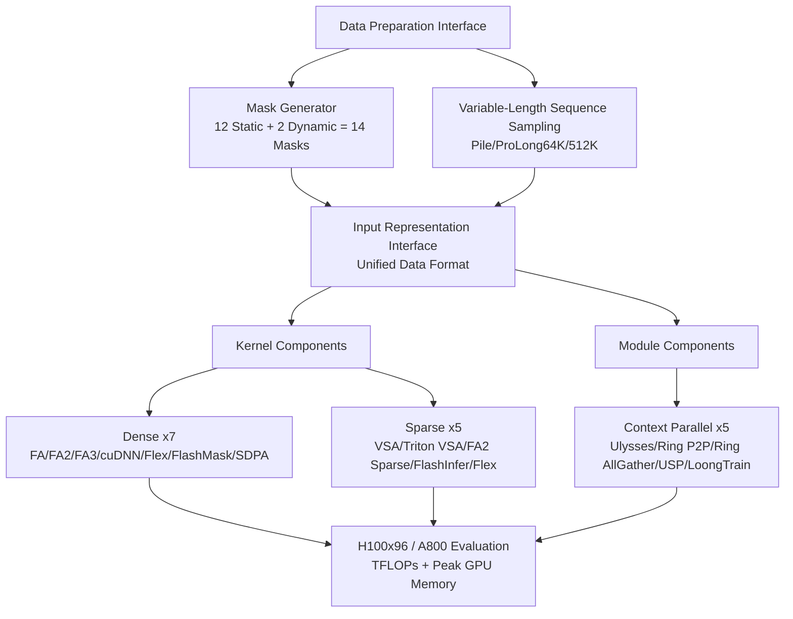

# Long-Context Attention Benchmark: From Kernel Efficiency to Distributed Context Parallelism

**Conference**: ICLR 2026  
**OpenReview**: [https://openreview.net/forum?id=W7sVYFJAEp](https://openreview.net/forum?id=W7sVYFJAEp)  
**Code**: [https://github.com/NJUDeepEngine/LongCA-bench](https://github.com/NJUDeepEngine/LongCA-bench)  
**Area**: LLM Efficient Training / Long Context / Attention Systems  
**Keywords**: Long-context attention, attention operators, context parallelism, sparse attention, distributed training, Benchmark  

## TL;DR
This paper introduces **LongCA-bench**, a long-context attention benchmark that unifies 7 dense operators, 5 sparse operators, and 5 context parallelism mechanisms under a single data interface. Using up to 96 H100 GPUs and 768K sequence lengths, the study systematically evaluates the speed/memory trade-offs of various methods across a three-dimensional space of "mask patterns × sequence length × distributed scale."

## Background & Motivation
**Background**: The softmax attention of Transformers experiences $O(n^2)$ growth in computation and memory relative to sequence length, which constitutes the primary bottleneck in long-context training. The community addresses this through two main routes: **operator-level optimization** (FlashAttention series, cuDNN Fused, sparse kernels for single-card acceleration) and **module-level context parallelism**, which partitions long sequences across multiple GPUs (Ulysses, Ring Attention, USP, LoongTrain, etc.).

**Limitations of Prior Work**: Evaluation remains severely fragmented. Support for mask patterns varies significantly across operators, and performance can differ vastly for the same operator under different masks. Furthermore, most context parallelism methods are deeply coupled with specific training frameworks (DeepSpeed, InternEvo), making them difficult to reuse or compare fairly.

**Key Challenge**: Researchers lack a clear understanding of the real trade-offs between different methods. Engineers face a lack of reliable reference baselines when selecting attention mechanisms for long-context training—practical questions such as "which kernel to use with which parallelism under specific sequence lengths and masks" remain unanswered.

**Goal**: The objective is to build a fair, unified, and extensible benchmark that incorporates representative operators and context parallelism mechanisms into a single data preparation and invocation interface. This allows for large-scale reproduction experiments across the critical dimensions of "mask patterns" and "sequence length × distributed scale."

**Key Insight**: **[Unified Interface + 3D Evaluation]** By utilizing a unified data preparation/input representation interface to eliminate inconsistencies in data formats across operators, experiments were conducted on the Cartesian product of 14 mask types, 1K–768K sequences, and 8–96 GPUs. This marks the first time that dense operators, sparse operators, and distributed parallelism methods are compared within a single coordinate system.

## Method

### Overall Architecture
LongCA-bench consists of three main components: a **data preparation interface** (unified mask generation + variable-length sampling), an **input representation interface** (connecting 7 dense + 5 sparse kernels), and a **context parallelism framework** (unifying and optimizing 5 distributed attention mechanisms). All methods share the same pipeline of "unified data format $\rightarrow$ kernel-specific adapter," ensuring comparability across methods.

### Key Designs

**1. Unified Data Preparation: Treating Mask Patterns as First-Class Citizens.** Rather than simply feeding downstream datasets, the benchmark designs a specialized data preparation interface that combines diverse mask patterns with variable-length sequence sampling. The authors categorize attention masks into **14 patterns**: 12 static masks (6 regular masks like FULL/CAUSAL/Sliding Window/Document variants, and 6 heterogeneous masks like Shared Question, Global Sliding, Causal Blockwise, Prefix LM, Block Causal Document) plus 2 dynamic block-sparse masks (uniform vs. variable-length blocks). Whether a mask can be predetermined before training distinguishes static from dynamic types. While this dimension was often overlooked, experiments show it significantly impacts efficiency, scalability, and usability—for instance, the FA series and cuDNN do not support heterogeneous masks.

**2. Operator-Level Unified Adaptation and Sparse Characterization.** For dense operators, naive stepwise attention and PyTorch SDPA serve as baselines that theoretically support any mask but have $O(S^2)$ complexity. These are compared against FA/FA2/FA3, cuDNN Fused (hardware-optimized), FlexAttention (generates specialized kernels via bitwise Boolean functions, compatible with any mask, nearly $O(S^2)$ memory), and FlashMask (optimizes heterogeneous computing with column-wise mask representation). For sparse operators, 5 block-sparse kernels are divided into: **Specialized Block-Sparse** (VSA, Triton VSA, FA2 Sparse, optimized for fixed block sizes like 64×64) and **General Block-Sparse** (FlexAttention, FlashInfer, supporting arbitrary/variable blocks). Each kernel is equipped with a specific adapter to resolve inconsistencies in data representation. The sparse sampling process is simplified by randomly generating block masks based on target sparsity rates (0.2/0.5/0.8) to purely evaluate kernel performance.

**3. Unified Implementation and Architecture Categorization of Context Parallelism.** The authors implemented and optimized 5 distributed attention mechanisms within a unified infrastructure, identifying three architectural categories: **All-to-All based** (Ulysses, which partitions sequence and head dimensions and uses All-to-All to switch parallelism dimensions, offering numerical precision but restricted scalability due to head count); **Ring P2P based** (Ring P2P via multi-round circular point-to-point and Ring All-Gather via single KV all-gather, offering high scalability and overlapping computation with communication, though with lower efficiency and cumulative numerical errors); and **Hybrid** (USP and LoongTrain, which extend Ulysses and Ring into a 2D scheme where inner All-to-All utilizes intra-node bandwidth and outer Ring improves cross-node scalability; LoongTrain further optimizes communication with a DoubleRing sliding window). Implementation draws from TransformerEngine, achieving load balance through **dual-parallel partitioning + head/tail rearrangement**, utilizing double-buffering and multi-stream overlapping, and precomputing metadata needed for distributed strategies to reduce synchronization overhead.

**4. Theoretical Communication Analysis.** In addition to empirical measurements, the authors provide a theoretical characterization of **per-device communication volume** for each context parallelism pipeline (covering forward/backward passes, communication operators, frequency, and data types). For example, the forward communication for Ulysses is $\frac{N-1}{N^2}t(h_{kv}+h_q)d\cdot2$, while for Ring P2P it is $\frac{N-1}{N}th_{kv}d\cdot2$. Hybrid architectures reduce the single-message communication volume from $D\times(N-1)/N$ in Ulysses to $D\times(8-1)/N$, allowing theoretical conclusions to align with empirical trends.

## Key Experimental Results

Experiments were conducted on up to **96 H100 (80GB HBM3) GPUs across 12 servers**, with some kernel experiments also run on A800. Speed is measured in TFLOPs/s and memory in GB.

### Main Results

| Evaluation Dimension | Setup | Key Conclusions |
|---|---|---|
| Dense kernels | 12 static masks, 1K–48K lengths, GQA(64:8)/MHA(64:64) | FA3 (Hopper-specific) is fastest for regular masks on H100; only Flex/FlashMask/SDPA/naive support heterogeneous masks; naive and SDPA are unusable for long sequences due to $O(S^2)$. |
| Sparse kernels | 64/128 blocks, 32K–128K lengths, 50% sparsity | VSA achieves the highest performance but only supports block size 64 and lacks GQA support; FlashInfer (block 128) significantly outperforms block 64 but prone to OOM on small blocks/long sequences; FA2 Sparse does not support block 64. |
| Context Parallelism | 8K per card, 8→96 GPUs, 64K→768K lengths, GQA(64:8) | Hybrid architectures (USP/LoongTrain) are overall optimal; Ulysses provides perfect load balancing but is head-count limited; Ring P2P is optimal under FULL mask but fluctuates under DOCUMENT mask due to variable-length padding. |

### Key Findings
- **The mask dimension is significantly underestimated**: Performance for the same operator can vary several-fold depending on the mask. Furthermore, the FA series and cuDNN have zero support for heterogeneous masks; kernel selection must account for the target mask first.
- **Sparse kernels win by "specialization"**: Kernels customized for specific block sizes or architectures (e.g., VSA) consistently outperform general implementations. However, **backpropagation is a universal bottleneck**, and since some kernels like FlashInfer only support the forward pass, the deployment of trainable sparse attention remains limited.
- **Distributed: Partitioning heads first provides the greatest gain**. Utilizing MHA to perform head partitioning (inner Ulysses layer) before stacking Ring parallelism yields the best performance. The two-level P2P in LoongTrain provides a slight speedup in the forward pass, but because extra window synchronization prevents direct backpropagation continuation, the total gain is neutralized.
- **GQA saves memory**: Performance differences between GQA and MHA on sparse kernels are minimal, but GQA offers better memory efficiency.

## Highlights & Insights
- **Establishing the "mask pattern" as a primary evaluation dimension** provides a valuable systematization of the long-context attention ecosystem.
- **Bridging the operator and module layers**: Few works bring single-card kernels and multi-card context parallelism into the same fair framework; this "kernel-to-distributed" full-stack perspective is a major engineering contribution.
- **Theoretical communication vs. empirical validation**: The paper goes beyond benchmarking numbers by providing per-device communication formulas that explain "why hybrid architectures are faster," offering direct guidance for system designers.
- **Exposing real-world engineering constraints**: The authors clearly identify bottlenecks such as backpropagation, variable-length padding, OOM, and head count limits, making the findings highly practical for deployment.

## Limitations & Future Work
- **Mask support is limited by underlying parallel design**: The context parallelism component currently only supports FULL, CAUSAL, and FULL/CAUSAL DOCUMENT masks; heterogeneous and dynamic masks have not yet been integrated for distributed settings.
- **Simplification of sparse sampling**: The use of random block masks to simulate sparsity does not involve real importance scoring or top-K selection, creating a gap between the benchmark and true sparsity patterns in end-to-end training.
- **Efficiency as the sole metric**: The benchmark measures speed and memory but does not evaluate the impact of these operators/parallelism strategies on final model accuracy.
- **Limited hardware coverage**: Evaluation primarily focused on H100/A800 architectures; whether conclusions generalize to other architectures (e.g., consumer GPUs) requires further validation.

## Related Work & Insights
- **Long-context Modeling**: Context windows extending from 4K to 1M/10M drive the need for long-document reasoning and retrieval, which this benchmark addresses.
- **Attention Operators**: Hardware-efficient (FlashAttention), low-bit quantization, sparse kernels, and KV cache compression (GQA) are the focus areas integrated into the dense/sparse categories.
- **Distributed Parallelism**: While traditional parallelisms (Data/Tensor/Pipeline/MoE) partition specific dimensions, they fail to resolve the activation memory issues of ultra-long sequences. Context parallelism partitions by sequence, but challenges in overlapping, balancing, and scalability remain—which this study quantifies.
- **Insight**: For system designers, this acts as a "map" for selection. For developers of new operators or parallelism strategies, it defines a fair protocol for benchmarking future methods.

## Rating
- **Novelty**: ⭐⭐⭐⭐ While the benchmark uses existing algorithms, the 3D unified evaluation and full-stack integration across operators and parallelism are systematic firsts.
- **Experimental Thoroughness**: ⭐⭐⭐⭐⭐ The scale and coverage (96 H100s, 768K sequences, 14 masks, 17 methods) are rare among similar benchmarks.
- **Writing Quality**: ⭐⭐⭐⭐ Clear structure, systematic charts, and alignment between theory and measurement; some conclusions rely heavily on appendix charts.
- **Value**: ⭐⭐⭐⭐⭐ Directly addresses the engineering challenge of kernel/parallelism selection for long-context training. Open-sourced code ensures high reproducibility and extensibility.

<!-- RELATED:START -->

## Related Papers

- [\[ICLR 2026\] Retrospective Sparse Attention for Efficient Long-Context Generation](retrospective_sparse_attention_for_efficient_long-context_generation.md)
- [\[ICLR 2026\] AutoSP: Unlocking Long-Context LLM Training Via Compiler-Based Sequence Parallelism](autosp_unlocking_long-context_llm_training_via_compiler-based_sequence_paralleli.md)
- [\[ICLR 2026\] Tactic: Adaptive Sparse Attention with Clustering and Distribution Fitting for Long-Context LLMs](tactic_adaptive_sparse_attention_with_clustering_and_distribution_fitting_for_lo.md)
- [\[ICLR 2026\] Revisiting Long-context Modeling from Context Denoising Perspective](revisiting_long-context_modeling_from_context_denoising_perspective.md)
- [\[ICLR 2026\] FSA: An Alternative Efficient Implementation of Native Sparse Attention Kernel](fsa_an_alternative_efficient_implementation_of_native_sparse_attention_kernel.md)

<!-- RELATED:END -->
