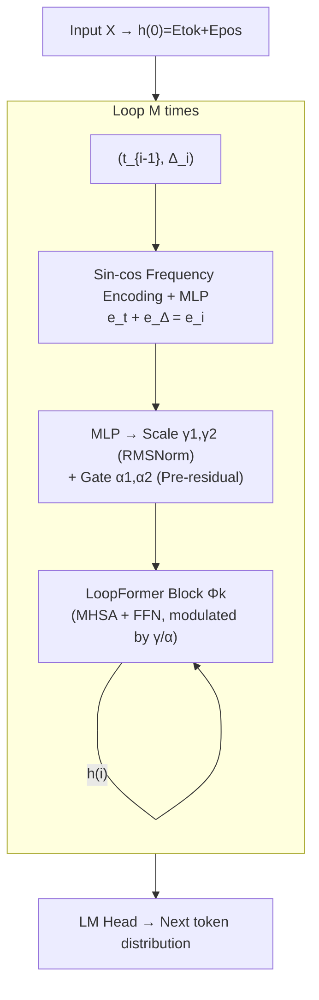

# LoopFormer: Elastic-Depth Looped Transformers for Latent Reasoning via Shortcut Modulation

**Conference**: ICLR 2026  
**OpenReview**: [https://openreview.net/forum?id=RzYXb5YWBs](https://openreview.net/forum?id=RzYXb5YWBs)  
**Code**: [https://loopformer.github.io](https://loopformer.github.io)  
**Area**: LLM Efficient Inference / Elastic Depth / Looped Transformer  
**Keywords**: Looped Transformer, Latent Reasoning, Elastic Depth, Budget-Conditioned Inference, Shortcut Consistency, Trajectory Modeling  

## TL;DR
LoopFormer explicitly conditions each iteration of a looped Transformer on a "normalized time $t$ + step size $\Delta t$" and uses shortcut-consistency training to align trajectories of different lengths to the same endpoint. This enables a single model to gracefully scale its depth based on any **arbitrarily specified inference budget $M$ without retraining**, avoiding the representation collapse typical of naive early exiting.

## Background & Motivation
**Background**: Looped or weight-sharing Transformers (e.g., Universal Transformer, ALBERT, Recurrent Depth) have demonstrated strong inductive biases for algorithmic and reasoning tasks. They can internalize "latent reasoning" similar to chain-of-thought within hidden states, with reasoning capabilities improving smoothly as the effective computational depth (number of loops) increases.

**Limitations of Prior Work**: Most existing looped models utilize a **fixed number of loops $L$** during both training and inference. Representations tend to collapse when evaluated at shorter or longer depths post-training because those depths are off-distribution. Consequently, looped models often consume the same FLOPs as non-looped baselines of equivalent compute, losing their primary selling point of "flexible computation."

**Key Challenge**: Users desire high-quality representations given an arbitrary budget $M$. However, integrating dynamic computation techniques like early exiting, routing, or layer dropping into looped architectures is fragile. Shared blocks often converge to stagnant states where short routes are degenerate and long routes fail to refine further.

**Goal**: Train a looped model with **elastic depth**—a single model that performs well under any user-chosen budget without retraining or late-stage degradation.

**Key Insight**: **Model iterative representation refinement as a trajectory in representation space**, where the token state evolves from $h_0$ to a destination $h_1$ over a normalized unit time $[0, 1]$. Inspired by shortcut/one-step distillation in diffusion models and Neural ODEs, **each loop is made aware of its current time and step size**. This allows coarse-grained trajectories to approximate fine-grained ones using fewer steps, while a consistency loss aligns the endpoints of short trajectories with the full $L$-step trajectory (intra-loop self-distillation).

## Method

### Overall Architecture
LoopFormer is a decoder-only looped Transformer where a group of $k$ shared blocks $\Phi_k(\cdot)$ is applied recursively $M$ times ($1 \le M \le L$), denoted as $(k \otimes L)$. The distinct feature is that **each loop $i$ is conditioned on $(t_{i-1}, \Delta_i)$**, where $0 = t_0 < t_1 < \dots < t_M = 1$ are cumulative normalized timestamps and $\Delta_i = t_i - t_{i-1}$ is the step size. During training, the model processes both a full trajectory $\Delta_L$ and a randomly sampled short trajectory $\Delta_S$, using a consistency loss to align them.

### Key Designs

**1. Trajectory Conditioning (Time + Step Size):**
Unlike models that only use "loop index" as time, LoopFormer conditions each loop on **two scalars**: the cumulative normalized time $t_{i-1} \in [0, 1]$ and the step size $\Delta_i \in (0, 1]$. Both are sin-cos frequency encoded and projected via an MLP to $e_t, e_\Delta$, resulting in $e_i = e_t + e_\Delta$. This signal modulates the blocks via adaptive RMSNorm scales $(\gamma_1, \gamma_2)$ and pre-residual gates $(\alpha_1, \alpha_2)$. **The step size dimension is critical**, as it allows the same parameters to switch between "coarse large jumps" and "fine small steps."

**2. Shortcut-consistency Training:**
To prevent late-stage stagnation, each batch samples a short trajectory length $S \sim \mathcal{U}\{1, \dots, L-1\}$ alongside the full trajectory $L$. A step schedule $\Delta_S$ is sampled such that $\sum_{i=1}^S \Delta_i = 1$. The total loss is:

$$\mathcal{L} = \mathcal{L}_L + \lambda_1 \mathcal{L}_S + \lambda_2 \mathcal{L}_{\text{cons}},$$

where the consistency term

$$\mathcal{L}_{\text{cons}} = \big\lVert \text{stopgrad}(h^{(L)}) - h^{(S)} \big\rVert^2$$

pulls the representations of short trajectories toward the endpoint of the full trajectory using self-distillation. This ensures short paths remain informative while long paths continue to refine.

**3. Elastic-Depth Inference:**
Users select a budget $M \le L$ and a step schedule $\Delta_M$. The model runs $M$ iterations $h^{(i)} = \Phi_k(h^{(i-1)}; t_{i-1}, \Delta_i)$. Due to the consistency alignment, performance improves **smoothly with compute** instead of collapsing at short depths. While uniform steps $\Delta_i = 1/M$ are the default, the authors found that **coarse steps early and fine steps late** often yield better results.

## Key Experimental Results

**Settings**: 24-layer / ~1B parameter non-looped Transformer as an iso-FLOP anchor; NanoGPT-style decoder; trained on 25B tokens of The Pile. Evaluated on FineWeb-Edu/OpenWebText for PPL and 10 zero-shot reasoning benchmarks.

### Main Results ($(3 \otimes 8)$ across budgets)

| Budget | Model | Pile PPL ↓ | Avg Zero-Shot Acc ↑ |
|:-------|:------|:-----------|:--------------------|
| 24× | Base (24⊗1, Non-looped) | **9.49** | **45.27** |
| 24× | Base-Loop (3⊗8) | 10.91 | 42.88 |
| 24× | TMLT (3⊗8) | 10.38 | 44.69 |
| 24× | **LoopFormer (3⊗8)** | **10.28** | 44.81 |
| 12× | Base (12⊗1) | 9.98 | 44.93 |
| 12× | TMLT-EE (3⊗4) | 12.18 | 41.5 |
| 12× | **LoopFormer (3⊗4)** | **11.12** | **43.73** |
| 6× | Base (6⊗1) | 11.13 | 42.73 |
| 6× | TMLT-EE (3⊗2) | 15.79 | 37.59 |
| 6× | **LoopFormer (3⊗2)** | **14.30** | **40.36** |

**Key Findings**: LoopFormer achieves the best PPL and reasoning performance among looped baselines. As the budget tightens (6×/12×), its advantage over early-exiting baselines (TMLT-EE) widens significantly, as the latter suffers from severe PPL spikes at low budgets.

### Ablation Study
- **Representation Dynamics**: Baseline early-exiting models exhibit flat curvature and high CKA similarity across layers, indicating stagnation. LoopFormer maintains higher curvature and entropy in mid-stages followed by convergence at the end, suggesting continuous refinement.
- **Trajectory Selection**: Given a fixed budget, different step schedules impact performance. The "coarse-to-fine" strategy (larger steps initially) is generally superior.

## Highlights & Insights
- **Budget Control in Looped Models**: LoopFormer provides a clean, sequence-level budget conditioning scheme using a "time trajectory" perspective, allowing for any inference depth after a single training run.
- **Criticality of Step Size**: Conditioning only on loop indexes is insufficient; adding the "how large is the jump" dimension is the mathematical prerequisite for enabling coarse and fine trajectories to approximate each other.
- **Geometric Diagnostics**: The use of anisotropy, curvature, entropy, and CKA effectively visualizes "representation collapse" and provides evidence of whether looped models are successfully utilizing their depth.

## Limitations & Future Work
- **Global vs. Local Budgeting**: The budget is applied at the sequence level rather than being instance- or token-adaptive (like Mixture-of-Recursions).
- **Training Overhead**: Consistency training requires processing an additional short trajectory per batch, increasing computational costs during training.
- **Scale**: Experiments are limited to the ~1B parameter / 25B token scale; validation on larger models and instruction-tuning scenarios is needed.

## Related Work & Insights
- **Looped Transformers**: Universal Transformer, ALBERT, TMLT (which uses loop indexes as timesteps). LoopFormer improves upon TMLT by adding step-size conditioning and multi-trajectory consistency.
- **Dynamic Computation**: LayerSkip, CALM, MoE, and Mixture-of-Depths. LoopFormer follows the "budget-conditioned" path rather than routing or halting.
- **Diffusion-Inspired Training**: Transferring the concept of "consistency models" and shortcut distillation from diffusion to language model depth refinement.

## Rating
- **Novelty**: ⭐⭐⭐⭐ — Novel application of diffusion-style trajectory and consistency concepts to looped LMs for elastic depth.
- **Experimental Thoroughness**: ⭐⭐⭐⭐ — Comprehensive evaluation across budgets, scaling factors, and geometric diagnostics, though limited in absolute parameter scale.
- **Writing Quality**: ⭐⭐⭐⭐ — Clear motivation, unified trajectory perspective, and well-supported by visualizations.
- **Value**: ⭐⭐⭐⭐ — Provides a practical path for budget-aware LLM inference that does not require retraining or specialized routing.

<!-- RELATED:START -->

## Related Papers

- [\[ICLR 2026\] DND: Boosting Large Language Models with Dynamic Nested Depth](dnd_boosting_large_language_models_with_dynamic_nested_depth.md)
- [\[NeurIPS 2025\] From Shortcut to Induction Head: How Data Diversity Shapes Algorithm Selection in Transformers](../../NeurIPS2025/llm_efficiency/from_shortcut_to_induction_head_how_data_diversity_shapes_algorithm_selection_in.md)
- [\[ICLR 2026\] STEM: Scaling Transformers with Embedding Modules](stem_scaling_transformers_with_embedding_modules.md)
- [\[ICLR 2026\] Sparse Attention Adaptation for Long Reasoning](sparse_attention_adaptation_for_long_reasoning.md)
- [\[ICLR 2026\] MeSH: Memory-as-State-Highways for Recursive Transformers](mesh_memory-as-state-highways_for_recursive_transformers.md)

<!-- RELATED:END -->
## Related Papers

- [\[ICLR 2026\] MeSH: Memory-as-State-Highways for Recursive Transformers](mesh_memory-as-state-highways_for_recursive_transformers.md)
- [\[ICLR 2026\] DND: Boosting Large Language Models with Dynamic Nested Depth](dnd_boosting_large_language_models_with_dynamic_nested_depth.md)
- [\[NeurIPS 2025\] From Shortcut to Induction Head: How Data Diversity Shapes Algorithm Selection in Transformers](../../NeurIPS2025/llm_efficiency/from_shortcut_to_induction_head_how_data_diversity_shapes_algorithm_selection_in.md)
- [\[ICLR 2026\] STEM: Scaling Transformers with Embedding Modules](stem_scaling_transformers_with_embedding_modules.md)
- [\[ICLR 2026\] Sparse Attention Adaptation for Long Reasoning](sparse_attention_adaptation_for_long_reasoning.md)

<!-- RELATED:END -->
