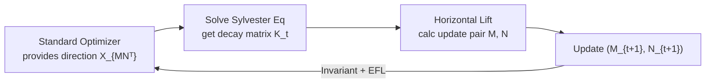

# LoRA-S: An Efficient Low Rank Adaptation scheme via Sylvester equation

**Conference**: ICLR 2026  
**OpenReview**: [https://openreview.net/forum?id=Guo2XGgxZA](https://openreview.net/forum?id=Guo2XGgxZA)  
**Code**: [https://gitee.com/sanjin998/lora_s](https://gitee.com/sanjin998/lora_s)  
**Area**: llm_efficiency / Parameter-Efficient Fine-Tuning (PEFT)  
**Keywords**: LoRA, Efficient Feature Learning (EFL), Quotient Manifold Optimization, Horizontal Lift, Sylvester Equation, Transformation Invariance  

## TL;DR
This paper employs the "horizontal lift" theory from differential geometry to optimize LoRA's two low-rank factors on a quotient manifold. It derives a universal iterative framework that enables **any preconditioned optimizer** to automatically achieve "Efficient Feature Learning (EFL) / transformation invariance." Furthermore, it replaces the hand-tuned weight decay hyperparameter with a decay matrix $K$ solved via the Sylvester equation, resulting in two plug-and-play efficient LoRA optimizers: AdamS and LRACS.

## Background & Motivation
**Background**: LoRA performs parameter-efficient fine-tuning by freezing the pre-trained weights $W\in\mathbb{R}^{n\times m}$ and only training low-rank increments $X=MN^\top$. Numerous recent works (LoRA+, LoRA-Rite, etc.) aim to accelerate LoRA convergence, with "Efficient Feature Learning (EFL)" being a prominent research direction. EFL requires that updates to both factors $M$ and $N$ contribute substantially to the loss change, rather than one factor stagnating while the other updates.

**Limitations of Prior Work**: Standard optimizers fail to achieve EFL in LoRA because the decomposition $X=MN^\top$ contains redundant degrees of freedom $R\in GL(r)$ (where $(MR, NR^{-\top})$ represents the same $X$), making updates "transformation-variant." To mitigate this, LoRA+ assigns different learning rates to the two factors (requiring extra tuning), while LoRA-Rite redesigns a complex preconditioner (cumbersome to implement and difficult to generalize). Classic Riemannian methods (RGD, ScaledAdam) naturally satisfy EFL but lose it once combined with modern preconditioning.

**Key Challenge**: Achieving EFL often requires forgoing strong preconditioning, whereas using strong preconditioning (to mitigate the ill-conditioned Hessian in LLMs) usually breaks EFL. These two are difficult to reconcile, and existing methods often entail expensive hyperparameter searches.

**Goal**: Establish a unified framework where "any optimizer + any preconditioner" maintains EFL, while simultaneously eliminating the time-consuming weight decay hyperparameter.

**Core Idea**: Treat LoRA optimization as geometric optimization on the quotient manifold $\mathbb{R}^{m\times r}_*\times\mathbb{R}^{n\times r}_*/\!\sim$. Use the **horizontal lift** to project any tangent space direction into a redundancy-free horizontal space, naturally achieving transformation invariance. Additionally, a decay term $K$, determined by the **Sylvester equation**, emerges naturally from the lifted vector, proving superior to manual weight decay.

## Method

### Overall Architecture
A redundancy fiber of dimension $r^2$ exists between the LoRA factors $(M,N)$ and the low-rank matrix $X=MN^\top$ intended for optimization. This work first establishes a Riemannian immersion $\pi:(M,N)\mapsto MN^\top$ from the factor space to the rank-$r$ matrix manifold $\mathcal{M}(r,m\times n)$. The "descent direction on $X$" is uniquely restored via horizontal lift as an "update pair on $(M,N)$" with inherent redundancy-eliminating constraints. The process is formalized into a three-step universal iterative framework (Algorithm 1): Given a descent vector → Solve the Sylvester equation for $K_t$ → Calculate the lifted updates for both factors using $K_t$.

### Key Designs

**1. Quotient Manifold + Horizontal Lift: Reformulating EFL as a Geometric Condition.** Since $\pi^{-1}(MN^\top)=\{(MR, NR^{-\top}):R\in GL(r)\}$ is an $r^2$-dimensional fiber, conventional updates fall into the tangent space containing redundancy, becoming transformation-variant. The authors define an equivalence relation $\sim$ (where $(M_a,N_a)\sim(M_b,N_b)\iff MN^\top$ is identical) and decompose the tangent space into the fiber kernel and its orthogonal complement—the horizontal space $\mathcal{H}_{(M,N)}$. Given a direction $\dot X_{MN^\top}$ in the matrix tangent space, there exists a unique horizontal lift $\dot X_{\uparrow(M,N)}$ satisfying $D\pi(M,N)[\dot X_{\uparrow}]=\dot X_{MN^\top}$. This paper further provides a rigorous mathematical definition of EFL (Definition 2): When two sets of factors represent the same weight $M_1N_1^\top=M_2N_2^\top$, the updates must have equal magnitude under metric $g$ and satisfy $\dot M_2=\dot M_1 R,\ \dot N_2=\dot N_1 R^\top$. This condition is equivalent to the "transformation invariance" described by LoRA-Rite (Proposition 1), grounding the engineering concept of EFL in the language of manifold optimization.

**2. Sylvester Decay Matrix $K$: Eliminating the Weight Decay Hyperparameter.** By selecting a Grassmann quotient manifold metric $g_{(M,N)}=\mathrm{trace}\big(M^\top M\,\dot M^\top\dot M + N^\top N\,\dot N^\top\dot N\big)$ that satisfies EFL conditions, the closed-form solution for the horizontal lift is:
$$\dot X_{M(M,N)}=\big(\dot X_{MN^\top}N - MN^\top N K\big)(N^\top N)^{-1},$$
where $K$ is the unique solution to the Sylvester equation $M^\top \dot X_{MN^\top} N = M^\top M N^\top N K + K M^\top M N^\top N$. The authors decompose the lifted vector into a "Gradient Term (GT)" and a "Decay Term (DT)," noting that manually tuned weight decay $\lambda$ in traditional LoRA is merely a crude approximation of the decay term. Since $K_t$ is solved directly via the Sylvester equation without tuning, and both theory and experiments show its regularization effect exceeds $L_2$, the method **naturally eliminates the need for weight decay hyperparameter search** (ablations show that more accurate approximations of the Sylvester solution yield better performance, and additional regularization on $K$ provides no gain, indicating $K$ itself is the appropriate decay).

**3. Generality: "Lifting" Any Optimizer into a Transformation-Invariant Version.** Theorem 1 guarantees that any optimizer following Algorithm 1 automatically satisfies EFL and transformation invariance. This means the framework is a plug-and-play "shell": one simply feeds the descent direction from a standard optimizer into it. Specifically, the authors instantiate two optimizers: **AdamS** (lifted Adam, providing a low-memory variant and optional Riemannian inner product) and **LRACS** (lifted RACS optimizer; if applied to the final layer, the layer degrades to standard Adam training). Both include runtime analysis, and their key advantage is maintaining EFL even when combined with modern strong preconditioning (mitigating ill-conditioned Hessians), which older Riemannian methods like RGD or ScaledAdam cannot achieve.

## Key Experimental Results

### Main Results
Evaluated on the Mix-of-show image generation model (MSE loss, block-diagonal Hessian) using CLIP↑/FID↓, trained for 3500 steps:

| Optimizer | r=4 CLIP | r=4 FID | r=8 CLIP | r=8 FID | r=16 CLIP | r=16 FID |
|---|---|---|---|---|---|---|
| Adam | 25.17 | 72.75 | 26.83 | 67.09 | 29.86 | 57.35 |
| Scaled GD (EFL Baseline) | 25.74 | 70.99 | 25.98 | 70.01 | 29.07 | 59.87 |
| LoRA-Rite (SOTA EFL) | 30.96 | 59.04 | 30.99 | 59.02 | 31.90 | 55.68 |
| **LRACS (Ours)** | 31.43 | 52.67 | 31.46 | 52.12 | 32.09 | 49.52 |
| **AdamS (Ours)** | **32.20** | 54.39 | 32.38 | 51.87 | **32.64** | **46.32** |

GPT-2 medium on E2E NLG (r=4, 5 epochs / 22.6k steps, 0.39M trainable parameters):

| Method | BLEU | NIST | MET | ROUGE-L | CIDEr |
|---|---|---|---|---|---|
| Adam | 68.0 | 8.61 | 44.7 | 69.1 | 2.38 |
| AdamW | 68.6 | 8.69 | 46.5 | 71.3 | 2.51 |
| LoRA-Rite | 69.3 | 8.75 | 46.5 | 71.7 | 2.53 |
| **AdamS (Ours)** | 69.4 | 8.75 | 46.5 | 71.7 | 2.53 |
| **LRACS (Ours)** | **70.4** | **8.85** | **46.7** | **71.9** | **2.54** |

### Ablation Study

| Ablation Item | Conclusion |
|---|---|
| Sylvester solution → Replace with weight decay matrix | Accuracy of approximation correlates with performance; Sylvester solution is indispensable |
| Extra regularization on $K$ | Does not improve performance; $K$ itself is sufficient decay |
| LoRA rank r=4/8/16 | r=16 is optimal for Mix-of-show; method is robust to rank |
| Riemannian vs. Euclidean momentum accumulation (GPT-2 small) | Validates the effectiveness of the Riemannian inner product option |
| LR sensitivity 50%–250% / Batch size sensitivity | AdamS and LRACS are robust to hyperparameter variations |

### Key Findings
- AdamS improves average CLIP on Mix-of-show to **32.64**, which is 9% higher than Adam (29.86) and 3% higher than LoRA-Rite (31.90). FID at r=16 drops from 57.35 to 46.32.
- Methods satisfying EFL consistently outperform their non-EFL counterparts, validating the "geometric EFL" approach.
- Eliminating weight decay does not degrade performance; instead, the precision of Sylvester decay leads to superior results, effectively saving hyperparameter search time.

## Highlights & Insights
- **Elevating engineering tricks to geometric theorems**: Previous EFL relied on empirical practices like "setting different learning rates for two factors." This paper uses horizontal lift to provide necessary and sufficient metric conditions, proving LoRA-Rite's invariance is a special case, resulting in a cleaner, unified theory.
- **"Weight decay ≈ Decay term approximation" insight**: Interpreting a long-standing hand-tuned hyperparameter as a crude substitute for a term in the lift vector—and solving it precisely via the Sylvester equation—effectively "eliminates a hyperparameter through theory."
- **Framework over point solution**: The core output is a universal "shell" for any preconditioned optimizer. AdamS and LRACS are simply two instances, demonstrating strong extensibility.

## Limitations & Future Work
- Small Experimental Scale: Experiments are limited to GPT-2 medium/small and Mix-of-show, lacking validation on mainstream large LLMs (7B+) or larger vision models. Conclusions on scalability rely indirectly on rank and dataset diversity.
- Computational Overhead: Solving an $r\times r$ Sylvester equation and performing matrix inversion at each step incurs costs. Although $r$ is typically small, runtime and VRAM overhead in high-rank or multi-layer scenarios require attention (mitigated partly by the low-memory variant).
- Structural Assumptions: The theory builds on assumptions like "block-diagonal Hessian"; optimality for losses or architectures not satisfying this structure remains unclear.
- Orthogonality: Combinations with other PEFT improvements like DoRA or quantized LoRA variants have not yet been explored.

## Related Work & Insights
- **EFL Lineage**: LoRA+ (different learning rates) and LoRA-Rite (transformation-invariant preconditioners) are direct benchmarks. This paper unifies and surpasses them using quotient manifold geometry.
- **Riemannian/Quotient Manifold Optimization**: ScaledGD, Quotient GD, RGD, and ScaledAdam provided the geometric toolbox; this paper's contribution is enabling the coexistence of "modern preconditioning + EFL."
- **Insight**: Reinterpreting "hand-tuned hyperparameters" as approximations of deeper structures (in this case, the decay term of a lift vector) is a highly transferable research paradigm—applicable to other low-rank or factorized training methods beyond LoRA to find similar "analytically replaceable hyperparameters."

## Rating
- **Novelty**: ⭐⭐⭐⭐ Uses horizontal lift and quotient manifolds to provide a rigorous geometric definition of EFL and interprets weight decay as an approximation of the Sylvester decay term.
- **Experimental Thoroughness**: ⭐⭐⭐ Main experiments plus multiple ablations/sensitivity tests are complete, but lacks validation on large-scale LLMs.
- **Writing Quality**: ⭐⭐⭐⭐ Mathematical derivations are clear. The motivation-theory-algorithm-experiment chain is complete. While notation is heavy, Algorithm 1 makes the method implementation-friendly.
- **Value**: ⭐⭐⭐⭐ Plug-and-play, hyperparameter-free, and applicable to any preconditioned optimizer; of direct value to PEFT training practice.

<!-- RELATED:START -->

## Related Papers

- [\[ICLR 2026\] BA-LoRA: Bias-Alleviating Low-Rank Adaptation to Mitigate Catastrophic Inheritance in Large Language Models](ba-lora_bias-alleviating_low-rank_adaptation_to_mitigate_catastrophic_inheritanc.md)
- [\[ICLR 2026\] BoRA: Towards More Expressive Low-Rank Adaptation with Block Diversity](bora_towards_more_expressive_low-rank_adaptation_with_block_diversity.md)
- [\[ICLR 2026\] On-the-Fly Adaptation to Quantization: Configuration-Aware LoRA for Efficient Fine-Tuning of Quantized LLMs](on-the-fly_adaptation_to_quantization_configuration-aware_lora_for_efficient_fin.md)
- [\[ICLR 2026\] FLoRG: Federated Fine-tuning with Low-rank Gram Matrices and Procrustes Alignment](florg_federated_fine-tuning_with_low-rank_gram_matrices_and_procrustes_alignment.md)
- [\[ICLR 2026\] PLoP: Precise LoRA Placement for Efficient Finetuning of Large Models](plop_precise_lora_placement_for_efficient_finetuning_of_large_models.md)

<!-- RELATED:END -->
