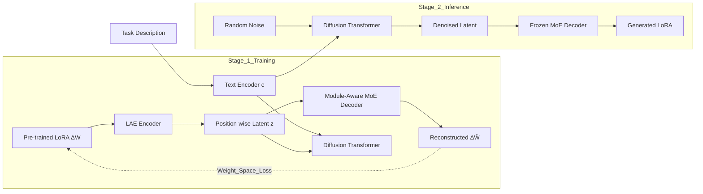

# LoRAGen: Structure-Aware Weight Space Learning for LoRA Generation

**Conference**: ICLR 2026  
**OpenReview**: [https://openreview.net/forum?id=mrafO7aTYj](https://openreview.net/forum?id=mrafO7aTYj)  
**Code**: [https://github.com/tsinghua-fib-lab/LoRAGen](https://github.com/tsinghua-fib-lab/LoRAGen)  
**Area**: Efficient LLM Adaptation / Parameter Generation / LoRA  
**Keywords**: LoRA Generation, Weight Space Learning, Latent Diffusion Model, MoE, Zero-shot Adaptation  

## TL;DR
LoRAGen focuses on the "structural characteristics of the LoRA parameter space" by employing **weight space loss on the full adaptation matrix $\Delta W$** and a **module-aware MoE decoder**. This allows a latent diffusion model to generate LoRA parameters directly from natural language task descriptions, achieving performance close to task-specific LoRAs in-distribution and exceeding baselines by nearly 5 points on unseen tasks.

## Background & Motivation
- **Background**: LoRA has become the de facto standard for efficient fine-tuning. However, training adapters and tuning hyperparameters for every new task entails high maintenance costs and poor reusability. "Parameter generation" has emerged as a solution—training a hypernetwork or generative model to synthesize LoRA weights directly from task descriptions, bypassing task-specific training. Representative works include learning latent representations for decoding (D2NWG, etc.), conditional diffusion priors, and the one-step forward hypernetwork Text-to-LoRA (T2L).
- **Limitations of Prior Work**: Existing methods treat LoRA generation as an instance of "generic weight space learning" by reconstructing the low-rank decomposition matrices $A$ and $B$. This ignores structural properties of the LoRA space, resulting in poor generalization and difficulty in cross-architecture adaptation.
- **Key Challenge**: Empirical analysis on a LoRA library for FLAN-T5-large reveals two overlooked structural facts:
  1. **Non-uniqueness of Low-Rank Decomposition**: While $\Delta W$ is unique, its decomposition into $(A, B)$ is not (for any invertible $R$, $(BR)(R^{-1}A) = \Delta W$). Experiments show that task description similarity correlates with the **full matrix $\Delta W$ similarity** but has nearly zero correlation with the **decomposition matrix similarity**. Directly supervising $A$ and $B$ introduces noise from arbitrary rotations/scalings, making the model prone to memorization rather than generalization.
  2. **Heterogeneous Weight Distribution Across Modules**: Spectral entropy distributions differ systematically across module types (highest in encoder self-attn, lowest in decoder self-attn, and intermediate in cross-attn). Using a single decoder for all modules leads to a mismatch.
- **Goal**: Design a generation method specifically tailored to the structural properties of LoRA that is robust to decomposition non-uniqueness and matches heterogeneous module distributions.
- **Core Idea (Structure-Aware Weight Space Learning)**: **Supervise the full adaptation matrix instead of decomposition matrices** and use a **module-routed MoE decoder** to explicitly inject priors of "LoRA parameter space geometry" into the latent diffusion framework.

## Method

### Overall Architecture
LoRAGen is a two-stage "Latent Diffusion + Autoencoder" framework. **Stage 1** uses a LoRA Weight Autoencoder (LAE) to encode pre-trained LoRA parameters $\Delta W$ into position-wise (module $m$, layer $\ell$) latent variables, which are reconstructed by a module-aware MoE decoder. Simultaneously, a Diffusion Transformer is trained to build a conditional prior on the LAE latent space, conditioned on task description embeddings $c$ from a text encoder. **Stage 2** (Inference) only requires the task description $c$ and Gaussian noise; the Diffusion Transformer performs reverse denoising to obtain latent variables, which are processed by the frozen MoE decoder to generate full LoRA parameters for the LLM.

### Key Designs

**1. Adapter-Level Supervision: Using $\Delta W$ instead of $A, B$ as training signals.** This addresses the non-uniqueness in Obs-1. Since countless $(A,B)$ pairs yield the same $\Delta W$, element-wise reconstruction of $A$ and $B$ forces the generator to pick a specific decomposition, making training sensitive to arbitrary scaling/rotation. LoRAGen supervises at the level of the low-rank adapter $\widehat{\Delta W}_{m,\ell}=D_\theta(z)_{m,\ell}$ using two complementary terms. **Angular Loss** normalizes both prediction and target to unit Frobenius norm to eliminate norm ambiguity: $L_{\text{ang}}(m,\ell)=1-\frac{\langle \widehat{\Delta W}_{m,\ell},\,\Delta W_{m,\ell}\rangle_F}{\|\widehat{\Delta W}_{m,\ell}\|_F\,\|\Delta W_{m,\ell}\|_F}$. To ensure consistent energy distribution across the singular spectrum, a **Spectral Loss** aligns the top-$k$ singular values: $L_{\text{spec}}(m,\ell)=\big\|\sigma_{1:k_{m,\ell}}(\widehat{\Delta W}_{m,\ell})-\sigma_{1:k_{m,\ell}}(\Delta W_{m,\ell})\big\|_{p,\omega}$. These weighted terms form $L_{\text{adapter}}$, ensuring generated LoRAs are task-aligned in both direction and spectral energy.

**2. Module-Aware MoE Decoder: Specialized experts for module-specific spectral distributions.** This addresses the heterogeneity in Obs-2. The decoder constructs structural embeddings $h_{m,\ell}=[\,z_{m,\ell};\,e_m;\,e_\ell\,]$ for each position $(m,\ell)$, concatenating the latent variable with **learnable module embeddings $e_m$ and layer embeddings $e_\ell$**. A router $W_r$ outputs logits for top-$K$ soft gating: $g_{(m,\ell),e}=\frac{\exp(\ell_{m,\ell,e}/\tau)}{\sum_{e'\in S_{m,\ell}}\exp(\ell_{m,\ell,e'}/\tau)}\,\mathbb{I}[e\in S_{m,\ell}]$. Experts are small MLPs. The gated sum is mapped through **module-specific output heads** $H_m$: $\widehat{\Delta W}_{m,\ell}=H_m\!\big(\sum_{e\in S_{m,\ell}} g_{(m,\ell),e}E_e(h_{m,\ell})\big)$. To prevent expert collapse, a load-balancing loss $L_{\text{moe}}$ is added.

**3. Conditional Latent Diffusion: Sampling LoRA as a denoising process.** The LAE provides a diagonal Gaussian posterior $q_\phi(z\mid\Delta W)$ as the latent target. The Diffusion Transformer learns the conditional prior $p_\psi(z_0\mid c)$. Forward diffusion follows $q(z_t\mid z_0)=\mathcal N(\sqrt{\bar\alpha_t}z_0,(1-\bar\alpha_t)I)$, and the denoiser is trained with a $v$-prediction objective: $L_{\text{diff}}(\psi)=\mathbb E\big[\|v-f_\psi(z_t,t,c)\|_2^2\big]$. The total LAE objective combines adapter supervision, KL regularization, and MoE load balancing.

## Key Experimental Results

### Main Results
FLAN-T5-Large (Subsets of 7 FLAN tasks, In-distribution, Avg. Acc):

| Method | Avg. (acc) |
|------|-----------|
| FLAN-T5-Large (No Adaptation) | 36.8 |
| Average LoRA | 95.8 |
| D2NWG | 58.4 |
| T2L | 88.7 |
| **LoRAGen (Ours)** | **96.0** |
| Task-specific LoRAs (Upper bound) | 96.2 |

Gemma-2-2B-Instruct (8 Benchmark tasks, In-distribution):

| Method | Avg. (acc) |
|------|-----------|
| Gemma-2-2B-Instruct | 68.8 |
| D2NWG | 68.9 |
| T2L | 69.2 |
| **LoRAGen (Ours)** | **72.7** |
| Task-specific LoRAs (Upper bound) | 74.5 |

Zero-shot (Trained on 136 FLAN tasks, tested on 7 unseen tasks):

| Method | Avg. (acc) |
|------|-----------|
| D2NWG | 35.0 |
| T2L | 35.2 |
| **LoRAGen (Ours)** | **40.2** |

### Ablation Study
Decomposing components on the FLAN subset ($L_{\text{ang}}$ / $L_{\text{spec}}$ / $D_\theta$ MoE Decoder):

| $L_{\text{ang}}$ | $L_{\text{spec}}$ | $D_\theta$ | Avg. (acc) |
|:---:|:---:|:---:|:---:|
| ✓ | ✓ | ✗ | 58.4 |
| ✗ | ✗ (Recon only) | ✓ | 95.2 |
| ✗ | ✓ | ✓ | 36.9 |
| ✓ | ✓ | ✓ | **96.0** |

### Key Findings
- **MoE Decoder is the Primary Engine**: Performance drops to 58.4 without the MoE decoder, confirming that module heterogeneity must be handled by module-aware routing.
- **Angular Loss is Essential**: Removing angular loss while keeping spectral loss drops performance to 36.9, as spectral loss only preserves energy distribution and needs angular loss to anchor the task direction.
- **Adapter-Level Supervision Enhances Zero-shot Generalization**: D2NWG/T2L reconstruct decomposition matrices, leading to memorization of task-specific LoRAs. LoRAGen supervises $\Delta W$ directly, learning task-relevant structures instead of rigid parameters.
- **Cross-architecture Portability**: The structure-aware design is effective across T5 (encoder-decoder) and Gemma (decoder-only) architectures.

## Highlights & Insights
- **Inference based on Weight Space Geometry**: The authors first identify structural facts (non-uniqueness and heterogeneity) through empirical analysis and then match each design to an observation ($Losses \leftrightarrow Obs-1, Decoder \leftrightarrow Obs-2$).
- **Essence of LoRA as $\Delta W$**: Shifting supervision from decomposition matrices to the full adaptation matrix is a fundamental correction to previous generation methods and the source of zero-shot gains.
- **Complementary Angular + Spectral Losses**: Covering task direction and spectral energy distribution effectively captures task-relevant LoRA information while remaining robust to decomposition equivalence classes.

## Limitations & Future Work
- **Limited Base Model Scale**: Experiments are limited to FLAN-T5-large and Gemma-2-2B; scalability to 7B+ models remains to be verified.
- **Low Zero-shot Absolute Accuracy**: An accuracy of 40.2 on unseen tasks is far from practical, suggesting zero-shot limits are tied to training task coverage.
- **Dependency on LoRA Libraries**: Training requires existing pre-trained LoRA libraries and high-quality task descriptions.
- **Spectral Loss Hyperparameters**: Parameters like truncation ratio $\rho$ and $\ell_p$ norm weights require manual tuning.

## Related Work & Insights
- **Weight Space Learning**: LoRAGen is a "structure-aware specialization" of generic weight generation frameworks like G.pt (Peebles et al.) and cross-architecture generation (Kofinas et al.).
- **Insight**: (1) Studying equivalence classes and geometric invariants of the parameter space can directly guide loss design. (2) MoE with structural routing is a natural fit for heterogeneously distributed modules. (3) "What to supervise" is often more critical for generalization than the "generative model used."

## Rating
- **Novelty**: ⭐⭐⭐⭐ First weight space learning method addressing LoRA structural properties.
- **Experimental Thoroughness**: ⭐⭐⭐ Covers multiple architectures and zero-shot settings, though limited model scales.
- **Writing Quality**: ⭐⭐⭐⭐ Logic flow from motivation to observation to method is convincing.
- **Value**: ⭐⭐⭐⭐ Provides methodological insights for parameter generation and efficient adaptation.

<!-- RELATED:START -->

## Related Papers

- [\[ICLR 2026\] Meta-UCF: Unified Task-Conditioned LoRA Generation for Continual Learning in Large Language Models](meta-ucf_unified_task-conditioned_lora_generation_for_continual_learning_in_larg.md)
- [\[ICLR 2026\] MiSS: Revisiting the Trade-off in LoRA with an Efficient Shard-Sharing Structure](miss_revisiting_the_trade-off_in_lora_with_an_efficient_shard-sharing_structure.md)
- [\[ICML 2026\] STAR: Rethinking MoE Routing as Structure-Aware Subspace Learning](../../ICML2026/llm_efficiency/star_rethinking_moe_routing_as_structure-aware_subspace_learning.md)
- [\[ICLR 2026\] Merge before Forget: A Single LoRA Continual Learning via Continual Merging](merge_before_forget_a_single_lora_continual_learning_via_continual_merging.md)
- [\[ICLR 2026\] On-the-Fly Adaptation to Quantization: Configuration-Aware LoRA for Efficient Fine-Tuning of Quantized LLMs](on-the-fly_adaptation_to_quantization_configuration-aware_lora_for_efficient_fin.md)

<!-- RELATED:END -->
