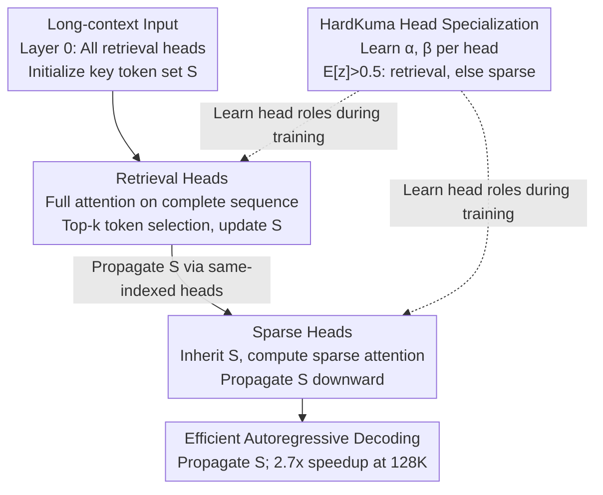

# LycheeDecode: Accelerating Long-Context LLM Inference via Hybrid-Head Sparse Decoding

**Conference**: ICLR 2026  
**arXiv**: [2602.04541](https://arxiv.org/abs/2602.04541)  
**Code**: [https://github.com/（论文提及有代码）](https://github.com/（论文提及有代码）)  
**Area**: LLM Efficiency  
**Keywords**: Long-Context Inference, Sparse Attention, Attention Head Specialization, KV Cache Optimization, HardKuma Distribution

## TL;DR
Ours proposes LycheeDecode, which fine-grains attention heads into a few retrieval heads (responsible for full attention to select key tokens) and numerous sparse heads (reusing selected tokens for sparse computation). Using the HardKuma distribution for end-to-end head type learning, it achieves a 2.7× speedup on 128K contexts without performance degradation.

## Background & Motivation
Long-context LLMs (e.g., Gemini-2.5, Qwen2.5-1M supporting 1M tokens) have become a mainstream trend, but KV cache in autoregressive decoding grows linearly with sequence length, causing severe memory and latency bottlenecks. Existing sparse attention methods fall into two categories: **Eviction-based** (e.g., SnapKV, H2O, which permanently discard tokens) and **Selection-based** (e.g., TidalDecode, SeerAttention, which dynamically select subsets for computation).

**Key Insight**: Recent works (TidalDecode, OmniKV) found that key tokens in adjacent layers are highly similar, leading to the adoption of a **layer-level sharing strategy**—where all heads in the same layer share the same set of key tokens. However, this assumption is too coarse: heatmap analysis reveals that top-k overlap rates vary significantly across different heads within the same layer (e.g., in adjacent layers, the 14th head has 0% overlap while the 24th head has 100%). This implies that uniform layer-level sharing eliminates functional diversity between heads.

**Key Challenge**: Layer-level sharing is too coarse and ignores attention head specialization. **Key Insight**: Refine sharing granularity from the layer level to the head level, allowing different heads to play distinct roles. **Core Idea**: A few retrieval heads perform full attention to discover key tokens, while many sparse heads reuse these tokens for efficient computation.

## Method

### Overall Architecture

LycheeDecode addresses the issue where each token generation in long-context decoding requires full attention over the entire KV cache, leading to linear expansion of cache and explosion of memory and latency. The core concept is to subdivide attention heads in each layer into two types: a few **retrieval heads** perform full attention on the complete sequence to identify the most critical token subsets and pass them to lower layers, while many **sparse heads** inherit these subsets and perform only sparse computations. Thus, expensive full scanning is borne by only a few heads, while the majority follow a low-cost sparse path. Instead of manual assignment, a **HardKuma** gating variable is attached to each head to learn roles end-to-end, allowing the sparse structure to be trained alongside model weights. By default, all heads in Layer 0 are retrieval heads to initialize the key token set $S$, which then flows down through heads with the same index.

### Key Designs

**1. Retrieval Heads: Periodic Discovery of Key Tokens**

Layer-level sharing fails because it assumes one set of tokens serves all heads in a layer; this work instead tasks a few heads with the "heavy lifting" of token search. These retrieval heads in layer $l$ perform standard dense attention $A_h^{(l)} = \text{softmax}\!\left(\frac{q_h^{(l)}(K_h^{(l)})^T}{\sqrt{d_k}}\right)$ on the complete KV cache, then extract the top-k critical token indices $\mathcal{S}_h^{(l+1)} = \text{argsTopK}(A_h^{(l)}, k)$ for the same-indexed head in the next layer. All heads in the first layer are retrieval heads by default to initialize the pipeline. Since only a small fraction of heads pay the cost of full attention while continuously refreshing key tokens during decoding, the framework maintains context adaptability while minimizing expensive scanning.

**2. Sparse Heads: Reusing Subsets for Compute and Memory Savings**

The majority of sparse heads do not search for tokens but inherit the set $\mathcal{S}_h^{(l)}$ from the previous layer, performing attention only on this subset:

$$O_h^{(l)} = \text{softmax}\!\left(\frac{q_h^{(l)} (K_h^{(l)}[\mathcal{S}_h^{(l)}])^T}{\sqrt{d_k}}\right) V_h^{(l)}[\mathcal{S}_h^{(l)}]$$

The set is propagated unchanged ($\mathcal{S}_h^{(l+1)} = \mathcal{S}_h^{(l)}$). As the number of keys/values involved is reduced to $k$ rather than the entire history, both computation and data movement from the KV cache are reduced, providing the primary source of the 2.7× speedup.

**3. HardKuma Head Specialization: Making Discrete Role Assignment Differentiable**

Deciding whether a head is retrieval or sparse is a binary choice. Using continuous variables and rounding (as in DuoAttention) causes training-inference inconsistency. Ours adopts the Hard Kumaraswamy distribution: first, sample $u$ from a uniform distribution, apply the Kuma inverse CDF to get $s=(1-u^{1/\beta})^{1/\alpha}$, linearly stretch it to the interval $(p,q)$ (where $p<0, q>1$) to get $s'=s\cdot(q-p)+p$, and finally perform a hard-clamp to $[0,1]$ to obtain $z=\min(1,\max(0,s'))$. Probability mass falling in $(p,0]$ and $[1,q)$ is pushed exactly to 0 and 1, creating samples clustered at the ends while maintaining differentiability. Each head learns only two parameters $\alpha_h^{(l)}, \beta_h^{(l)}$. During inference, the random sampling is replaced with a deterministic decision: if $\mathbb{E}[z_h^{(l)}] > 0.5$, it is a retrieval head; otherwise, it is a sparse head.

### Loss & Training
During the training phase, each head calculates both sparse and full attention maps. These are linearly mixed using the HardKuma sample $z_h^{(l)}$ as $\tilde{A}_h^{(l)} = z_h^{(l)} \cdot A_{R,h}^{(l)} + (1 - z_h^{(l)}) \cdot A_{S,h}^{(l)}$, allowing gradients for head role selection to flow back. The objective function consists of a distillation term and a sparsity constraint: the distillation term makes the mixed-attention student approximate the full-attention teacher's logits (L2 distance), while the sparsity constraint pushes the number of retrieval heads toward the target, expressed as $\min_{\alpha,\beta} \max_{\lambda \geq 0} \mathcal{L}_{\text{distill}} + \lambda \cdot (\mathbb{E}[\|\mathbf{z}\|_0] - N_{\text{target}})$. Since $\mathbb{E}[\|\mathbf{z}\|_0]$ has a closed-form solution and the Lagrange multiplier $\lambda$ is automatically adjusted via gradient ascent, manual hyperparameter searching for sparsity is avoided. Training takes only a few hours on a single A100 (3000 steps).

## Key Experimental Results

### Main Results (LongBench Context Understanding)

| Method (Budget) | MFQA | NrtQA | Qasper | 2Wiki | HotQA | QMSum | TrQA | PRe | Avg |
|---|---|---|---|---|---|---|---|---|---|
| Full Attention (Llama3-8B) | 30.76 | 5.52 | 14.56 | 13.32 | 11.50 | 19.43 | 86.56 | 77.00 | 32.33 |
| TidalDecode (4096) | 30.94 | 6.19 | 13.85 | 14.40 | 13.71 | 19.48 | 86.30 | 78.00 | 32.86 |
| **LycheeDecode (4096)** | **30.11** | **5.85** | **14.39** | **12.86** | **12.66** | **19.30** | **86.78** | **82.58** | **33.07** |
| Full Attention (Qwen3-8B) | 25.84 | 3.43 | 10.96 | 11.97 | 11.74 | 20.90 | 90.21 | 89.08 | 33.02 |
| TidalDecode (4096) | 23.57 | 2.99 | 10.79 | 11.47 | 11.31 | 20.01 | 88.94 | 85.00 | 31.76 |
| **LycheeDecode (4096)** | **24.90** | **3.32** | **10.88** | **12.74** | **11.68** | **20.71** | **90.34** | **93.25** | **33.48** |

On mathematical reasoning tasks (DeepSeek-R1-Distill-Qwen-7B), LycheeDecode + Cache Correction achieved 46.7% on AIME24 (compared to 40.0% for Full Attention), and an average score of 44.9, surpassing Full Attention's 43.0.

### Ablation Study (Head Identification Comparison)

| Method | Passkey Retrieval | HotpotQA |
|---|---|---|
| Direct Optimize (DuoAttention) | 32.06 | 31.02 |
| Hard Concrete | 32.13 | 30.25 |
| **HardKuma (Ours)** | **33.07** | **31.11** |

In comparison across different sparse strategies (Top-k / Top-p / Threshold / Ratio), the Ratio method proved globally optimal under equivalent sparsity.

### Key Findings
- LycheeDecode outperforms layer-level sharing (TidalDecode) on both Llama3 and Qwen3, validating that head-level strategies are superior.
- Achieves 2.7× end-to-end decoding speedup at 128K context, with kernel-level speedup up to 7× (8/8 sparse head configuration).
- HardKuma is more stable than the direct optimization of DuoAttention or the Hard Concrete distribution.
- Inference performance sometimes exceeds Full Attention; ours hypothesizes that head specialization helps filter irrelevant context noise.
- End-to-end acceleration is maintained in multi-batch size scenarios, showing high practicality.

## Highlights & Insights
- **Head-level granularity** is the primary innovation. Heatmap visualization and LongBench comparisons demonstrate that head diversity should not be suppressed by uniform sharing strategies.
- The Retrieval-Sparse collaboration mechanism builds an efficient information propagation pipeline: retrieval heads periodically refresh key tokens for context adaptability, while sparse heads reuse results for efficiency.
- The HardKuma distribution elegantly solves end-to-end learning for discrete variables, proving more natural than continuous relaxation with rounding.
- Minimal training overhead (hours on a single A100) makes the method highly practical.
- True end-to-end speedup is achieved via a hybrid-head block-sparse kernel implemented with TileLang.

## Limitations & Future Work
- The number of retrieval heads is fixed at 32; methods to automatically determine the optimal count were not explored.
- Performance in short-answer scenarios (e.g., HotpotQA) is slightly lower; sparse supervision signals need optimization.
- Evaluation only covered 7B-8B models; effectiveness on larger scales (70B+) is unknown.
- Direct comparison with Native Sparse Attention (e.g., original Qwen3) was not conducted.
- The block-sparse kernel implementation depends on TileLang, and portability was not discussed.

## Related Work & Insights
- Comparison with DuoAttention: DuoAttention also distinguishes retrieval/streaming heads, but decisions are made per-head without a collaborative propagation mechanism.
- Comparison with TidalDecode: TidalDecode uses layer-level sharing, whereas LycheeDecode uses finer head-level sharing.
- Potentially combinable with KV cache quantization/compression to further reduce memory.
- The head specialization + sparsity approach could be extended to expert assignment in MoE architectures.
- Applicable to multimodal long-sequence scenarios such as video understanding and multi-document dialogue.

## Rating
- Novelty: ⭐⭐⭐⭐ The combination of head-level sharing and HardKuma is innovative, though the retrieval/sparse head classification is not entirely new.
- Experimental Thoroughness: ⭐⭐⭐⭐⭐ Comprehensive coverage across long-context understanding, math reasoning, efficiency tests, and ablations on both Llama3 and Qwen3.
- Writing Quality: ⭐⭐⭐⭐ Logical clarity with rich visualization and well-explained motivation.
- Value: ⭐⭐⭐⭐ Practical significance for long-context LLM inference acceleration with low training costs.

<!-- RELATED:START -->

## Related Papers

- [\[ACL 2025\] Squeezed Attention: Accelerating Long Context Length LLM Inference](../../ACL2025/llm_efficiency/squeezed_attention_accelerating_long_context_length_llm_inference.md)
- [\[ICLR 2026\] Retrospective Sparse Attention for Efficient Long-Context Generation](retrospective_sparse_attention_for_efficient_long-context_generation.md)
- [\[ICLR 2026\] Tactic: Adaptive Sparse Attention with Clustering and Distribution Fitting for Long-Context LLMs](tactic_adaptive_sparse_attention_with_clustering_and_distribution_fitting_for_lo.md)
- [\[ICLR 2026\] Sparse Attention Adaptation for Long Reasoning](sparse_attention_adaptation_for_long_reasoning.md)
- [\[ICLR 2026\] PARD: Accelerating LLM Inference with Low-Cost Parallel Draft Model Adaptation](pard_accelerating_llm_inference_with_lowcost_parallel_draft_model_adaptation.md)

<!-- RELATED:END -->
