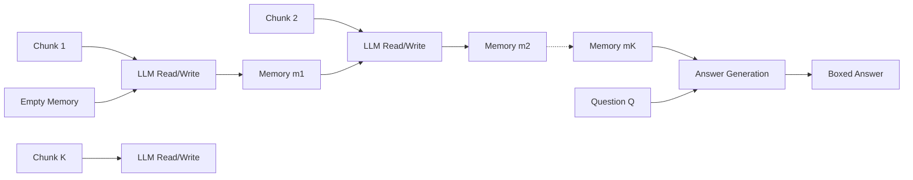

# MemAgent: Reshaping Long-Context LLM with Multi-Conv RL-based Memory Agent

**Conference**: ICLR 2026  
**OpenReview**: [https://openreview.net/forum?id=k5nIOvYGCL](https://openreview.net/forum?id=k5nIOvYGCL)  
**Code**: TBD  
**Area**: Long-context modeling / LLM efficiency / Reinforcement Learning  
**Keywords**: Long context, fixed-length memory, linear complexity, length extrapolation, Multi-Conv DAPO, RLVR  

## TL;DR
MemAgent segments "unbounded long documents" into fixed-length chunks for streaming processing, replacing the ever-expanding context with a fixed-length, overwritable token memory. By utilizing an extended version of Multi-Conv DAPO for end-to-end training of memory read/write strategies, 8K window models can extrapolate to 3.5M token QA tasks with nearly no performance loss and strictly linear inference complexity.

## Background & Motivation
**Background**: There are three main technical routes for processing ultra-long documents: length extrapolation (moving position embeddings + continued pre-training), sparse/linear attention, and context compression (token-level or external memory modules). All attempt to fit or pass longer sequences through existing windows.

**Limitations of Prior Work**: Length extrapolation still incurs $O(n^2)$ computational overhead on extremely long texts and exhibits significant performance collapse. Sparse/linear attention often requires training from scratch and depends on manually designed attention patterns or lacks parallelism. Context compression frequently suffers from poor extrapolation and requires additional modules or context operations, disrupting standard autoregressive generation and harming compatibility and parallelism.

**Key Challenge**: A truly powerful long-context LLM must satisfy a "trinity"—the ability to process infinitely long text, stable performance during expansion, and linear complexity during decoding. Existing methods consistently struggle to balance all three.

**Goal**: To return to the human intuition for processing long documents—humans take notes, remember key points, and discard redundant information rather than memorizing every word. Based on this, the model should maintain a dynamically updated fixed-length "memory" to process arbitrary-length inputs within a fixed window.

**Core Idea**: **[Streaming + Overwritable Memory]** Treat long documents as an "evidence stream," where each step only processes the next chunk and a fixed-length memory, overwriting the memory once read. **[RL-Shaped Memory]** What to remember or discard is determined not by manual rules, but learned end-to-end via RL through verifiable outcome rewards.

## Method

### Overall Architecture
MemAgent treats arbitrary long documents as a controlled evidence stream rather than a single monolith. During inference, the model encounters two components at each step: the next text chunk and a fixed-length memory (represented as standard tokens in the context window). After reading the current chunk, the old memory is overwritten with a new one. The workflow is divided into two modules: the Context-Processing module updates the memory iteratively by chunk, and once the document stream is exhausted, the Answer-Generation module generates the answer using only the question and the final memory. Since the memory length is constant and position embeddings are never rescaled, the base LLM's generation process remains unchanged, and linear complexity is naturally ensured by the "fixed window." Training is optimized as an RL policy over these multi-turn memory read/write dialogues.

### Key Designs

**1. Overwritable Fixed-Length Memory: Trading a Constant Window for Linear Complexity.** The key to MemAgent is that memory never grows. After reading each chunk, the model rewrites the entire previous memory into a new memory of constant length $M$, condensing all significant evidence seen thus far. Since $|m_k|=M$ is a constant, the computation and VRAM per step are only $O(C+M)$ ($C$ being the chunk length), making the end-to-end complexity strictly linear $O(N)$ relative to the number of chunks. While "overwriting" seems simple, it allows the system to scale to millions of tokens: fixed window size means decoding time and memory grow linearly with input rather than exploding quadratically. Because memory consists of standard tokens within the window, the base model requires no architectural changes or position embedding rescaling, directly leveraging its latent extrapolation capabilities.

**2. Autoregressive Decomposition Perspective: Splitting the Language Model into "Read-Write" Paths.** Standard autoregressive LLMs decompose the joint likelihood of a sequence as $p(x_{1:N})=\prod_{n=1}^{N} p(x_n\mid x_{1:n-1})$, implicitly assuming every historical token must remain in the active context—which is the root of the quadratic attention bottleneck. MemAgent introduces a fixed-length latent memory sequence $m_{1:K-1}$, rewriting the likelihood as the product of read and write paths:

$$p(x_{1:N})=\sum_{m_{1:K-1}}\prod_{k=1}^{K}\underbrace{p(c_k\mid m_{k-1})}_{\text{read}}\;\underbrace{p(m_k\mid c_k, m_{k-1})}_{\text{write}}$$

where $m_0=\varnothing$. Each chunk still uses a standard Transformer decoder but is conditioned only on the constant window $(c_k, m_{k-1})$. The read path decomposes token-by-token $p(c_k\mid m_{k-1})=\prod_i p(x_i\mid x_{1:i-1}, m_{k-1})$, and the write path similarly generates the next memory autoregressively. This mathematically unifies "long-text modeling" and "RL optimization of memory states"—the read/write trajectories form an MDP where the RL goal is to learn the optimal distribution of memory states given the context.

**3. Multi-Conv DAPO: End-to-End Optimization of Multiple Independent Contexts.** MemAgent generates multiple context-independent dialogues for a single query (multi-turn memory updates + one answer generation). This exceeds the scope of current RL frameworks, which typically concatenate trajectories or use sliding windows, lacking flexibility and scalability. This paper treats each dialogue as an independent optimization target, extending the DAPO loss from two dimensions (group, token) to three (group, conversation, token). Specifically, the policy model samples $G$ sets of responses per input, with each sample $i$ generating $n_i$ dialogues. Advantages are calculated only from the dialogue containing the final answer and then applied uniformly to all precursor dialogues derived from the same sample:

$$\hat{A}_{i,j,t}=R_i-\text{mean}(\{R_i\}_{i=1}^{G})$$

Rewards are provided via a rule-based verifier giving a verifiable outcome reward $R(\hat{y}, y)=\mathbb{1}_{\text{is\_equiv}(y,\hat{y})}$. Following Dr. GRPO, advantages are not divided by standard deviation. Consequently, which memory segments should retain critical facts and which should discard distractors is shaped inversely by the correctness of the final answer, achieving end-to-end optimization of arbitrary agent workflows.

## Key Experimental Results

### Main Results (RULER-HQA, Accuracy %, Across Context Lengths)

| Model | 7K | 112K | 448K | 896K | 1.75M | 3.5M |
|---|---|---|---|---|---|---|
| QwenLong-L1-32B | 72.66 | 31.25 | 13.28 | 11.72 | N/A | N/A |
| Qwen2.5-Instruct-14B-1M | 60.16 | 50.00 | 8.59 | 0.00 | N/A | N/A |
| DS-Distill-Qwen-32B | 70.31 | 23.44 | 7.81 | 7.03 | N/A | N/A |
| **RL-MEMAGENT-14B** | **80.47** | **81.25** | **79.69** | **75.78** | **78.91** | **71.09** |
| **RL-MEMAGENT-7B** | 81.25 | 79.69 | 76.56 | 74.22 | 77.34 | 71.88 |

MemAgent, trained on an 8K window (1024 query + 5000 chunk + 1024 memory + 1024 output), extrapolates to 3.5M tokens with a performance drop of less than 10% from 7K to 3.5M. Meanwhile, competitors drop nearly to zero at the million-token scale.

### Ablation Study (LongBench-SUM, AVG recall %)

| Model | GOV REPORT AVG | QMSUM AVG |
|---|---|---|
| Qwen2.5-Instruct-14B-1M | 19.34 | 29.84 |
| QwenLong-L1 | 16.29 | 23.74 |
| **RL-MEMAGENT-14B** | **21.80** | **31.39** |
| RL-MEMAGENT-7B | 19.34 | 31.27 |

In the NIAH-512K (Needle-In-A-Haystack) test, MemAgent achieves >95% accuracy. On LongBench-QA, the 14B version averages 51.0, outperforming the 32B-class QwenLong-L1 (50.7). The w/o RL control group collapses significantly on long sequences, indicating that RL training is the critical source of memory capability.

### Key Findings
- **Near-Lossless Extrapolation**: The combination of a fixed window and RL-shaped memory allows the performance curve to remain flat up to millions of tokens, breaking the convention that length extrapolation must collapse.
- **Small Models Outperforming Large Models**: 7B/14B MemAgent variants completely dominate 32B-class specialized long-context baselines in ultra-long scenarios.
- **RL is Indispensable**: Removing RL causes MemAgent to fail on long sequences, validating that the decision of what to keep or discard must be learned through outcome rewards rather than predefined rules.

## Highlights & Insights
- **Trading "Constant Window" for "Infinite Length"**: Reframes the long-context problem from "how to fit more tokens" to "how to maintain sufficient fixed-length memory," fundamentally bypassing the quadratic attention bottleneck.
- **Zero Architecture Changes, Plug-and-Play**: Memories are standard tokens. With no changes to position embeddings or attention layouts, any mid-window LLM can be transformed into a linear-complexity long-context reasoner.
- **Unified Long-Text Modeling via RL**: Formalizes memory read/write as an MDP and provides an autoregressive "Read-Write" decomposition, theoretically merging RL optimization with long-text modeling.
- **Addressing Multi-Conv DAPO Gaps**: Training agent workflows across multiple independent contexts was previously unexplored; this paper provides a viable recipe for backpropagating advantages from the final answer dialogue to all precursor dialogues.

## Limitations & Future Work
- **Overwriting is Lossy**: Fixed-length memory inevitably discards information. This may be detrimental for tasks requiring precise recall of many details or multi-hop reasoning involving scattered clues; the fixed $M$ capacity is a hard constraint.
- **Sequential Streaming Processing**: Chunks must be processed in order and memory updated serially. It is difficult to parallelize within a single sample, and the wall-clock time for long document inference remains linearly affected by the number of chunks.
- **Reliance on Verifiable Rewards**: The RLVR formulation requires answers to be checkable via rule-based verifiers. Designing rewards for open-ended generation or long-text tasks without standard answers remains an open problem.
- **Adaptive Memory Capacity**: Future work could explore dynamically adjusting memory length based on task difficulty or utilizing hierarchical memory to alleviate the bottlenecks of fixed-length memory in high-information-density texts.

## Related Work & Insights
This work lies at the intersection of and transcends three long-context routes (length extrapolation, sparse/linear attention, and context compression). Like compression methods, it condenses information but without disrupting standard autoregressive generation. Like linear attention, it ensures linear complexity but without requiring training from scratch or manual pattern design. It inherits "external memory" concepts from NTM/Memory Networks but makes memory read/write strategies learnable via RL. Training-wise, it extends RLVR algorithms like DAPO/GRPO from single dialogues to multi-dialogue workflows, offering a general strategy for end-to-end training in scenarios like agents, tool calling, and long-range planning.

## Rating
- **Novelty**: ⭐⭐⭐⭐ — The combination of "fixed-length overwritable memory + Multi-Conv DAPO" reframes the long-context problem cleanly, with original contributions in autoregressive decomposition and multi-dialogue RL extension.
- **Experimental Thoroughness**: ⭐⭐⭐⭐ — Covers extreme extrapolation curves from 7K to 3.5M, NIAH/LongBench-QA/SUM multi-benchmarks, and w/o RL controls, providing a complete and convincing chain of evidence.
- **Writing Quality**: ⭐⭐⭐⭐ — The motivation (human note-taking) is clear, methods and formulas align well with diagrams, and the "trinity" argument structure is well-defined.
- **Value**: ⭐⭐⭐⭐ — Provides a practical recipe to turn ordinary LLMs into linear-complexity long-context reasoners without architectural changes, with direct implications for industrial long-text systems and agent long-term memory.

<!-- RELATED:START -->

## Related Papers

- [\[ICLR 2026\] RMAAT: Astrocyte-Inspired Memory Compression and Replay for Efficient Long-Context Transformers](rmaat_astrocyte-inspired_memory_compression_and_replay_for_efficient_long-contex.md)
- [\[ICLR 2026\] Smooth Reading: Bridging the Gap of Recurrent LLM to Self-Attention LLM on Long-Context Understanding](smooth_reading_bridging_the_gap_of_recurrent_llm_to_self-attention_llm_on_long-c.md)
- [\[ACL 2026\] CoMeT: Collaborative Memory Transformer for Efficient Long Context Modeling](../../ACL2026/llm_efficiency/comet_collaborative_memory_transformer_for_efficient_long_context_modeling.md)
- [\[ICLR 2026\] AutoSP: Unlocking Long-Context LLM Training Via Compiler-Based Sequence Parallelism](autosp_unlocking_long-context_llm_training_via_compiler-based_sequence_paralleli.md)
- [\[ICLR 2026\] Dynamic Speculative Agent Planning](dynamic_speculative_agent_planning.md)

<!-- RELATED:END -->
