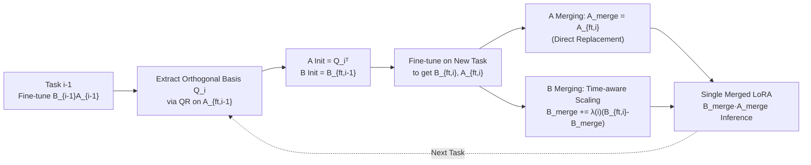

# Merge before Forget: A Single LoRA Continual Learning via Continual Merging

**Conference**: ICLR 2026  
**OpenReview**: [https://openreview.net/forum?id=i1Rj7yU6eF](https://openreview.net/forum?id=i1Rj7yU6eF)  
**Code**: To be confirmed  
**Area**: Parameter-efficient Continual Learning / LoRA Model Merging  
**Keywords**: LoRA, Continual Learning, Catastrophic Forgetting, Model Merging, Orthogonal Initialization, PEFT  

## TL;DR
This paper reformulates "Continual Learning" as a "Sequential Model Merging" problem, maintaining only **one pair** of LoRA matrices `{A, B}` throughout the process. It initializes `A` for new tasks using the orthogonal basis of the previous task and performs time-aware scaling for merging `B` based on LoRA asymmetry. This reduces memory complexity from linear growth to constant while mitigating forgetting and rigidity.

## Background & Motivation
- **Background**: LoRA has become a mainstream PEFT method for Continual Learning (CL) in Large Language Models. Representative methods include O-LoRA (freezing old LoRAs and learning in orthogonal subspaces), InfLoRA (defining subspaces via task-related inputs), SAPT-LoRA (preserving old LoRAs + pseudo-sample alignment), and SD-LoRA (decoupling magnitude and direction).
- **Limitations of Prior Work**: These methods either **freeze and retain** all historical LoRAs, accumulating parameters as `[B₁A₁, …, B_tA_t]`, or maintain task-specific data representations. Consequently, (i) memory grows **linearly** at `O(T(m+n)r)`, (ii) scalability is limited by storage, and (iii) task interference occurs due to the lack of principled merging mechanisms.
- **Key Challenge**: While "Model Merging" can combine multiple models, methods like KnOTS and LoRA-LEGO **assume simultaneous access to all task LoRAs**, which is unsuitable for sequential CL. Existing full-model continual merging (e.g., OPCM) is not designed for LoRA and has different objectives (retention vs. generalization). **Retaining everything ≠ Efficient continual learning**.
- **Goal**: To answer "Can continual learning be achieved using only a **single shared LoRA** without storing task-specific adapters or data representations?"
- **Core Idea**: **[Framework Refactoring]** Framing CL as a sequential merging problem + **[Key Insight]** Empirical observations show that the cosine similarity of `A` across tasks is significantly higher than that of `B` (Fig. 1). This implies that `A` and `B` have fundamentally different learning dynamics and should be **treated differently**.

## Method

### Overall Architecture
The proposed method, **SLAO** (Single LoRA continual learning with Orthogonal initialization via continual merging), proceeds in two steps for each new task: (1) **Initialization**: Initialize `A` using the orthogonal basis extracted from the previous task's fine-tuned LoRA and initialize the new `B` with the previous `B`. (2) **Merging**: After fine-tuning, leverage `A`/`B` asymmetry—`A` is directly replaced by the new fine-tuned `A`, while `B` is incrementally merged using a time-aware coefficient. Only the "currently merged LoRA" and the "fine-tuned LoRA to be merged" are stored, ensuring memory is independent of the number of tasks.

### Key Designs

**1. Orthogonal Initialization**: Derived from an NTK forgetting bound, the authors propose "fine-tuning A while inheriting the orthogonal basis." Under the NTK regime, forgetting and rigidity errors are unified as terms like `∥B_tA_t − B_iA_i∥_F`. While freezing `A` ensures `∥A_t−A_i∥_F=0`, random `A` values amplify the rigidity term `∥A_i−A*_i∥_F`. Thus, the method fine-tunes `A_i` but initializes it using the QR decomposition of `A_{ft,i-1}` to get $Q_i$, ensuring $A_i^{(0)}(A_i^{(0)})^{\top} = I_r$. This orthogonal structure maintains geometric consistency across tasks ($E[A_jA_i^{\top}] \approx I_r$) and suppresses both forgetting and rigidity. Specifically: $Q_iR_i = \mathrm{QR}((A_{ft,i-1})^{\top}),\; Q_i = Q_i\cdot\mathrm{sign}(\mathrm{diag}(R_i))^{\top},\; A_{ft,i}^{(0)} = Q_i^{\top}$.

**2. Merging B Only**: Based on LoRA asymmetry, updates to `B` are more orthogonal and thus better suited for task vector addition. Following training dynamics where $B_1 = \eta f_B(T)A_0^{\top}$ and $A_1 = A_0 + \eta A_0 f_A(T)$, it is derived that $∥\Delta B_i^{\top} B_{i-1}∥_F < ∥A_{i-1}\Delta A_i^{\top}∥_F$. When the learning rate is small, updates to `B` are closer to orthogonal relative to its initialization. Since near-orthogonal task vectors minimize interference, merging `B` provides better task isolation. Therefore, `A` is not merged (replaced by the new `A`), while `B` undergoes linear arithmetic merging: $B_{merge} = B_{merge} + \lambda\cdot(B_{new} - B_{merge})$.

**3. Time-aware Scaling**: Using $\lambda(i)=1/\sqrt{i}$ to maintain constant merging magnitude. Since task vectors for `B` are approximately pairwise orthogonal, a fixed coefficient would cause the cumulative shift to diverge. Borrowing from OPCM, setting $\lambda(i) = \frac{1}{\sqrt{i}}$ ensures the relative shift of `B` against history remains consistent across the sequence, balancing new knowledge acquisition with the plasticity of old knowledge.

**4. Mechanism**: Orthogonal initialization forces `B` updates across different subspaces, implicitly increasing the rank to aid generalization. Theorem 1 proves that under SGD, if $A_i^{(0)}(A_i^{(0)})^{\top}=I_r$, the total update $\Delta B_i$ accumulates in different initialization subspaces, effectively increasing the rank of `B`. Unlike prior work using $B^{(0)}=0$, SLAO initializes with the previous task's `B` ($B^{(0)} \neq 0$), allowing merging to inherit historical knowledge.

## Key Experimental Results

### Main Results
Llama-2-7B-chat across three benchmarks (Standard CL / Long Sequence / SuperNI), mean accuracy (%):

| Method | Standard CL avg | Long Sequence avg | SuperNI avg |
|------|:---:|:---:|:---:|
| SeqLoRA | 76.0 | 68.7 | 22.6 |
| IncLoRA | 77.0 | 72.5 | 23.8 |
| O-LoRA | 77.2 | 73.5 | 25.9 |
| InfLoRA | 79.6 | 69.8 | 19.3 |
| SAPT-LoRA* | 81.1 | 81.9 | 50.9 |
| CorDA | 79.2 | 73.4 | 18.5 |
| MagMax | 80.3 | 73.4 | 11.2 |
| KnOTS | 68.2 | 59.9 | 32.4 |
| LoRA-LEGO | 68.4 | 56.9 | 29.8 |
| OPCM | 60.2 | 50.5 | 12.0 |
| **SLAO (Ours)** | **80.4** | **74.8** | **37.2** |
| Multi-Task (Upper Bound) | 80.9 | 78.1 | 45.2 |

\* SAPT-LoRA relies on generating pseudo-samples of historical tasks (often impractical for LLMs); SLAO is the best among strictly **data-free** baselines.

### Ablation Study
**Initialization Strategy**:

| Initialization | Standard | Long | SuperNI |
|------|:---:|:---:|:---:|
| Random (zero) | 65.7 | 59.6 | 31.1 |
| Last-Merge | 80.3 | 74.2 | 34.0 |
| **Last-FT (Ours)** | **80.4** | **74.8** | **37.2** |

**Merging Strategy Asymmetry**:

| Strategy | Standard | Long | SuperNI |
|------|:---:|:---:|:---:|
| FREB-MA (Freeze B, Merge A) | 77.3 | 69.7 | 19.7 |
| FREA-MB (Freeze A, Merge B) | 78.7 | 72.9 | 26.5 |
| FTBA-MA (FT both, Merge A) | 78.4 | 71.7 | 25.9 |
| FTBA-MBA (Merge A & B) | 80.1 | 73.9 | 33.3 |
| FTBA-MB (FT both, Merge B) | 80.1 | 74.3 | 33.8 |
| **SLAO (Ours)** | **80.4** | **74.8** | **37.2** |

### Key Findings
- **Constant Memory**: Unlike freezing methods requiring $O(T(m+n)r)$, SLAO maintains $O((m+n)r)$ regardless of the number of tasks.
- **"Initialize from last FT point" is optimal**: This allows the single merged LoRA to implicitly re-weight historical updates; initializing from the "last merge point" fixes time coefficients and loses flexibility.
- **Asymmetry Verification**: FTBA-MB > FTBA-MBA > FTBA-MA, confirming that merging `B` provides superior task isolation.
- Direct application of full-model merging (OPCM) to LoRA by treating `A` and `B` equally results in significant performance drops, proving the necessity of asymmetric treatment.

## Highlights & Insights
- **Paradigm Shift**: Reformulating CL as sequential LoRA merging breaks the habit of "retaining all history," naturally achieving constant memory.
- **Theory-Driven Design**: The orthogonal init is rooted in NTK bounds, merging `B` is justified by training dynamics, and the $1/\sqrt{i}$ scaling assumes near-orthogonal task vectors.
- **Root Cause Analysis**: The observation of LoRA asymmetry (Fig. 1) provides a physical basis for treating `A` and `B` differently, creating a logical closed loop.

## Limitations & Future Work
- **NTK Assumption**: Analysis relies on the assumption that prompt-based fine-tuning stays within the NTK regime; guarantees might weaken for extensive fine-tuning.
- **Gap with Generative Methods**: There remains a gap between SLAO and SAPT-LoRA on SuperNI, as the latter uses pseudo-samples.
- **Capacity Bottleneck**: For low-similarity tasks in SuperNI, a single LoRA's capacity may be a bottleneck; future work could explore rank-adaptive or lightweight expansion.
- The fixed value of $\lambda(i)=1/\sqrt{i}$ could potentially be improved with learnable or adaptive scaling.

## Related Work & Insights
- **LoRA CL**: O-LoRA, InfLoRA, etc., focus on preserving adapters; SLAO replaces "preservation" with "merging."
- **Model Merging**: KnOTS and LoRA-LEGO assume concurrent access to models. SLAO is the first to systematically apply continual merging to LoRA with asymmetric components.
- **Value**: When storage is the bottleneck, the "merge over retain" perspective offers a constant-memory solution while exploiting component-level asymmetry as a "free lunch."

## Rating
- **Novelty**: ⭐⭐⭐⭐ — The combination of CL as merging + merging B only + orthogonal init is novel and theoretically motivated.
- **Experimental Thoroughness**: ⭐⭐⭐⭐ — Extensive testing across 5 models and 13 baselines with detailed ablations.
- **Writing Quality**: ⭐⭐⭐⭐ — Clear logical chain from observation to theory to method.
- **Value**: ⭐⭐⭐⭐ — Highly attractive for practical deployment due to constant memory and data-free setup.

<!-- RELATED:START -->

## Related Papers

- [\[ICLR 2026\] Meta-UCF: Unified Task-Conditioned LoRA Generation for Continual Learning in Large Language Models](meta-ucf_unified_task-conditioned_lora_generation_for_continual_learning_in_larg.md)
- [\[ICLR 2026\] One-Prompt Strikes Back: Sparse Mixture of Experts for Prompt-based Continual Learning](one-prompt_strikes_back_sparse_mixture_of_experts_for_prompt-based_continual_lea.md)
- [\[ICLR 2026\] CONCUR: A Framework for Continual Constrained and Unconstrained Routing](concur_a_framework_for_continual_constrained_and_unconstrained_routing.md)
- [\[ICML 2026\] Turning Back Without Forgetting: Selective Backward Refinement for Parameter-Efficient Continual Learning](../../ICML2026/llm_efficiency/turning_back_without_forgetting_selective_backward_refinement_for_parameter-effi.md)
- [\[ICLR 2026\] LoRAGen: Structure-Aware Weight Space Learning for LoRA Generation](loragen_structure-aware_weight_space_learning_for_lora_generation.md)

<!-- RELATED:END -->
## Related Papers

- [\[ICLR 2026\] Meta-UCF: Unified Task-Conditioned LoRA Generation for Continual Learning in Large Language Models](meta-ucf_unified_task-conditioned_lora_generation_for_continual_learning_in_larg.md)
- [\[ICLR 2026\] One-Prompt Strikes Back: Sparse Mixture of Experts for Prompt-based Continual Learning](one-prompt_strikes_back_sparse_mixture_of_experts_for_prompt-based_continual_lea.md)
- [\[ICLR 2026\] CONCUR: A Framework for Continual Constrained and Unconstrained Routing](concur_a_framework_for_continual_constrained_and_unconstrained_routing.md)
- [\[ICML 2026\] Turning Back Without Forgetting: Selective Backward Refinement for Parameter-Efficient Continual Learning](../../ICML2026/llm_efficiency/turning_back_without_forgetting_selective_backward_refinement_for_parameter-effi.md)
- [\[ICLR 2026\] PLoP: Precise LoRA Placement for Efficient Finetuning of Large Models](plop_precise_lora_placement_for_efficient_finetuning_of_large_models.md)

<!-- RELATED:END -->
