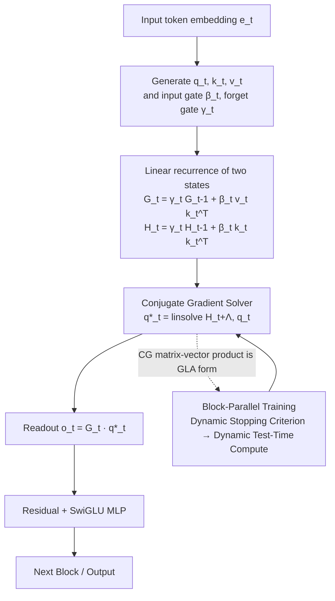

# MesaNet: Sequence Modeling by Locally Optimal Test-Time Training

**Conference**: ICLR 2026  
**OpenReview**: [https://openreview.net/forum?id=xa3OnTb6c3](https://openreview.net/forum?id=xa3OnTb6c3)  
**Code**: To be confirmed  
**Area**: Efficient Sequence Modeling / Linear Attention / Test-Time Training  
**Keywords**: Mesa layer, linear RNN, Test-Time Training, Conjugate Gradient, block-parallelism, Dynamic Test-Time Computation  

## TL;DR
MesaNet pushes "Test-Time Training" to its optimum: unlike DeltaNet which takes a single gradient step per token, it **optimally solves** the cumulative regularized squared error of "fitting a linear model using context" at every time step. Through a Conjugate Gradient (CG) solver and block-parallelism, the Mesa layer—previously restricted to serial execution and numerically unstable—can be scaled to billion-parameter training on GPU/TPU for the first time.

## Background & Motivation
Transformers dominate sequence modeling via softmax self-attention, but their memory and compute scale linearly with sequence length during inference. Recently, linear attention and modern RNNs (Mamba, xLSTM, DeltaNet, Gated DeltaNet) have replaced softmax with linearization to achieve constant memory and constant inference compute.

These models can be unified under a single perspective: their recurrent states essentially perform **online learning of a linear mapping** (fast weight) using the context. Each incoming token triggers a learning rule—the Hebbian rule corresponds to Gated Linear Attention (GLA), while the delta rule corresponds to DeltaNet; both perform single-step gradient descent on a quadratic loss.

The issue lies in "single-step." Single-step gradients only utilize first-order information and focus on the instantaneous loss of the current token. Writing a new association often requires repeated presentations to lower the memory error. The Mesa layer proposed by von Oswald et al. (2024) changes the objective to finding the "optimal solution for the cumulative regularized squared error of all historical tokens." Theoretically, this is the **optimal linear associative memory** in the sense of squared error, allowing for one-shot association writing.

However, it has two fatal shortcomings: first, it requires classical serial Recursive Least Squares (RLS), failing to utilize matrix accelerators and performing an order of magnitude slower than alternatives at 400M scale; second, it is numerically unstable when used with forgetting gates, requiring the regularization term to decay exponentially over time. MesaNet addresses these by **retaining the expressivity of the "optimal solution" while enabling parallel training, numerical stability, and context-dependent forgetting**.

## Method
MesaNet follows the mainstream decoder-only architecture: $N$ residual blocks are stacked, each consisting of channel mixing (standard SwiGLU MLP) and sequence mixing. The only component replaced is the sequence mixing layer—using the Mesa layer instead of Multi-Head Attention (MHA).

All comparison models (MHA, Mamba2, xLSTM, (Gated) DeltaNet) share the exact same backbone, changing only the sequence mixing rules to ensure 1-to-1 fair comparisons. The overall data flow is as follows:

**Expressing the "Optimal Solution" as a Closed-form Readout of Two Linear Recursive States.**
The objective of the Mesa layer at each time step $t$ is to solve a cumulative weighted least squares problem with regularization:

$$\hat{\Phi}_t = \arg\min_\Phi \tfrac{1}{2}\sum_{t'\le t}\rho_{tt'}\|v_{t'}-\Phi k_{t'}\|^2 + \tfrac12\mathrm{Tr}(\Phi\Lambda\Phi^\top),$$

where $\rho_{tt'}$ is the causal weight obtained by the product of forgetting gates. Since the loss is quadratic with respect to $\Phi$, the optimal solution has a closed form $o_t = G_t(H_t+\Lambda)^{-1}q_t$. The key observation is that both matrix states satisfy simple linear recurrences:

$$G_t=\gamma_t G_{t-1}+\beta_t v_t k_t^\top=\sum_{t'}\rho_{tt'}v_{t'}k_{t'}^\top,\qquad H_t=\gamma_t H_{t-1}+\beta_t k_t k_t^\top=\sum_{t'}\rho_{tt'}k_{t'}k_{t'}^\top.$$

Thus, there is no need to explicitly retain historical tokens; one only needs to maintain an additional $n_a\times n_a$ state $H_t$. This is the fundamental difference between the Mesa layer and all "single-step" RNNs: models like DeltaNet only optimize the instantaneous loss of the current input and take only one step, whereas Mesa solves for the optimal loss of the entire history. As a second-order online learner, it can perform one-shot writing of new associations, whereas the delta rule often requires repeated presentations to reduce memory error.

The table below compares the recurrence and readout of several modern linear RNNs, showing that Mesa is the only one to explicitly solve a linear system at readout:

| Layer | State Recursion | Readout |
|---|---|---|
| Mamba2 / GLA | $G_t=\gamma_t G_{t-1}+\beta_t v_t k_t^\top$ | $o_t=G_t q_t$ |
| DeltaNet | $G_t=G_{t-1}(I-\beta_t k_t k_t^\top)+\beta_t v_t k_t^\top$ | $o_t=G_t q_t$ |
| Gated DeltaNet | $G_t=\gamma_t G_{t-1}(I-\beta_t k_t k_t^\top)+\beta_t v_t k_t^\top$ | $o_t=G_t q_t$ |
| **Mesa** | Dual-state linear recurrence ($G_t, H_t$) | $o_t=G_t\,\mathrm{linsolve}(H_t+\Lambda,q_t)$ |

**Solving the Linear System via Conjugate Gradient for Numerical Stability and Block-Parallelism.**
The original Mesa layer explicitly maintained $(H_t+\Lambda)^{-1}$ using Recursive Least Squares, which leads to numerical explosion once forgetting is enabled, requiring the regularization term to decay exponentially over time. MesaNet avoids explicit inversion by solving the linear system $q^*_t = \mathrm{linsolve}(H_t+\Lambda, q_t)$ for each query using the Conjugate Gradient (CG) method. This choice is deliberate: the most computationally heavy part of a CG iteration is $\sum_i \rho_{ti}k_ik_i^\top p$ (where $p$ is the current search direction), which happens to be the form of Gated Linear Attention (GLA). Consequently, the layer can be written in an $O(1)$ recursive inference mode while reusing existing hardware-efficient block-parallel GLA implementations for $O(T)$ parallel training and efficient backpropagation. The cost is that CG convergence is relatively slower in the early sequence when $\Lambda$ is fixed, and the additional $H_t$ state consumes extra memory—though this accounts for less than 1% of total memory in practice.

**Treating CG Step Count as a Tunable Knob to Realize Dynamic Test-Time Computation.**
Since the Mesa layer is essentially a test-time optimizer, it naturally provides a principled way to allocate computation: the number of CG steps $k$ required to reach a given error tolerance depends on the head, sequence, and token. A stopping criterion allows inference (and even training) costs to adapt dynamically to the input content. This contrasts interestingly with softmax attention, where computation grows with sequence length regardless of content; the Mesa layer spends compute based on "how difficult this chunk of data is to solve." The two extremes are clear:

- At $k=0$, $q^*_t=q_t$, and the layer degrades to GLA, providing a lower bound for compute.
- Larger $k$ approaches the optimal solution, with FLOPs roughly $k$ times that of GLA and $k-1$ times that of (Gated) DeltaNet.

Since the total CG overhead grows as $kn_a^2$, there exists a maximum $k$ where Mesa remains more FLOP-efficient than MHA. The main experiments fix $k=30$.

## Key Experimental Results
- **Scale and Data**: Models trained at three scales (140M / 440M / 1B) on SlimPajama. Main results use 1B models, 50B tokens, and a sequence length of 2048. All models share the backbone/tokenizer/data order and undergo independent learning rate tuning.
- **Language Modeling PPL (1B / 50B tokens, lower is better)**: Mesa achieved an average PPL of 13.79 and Hawk-Mesa 13.75, both outperforming Gated DeltaNet (13.87), xLSTM/DeltaNet (14.03/14.05), and Mamba2 (14.58). Hawk-Mesa even slightly outperformed the Transformer baseline (13.79). Mesa consistently led all RNN baselines across SlimPajama, WikiText, PG19, GovReport, and Qasper subsets.
- **Downstream Capabilities (400M / 50B tokens)**: In global reasoning (40.88) and in-context recall (39.30 vs. Gated DeltaNet's 35.96), Mesa outperformed all RNNs. However, in strong retrieval tasks like recall, it still significantly lags behind Transformers (49.95).
- **Sequence Position Analysis**: Analysis of NLL differences relative to Transformer reveals that almost all RNNs are stronger in the first 64 tokens and lag thereafter; MesaNet and Hawk-Mesa extend this advantage beyond 512 tokens.
- **Efficiency**: Despite solving $t \cdot H$ linear systems and backpropagating through them per layer, block-parallel training throughput on H100 remains competitive with MHA and other RNNs. Compared to the original serial Mesa layer (which was an order of magnitude slower at 400M and had ~3.2 point / 23% worse PPL due to the lack of forgetting gates), the Gain is significant.

## Highlights & Insights
- **"Solving to Optimality" yields real gains, not just hype**: Under strict 1-to-1 comparison, upgrading from single-step online learning to an optimal solution per step results in lower PPL and improved global reasoning/retrieval, validating the value of second-order optimal associative memory.
- **Algorithm selection serves hardware**: CG was chosen not because it converges fastest, but because its core matrix-vector product (matvec) maps to the GLA form, allowing direct integration with mature block-parallel kernels—a key to making "theoretically beautiful but engineering-unscalable" layers practical.
- **A new form of Dynamic Test-Time Computation**: Embedding "solve more CG steps for higher accuracy" as an internal optimization loop aligns with the trend of "trading test-time compute for performance," but at the layer level rather than the Chain-of-Thought level.
- **Methodological value of position-conditional evaluation**: The paper notes that average PPL hides differences; the phenomenon of RNNs being "early-strong, late-weak" only becomes visible when broken down by token position, which is highly insightful for evaluating linear models.
- **Serves as a strong baseline**: Mesa/Hawk-Mesa consistently lead various modern RNNs under a unified backbone, providing a robust reference for future research on efficient sequence layers.

## Limitations & Future Work
- **Retrieval remains a weakness**: Even with an optimal Mesa layer, in-context recall is markedly inferior to Transformers; the fundamental bottleneck of constant-sized states has not been eliminated.
- **Inference compute and memory overhead**: Compared to single-state RNNs, it requires additional propagation of the $n_a \times n_a$ $H_t$ matrix, and FLOPs are approximately $k$ times those of GLA. CG converges slowly in the early parts of a sequence.
- **Backbone not optimized for Mesa**: To ensure fair comparison, the Llama2 backbone was used (without tuning key size, number of heads, or MLP fusion), which may underestimate MesaNet's upper bound.
- **Simple forgetting/regularization settings**: Experiments used a static diagonal regularization $\Lambda$. There is further potential for more flexible context-dependent regularization or non-linear test-time objectives (similar to the Atlas approach).

## Related Work & Insights
MesaNet sits on the unified lineage of "Modern RNN = Test-time Regression": GLA/Mamba2 (Hebbian rule) and DeltaNet/Gated DeltaNet (delta rule) are special cases of single-step online learning, while the Mesa layer is the limit of "solving to optimality."

It directly improves upon the serial Mesa layer by von Oswald et al. (2024) and forms a contrast with parallel works like Longhorn (also derived from quadratic loss but only considering current input), Atlas (sliding window + non-linear variants of Mesa), and Titans (mini-batch gradient + momentum).

The insight for readers: when a recurrent layer can be formulated as an optimal solution to a quadratic loss, "solving it to optimality" carries both theoretical significance (optimal associative memory, second-order learning) and hardware friendliness through proper solvers (CG ↔ GLA equivalence). This provides a paradigm for designing next-generation efficient sequence layers: "find the closed-form optimum first, then find a parallelizable solver."

## Rating
- Novelty: 4.5/5 (Making optimal test-time training a scalable, stable, and dynamic compute layer)
- Experimental Thoroughness: 4.5/5 (Multiple scales, strict 1-to-1 comparison, thorough position-conditional evaluation and efficiency analysis)
- Writing Quality: 4.5/5 (Clear unified perspective, tight integration of derivation and motivation)
- Value: 4.5/5 (Provides a new "optimal + parallelizable" paradigm and solid baseline for efficient sequence modeling)

<!-- RELATED:START -->

## Related Papers

- [\[ICLR 2026\] Test-Time Training Done Right](test-time_training_done_right.md)
- [\[ICLR 2026\] Let's (not) just put things in Context: Test-time Training for Long-context LLMs](lets_not_just_put_things_in_context_test-time_training_for_long-context_llms.md)
- [\[ICLR 2026\] Local Linear Attention: An Optimal Interpolation of Linear and Softmax Attention for Test-Time Regression](local_linear_attention_an_optimal_interpolation_of_linear_and_softmax_attention_.md)
- [\[ICLR 2026\] MoM: Linear Sequence Modeling with Mixture-of-Memories](mom_linear_sequence_modeling_with_mixture-of-memories.md)
- [\[ICLR 2026\] Scaling Up, Speeding Up: A Benchmark of Speculative Decoding for Efficient LLM Test-Time Scaling](scaling_up_speeding_up_a_benchmark_of_speculative_decoding_for_efficient_llm_tes.md)

<!-- RELATED:END -->
