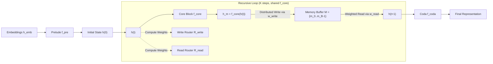

# MeSH: Memory-as-State-Highways for Recursive Transformers

**Conference**: ICLR 2026  
**OpenReview**: [https://openreview.net/forum?id=IhTrFvY7p3](https://openreview.net/forum?id=IhTrFvY7p3)  
**Code**: [https://github.com/LivingFutureLab/MeSH](https://github.com/LivingFutureLab/MeSH)  
**Area**: Efficient LLMs / Recursive Transformer Architectures / Parameter-efficient Pre-training  
**Keywords**: Recursive Transformer, Weight Sharing, Memory Buffer, Dynamic Routing, Parameter Efficiency  

## TL;DR
This paper identifies two root causes for why recursive Transformers lag behind non-recursive models of equal compute—"undifferentiated computation" and "information overload." It proposes MeSH: a scheme using explicit memory slots and step-wise learnable read/write routers to replace the overloaded single hidden state. This allows a 1.4B recursive model to outperform a same-scale Vanilla Transformer while using 33% fewer parameters.

## Background & Motivation

**Background**: Recursive Transformers decouple "computational depth" from "parameter depth" by repeatedly invoking a weight-shared core block. This is a parameter-efficient architectural approach to address compute, data, and communication bottlenecks, theoretically allowing for adaptive compute budget allocation and opening a new scaling axis of "computational depth."

**Limitations of Prior Work**: Under **compute-aligned** conditions (equal FLOPs), recursive models with fewer parameters typically underperform non-recursive counterparts, showing higher perplexity and lower downstream accuracy. Previous works merely patched recursive models with various fixed residual or anchor connections without clarifying the fundamental performance gap.

**Key Challenge**: The authors quantify the performance gap into three observable phenomena through probe experiments and attribute them to two root causes. First, **undifferentiated computation**: the core block is unaware of its current iteration step and is forced to perform nearly identical transformations at every step. This manifests as "computation skew" (the first loop does most of the work, with subsequent updates approaching zero) and "representation stagnation" (extremely high CKA similarity between adjacent loop states, where the model gets stuck in a fixed point). Second, **information overload**: a single hidden state must serve as "long-term memory" to prevent forgetting the initial input and as "working memory" for instantaneous per-step computation. These conflicting roles compete for the same vector space, forcing the model to degrade into a low-dimensional "common ground" representation, causing "representation collapse" (the singular value spectrum of loop states decays much faster than the initial state, leading to a sharp drop in effective rank).

**Goal**: To eliminate both pathological issues at the architectural level without increasing parameters or breaking compute alignment, enabling recursive models to fully realize their parameter efficiency advantages.

**Core Idea**: **[State Outsourcing + Dynamic Routing]** Outsourcing "state management" from an implicit burden to an explicit learnable routing problem. A multi-slot memory buffer (state highway) is used to store long-term information, while read/write routers with per-step parameters dynamically synthesize the next state. This allows the core block to play different roles in each iteration and releases the full dimensionality of the hidden state for instantaneous computation.

## Method

### Overall Architecture

MeSH is built on a Prelude-Recurrent-Coda structure: a non-shared prelude block $f_{pre}$ processes word embeddings into an initial state, followed by $K$ iterations of a weight-shared core block $f_{core}$, and finally a coda block $f_{coda}$ produces the representation. The MeSH modification occurs strictly within the recursion: the single-channel path where the "previous hidden state is fed directly to the next" is replaced by a read-write cycle using a multi-slot memory buffer. Read/write weights are calculated in real-time by lightweight, per-step independent routers.

### Key Designs

**1. Multi-slot Memory Buffer: A dedicated highway for long-term information.** MeSH maintains a state buffer $M=\{m_0,\dots,m_{B-1}\}$ with $B$ slots, each $m_b\in\mathbb{R}^{L\times D}$ isomorphic to the hidden state. Before the loop starts, the original word embedding is placed in slot 0 as an "initial anchor," and other slots are zeroed: $m_0^{(0)}=h_{emb},\ m_{b>0}^{(0)}=\mathbf{0}$. This buffer provides a dedicated space for long-term context, preventing it from competing with instantaneous computation within the same hidden state. Consequently, the hidden state can utilize all dimensions for high-dimensional, expressive transformations, directly addressing representation collapse caused by "information overload."

**2. Step-wise Independent Read/Write Routers: Letting the core block "know its step."** Buffer access is managed by a write router $R_{write}^{(t)}$ and a read router $R_{read}^{(t)}$. **Crucially, they have independent parameters for each iteration $t=0,\dots,K-1$.** Routing weights are calculated at each step based on the current hidden state: $w_{write}^{(t)}=\mathrm{Softmax}(\mathrm{Linear}_{write}^{(t)}(h^{(t)}))$ and $w_{read}^{(t)}=\mathrm{Softmax}(\mathrm{Linear}_{read}^{(t)}(h^{(t)}))$. Each Linear layer is a single-layer projection from the $D$-dimensional hidden state to $B$ slots. Because the routers are not shared across steps, the model is not forced to apply the same universal transformation every time; instead, it learns different "where to fetch, where to store" strategies for each step—acting as an implicit switch to break "undifferentiated computation" and achieve functional specialization.

**3. Soft Write + Weighted Read State Synthesis: Upgrading fixed supplements to learnable dynamic combinations.** At each step, the core block first computes the output $h_m^{(t)}=f_{core}(h^{(t)})$. This is followed by a "distributed soft write," where the output is scaled by write weights and **accumulated** into the slots: $m_b^{(t+1)}=m_b^{(t)}+h_m^{(t)}\odot w_{write,b}^{(t)}$ (where $\odot$ denotes element-wise multiplication with broadcasting). The next state is then synthesized via a weighted read from the updated buffer: $h^{(t+1)}=\sum_{b=0}^{B-1}m_b^{(t+1)}\odot w_{read,b}^{(t)}$. Compared to rigid "residual" or "anchor" schemes that fixedly add $h^{(0)}$ or $h^{(t)}$, this read-write mechanism allows the model to flexibly retrieve and combine context from all historical states. The paper notes that this subsumes residual and anchor connections as special cases. In the Prelude-Recurrent-Coda setup, the prelude output is first synthesized into $h^{(0)}$ through a transition cycle, and after the main loop, a final read operation computes $h^{(K)}$ from the buffer for the coda.

## Key Experimental Results

Pre-training follows the Pythia suite methodology (GPT-NeoX architecture, deduplicated Pile subset), trained from scratch on 160M–6.9B scales. Evaluation includes perplexity (Pile/Wiki/Lambada-OpenAI/Standard) and average accuracy across 9–10 few-shot downstream tasks. Recursive variants save approximately 33% of non-embedding parameters compared to Vanilla.

### Main Results (Selected Scales, ∆acc is absolute change vs. Vanilla)

| Scale | Scheme | Config | Pile PPL↓ | LD-O PPL↓ | 0-shot ∆acc | 5-shot ∆acc |
|------|------|------|-----------|-----------|-------------|-------------|
| 160M | Vanilla | 12 layers | 11.31 | 42.86 | — | — |
| 160M | base | 2+4R2+2 | 11.79 | 53.06 | -0.98 | -1.25 |
| 160M | +anchor | 2+4R2+2 | 11.63 | 50.38 | -1.07 | -0.39 |
| 160M | **+mesh** | 2+4R2+2 | **11.37** | **46.60** | **-0.47** | **+0.06** |
| 410M | Vanilla | 24 layers | 9.07 | 19.48 | — | — |
| 410M | base | 3+6R3+3 (-50%) | 9.65 | 26.76 | -1.93 | -1.30 |
| 410M | **+mesh** | 3+6R3+3 (-50%) | **9.35** | **20.72** | **-0.34** | **+0.73** |
| 1.4B | Vanilla | 24 layers | 7.44 | 10.51 | — | — |
| 1.4B | base | 4+8R2+4 | 7.63 | 11.38 | -0.61 | -0.94 |
| 1.4B | **+mesh** | 4+8R2+4 | **7.39** | **9.72** | **+1.06** | **+0.86** |

**Highlight**: MeSH at 1.4B outperforms Vanilla by +1.06%/+0.86% in 0-shot/5-shot accuracy while saving 33% of parameters, achieving the best overall perplexity.

### Ablation Study (Pythia-410M, 3+6R3+3, Mean of 500 samples)

| Diagnostic Dimension | base | +residual | +anchor | +mesh |
|----------|------|-----------|---------|-------|
| Computation Skew (Fig 3) | Extreme imbalance, later loops ≈ 0 | Partially mitigated, still drops | Partially mitigated, still drops | **Balanced contributions across loops** |
| Repr. Stagnation CKA (Fig 4) | Extremely high adj. similarity | Slight reduction | Slight reduction | **Significant reduction, escapes fixed point** |
| Repr. Collapse Spectrum (Fig 5) | Decay much faster than input | Marginal improvement | Marginal improvement | **Maintains high-dimensional expressivity** |

### Key Findings
- **1.46× Parameter Efficiency**: The 805M MeSH model (50.6% 0-shot / 52.8% 5-shot) surpasses the 1.2B non-embedding parameter Vanilla model (49.5% / 51.9%), meaning it achieves equivalent performance with nearly 1/3 fewer parameters.
- **Dominance Throughout Training**: The 1.4B MeSH model consistently maintains lower loss and higher downstream accuracy throughout 120k training steps; the benefits are present from the start rather than being late-stage patches.
- **Robust Layer Allocation**: In Fig 8 control experiments, regardless of the layer distribution between prelude/core/coda, MeSH perplexity remains lower than the base recursive model and approaches the 24-layer Vanilla while saving ~30% non-embedding parameters.
- **Scaling Advantages**: Performance leads increase as the model size grows, suggesting that dynamic state management is a scalable architectural principle.

## Highlights & Insights
- **Diagnosis-driven Design**: The paper uses three quantifiable probes—computation skew, CKA similarity, and singular value spectra—to transform the "why recursion fails" intuition into evidence, allowing for precise architectural remedies.
- **Explicating Implicit Challenges**: State management is typically an implicit burden in recursive models. MeSH reformulates it into a learnable routing problem ("which slots to read/write"), making residual and anchor connections elegant special cases of its framework.
- **Step-wise Independent Routing is the "Finishing Touch"**: Making router parameters unshared across steps is crucial for breaking "undifferentiated computation." This implicitly gives the core block a "sense of position," allowing for functional specialization without explicit step embeddings.

## Limitations & Future Work
- Experiments are focused on the Pythia suite (160M–6.9B) and pre-training from scratch on the Pile. Transferability to larger scales, different data distributions, or continued training/fine-tuning of existing models remains unverified.
- Introducing step-specific router parameters and multi-slot buffers reduces non-embedding parameters overall, but the actual throughput and VRAM costs of extra read/write operators and buffer memory for long sequences or large $B$ are less discussed.
- Sensitivity analysis for the number of slots $B$ and the choice of additive vs. overwriting writes is limited in the main text; optimal configurations across scales/tasks require further systematic characterization.

## Related Work & Insights
- **Recursive/Weight-shared Transformers** (Geiping 2025, Bae 2024/2025, Saunshi 2025): MeSH stands directly on this line, providing the missing piece of state management for decoupling computational and parameter depth.
- **Heuristic Recursive Connections** (residual / anchor / anchor*): MeSH unifies these as special cases of dynamic routing, revealing their inherent limitations in "only mitigating information overload but not addressing undifferentiated computation."
- **External Memory / Routing Mechanisms**: Bringing explicit memory buffers and soft read/write routing into the recursive loop aligns with Memory-Augmented Neural Networks and MoE routing concepts, inspiring the use of "learnable state highways" as a general component for recursive and dynamic compute architectures.

## Rating
- **Novelty**: ⭐⭐⭐⭐⭐ Accurately diagnoses two quantifiable pathologies of recursive Transformers and provides a unified architectural solution that subsumes previous heuristics.
- **Experimental Thoroughness**: ⭐⭐⭐⭐ Covers multiple scales (160M–1.4B), uses both perplexity and downstream metrics, and includes comprehensive diagnostic probes; minor points lost for lack of massive-scale transfer and detailed overhead analysis.
- **Writing Quality**: ⭐⭐⭐⭐⭐ The "Diagnosis—Attribution—Remedy—Verification" logic is very clear, with figures and formulas tightly coupled to the core arguments.
- **Value**: ⭐⭐⭐⭐⭐ Provides a scalable recursive architecture path to outperform vanilla models with fewer parameters, offering significant progress for parameter-efficient pre-training.

<!-- RELATED:START -->

## Related Papers

- [\[ICLR 2026\] RMAAT: Astrocyte-Inspired Memory Compression and Replay for Efficient Long-Context Transformers](rmaat_astrocyte-inspired_memory_compression_and_replay_for_efficient_long-contex.md)
- [\[ICLR 2026\] STEM: Scaling Transformers with Embedding Modules](stem_scaling_transformers_with_embedding_modules.md)
- [\[ICLR 2026\] Scaling Linear Attention Capacity with Sparse State Expansion](scaling_linear_attention_capacity_with_sparse_state_expansion.md)
- [\[ICLR 2026\] Reconstructing KV Caches with Cross-Layer Fusion for Enhanced Transformers](reconstructing_kv_caches_with_cross-layer_fusion_for_enhanced_transformers.md)
- [\[ICLR 2026\] LoopFormer: Elastic-Depth Looped Transformers for Latent Reasoning via Shortcut Modulation](loopformer_elastic-depth_looped_transformers_for_latent_reasoning_via_shortcut_m.md)

<!-- RELATED:END -->
