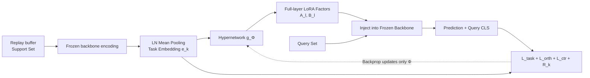

# Meta-UCF: Unified Task-Conditioned LoRA Generation for Continual Learning in Large Language Models

**Conference**: ICLR 2026  
**OpenReview**: [https://openreview.net/forum?id=iNg5KL7eTC](https://openreview.net/forum?id=iNg5KL7eTC)  
**Code**: To be confirmed  
**Area**: LLM Efficient Fine-tuning / Continual Learning  
**Keywords**: LoRA, Continual Learning, Hypernetwork, Parameter-Efficient Fine-Tuning, Meta-learning, Catastrophic Forgetting  

## TL;DR
The authors utilize a shared hypernetwork to instantly translate lightweight task embeddings into full-layer LoRA updates. By employing meta-contrastive and orthogonal objectives to push task embeddings toward near-orthogonality, they achieve continual learning without forgetting while maintaining constant memory (equivalent to the parameters of a single adapter).

## Background & Motivation
**Background**: As LLMs are deployed in scenarios involving a continuous stream of tasks, PEFT methods (LoRA, adapters, prefixes) have reduced the single-task overhead to a small percentage of the total weights. LoRA variants for continual learning (O-LoRA for orthogonalized subspaces, N-LoRA for reparameterized collision avoidance, and GRID/Adaptive-SVD for compressing adapter libraries under a shared orthogonal basis) have shown strong performance in accuracy and anti-forgetting.

**Limitations of Prior Work**: These methods **statically allocate a low-rank slot** for each new task, causing the model size to grow linearly with the number of tasks and making subspace scheduling fragile. Prompt-retrieval methods (L2P, ConPET) do not increase weights but freeze the backbone and require explicit prompt retrieval during inference, which prevents modifying deep representations and limits transfer in reasoning tasks.

**Key Challenge**: The trade-off between linear parameter expansion and sacrificing deep adaptation capability remains unresolved. A deeper issue is that existing methods treat each new task as an isolated patch, lacking a mechanism to **reorganize existing knowledge** as the task stream grows.

**Goal**: To achieve **constant memory and instant adaptation** for continual learning in frozen LLMs facing an unbounded task stream.

**Core Idea**: **Reframe sequential PEFT as a generation problem**. Instead of storing a specific slot for each task, a single hypernetwork is trained to generate rank-$r$ LoRA updates for all layers from compact task embeddings on-the-fly. Meta-contrastive objectives push task embeddings toward near-orthogonality, while orthogonal penalties prevent the collapse of generation directions, ensuring the frozen backbone maintains both plasticity (instant conditional updates) and stability (only a constant-sized hypernetwork is learning).

## Method

### Overall Architecture
Meta-UCF equips the frozen backbone with a shared hypernetwork $g_\Phi$. A support set sampled from a replay buffer is encoded by the frozen backbone and averaged to obtain a task embedding $e_k$. This $e_k$ is fed into $g_\Phi$ to instantly generate rank-$r$ LoRA factors for each layer. The backbone, augmented with these factors, processes the query batch of the current task. Task loss, orthogonal loss, contrastive loss, and bias loss are backpropagated to **update only $\Phi$**, while backbone weights and LayerNorm statistics remain frozen. Training utilizes a first-order MAML variant with zero inner-loop steps.

### Key Designs
**1. Task Embedding: Parameter-free Task Profiling via LayerNorm Mean Pooling.** A robust task embedding must summarize the current task, be stable against sampling noise, be parameter-free for on-the-fly computation, and share the representation space with the backbone. Meta-UCF averages the CLS hidden states of support set samples and applies LayerNorm: $e_k = \mathrm{LN}\big(\frac{1}{S_k}\sum_s h_s\big)$. This simple choice offers three benefits: unbiasness ($\mathbb{E}[e_k]=\mathrm{LN}(\mu_k)$), variance decaying at $O(S_k^{-1})$, and scale equivariance (LN removes arbitrary scaling of feature dimensions). It can also be interpreted as the first-order term of a Fisher kernel expansion. For continual training, $e_k$ is updated via EMA streaming: $e_k^{(t)}=\mathrm{LN}\big((1-\rho)e_k^{(t-1)}+\rho\bar h^{(t)}\big)$, with memory usage only $O(d)$. Finally, $\ell_2$ normalization projects embeddings onto a unit hypersphere so that Euclidean distance is consistent with cosine similarity: $\mathrm{sim}(e_i,e_j)=1-\frac{1}{2}\|e_i-e_j\|_2^2$.

**2. Meta-Conditioned Parameter Generator: Replacing the Adapter Library with one Hypernetwork.** This is the core of eliminating linear growth. The task embedding is first compressed into a task code $z_k=\mathrm{MLP_{task}}(e_k)\in\mathbb{R}^h$ ($h<d$) via a two-layer MLP, then concatenated with learnable layer-specific position embeddings $p_l$: $\tilde z_{k,l}=[z_k;p_l]$. Two low-rank projection heads generate the LoRA factors $(A_l, B_l)$ for that layer, where $W_A, W_B$ are shared across layers and produce layer-specific outputs via $p_l$. During injection, $W_l^{(k)}=W_l+\alpha B_l(e_k;\Phi)A_l(e_k;\Phi)$ with $\alpha=1/r$. The generator parameters $|\Phi|=|\mathrm{MLP_{task}}|+2hL+2hdr$ and the forward overhead $O(|\Phi|+Ldr$ are **independent of the number of tasks $K$**, serving as the source of constant memory.

**3. Dual-layer Orthogonality + Bias-Gated Meta-Objective.** Mutually exclusive support/query sets are sampled for each episodic task. The loss function consists of four terms (Eq. 13): the task loss $L_{task}$ is a standard supervised objective providing plasticity; the **orthogonal penalty** $L_{orth}=\sum_{i<j}\Omega_{ij}^2$ (where $\Omega_{ij}=\frac{1}{|Q_i||Q_j|}\|H_i^\top H_j\|_F$) acts on the query subspace of the adapted backbone to constrain **output geometry** and reduce cross-task interference. The **meta-contrastive loss** $L_{ctr}$ is an InfoNCE loss that treats two independent support minibatches from the same task as IID "views" for task-level augmentation, pushing different tasks apart on the unit hypersphere to constrain the **input geometry** of the generator. These two regularizers balance plasticity and stability at complementary levels. A fourth term, **dynamic bias calibration** $R_k$, measures sensitive attribute bias via demographic parity difference and gates the gradient using $\sigma(-\beta R_k)$.

**Inference**: For an unseen task, a small support set of $S \le 16$ is used to calculate $e_{new}$. The hypernetwork then generates $\Delta(e_{new})$ without optimization, enabling a "one-model-for-all-tasks" setup with negligible memory overhead.

## Key Experimental Results

### Main Results
Four streams (Std-CL 5, Long-CL 15, Seq-GLUE 7, TRACE-8), Average Accuracy (%, ↑):

| Method | Std-CL 5 | Long-CL 15 | Seq-GLUE 7 | TRACE-8 |
| :--- | :--- | :--- | :--- | :--- |
| LoRA | 78.3 | 61.4 | 75.9 | 55.6 |
| O-LoRA | 80.1 | 63.4 | 76.8 | 57.3 |
| SAPT | 83.2 | 68.1 | 79.6 | 60.7 |
| N-LoRA (Strongest Baseline) | 83.5 | 68.1 | 80.2 | 61.0 |
| **META-UCF (r=8, All)** | **85.6** | **70.7** | **82.7** | **63.4** |
| META-UCF (r=8, Top-Half) | 84.9 | 70.1 | 82.1 | 62.9 |
| META-UCF (r=4, All) | 84.3 | 69.0 | 81.6 | 62.0 |

Compared to N-LoRA, Meta-UCF shows a +1.7 pp gain on Std-CL 5 and +2.2 pp on the heterogeneous TRACE-8. Regarding stability, Meta-UCF reaches a new low in forgetting rate (6.2% on Std-CL 5 vs. 7.1% for N-LoRA), and its Backward Transfer (BWT) is nearly neutral or slightly positive (+0.2 for Std-5, +0.1 for GLUE-7), whereas all competing methods exhibit negative BWT.

Zero-shot protocol (LLaMA-7B first instruction-tuned with rank-8 LoRA on Alpaca, then trained continually on Std-CL 5): Meta-UCF achieves 80.5% downstream accuracy (+3.7 pp over Alpaca-O-LoRA-CL) while maintaining a zero-shot MMLU of 36.2% (close to the 37.5% of single-task Alpaca-LoRA), indicating preservation of general knowledge.

### Ablation Study
Single-factor ablation on Std-CL 5 / Long-CL 15:

| Variant | Std Acc.↑ | Std FR↓ | Long Acc.↑ | Long FR↓ |
| :--- | :--- | :--- | :--- | :--- |
| Full Meta-UCF | 85.6 | 6.2 | 70.7 | 11.5 |
| w/o $L_{orth}$ | 83.9 | 7.8 | 68.5 | 13.2 |
| w/o $L_{ctr}$ | 84.1 | 7.2 | 68.9 | 12.7 |
| w/o Bias Calib. | 84.6 | 6.9 | 69.4 | 12.0 |
| CLS Mean → Last CLS | 82.1 | 9.5 | 66.3 | 15.1 |
| Static LoRA (No Generator) | 80.3 | 11.1 | 64.9 | 17.0 |

### Key Findings
- Removing $L_{orth}$ or $L_{ctr}$ results in a drop of 1.1–1.9 pp in accuracy and a ≈1.5 pp increase in forgetting; these two together control drift. Bias calibration is more effective on longer streams.
- Replacing mean pooling with a single CLS vector drops accuracy by 3.1 pp, while **using fixed LoRA slots (removing the generator) results in the largest loss**, confirming the necessity of task-conditioned generation.
- Sensitivity analysis shows the method is extremely robust to hyperparameters, with most settings fluctuating within ±1 pp of the default.
- Theoretical analysis provides the expressivity bounds of low-rank hypernetworks and PAC-Bayes generalization bounds over task streams.

## Highlights & Insights
- **Paradigm Shift**: By switching from "storing a slot for every task" to "generating LoRA from task embeddings," the authors decouple parameter count from the number of tasks for the first time, offering a clean perspective on PEFT as a generation problem.
- **Dual Geometric Regularization**: $L_{ctr}$ manages the generator's input side (making task codes near-orthogonal), while $L_{orth}$ manages the backbone's output side (ensuring query subspaces do not overlap). This dual approach balances plasticity and stability more systematically than post-hoc orthogonal heuristics.
- **Zero-Inner-Loop MAML**: By eliminating the need for inner-loop gradients, the system can instantly generate adapters using a support set of $S \le 16$, truly achieving a "one-model-for-all-tasks" deployment.
- **Positive BWT**: While most continual learning methods suffer from negative BWT (losing old knowledge to learn new), Meta-UCF pushes BWT toward neutral/positive values, suggesting that generative updates facilitate knowledge reorganization rather than simple overwriting.

## Limitations & Future Work
- **Dependence on Replay Buffer**: Although only a small support set is required, it still assumes representative samples can be collected. If task distributions drift severely or samples are extremely scarce, the representation of mean embeddings may degrade.
- **Hypernetwork Capacity as a Latent Bottleneck**: Since all tasks share a single $g_\Phi$, its ability to accommodate a massive number of tasks or highly diverse tasks requires further stress testing (the paper provides expressivity bounds, but the longest empirical stream is 15 tasks).
- **Marginal Utility of Bias Calibration**: The dynamic bias term requires binary sensitive attribute labels, and ablation shows limited gains, restricting its applicability.
- **Backbone Fully Frozen**: As deep representations are adjusted via LoRA injection, the plasticity ceiling is still constrained by the frozen backbone for tasks requiring fundamental changes to low-level representations.

## Related Work & Insights
- **Parameter-Efficient Continual Learning**: Tools like O-LoRA, N-LoRA, GRID, and Adaptive-SVD follow the "static slot + subspace orthogonality/compression" route, where memory grows linearly with tasks. Meta-UCF fundamentally rewrites this by using a single hypernetwork to generate the entire adapter library.
- **Prompt-based Methods**: Methods like L2P, ConPET, and JARe do not increase weights but freeze the backbone and require retrieval during inference. Meta-UCF’s task-embedding-driven low-rank updates provide stronger plasticity.
- **Classical Continual Learning**: Approaches like EWC, GEM, and LwF scale poorly on billion-parameter backbones. This work validates the advantages of the generative route.
- **Insight**: The concept of replacing "allocating new modules for new demands" with "instant synthesis of module parameters via a conditional generator" can be extended to multi-task or personalization scenarios (e.g., generating personalized adapters based on user embeddings).

## Rating
- **Novelty**: ⭐⭐⭐⭐ Reframing sequential PEFT as a hypernetwork generation problem and balancing plasticity-stability through dual-layer geometric regularization is a substantial innovation for LoRA-based continual learning.
- **Experimental Thoroughness**: ⭐⭐⭐⭐ Covers four heterogeneous streams, four 7–13B backbones, and multiple metrics including zero-shot MMLU. However, the 15-task limit for the longest stream does not fully test the capacity limits of the hypernetwork.
- **Writing Quality**: ⭐⭐⭐⭐ Clear motivation, complete mathematical formulations, and an intuitive pipeline diagram. Excellent integration of theory and empirical results.
- **Value**: ⭐⭐⭐⭐ Constant memory, instant adaptation, and neutral BWT are highly practical for lifelong learning in LLMs. The "one-model-for-all-tasks" deployment is engineering-attractive.

<!-- RELATED:START -->

## Related Papers

- [\[ICLR 2026\] Merge before Forget: A Single LoRA Continual Learning via Continual Merging](merge_before_forget_a_single_lora_continual_learning_via_continual_merging.md)
- [\[ICLR 2026\] PLoP: Precise LoRA Placement for Efficient Finetuning of Large Models](plop_precise_lora_placement_for_efficient_finetuning_of_large_models.md)
- [\[ICLR 2026\] LoRAGen: Structure-Aware Weight Space Learning for LoRA Generation](loragen_structure-aware_weight_space_learning_for_lora_generation.md)
- [\[ICLR 2026\] BA-LoRA: Bias-Alleviating Low-Rank Adaptation to Mitigate Catastrophic Inheritance in Large Language Models](ba-lora_bias-alleviating_low-rank_adaptation_to_mitigate_catastrophic_inheritanc.md)
- [\[ICLR 2026\] Deep Hierarchical Learning with Nested Subspace Networks for Large Language Models](deep_hierarchical_learning_with_nested_subspace_networks_for_large_language_mode.md)

<!-- RELATED:END -->
