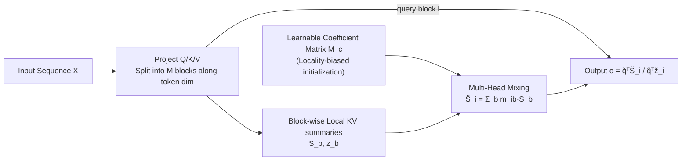

# MHLA: Restoring Expressivity of Linear Attention via Token-Level Multi-Head

**Conference**: ICLR 2026  
**OpenReview**: [https://openreview.net/forum?id=340QjF3jJP](https://openreview.net/forum?id=340QjF3jJP)  
**Code**: [dagroup-pku.github.io/MHLA](https://dagroup-pku.github.io/MHLA) (Project Page)  
**Area**: Efficient Attention / Linear Attention Architecture  
**Keywords**: Linear Attention, Token-Level Multi-Head, Global Context Collapse, Rank, Linear Complexity  

## TL;DR
This paper identifies "Global Context Collapse" as the root cause of performance degradation in linear attention—where all queries share a fixed $d \times d$ global KV summary, capping the attention matrix rank at $d$. The authors propose Multi-Head Linear Attention (MHLA), which partitions the sequence along the token dimension and utilizes a learnable coefficient matrix for query-conditioned mixing of local summaries. This approach elevates the rank upper bound to $\sum_b \min(n_b, d)$ and restores the expressivity of softmax attention while maintaining $O(N)$ complexity and avoiding extra convolutional or gating modules.

## Background & Motivation
**Background**: Transformer self-attention is the core module for vision, NLP, and generative models, but its $O(N^2)$ complexity is prohibitive for long-sequence tasks such as high-resolution image or video generation. Linear attention (Katharopoulos 2020, Performer, etc.) approximates the softmax kernel using positive feature maps $\phi(\cdot)$ such that $\mathrm{Sim}(Q_i, K_j) \approx \phi(Q_i)\phi(K_j)^\top$, compressing all key-values into a global summary $G = \sum_j \phi(K_j)^\top V_j$, reducing complexity to $O(N)$.

**Limitations of Prior Work**: Directly replacing softmax with linear attention often leads to significant accuracy drops, especially in long-sequence tasks. Prevailing remedies (Focused LA, Inline Attn, MALA/RALA, etc.) incorporate external modules like depthwise convolutions or gating to recover performance. However, these modules reintroduce computational overhead and degrade as sequences lengthen, deviating from the original goal of linear attention efficiency.

**Key Challenge**: Linear attention compresses all tokens into a fixed-size $d \times d$ global KV summary shared by all queries, thereby losing the most critical advantage of softmax attention: **query-conditioned adaptation** (the ability for each query to select a specific subset of tokens). **Key Insight**: The authors quantify this phenomenon as "**Global Context Collapse**"—(1) Rank Collapse: $\mathrm{rank}(A_{lin}) = \mathrm{rank}(\tilde Q \tilde K^\top) \le d$, where the attention matrix rank is capped at $d$ regardless of sequence length; (2) Sparsity Loss: All queries reuse the same aggregated representation, losing the ability to re-weight keys based on query relevance. As $N$ increases, the attention distribution tends toward uniformity and entropy rises, sacrificing focus.

**Goal**: To restore query-related diversity (allowing different queries to retrieve different contexts) **without sacrificing linear complexity or introducing heavy external modules**.

**Core Idea**: **Multi-heading along the token dimension**. The sequence is partitioned into $M$ non-overlapping blocks (spatial or spatio-temporal "heads"). Each block computes its own local KV summary, and each query block performs query-specific mixing of these local summaries via a learnable coefficient matrix. This two-stage process restores "block-level selection × intra-block token re-weighting" query-conditioned diversity.

## Method

### Overall Architecture
MHLA partitions the input sequence $X \in \mathbb{R}^{N \times d}$ along the token dimension into $M$ non-overlapping blocks (defined on 2D/3D spatial grids rather than flattened 1D for vision tasks). Each block computes a local KV summary $S_b = \sum_{j \in b} \tilde K_j V_j^\top$ and a normalization term $z_b = \sum_{j \in b} \tilde K_j$. The core innovation is the **Multi-Head Mixing** via a learnable coefficient matrix $M_c \in \mathbb{R}^{M \times M}$: query block $i$ no longer reads a single global summary but instead weights $M$ local summaries into a query-specific mixed summary $\tilde S_i = \sum_b m_{i,b} S_b$ before applying attention. The entire pipeline uses standard GEMM and maintains $O(N)$ complexity.

### Key Designs

**1. Token-level Multi-Head + Local KV Summaries: Breaking the Rank Bound $d$**. Standard linear attention compresses the full sequence into one $d \times d$ summary, where the rank of the attention matrix $A_{lin} = \tilde Q \tilde K^\top$ is strictly bounded by $\mathrm{rank} \le \min\{\mathrm{rank}(\tilde Q), \mathrm{rank}(\tilde K)\} \le d$. When $N \gg d$, this is a severe low-rank approximation of the true $N \times N$ attention. By partitioning the sequence into $M$ blocks and calculating local summaries $S_b = \sum_{j \in b} \tilde K_j V_j^\top$, the mixed key sequence seen by each query block is composed of different blocks, and the attention sub-matrix rank $\mathrm{rank}(A_b) \le \min(n_b, d)$. The global rank bound is thus expanded to $\mathrm{rank}(A_{MHLA}) \le \min\big(N, \sum_{b=1}^M \min(n_b, d)\big)$. Effectively, the rank is no longer capped by a single $d$ but grows near-linearly with the number of heads $M$. In DeiT-T experiments, MHLA achieves an attention rank (233) far higher than linear attention (58) and approaches softmax (255).

**2. Multi-Head Mixing: Restoring Query-conditioned Selectivity**. Partitioning alone is insufficient; each query must be able to combine these blocks specifically. MHLA introduces a coefficient matrix $M_c \in \mathbb{R}^{M \times M}$, where the $i$-th row $m_i$ specifies how query block $i$ linearly combines the $M$ local summaries: $\tilde S_i = \sum_{b=1}^M m_{i,b} S_b$ and $\tilde z_i = \sum_b m_{i,b} z_b$. For a given query $\tilde q$, the output is:

$$o = \frac{\tilde q^\top \tilde S_i}{\tilde q^\top \tilde z_i} = \frac{\sum_{b=1}^M m_{i,b} \, \tilde q^\top S_b}{\sum_{b=1}^M m_{i,b} \, \tilde q^\top z_b}.$$

Expanding the local summaries yields $\tilde q^\top \tilde S_i = \sum_{t=1}^N m_{i,b(t)} \big(\tilde q^\top \tilde K_t\big) V_t^\top$. The mechanism is transparent: the **outer layer** $m_{i,b(t)}$ allows the query block to select relevant blocks at a "block-level," while the **inner layer** $\tilde q^\top \tilde K_t$ distinguishes tokens within the block. This two-level multiplication restores query-specific focusing (significantly lowering entropy) and simplifies all operations to a mixture of $M$ $d \times d$ matrices (one GEMM), preserving $O(N)$. For long-sequence scenarios like language modeling or video generation, the normalization term can be omitted to enhance training stability.

**3. Locality-biased Initialization + End-to-End Learning**: Since blocks are defined on spatial/spatio-temporal axes, $M_c$ is initialized with a preference for locality—the $i$-th row $m^{(0)}_{i,j} \propto 1 - \mathrm{dist}(i,j) / \max_k \mathrm{dist}(i,k)$ (decaying by Euclidean distance), normalized such that $\sum_j m^{(0)}_{i,j} = 1$. Coefficients are clipped to $(0,1)$ during updates to ensure non-negativity and stability. This prior facilitates faster and more stable convergence while allowing $M_c$ to learn and adapt to the data distribution. Ablations show that locality-only initialization (frozen) reaches 75.4%, learnable-only without prior reaches 75.1%, and the combination achieves 75.8%.

**4. Complexity and Head Count Trade-off**: The total complexity of MHLA is $O(MN_b d^2 + M^2 d^2 + MN_b d^2) = O(Nd^2 + M^2d^2)$. To ensure $Nd^2$ remains the dominant term, the number of heads is chosen such that $M^2 \le N$ (e.g., for DiT-S/2 at 512 resolution with sequence length 1024, $M \le 32$). This maintains $O(Nd^2)$ linear complexity and $O(Md^2)$ memory complexity, naturally supporting chunkwise parallel training and streaming/stateful inference.

## Key Experimental Results

### Main Results

**Image Classification (ImageNet-1K)**—MHLA achieves the best accuracy among linear attention methods with minimal extra parameters, even surpassing self-attention:

| Model / Attention | Params | FLOPs | Top1-Acc |
|---|---|---|---|
| DeiT-T Self Attn | 5.7M | 1.1G | 72.2 |
| DeiT-T Linear Attn | 5.7M | 1.1G | 69.8 |
| DeiT-T MALA | 6.3M | 1.1G | 75.1 |
| **DeiT-T MHLA** | **5.7M** | 1.1G | **75.8** |
| DeiT-S Self Attn | 22M | 4.2G | 79.8 |
| **DeiT-S MHLA** | **22M** | 4.2G | **81.0** |
| MAViT-S (Reproduction) | 27M | 4.6G | 84.3 |
| **MHLA-VLT-S** | 27M | 4.6G | **84.6** |

**Image Generation (Class-to-Image, ImageNet-1K, FID↓)**—Best performance across scales; on L/XL, vanilla MHLA matches self-attention:

| Model | Self Attn | Linear Attn | MHLA |
|---|---|---|---|
| DiT-S/2 @256 | 68.40 | 89.72 | **59.80** |
| DiT-S/2 @512 | 84.54 | 125.33 | **78.63** |
| DiT-B/2 @256 | 43.47 | 60.47 | **37.47** |
| DiT-XL/2 @256 | 19.47 | 28.63 | **19.17**(w/ CPE+Gating) |

**Text-to-Image (SANA-0.6B Fine-tuning)**: SANA-MHLA improves FID from 6.10 to 5.90, CLIP from 28.15 to 28.26, and GenEval from 0.64 to 0.68, surpassing PixArt-α/Σ and the original SANA, catching up to pre-trained checkpoints within 2k steps.

**Video Generation (Wan2.1-1.3B, VBench, Sequence Length 31,500, $M=105$)**:

| Model | Quality↑ | Semantic↑ | Total↑ | Latency(s)↓ |
|---|---|---|---|---|
| Wan-FA (Original FlashAttn) | 85.23 | 75.65 | 83.31 | 166 |
| Wan-LA (Full Linear Attn) | 69.96 | 11.38 | 58.24 | 82 |
| **Wan-MHLA** (Full Replacement) | 84.26 | 76.16 | 82.62 | **81** (2.1× Acceleration) |
| **Wan-MHLA-H** (2/3 Layers Replaced) | 84.87 | **79.59** | **83.82** | 103 (1.6× Acceleration) |

Under 31.5k ultra-long sequences, vanilla LA collapses (Total only 58.24, loss stagnates). MHLA nearly recovers to FlashAttn levels with a 2.1× speedup; the hybrid version even outperforms the original.

**NLP (0.3B, FineWeb-Edu 10B tokens)**: Average commonsense reasoning of 47.1 is competitive with Transformer++ (46.8), Mamba2 (47.0), and GDN (46.9). LongBench average of 7.41 is the best overall, particularly in Multi-Doc QA, Summarization, and Code tasks, demonstrating long-context understanding.

### Ablation Study

| (a) Multi-Head Mixing (DeiT-T) | Top1-acc |
|---|---|
| Locality-bias only (frozen) | 75.4 |
| Learnable only (no prior) | 75.1 |
| **Locality-bias + Learnable** | **75.8** |

| (b) Head Number M (DiT-S/2 @512, Seq Length 1024) | FID↓ | Throughput↑ |
|---|---|---|
| M=4 | 79.56 | 435 |
| **M=16** | **78.63** | 435 |
| M=64 | 79.50 | 408 |

The number of heads is not "the more the better": $M=16$ (satisfying $M^2 \le N$) balances FID and throughput. At $M=64$ ($M^2 > N$), both FID and throughput degrade, supporting the complexity constraint.

### Key Findings
- **Rank and Entropy disprove the "Global Summary is Enough" notion**: On DeiT-T, LA has rank 58.4/entropy 5.12, while softmax has 254.8/4.13. MHLA achieves 233.4/**4.06**—not only approaching softmax in rank but actually becoming more focused (lower entropy).
- **External modules fail at scale**: DWConv (CPE) helps in small DiT, but in DiT-XL, adding CPE degrades FID from 20.32 to 22.79. Vanilla MHLA matches self-attention, suggesting its gains are intrinsic and scalable, unlike convolutional add-ons.
- **Rapid Adaptation**: SANA-MHLA catches up to pre-training in 2k steps, and Wan-MHLA follows the original loss trajectory closely, indicating low migration costs.

## Highlights & Insights
- **Seamless Diagnosis-to-Solution**: The authors use rank and entropy to pinpoint "Global Context Collapse" as the root cause and address it by expanding the rank bound through token-level multi-heading. The theory (rank bound $\sum_b \min(n_b, d)$) aligns perfectly with empirical results (rank 58 to 233).
- **No External Modules**: Unlike competitors relying on DWConv or gating, MHLA uses only partitioning and a single $M \times M$ GEMM, upholding the efficiency ethos of linear attention while proving that intrinsic gains are more scalable than external ones.
- **Cross-task Generality**: Validated across classification, image generation, video generation, and NLP. Achieves 2.1× speedup on 31.5k ultra-long video sequences without significant quality loss, unifying discriminative and generative tasks.
- **Novel "Token-level Multi-Head" Perspective**: Traditional multi-head attention splits the feature dimension (channel). MHLA splits the token dimension (spatial/spatio-temporal blocks), redefining "heads" as local context units and providing a new degree of freedom for linear attention design.

## Limitations & Future Work
- **Partitioning depends on spatial/spatio-temporal structure**: Locality-biased initialization assumes blocks are defined on spatial axes. For sequence tasks without natural geometric structures (e.g., sets or graphs), block partitioning and initialization require further exploration.
- **Head count constraint $M^2 \le N$**: This ties the number of heads to the sequence length. In short sequences, the available heads and resulting rank improvements might be limited. The current selection of $M$ is empirical.
- **NLP Perplexity Gap**: WikiText ppl of 38.31 and LAMBADA 71.64 are still higher than Transformer++ (34.57/60.46). While commonsense reasoning is competitive, perplexity in pure autoregressive long-sequence modeling is not yet fully recovered.
- **Optimal Hybrid Ratios**: Wan-MHLA-H performs best with 2/3 layers replaced, suggesting full replacement might not be optimal, yet there is currently no systematic principle for selecting hybrid ratios.

## Related Work & Insights
- **Linear Attention Lineage**: From the kernel approximations of Linear Transformer (Katharopoulos 2020) and Performer (Choromanski 2021) to external modules like Focused LA (Han 2023), Inline Attn (Han 2024), and MALA/RALA (Fan 2025). MHLA offers a third path: changing the summary structure via token-wise partitioning instead of adding modules.
- **Comparison with Gated Linear Attention/SSM**: GLA, Mamba2, and GDN restore expressivity through gating or selective states. MHLA’s learnable mixing matrix can be viewed as a lighter alternative based on explicit block-level selection, compatible with chunkwise parallelism.
- **Rank as an Expressivity Metric**: Extending the ideas of Bhojanapalli 2020, MHLA treats "increasing rank" as a derivable design goal. This provides a methodology for future efficient attention designs: any linear variant can have its expressivity ceiling predicted by whether its rank bound scales with sequence length or head count.

## Rating
- **Novelty**: ⭐⭐⭐⭐ The "token-level multi-head + learnable mixing" perspective is novel, identifying rank collapse as a traceable cause and offering a derivable mechanism for improvement, distinct from the modular add-on path.
- **Experimental Thoroughness**: ⭐⭐⭐⭐⭐ Comprehensive coverage across four major tasks, including 31.5k ultra-long sequence videos, fast adaptation of SANA/Wan large models, and mechanism visualization via rank and entropy.
- **Writing Quality**: ⭐⭐⭐⭐ Clear "diagnosis → theory → method → validation" structure. The rank bound derivation and token-level expansion effectively explain the mechanism, though minor notation ambiguity exists (e.g., $Y_i$ reuse).
- **Value**: ⭐⭐⭐⭐⭐ Enables linear attention to match or exceed softmax without extra overhead. Its plug-and-play compatibility with DiT, SANA, and Wan provides immediate utility for long-sequence generation and efficient architecture deployment.

<!-- RELATED:START -->

## Related Papers

- [\[ICLR 2026\] Log-Linear Attention](log-linear_attention.md)
- [\[ICLR 2026\] RACE Attention: A Strictly Linear-Time Attention Layer for Training on Outrageously Large Contexts](race_attention_a_strictly_linear-time_attention_layer_for_training_on_outrageous.md)
- [\[ICLR 2026\] Explainable Token-level Noise Filtering for LLM Fine-tuning Datasets](explainable_token-level_noise_filtering_for_llm_fine-tuning_datasets.md)
- [\[ICML 2025\] MoH: Multi-Head Attention as Mixture-of-Head Attention](../../ICML2025/llm_efficiency/moh_multi-head_attention_as_mixture-of-head_attention.md)
- [\[ICLR 2026\] FlexLinearAttention: Compiling a Unified Abstraction into Scalable Kernels for Linear Attention](flexlinearattention_compiling_a_unified_abstraction_into_scalable_kernels_for_li.md)

<!-- RELATED:END -->
