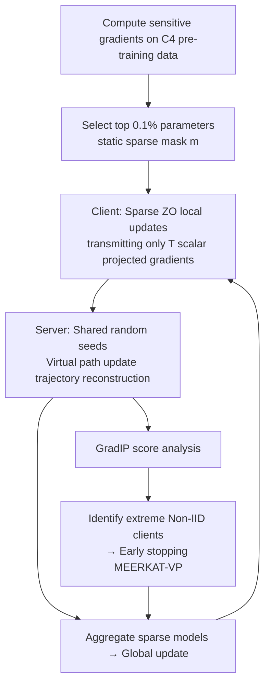

# Mitigating Non-IID Drift in Zeroth-Order Federated LLM Fine-Tuning with Transferable Sparsity

**Conference**: ICLR 2026  
**OpenReview**: [https://openreview.net/forum?id=2DuMBKVbX2](https://openreview.net/forum?id=2DuMBKVbX2)  
**Code**: To be confirmed  
**Area**: Efficient LLM Fine-Tuning / Federated Learning / Zeroth-Order Optimization  
**Keywords**: Federated Learning, Zeroth-Order Optimization, Sparse Fine-Tuning, Non-IID, LLM  

## TL;DR
The paper proposes MEERKAT—a sparse zeroth-order federated fine-tuning method that updates only 0.1% of pre-trained sensitive parameters. It suppresses Non-IID drift through "extreme sparsity + high-frequency synchronization." Based on traceable virtual paths, the GradIP phenomenon is discovered, enabling MEERKAT-VP to identify and early-stop extreme Non-IID clients to improve global model quality.

## Background & Motivation
- **Background**: Federated Learning (FL) allows collaborative fine-tuning of LLMs on decentralized devices without uploading raw data, serving as a critical paradigm for privacy-sensitive scenarios. Zeroth-Order (ZO) optimization, which estimates gradients via forward perturbations, avoids backpropagation and activation caching, significantly reducing on-device memory and becoming a popular direction for federated LLM fine-tuning.
- **Limitations of Prior Work**: The massive parameter count of LLMs leads to a dilemma: (1) high communication overhead from transmitting full models or large gradients every round; (2) client drift caused by Non-IID data heterogeneity, which hinders global convergence. Standard ZO acting directly on billion-parameter spaces is inefficient and unstable.
- **Key Challenge**: The most effective means to mitigate Non-IID drift is **high-frequency synchronization**, but the communication cost of high-frequency sync is unbearable for large models. While sparsification reduces communication, traditional sparse ZO performs unreliably under heterogeneous data. How to simultaneously achieve "low communication + high frequency + heterogeneity resistance"?
- **Goal**: Design a federated ZO fine-tuning method with extremely low communication overhead that supports high-frequency synchronization and can naturally identify and handle extreme Non-IID clients.
- **Key Insight**: **"Transferable Static Ultra-Sparse Mask"**—use gradients from pre-training data to select the 0.1% of parameters most sensitive to loss as a fixed update subset. This allows per-round exchange of only scalar projected gradients, reducing communication by $1000\times$ and making high-frequency sync affordable. **"Virtual Paths + GradIP Signals"**—the server reconstructs client update trajectories using shared random seeds and discovers that gradient inner products of IID vs. Non-IID clients exhibit distinguishable dynamics, allowing for early-stopping of extreme clients.

## Method

### Overall Architecture
MEERKAT performs sparse ZO fine-tuning on clients (perturbing only the selected 0.1% parameters and uploading $T$ scalar projected gradients). The server reconstructs each client's update trajectory on "virtual paths" without data using shared random seeds for aggregation. Furthermore, MEERKAT-VP utilizes virtual paths to calculate GradIP scores, identifying extreme Non-IID clients and applying early-stopping (taking only one step per round) to weaken the pollution of global models by their skewed updates.

### Key Designs

**1. Ultra-sparse static mask driven by pre-trained sensitive parameters: Limiting updates to 0.1% to leverage high-frequency sync.** MEERKAT calculates the average squared gradient for each parameter on a subset of C4 pre-training data. The highest $u$ (default $u=0.1\%$) are marked as 1 to form a binary mask $m\in\{0,1\}^d$, which remains fixed throughout training. Local ZO updates only perturb these parameters: projected gradient $g=\frac{f(w+\epsilon(z\odot m);B)-f(w-\epsilon(z\odot m);B)}{2\epsilon}$, and local gradient estimate $\hat\nabla f = g\,(z\odot m)$, where $z\sim\mathcal N(0,I_d)$. The key to this design: sensitivity is highly concentrated (average squared gradients of top 0.1% parameters are $52\times$ larger than the 0.1%–1% tier), so extreme sparsity incurs almost no precision loss; moreover, this mask is **transferable** across domain-shifted calibration data. Since both parties share random seeds to generate $z$ and the mask is fixed, only one scalar $g$ needs to be exchanged per step, reducing communication by over $1000\times$ compared to Full-FedZO.

**2. Synergy of "Sparsity + High-frequency Sync" to suppress Non-IID drift, theoretically lowering the error floor.** Convergence analysis (under PL-type non-convex conditions) gives the bound $\frac{1}{R}\sum_r (f(w_r)-f^*)\le O\!\big(\frac{(2+u)^2}{TR}\big)+O\!\big(\frac{T}{2+u}\big)+O(1)$. The coupling of two variables shows a clear trade-off: higher sparsity (smaller $u$) improves the transient convergence term quadratically $\propto(2+u)^2$ but raises the steady-state error $\propto\frac{1}{2+u}$. Thus, an optimal sparsity exists. Smaller local steps $T$ (more frequent sync) reduce the steady-state term $O(\frac{T}{2+u})$, lowering the error floor—the theoretical basis for high-frequency sync resisting heterogeneity. Experiments confirm that under extreme high-frequency $T=1$ on Qwen2-1.5B, MEERKAT's Non-IID average accuracy is on par with IID, nearly eliminating the gap caused by heterogeneity.

**3. Virtual Path Reconstruction: Server recovers client trajectories without raw data.** Because the server and client share per-round random seed lists $\{s_r^1,\dots,s_r^T\}$, the server can regenerate $z_k^t$ upon receiving $T$ scalar projected gradients. Combined with the fixed mask $m$, it recovers local gradients $\hat\nabla f_k^t=g_k^t\cdot(z_k^t\odot m)$ at each step, thereby reconstructing the entire local "virtual path" and aggregating $w_k^T$. This traceability is the foundation for subsequent heterogeneity diagnosis: it transforms black-box FL into an analyzable process where the server observes training dynamics step-by-step without touching raw data, while also reducing transmission requirements under weak networks.

**4. GradIP phenomenon and MEERKAT-VP early-stopping: identifying and isolating extreme Non-IID clients using gradient inner product trajectories.** The GradIP score is defined as the inner product of the local ZO gradient and the server pre-training gradient $\langle\nabla f_p,\hat\nabla f_k^t\rangle$. Experiments reveal a clearly separable phenomenon: GradIP of extreme Non-IID (single-label) clients decays monotonically toward zero within 100 steps, while IID clients oscillate continuously. This occurs because the gradients are nearly orthogonal (cosine ≈ 0), and the difference is mainly determined by the local gradient norm trajectory. MEERKAT-VP calculates two metrics during a calibration phase—the ratio of initial/later means $\rho_{\text{later}}=\frac{\text{Gradip}_{\text{init\_avg}}}{\text{Gradip}_{\text{later\_avg}}}$ and the quiet step ratio $\rho_{\text{quie}}$. Clients exceeding thresholds are classified as extreme Non-IID and subjected to early-stopping (one step per round, using a data pointer to ensure full data coverage). Theoretically, MEERKAT-VP has a smaller heterogeneity coefficient $\frac{(2+u)L}{4K}<\frac{L}{K}$, with increasing advantages as heterogeneity $c_h$ grows.

## Key Experimental Results

Models: Gemma-2-2B / Qwen2-1.5B / Llama-3.2-1B; Data: SST-2, AG News, Yelp, BoolQ, RTE, WSC, WiC, partitioned as Non-IID using Dirichlet distribution.

### Main Results (Average Accuracy under Non-IID, LLaMA-3.2-1B, selected)

| Method | Local Step | SST-2 | AgNews | Yelp | BoolQ | RTE | Avg. Acc |
|------|-----------|-------|--------|------|-------|-----|---------|
| Full-FedZO | 10 | 0.909 | 0.705 | 0.940 | 0.641 | 0.542 | 0.699 |
| Weight Magnitude | 10 | 0.902 | 0.857 | 0.951 | 0.696 | 0.551 | 0.717 |
| LoRA-FedZO | 10 | 0.901 | 0.749 | 0.960 | 0.649 | 0.524 | 0.715 |
| **Ours (MEERKAT)** | 10 | 0.916 | 0.872 | 0.964 | 0.695 | 0.600 | **0.759** |

On Qwen2-1.5B ($T=10$), MEERKAT averages 0.805, significantly higher than Full-FedZO (0.761), LoRA (0.768), and Weight-Mag (0.776); it consistently leads across $T\in\{30,50,100\}$.

### Highlights & Insights
- **Communication Cost**: Fixed 0.1% mask reduces communication by >**1000×** compared to Full-FedZO.
- **Sensitivity Concentration**: Top 0.1% parameter average squared gradients are **52×** larger than the 0.1–1% tier (supporting extreme sparsity).
- **Mask Transferability**: Performs well when transferred across domain-shifted calibration sets; comparable to client UnionMask.
- **Additional Baselines**: Under the same settings, outperforms DeComFL; MEERKAT-VP outperforms adapted FedDYN, approaching the backpropagation upper bound.
- **Sparsity Robustness**: Maintains strong accuracy even at $10^{-3}$–$10^{-4}$ sparsity with $T=1$.

### Key Findings
- **Non-IID accuracy ≈ IID under extreme high-frequency $T=1$** (Qwen2-1.5B), directly validating that "Sparsity + High-frequency" smooths out heterogeneity.
- **GradIP trajectory is a reliable indicator of heterogeneity**: Non-IID decays to zero while IID continues to oscillate; near-orthogonality suggests norm dominance.
- **VPCS early-stopping consistently outperforms base MEERKAT and random early-stopping** across various communication frequencies (Non-IID $\alpha=0.5$).

## Highlights & Insights
- **Leveraging "Communication Budget" for "Sync Frequency"**: Extreme sparsity trades bandwidth for scalar-level communication, then reallocates saved bandwidth to high-frequency sync to offset Non-IID drift. This is logically consistent and theoretically supported (steady-state error decreases with $T$).
- **Virtual Path as a Clever Byproduct**: Sharing random seeds was originally a ZO communication optimization; the authors utilize this to let the server reconstruct client trajectories "for free," turning black-box FL into a diagnosable process and yielding GradIP signals.
- **GradIP offers a heterogeneity probe without raw data**, which is practical for privacy-sensitive FL and more fine-grained than client selection methods based purely on loss or accuracy.

## Limitations & Future Work
- The sparse mask relies on pre-training data (C4) for sensitivity; the assumption is that the server has access to calibration data similar to the pre-training distribution. Mask quality and GradIP signals under severe distribution shifts require further investigation.
- Early-stopping criteria involve multiple thresholds ($\rho_{\text{later}}$, $\rho_{\text{quie}}$, $\sigma$) and a calibration phase; hyperparameter tuning and robustness across tasks are not fully explored.
- Experiments focus on 1–2B small models and classification tasks; whether the benefits of "0.1% sparsity + high-frequency" hold for larger LLMs and generative tasks remains an open question.
- Theoretical explanation of GradIP decay is built on "Single-label extreme Non-IID + near-orthogonal gradient" assumptions; only empirical observations exist for more general continuous heterogeneity spectrums.

## Related Work & Insights
- **Zeroth-Order LLM Fine-Tuning**: Extends MeZO (Malladi 2023) concepts of using forward perturbations for memory efficiency into federated scenarios while adding sparse and traceable communication.
- **Sparse ZO Parameter Selection**: Consistent with Guo 2024 findings that gradient-sensitive parameters outperform weight magnitude or random selection, using the transferability of sensitive parameters as an engineering pivot.
- **Federated Heterogeneity**: Instead of correcting client drift like FedDYN, this paper identifies and early-stops the "worst" clients, with diagnostic signals derived from communication byproducts rather than extra computation.
- **Insight**: When communication is reduced to scalar levels, the design degrees of freedom for FL (sync frequency, trajectory observability) are released; using communication optimization methods to provide interpretability signals is a paradigm worth emulating.

## Rating
- Novelty: ⭐⭐⭐⭐ The combination of "Transferable static ultra-sparse mask + Virtual path GradIP signal" is novel, and the GradIP phenomenon is an interesting empirical discovery.
- Experimental Thoroughness: ⭐⭐⭐⭐ Covering 3 models and 7 tasks with multiple sparsities and frequencies, including theoretical convergence bounds and extensive baseline comparisons (DeComFL/FedDYN/Upper bound).
- Writing Quality: ⭐⭐⭐⭐ Claims correspond to Research Questions; logic is clear; explanations for theory and phenomena are sound, though threshold/hyperparameter details are relegated to the appendix.
- Value: ⭐⭐⭐⭐ Communication reduction by $1000\times$ plus data-free heterogeneity diagnosis offers practical utility for edge-side/privacy-sensitive federated LLM fine-tuning.

<!-- RELATED:START -->

## Related Papers

- [\[ICLR 2026\] FLoRG: Federated Fine-tuning with Low-rank Gram Matrices and Procrustes Alignment](florg_federated_fine-tuning_with_low-rank_gram_matrices_and_procrustes_alignment.md)
- [\[ICLR 2026\] Developmental Federated Tuning: A Cognitive-Inspired Paradigm for Efficient LLM Adaptation](developmental_federated_tuning_a_cognitive-inspired_paradigm_for_efficient_llm_a.md)
- [\[ICLR 2026\] Explainable Token-level Noise Filtering for LLM Fine-tuning Datasets](explainable_token-level_noise_filtering_for_llm_fine-tuning_datasets.md)
- [\[ICLR 2026\] Difficulty–Diversity Collaborative Filtering for Data-Efficient LLM Fine-Tuning](difficultydiversity_collaborative_filtering_for_data-efficient_llm_fine-tuning.md)
- [\[ICLR 2026\] Influence-Preserving Proxies for Gradient-Based Data Selection in LLM Fine-Tuning](influence-preserving_proxies_for_gradient-based_data_selection_in_llm_finetuning.md)

<!-- RELATED:END -->
