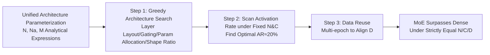

# Mixture-of-Experts Can Surpass Dense LLMs Under Strictly Equal Resource

**Conference**: ICLR 2026  
**OpenReview**: [https://openreview.net/forum?id=oIdzliJAeA](https://openreview.net/forum?id=oIdzliJAeA)  
**Code**: [https://huggingface.co/kamanphoebe/moe_surpass_dense](https://huggingface.co/kamanphoebe/moe_surpass_dense)  
**Area**: LLM Efficiency / MoE Architecture  
**Keywords**: Mixture-of-Experts, Activation Rate, Equal Resource Comparison, Data Reuse, Architecture Search  

## TL;DR
Under the premise of **strictly equal total parameters N, training compute C, and data volume D**, the authors optimize the MoE backbone and control the activation rate within an optimal range of approximately 20%. This demonstrates for the first time that MoE can consistently surpass dense models of equivalent resources. A data reuse strategy is employed to eliminate MoE's additional data requirements.

## Background & Motivation
- **Background**: MoE has become a powerful tool for scaling due to its "large parameters, low compute per token" property. However, mainstream open-source models like LLaMA, Qwen, and the first generation of DeepSeek still adhere to dense architectures. A fair conclusion on whether MoE is truly stronger remained elusive.
- **Limitations of Prior Work**: Existing comparisons either take a **data-centric perspective** (fixing total tokens to highlight MoE's parameter efficiency) or a **compute-centric perspective** (fixing compute while allowing total parameters to expand nearly a hundredfold). Both evade the reality of simultaneous N/C/D constraints in actual deployment—especially since all MoE experts must reside in HBM and be moved into shared memory during inference, making parameter count a runtime cost.
- **Key Challenge**: Intuitively, a dense model with the same total parameters should hold an advantage due to "full capacity utilization." Consequently, most studies rely on massive parameter counts for MoE to win, **avoiding direct comparisons at equal parameter counts** to bypass real engineering constraints.
- **Goal**: To answer a deliberately avoided question—**Can MoE truly beat dense models when N, C, and D are perfectly equal?** If it can, the gains must be attributed to the architecture itself.
- **Key Insight**: The authors first tune the MoE architecture to near-optimality, then scan activation rates under fixed N/C to identify a stable optimal range, and finally use data reuse to compensate for MoE's increased data demand, creating a fair arena where all three constraints are strictly aligned.

## Method

### Overall Architecture
The authors first establish a **unified architectural parameterization framework**, expressing total parameters N, active parameters Na, and compute per token M as analytical functions of shape hyperparameters (aspect ratio ζ, FFN expansion ratio α, MoE's µ/β, etc.). From this, they derive key observations such as "activation rate ra is the dominant factor" and propose a **three-step experimental method**: ① greedy search for the optimal MoE architecture → ② scanning activation rates under fixed N and C → ③ data reuse to align D.

### Key Designs

**1. Unified Architecture Parameterization: Decoupling activation rate from hyperparameters.** MoE architectures have numerous degrees of freedom (number of MoE layers Le, number of experts E, selected experts K, expert dimension De, shared experts Dse, etc.), making exhaustive search impossible. The authors express non-embedding parameters and compute per token analytically: for dense models, $N\approx(4+3\alpha)\zeta^2 L^3$ and $M\approx 2N+4\zeta^2\gamma L^3$; for pure MoE (Ld=0), the activation rate is $r_a=N_a/N=(4+3\beta)/(4+3\mu)$ and $M\approx 2r_aN+4\zeta^2\gamma L^3$. This yields a normalized compute cost $R_c=r_a\frac{4+3\alpha+2\gamma_d}{4+3\beta+2\gamma_m}$ relative to dense models. **Once shape hyperparameters are fixed, Rc grows monotonically with ra**, collapsing the high-dimensional design space into "activation rate" as the primary variable and revealing the N/C/D trade-off: at fixed N and C, MoE requires approximately Rc times more training tokens.

**2. Greedy Architecture Search: Optimizing the MoE backbone before comparison.** To avoid unfairness resulting from an unoptimized MoE, the authors greedily determine structure from macro to micro: for layer layout, **1 dense layer + remaining MoE layers + shared experts (1dense+SE)** proved most stable (dense layers aid training stability). Since the proportion of shared experts had minimal impact, it was fixed at $D_{se}=KD_e$. As gating score normalization provided no loss gain and caused zero gradients when K=1, it was omitted. For Top-K, findings showed that **excessively large K and K=1 were sub-optimal**; the main experiments avoid these extremes. Shape ratios were set to ζ≈88 and µ≈22 (following LLaMA's α=2.77). This ensures each MoE candidate runs on a near-optimal configuration.

**3. Scanning Activation Rate under Fixed N and C: Identifying the optimal range at ra≈20%.** Using a series of models at N≈2B and 7B scales with activation rates ranging from 8.7% to 58% (each trained sufficiently with D/N≥20), the authors found that performance grows non-linearly with compute at fixed D, but linearly with D at fixed ra. This confirms an **optimal activation rate point $r_a^{**}\approx20\%$ independent of D**. Crucially, the optimal point remained at 20% for both 2B and 7B scales, indicating that **the optimal AR does not change with model scale**. This directly contradicts the "optimal sparsity is proportional to model scale" claim by Abnar et al., which the authors attribute to their optimized backbone and strict control of variables.

**4. Data Reuse Strategy: Compensating for MoE's data requirement with multiple epochs.** Since MoE consumes about 4.6x more data at fixed compute (when ra=20%), the authors propose multi-epoch training on a fixed small dataset $\hat{D}$ with shuffling after each epoch to align D. The **Strict Scheme** ensures MoE and dense models are perfectly equal in N, D, and C, with the number of epochs increasing as ra decreases (1.7 to 8.3 epochs in 3B/7B experiments) to maintain the compute budget. The **Relaxed Scheme** fixes training at 2 epochs ($\hat{D}=0.5D$). Results show that reusing data brings only a slight performance drop compared to using unique data, and MoE still consistently surpasses dense models while the optimal AR remains unchanged. This effectively closes the loophole of "MoE winning by seeing more data."

## Key Experimental Results
Scale is unprecedented: nearly 200 models trained at the 2B scale, over 50 at 7B, with 50 trillion tokens processed in total. All checkpoints are public.

### Main Results (MoE vs Dense under Fixed Compute, lower BPC is better)

| Model | Compute C | Data D | Key Conclusion |
|------|--------|--------|----------|
| 2B Dense (C1=9.1e20) | C1 | 65B | Baseline |
| 2B Dense (C2≈2C1) | 1.64e21 | 114B | 2x Compute Upper Bound |
| 2B MoE, ra=20% | C1 | 541B | BPC 0.0064 lower than C1 dense, only 0.0049 higher than C2 dense |

MoE beats C1 dense in the ra range of approximately 15%~48% and approaches the performance of a dense model with double the compute.

### Main Results (7B SFT Models, excerpt from Table 2, MoE compute is half of dense)

| Task | Dense (C=5.45e21) | MoE ra=20% (C=2.86e21) |
|------|-------------------|------------------------|
| MMLU | 31.26 | **32.92** |
| DROP | 32.32 | **35.13** |
| BBH | 58.02 | **60.01** |
| GSM8K | 13.34 | **15.54** |
| GAOKAO-Math24 | 9.92 | **15.70** |

MoE exceeds the dense model on most knowledge/reasoning/math benchmarks using only about half the compute.

### Key Findings
- **Optimal activation rate ra≈20% is consistent across scales** (validated at 2B/7B/3B), independent of model size.
- **Data reuse is nearly lossless**: The strict reuse scheme causes only a slight drop compared to unique data, and the relaxed scheme often performs better.
- **Activation rates below 10% provide insufficient parameters for knowledge storage, while rates above 50% reduce expert specialization.** The authors hypothesize that the optimal range corresponds to stronger expert specialization.

## Highlights & Insights
- Reduced the convoluted "is MoE stronger" debate to **a single fair comparison under strictly equal N/C/D**. The conclusion is clear: the architecture itself wins.
- Unified parameterization **collapses the high-dimensional MoE design space into a single primary variable (activation rate)**, guiding experimental design and explaining the inherent N/C/D trade-offs.
- "Optimal AR≈20% regardless of scale" provides **direct engineering guidance for hyperparameters**, backed by the training of nearly 250 models and 50 trillion tokens.
- Data reuse addresses the long-standing criticism that "MoE wins by consuming more data," making the conclusions truly robust.

## Limitations & Future Work
- The study uses internal high-quality private corpora, making it difficult for outsiders to perfectly replicate the strict D-alignment experiments.
- The link between "optimal AR and stronger expert specialization" remains a **hypothesis** lacking direct mechanism-level evidence.
- The experiments scale up to 7B (with 3B validation). Whether the 20% optimal AR holds at much larger scales (tens of billions or more) requires further verification.
- The "Strict Scheme" for data reuse requires up to 8 epochs at low ra; the impact of long-term repetition in scenarios with limited data diversity was not fully discussed.

## Related Work & Insights
- Parallel to Ludziejewski et al. (2025), who found that sufficiently large MoE with enough tokens can surpass equal-parameter dense models. Ours further proves this at smaller scales and solves the data issue via reuse.
- Directly contradicts the "optimal sparsity is proportional to scale" conclusion from Abnar et al. (2025), which the authors attribute to under-training due to insufficient compute and lack of backbone optimization in the prior work.
- Leverages hyperparameter scaling laws from Li et al. (2025) to fairly set η and B for each model, preventing "tuning bias" from contaminating results.
- Insight for practitioners: **When building MoE, prioritize an activation rate of ~20% with a 1dense+SE backbone and use data reuse to align budgets** to consistently outperform dense models under equal resources.

## Rating
- **Novelty**: ⭐⭐⭐⭐ Provides the first positive evidence of MoE surpassing dense models under strictly equal N/C/D; clear perspective and conclusions that challenge existing sparsity scaling laws.
- **Experimental Thoroughness**: ⭐⭐⭐⭐⭐ Excellent volume and rigor, involving nearly 250 models, 50 trillion tokens, 2B/3B/7B scales, downstream tasks, and data reuse ablations.
- **Writing Quality**: ⭐⭐⭐⭐ Logical flow from parameterization to the three-step method; high information density in charts. Some conclusions lean heavily on appendix tables.
- **Value**: ⭐⭐⭐⭐ Offers directly applicable guidance on optimal activation rates and backbone recipes for MoE pre-training.

<!-- RELATED:START -->

## Related Papers

- [\[ICLR 2026\] Routing Manifold Alignment Improves Generalization of Mixture-of-Experts LLMs](routing_manifold_alignment_improves_generalization_of_mixture-of-experts_llms.md)
- [\[ICML 2026\] RepetitionCurse: Measuring and Understanding Router Imbalance in Mixture-of-Experts LLMs under DoS Stress](../../ICML2026/llm_efficiency/repetitioncurse_measuring_and_understanding_router_imbalance_in_mixture-of-exper.md)
- [\[ICLR 2026\] DirMoE: Dirichlet-Routed Mixture of Experts](dirmoe_dirichlet-routed_mixture_of_experts.md)
- [\[ICLR 2026\] Towards Greater Leverage: Scaling Laws for Efficient Mixture-of-Experts Language Models](towards_greater_leverage_scaling_laws_for_efficient_mixture-of-experts_language_.md)
- [\[ICLR 2026\] Understanding the Mixture-of-Experts with Nadaraya-Watson Kernel](understanding_the_mixture-of-experts_with_nadaraya-watson_kernel.md)

<!-- RELATED:END -->
