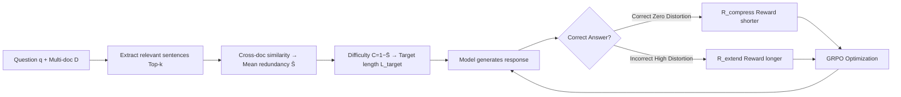

# MoL: Adaptive Mixture-of-Length Reasoning for Efficient Question Answering with Context

**Conference**: ICLR 2026  
**OpenReview**: [https://openreview.net/forum?id=oWWAeLEdE3](https://openreview.net/forum?id=oWWAeLEdE3)  
**Code**: [https://github.com/cong03/MoL](https://github.com/cong03/MoL)  
**Area**: Efficient Inference / LLM Inference Compression  
**Keywords**: Adaptive Reasoning Length, Difficulty Assessment, Dual-Objective Rewards, GRPO, Contextual QA  

## TL;DR
MoL utilizes a difficulty assessment based on cross-document information redundancy to assign a "difficulty score" to each question. It employs a dual-objective reward—rewarding expansion for incorrect answers and compression for correct ones—integrated with GRPO training. This encourages the model to naturally exhibit "intelligent conciseness": answering simple questions briefly and complex ones extensively, simultaneously improving accuracy and significantly compressing tokens across multiple contextual QA tasks.

## Background & Motivation
- **Background**: Question answering with context (multi-document / long-document QA) requires models to synthesize information from various locations. While CoT and reinforcement learning have significantly improved reasoning quality, the resulting long reasoning chains lead to high inference costs.
- **Limitations of Prior Work**: Existing efficient inference methods are categorized into two types: **uniform compression** (Token-Budget, TokenSkip, KIMI, etc.), which applies fixed compression strategies to all questions, resulting in "under-reasoning" for difficult problems and "over-expansion" for simple ones; and **adaptive methods** (e.g., ERPLP), which rely on heuristic difficulty estimation and rigid compression strategies, failing to correct errors if the initial difficulty judgment is wrong.
- **Key Challenge**: The tension between reasoning quality and computational efficiency—excessive compression loses critical reasoning steps, while insufficient compression wastes tokens. Furthermore, there is a lack of fault-tolerant mechanisms to extend reasoning after an initial failure.
- **Goal**: To adaptively allocate computational resources based on the true complexity of a question. This requires both a **principled difficulty assessment** to reliably distinguish simple retrieval tasks from complex multi-hop tasks, and a **fault-tolerant adaptive mechanism** that dynamically expands reasoning when initial attempts are inadequate.
- **Core Idea**: **[Difficulty Awareness + Fault-Tolerant Reward]** Quantize QA difficulty as cross-document redundancy (an approximation of the Set Cover problem) from an information-theoretic perspective. Then, use a dual-objective reward ("compress if correct, extend if incorrect") for GRPO training, allowing the model to dynamically switch between long and short modes based on answer correctness, enabling self-correcting and demand-based reasoning capacity scaling.

## Method

### Overall Architecture
MoL consists of two steps: first, calculating a difficulty score $C(q,D)$ based on **cross-document redundancy** to assign a target length $L_{target}$ for each question; second, using a **dual-objective reward** (compression reward for correct answers, extension reward for incorrect ones) within standard GRPO training. Crucially, these behaviors are not fixed multi-stage pipelines but are dynamically interleaved during training based on whether the current answer is correct, allowing the model to emerge with "intelligent conciseness."

### Key Designs

**1. Information-Theoretic Difficulty Assessment: Approximating Set Cover complexity with cross-document redundancy.** The authors model the requirement to synthesize knowledge fragments $U$ scattered in document set $D$ as a Set Cover problem. The difficulty of covering all necessary fragments with the minimum documents relates to the approximation hardness of Set Cover. Since exact Set Cover is NP-hard, a computable proxy is used: high redundancy (significant overlap in covered subsets among documents) implies low complexity, while low redundancy implies high complexity. Specifically, the model extracts Top-k sentences $D'_i = \{s \in D_i : s \in \text{Top-}k(\text{Sim}(s,q))\}$ from each document to denoise, then computes pairwise document similarity $S_{ij}=\cos(\text{embed}(D'_i),\text{embed}(D'_j))$ and takes the mean redundancy $\bar S=\frac{2}{n(n-1)}\sum_{i<j}S_{ij}$. The final difficulty is $C(q,D)=1-\bar S$. This heuristic shows 81% consistency with human-labeled difficulty. The step of "extracting relevant sentences before calculating similarity" is crucial; directly using original paragraphs would be contaminated by low-relevance sentences, misjudging simple problems as difficult.

**2. Dual-Objective Fault-Tolerant Reward: Rewarding expansion on failure and compression on success.** This is the core fault-tolerant mechanism formulated as a "rate-distortion trade-off in reasoning"—using response length as a proxy for "rate" and task error as a proxy for "distortion." For **incorrect answers (high distortion)**, the extension reward encourages longer responses to complete missing evidence chains: $R_{extend}=\text{clip}(\varepsilon_1-\lambda(1-\frac{L_{actual}}{L_{target}}),0,1)$, penalizing when the actual length is much shorter than the target. For **correct answers (zero distortion)**, the compression reward encourages "sufficiency" based on the Minimum Description Length (MDL) principle: $R_{compress}=\text{clip}(\varepsilon_2+\lambda(1-\frac{L_{actual}}{L_{target}}),0,1)$, where longer answers receive lower rewards. The unified reward selects one based on correctness: $R_{MoL}=R_{compress}$ if $y=y^*$, otherwise $R_{extend}$. Compared to unidirectional compression methods, this allows the model to "expand on demand" when wrong, rather than being unable to recover from initial judgment errors.

**3. Difficulty-Dependent Target Length + Progressive Curriculum Learning.** Target lengths are assigned across three tiers as empirical anchors on the rate-distortion curve: $L_{target}=512$ (Simple, $C\le0.3$), $1024$ (Medium, $0.3<C<0.7$), and $2048$ (Complex, $C\ge0.7$). The threshold values are initialised based on the HotpotQA length distribution and are robust to specific choices. To stabilize training, the length reward coefficient $\lambda$ follows a curriculum learning schedule: $\lambda(t)=\max(\gamma,\lambda\cdot(1-\frac{t}{T}))$, imposing strong constraints early and relaxing to a lower bound $\gamma$ later.

**4. GRPO Training Objective: Weighted accuracy and MoL rewards.** The total reward linearly combines the standard accuracy reward and the MoL reward: $R(x,y)=\alpha\cdot\mathbb{1}[y=y^*]+(1-\alpha)\cdot R_{MoL}(x,y)$. Optimization is performed via GRPO with a KL divergence constraint relative to the reference policy $\pi_{ref}$: $L(\theta)=\mathbb{E}_{x,y\sim\pi_\theta}[R(x,y)-\beta\log\frac{\pi_\theta(y|x)}{\pi_{ref}(y|x)}]$. This unified reward also prevents "reward hacking," as the model cannot cheat by being blindly long or short due to the correctness gating.

## Key Experimental Results

### Main Results
Evaluated on HotpotQA / StrategyQA / Loong datasets across Qwen3-1.7B/8B/14B and Llama-3.1-8B-Instruct (F1 for accuracy, tokens for output only):

| Model | Method | HotpotQA Acc | HotpotQA Tokens | StrategyQA Acc | Loong Acc | Loong Tokens |
|------|------|------|------|------|------|------|
| Qwen3-8B | Original | 61.0 | 609 | 93.7 | 55.8 | 2165 |
| Qwen3-8B | GRPO | 63.7 | 747 | 95.4 | 60.8 | 2363 |
| Qwen3-8B | ERPLP | 63.3 | 394 | 92.0 | 56.3 | 2037 |
| Qwen3-8B | KIMI | 62.8 | 444 | 92.5 | 60.8 | 1938 |
| Qwen3-8B | **MoL** | **67.2** | **316** | **95.9** | **62.3** | **1374** |
| Qwen3-14B | Original | 65.7 | 534 | 94.4 | 62.4 | 1915 |
| Qwen3-14B | **MoL** | **69.4** | **298** | **96.8** | **72.3** | **1128** |
| Llama-3.1-8B | Original | 53.3 | 431 | 77.4 | 36.3 | 742 |
| Llama-3.1-8B | **MoL** | **69.2** | **169** | **94.1** | **59.2** | **143** |

Ours (MoL) achieves a 49.1% compression rate while increasing accuracy by +6.2% on Qwen3-8B. While GRPO improves accuracy, it results in token inflation. Uniform compression in ERPLP/KIMI causes performance drops on complex questions due to the loss of key reasoning information.

### Ablation Study
Ablation of difficulty definition strategies (HotpotQA) and reward mechanisms (Loong):

| Dimension | Setting | Accuracy | Tokens |
|------|------|------|------|
| Difficulty Definition | Original (raw paragraph similarity) | 61.1 | 609 |
| Difficulty Definition | Original difficulty labels | 63.0 | 387 |
| Difficulty Definition | passage (reference paragraph similarity) | 62.1 | 594 |
| Difficulty Definition | **MoL (relevant sentences first)** | **67.2** | **316** |
| Mechanism | GRPO | 60.8 | 2363 |
| Mechanism | MoL w/o $R_{extend}$ | 58.9 | 1298 |
| Mechanism | MoL w/o $R_{compress}$ | 62.7 | 2862 |
| Mechanism | **MoL (Full)** | 62.3 | **1374** |

### Key Findings
- **Removing $R_{extend}$** leads to a significant drop in accuracy (even below GRPO), proving its role in maintaining reasoning quality. **Removing $R_{compress}$** drastically increases output length with negligible accuracy gains, proving its role in length control. The two components work orthogonally.
- **Stratified Difficulty Analysis**: On high-difficulty segments, accuracy increases by +7.3% with reasonable token usage. On medium-to-low difficulty segments, tokens are reduced by ~10% while maintaining accuracy advantages, demonstrating clearer difficulty awareness than KIMI's fixed compression.
- **Internal Activation Analysis**: Output-level adaptation correlates with internal computation patterns—simple questions activate fewer transformer layers, whereas complex questions invoke deeper model capacity, suggesting that MoL induces a type of dynamic computation allocation.

## Highlights & Insights
- **Grounding difficulty assessment in theoretical anchors**: Using Set Cover / Information Redundancy provides a computable proxy for "how hard a question is" that is 81% consistent with human annotation, offering more interpretability than pure heuristics.
- **"Rewarding expansion on failure" is truly novel**: Most efficient reasoning research employs unidirectional compression. MoL’s fault-tolerant expansion mechanism allows the model to recover from initial judgment errors, which is the root cause of its success on difficult problems.
- **"Intelligent conciseness" is emergent, not a hard constraint**: There are no explicit length limits; the long/short behavior is entirely induced by rewards and is robust to target length thresholds.

## Limitations & Future Work
- Difficulty assessment relies on sentence embeddings (BGE-M3) and Top-k extraction, making it sensitive to the encoder quality and choice of $k$. This proxy might fail on single-document tasks or those without obvious cross-document redundancy.
- The three target length thresholds (512/1024/2048) are derived from the HotpotQA distribution and may require retuning for domains with significantly different length distributions.
- The link between internal activation and effective layers is a post-hoc correlation analysis rather than causal evidence; the paper uses cautious phrasing regarding this.
- Training costs are relatively high (64×A100), and the method relies on verifiable correctness (mapped via F1 > 0.8), leaving its applicability to open-ended generative QA to be verified.

## Related Work & Insights
- **Uniform Compression** (Token-Budget hard limits, TokenSkip importance weighting, KIMI contrastive length rewards): Efficient but prone to losing key steps in complex problems—MoL’s difficulty awareness addresses this weakness.
- **Adaptive Methods** (ERPLP adjusting reasoning depth per pre-assessed difficulty): Lack error-correction mechanisms and utilize rigid strategies—MoL’s dual-objective fault-tolerant rewards directly target these pain points.
- **General Efficient Reasoning Insights**: Introducing the "Rate-Distortion trade-off + MDL" into reasoning length control provides a clean theoretical framework and a reusable reward design template for future "on-demand reasoning" research.

## Rating
- **Novelty**: ⭐⭐⭐⭐ The combination of information-theoretic difficulty assessment and bidirectional fault-tolerant rewards is novel in efficient reasoning, specifically the "extend on error" paradigm.
- **Experimental Thoroughness**: ⭐⭐⭐⭐ Comprehensive coverage with 4 models × 3 datasets, dual ablations on difficulty and reward mechanisms, and stratified difficulty analysis; though it lacks broader task types like mathematical reasoning.
- **Writing Quality**: ⭐⭐⭐⭐ Clear logic from motivation to theory to experiments; formulas and tables are complete with honest clarification of limitations.
- **Value**: ⭐⭐⭐⭐ Simultaneously improves accuracy and reduces token usage, is robust to thresholds, and provides open-source code, making it highly practical for controlling reasoning costs in long-document QA.

<!-- RELATED:START -->

## Related Papers

- [\[ICLR 2026\] ThinKV: Thought-Adaptive KV Cache Compression for Efficient Reasoning Models](thinkv_thought-adaptive_kv_cache_compression_for_efficient_reasoning_models.md)
- [\[ICLR 2026\] DiffAdapt: Difficulty-Adaptive Reasoning for Token-Efficient LLM Inference](diffadapt_difficulty-adaptive_reasoning_for_token-efficient_llm_inference.md)
- [\[ICML 2026\] Skill-Based Mixture-of-Experts: Adaptive Routing for Heterogeneous Reasoning via Inferred Skills](../../ICML2026/llm_efficiency/skill-based_mixture-of-experts_adaptive_routing_for_heterogeneous_reasoning_via_.md)
- [\[ICLR 2026\] UltraLLaDA: Scaling the Context Length to 128K for Diffusion Large Language Models](ultrallada_scaling_the_context_length_to_128k_for_diffusion_large_language_model.md)
- [\[ICLR 2026\] Tactic: Adaptive Sparse Attention with Clustering and Distribution Fitting for Long-Context LLMs](tactic_adaptive_sparse_attention_with_clustering_and_distribution_fitting_for_lo.md)

<!-- RELATED:END -->
