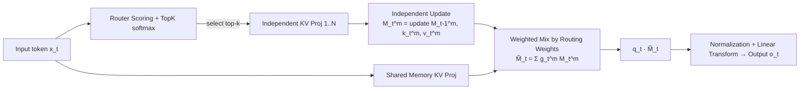

# MoM: Linear Sequence Modeling with Mixture-of-Memories

**Conference**: ICLR 2026  
**OpenReview**: [https://openreview.net/forum?id=3PdOq8Rgue](https://openreview.net/forum?id=3PdOq8Rgue)  
**Code**: TBD  
**Area**: Linear Sequence Modeling / Efficient Attention Architectures  
**Keywords**: Linear Attention, Mixture-of-Memories, Recall-intensive tasks, Memory Interference, Gated DeltaNet, Test-Time Training  

## TL;DR
MoM replaces the single fixed-size memory in linear models with a set of independent memory states and a routing network. This allows different tokens to update only their assigned memories, significantly expanding memory capacity and eliminating write interference while maintaining linear complexity, bringing performance on recall-intensive tasks close to Transformers.

## Background & Motivation
- **Background**: To escape the $O(n^2)$ complexity of Transformers, methods such as linear attention, State Space Models (Mamba), and linear RNNs compress the entire sequence into a single fixed-size matrix memory $M$, achieving $O(n)$ training and $O(1)$ inference. They can generally be written in a recurrent form: $M_t = M_{t-1} + k_t^\top v_t,\ o_t = q_t M_t$.
- **Limitations of Prior Work**: Compressing the entire sequence into a **single** fixed memory causes two major issues—**limited memory capacity** and **memory interference**. New information overwrites old memories via addition; orthogonal or novel inputs pollute stored content, causing a significant performance gap compared to Transformers in **recall-intensive tasks** like FDA, SWDE, and SQuAD.
- **Key Challenge**: Transformers are powerful because they maintain an independent KV cache for every token with almost no interference and near-infinite capacity. Linear models gain efficiency through extreme compression but lose this "divide and conquer" capability. Simply expanding a single RNN state manages the symptoms but not the root cause—a bloated memory still struggles to simultaneously carry multiple orthogonal information aspects.
- **Goal**: Find a balance between the "explicit token representation" of Transformers and the "extreme compression" of linear models. The goal is to expand capacity and remove interference without losing the efficiency benefits of linear training and constant-time inference.
- **Core Idea**: **[Neuroscience-inspired multi-memory architecture]** Drawing inspiration from multi-item memory encoding in hippocampal theta-gamma oscillations (where each gamma sub-cycle activates a different set of neurons, separating memory items in time to prevent interference) and the sparse routing idea of MoE, the authors propose **Mixture-of-Memories**. It maintains multiple independent memory states, where a router sends each token to only the top-k memories for updates, which are then combined via weighted readout based on importance.

## Method

### Overall Architecture
MoM replaces the "unique memory $M$" in linear layers with a "set of memories $\{M^1,\dots,M^M\}$ + a router." For each input token, the router calculates importance scores and selects the top-k memories. The selected memories are updated independently using their own KV projections in an RNN-like fashion, while unselected memories **remain unchanged** (the key to removing interference). During readout, the activated memories are weighted by routing scores into a "mixed memory" $\tilde M_t$, which is then queried by a shared query. Additionally, a **shared memory**, which is always activated for the entire sequence, is included to handle long-range dependencies. This mechanism is agnostic to memory update rules and can be integrated into various linear models (Linear Attn / GLA / DeltaNet / Gated DeltaNet / Mamba2 / RWKV...).

### Key Designs
**1. Router: Sparse dispatching of tokens to memories so each memory only receives similar information.** The router is a simple linear layer $W_g\in\mathbb{R}^{d\times M}$. It computes scores for each token followed by a softmax, selects top-k, and normalizes: $\text{scores}_t=\text{TopK}(\text{softmax}(x_tW_g))\in\mathbb{R}^k,\ g_t=\text{scores}_t/\sum\text{scores}_t$. This step transforms "one memory handling all information" into "different memories managing specific aspects," which is the source of capacity expansion and interference elimination. UMAP visualizations later show that routing effectively clusters inputs by features, with each memory specializing in a sub-distribution.

**2. Independent Memory Update + Freezing Unactivated Memories: The mechanistic essence of interference removal.** For each activated memory $m$, its exclusive projections $W_k^m,W_v^m$ compute $k_t^m,v_t^m$, followed by the memory update $M_t^m = M_{t-1}^m + (k_t^m)^\top v_t^m$. Crucially, **memories not selected by the router remain completely static**, ensuring that new information from the current token is never written into irrelevant memories. This is isomorphic to the "expert" concept in MoE, but here "experts" are individual RNN states embedded within linear recursion. The update rules can be swapped: the paper provides a comparison table unifying decay $\gamma M_{t-1}$ (RetNet), data-dependent gating (GLA/HGRN2), and the $(I-k_t^\top k_t)$ removal term (DeltaNet) into a general $M_t = \text{(gate)}\,M_{t-1}+\text{(write)}$ framework. Thus, MoM is a universal enhancement orthogonal to these works.

**3. Weighted Mixed Readout + Shared Memory: Re-aggregating "scattered memories" into a searchable whole.** After updates, the activated memories are weighted by routing scores to form a mixed memory $\tilde M_t = \sum_m g_t^{(m)} M_t^m$, and read out via $o_t = q_t\tilde M_t$. Notably, "mix then multiply by query" is mathematically equivalent to "multiply each by query then mix," providing significant hardware flexibility. Meanwhile, a **shared memory that is always activated** observes the full sequence to capture long-range context, compensating for global information that sparse routing might miss.

**4. Efficient Hardware Implementation: Simplifying multi-memory computation into varlen single-kernel calls.** A naive implementation would double costs due to multiple memories. MoM leverages the aforementioned equivalence to **reorder tokens** such that tokens belonging to the same memory are contiguous. These are concatenated into variable-length (varlen) sequences and processed in one go using existing Triton linear operators. After processing, they are aggregated by weight and restored to their original order. Formally, for batch $b$ and memory $m$, index sets $I_{b,m}$ are collected to form a flattened sequence $\tilde X$ with cumulative boundaries $s$. Each segment is processed by a memory-specific kernel $F_m$, and finally reconstructed as $y_{b,t}=\sum_m \alpha_{b,t,m}\hat o_{b,t,m}$. This allow MoM to reuse efficient kernels from prior linear models, maintaining linear training and constant-time inference.

## Key Experimental Results
Configurations: Using **Gated DeltaNet** as the memory update mechanism, 4 memories, activating 2 per step, plus 1 shared memory; trained from scratch on SlimPajama at 380M (15B tokens) and 1.3B (100B tokens) scales.

### Main Results (Recall-intensive tasks, 2K context, higher is better)

| Scale | Model | FDA | SWDE | SQuAD | NQ | TriviaQA | Drop | Avg. |
|---|---|---|---|---|---|---|---|---|
| 380M | Transformer++ | 46.14 | 25.87 | 33.22 | 18.94 | 45.97 | 20.03 | 31.70 |
| 380M | Gated DeltaNet | 20.53 | 23.24 | 28.55 | 14.98 | 44.91 | 16.48 | 24.78 |
| 380M | **MoM** | 22.98 | 29.90 | 29.69 | 16.60 | 48.82 | 20.99 | **28.16** |
| 1.3B | Transformer++† | 44.32 | 32.43 | 42.59 | 24.49 | 58.47 | 21.56 | 37.31 |
| 1.3B | Gated DeltaNet | 30.25 | 27.65 | 34.06 | 23.22 | 58.23 | 20.36 | 32.30 |
| 1.3B | **MoM** | 41.14 | 34.30 | 37.08 | 24.11 | 58.59 | 21.03 | **36.04** |

MoM significantly outperforms all linear baselines at both scales. At 1.3B, the average score of 36.04 is close to Transformer++'s 37.31, almost bridging the gap between linear models and Transformers on recall tasks. On LongBench, MoM averages 15.64, also superior to GSA (14.61) and Gated DeltaNet (13.98).

### Ablation Study (Mixed memory vs. Single memory expansion, Recall tasks Avg.)

| Model | Params | Recall Avg. |
|---|---|---|
| GLA expanded | 425M | 22.87 |
| GLA MoM | 395M | **23.53** |
| Gated DeltaNet expanded | 550M | 26.32 |
| Gated DeltaNet MoM | 444M | **28.16** |

The same trend applies to commonsense reasoning tasks (Gated DeltaNet MoM 444M scores 41.97, beating expanded 550M's 41.32). Crucially: **MoM outperforms "simply expanding a single memory" while using fewer parameters (444M vs 550M)**, proving that gains stem from interference removal via "divide and store" rather than just increasing capacity. Even under strictly matched active parameters (400M), MoM's recall Avg. of 26.51 remains higher than Gated DeltaNet's 24.78.

### Key Findings
- **Interference removal is the true gain**: Under same (or even fewer) parameters, separate memories consistently outperform an expanded single memory, indicating performance comes from eliminating write interference.
- **Efficiency remains linear**: Inference latency and memory usage grow linearly with sequence length. While Transformer++ reaches OOM on long sequences, MoM scales to 512K.
- **Stable extrapolation**: Trained on 2K and extrapolated to 32K for PPL testing, Transformer++ shows a sharp rise, while MoM achieves the lowest PPL among all linear models.
- **Spontaneous memory specialization**: UMAP shows the router clusters token hidden states into clear groups, with each memory specializing in a sub-distribution. The authors provide a TTT perspective—MoM is equivalent to a "test-time ensemble learning" where each memory only needs to fit a simpler $k\to v$ sub-mapping. With an auxiliary loss, memory loads remain balanced.

## Highlights & Insights
- **Paradigm Differentiation**: Existing linear models rely on "gating/removal" to passively reduce interference (discarding information). MoM uses "separated storage" to actively avoid interference (preserving information), representing a new direction orthogonal to gating.
- **Universal Plugin**: It is not tied to any specific update rule and can be applied to GLA, DeltaNet, Gated DeltaNet, Mamba2, RWKV, etc., with low implementation cost.
- **Bio-Engineering Dual Drive**: Theta-gamma multi-memory encoding provides the intuition, MoE sparse routing provides the implementation, and varlen Triton reordering ensures "multiple memories" do not increase computational overhead.
- **TTT Self-consistency**: By explaining "routing = dynamic clustering" and "each memory = sub-distribution expert," the paper completes its theoretical narrative by linking to Test-Time Training.

## Limitations & Future Work
- **Not Zero-Cost**: Sparse activation only applies to KV projections; active parameters still increase slightly (discussed in the appendix). Under strict parameter matching, recall gains are more pronounced than commonsense reasoning gains, and improvements on long-range summarization (LongBench Sum) are limited.
- **Hyperparameter Sensitivity**: Optimal configurations for memory count, top-k, and shared memory were primarily verified at 4/2/1. Scaling behavior and load balancing for larger scales and more memories require more systematic exploration.
- **Dependency on Auxiliary Loss**: Whether routing degenerates or memory collapse occurs without the load balancing loss has not been fully stress-tested.
- **Scale Ceiling**: The maximum experiment scale is 1.3B parameters / 100B tokens. Whether it can truly match Transformer's recall capacity at 7B+ remains an open question.

## Related Work & Insights
- **Linear Sequence Modeling Genealogy**: Linear Attention, RetNet, GLA, HGRN2, DeltaNet, Gated DeltaNet, Mamba2, RWKV6/7, etc. These are unified by this paper through the lens of memory update rules, serving as "hosts" for MoM.
- **Mixture-of-Experts**: Top-k routing and auxiliary losses from models like Switch Transformer are borrowed, but MoM's "experts" are RNN states rather than independent FFNs.
- **Test-Time Training / Titans**: The UMAP specialization analysis and TTT ensemble interpretation connect MoM to the line of work focused on "fitting $k \to v$ at test time."
- **Insights**: ① "Divide and conquer is better than expansion" serves as a reminder for all compressed memory architectures; ② Routing + varlen reordering is a universal engineering paradigm to implement sparse structures in linear operators at low cost, transferable to other SSM/Linear RNN variants.

## Rating
- **Novelty**: ⭐⭐⭐⭐ — Replaces single memory with multi-memory + sparse routing, opening a new interference removal paradigm distinct from gating, and unifying update rules into a plug-and-play framework.
- **Experimental Thoroughness**: ⭐⭐⭐⭐ — Comprehensive coverage across recall, long context, commonsense, extrapolation, efficiency, load balancing, and specialization analysis. Includes key comparisons such as equal-parameter and single-memory expansion. Scale limited to 1.3B is the only minor drawback.
- **Writing Quality**: ⭐⭐⭐⭐ — Clear motivation (bio-inspired + engineering), natural progression of methods, understandable hardware implementation, and effective visualizations.
- **Value**: ⭐⭐⭐⭐ — Brings linear models close to Transformer performance on recall-intensive tasks while maintaining linear efficiency. A solid advancement for efficient long-sequence architectures that is easy for subsequent work to adopt.

<!-- RELATED:START -->

## Related Papers

- [\[ICLR 2026\] MesaNet: Sequence Modeling by Locally Optimal Test-Time Training](mesanet_sequence_modeling_by_locally_optimal_test-time_training.md)
- [\[ACL 2026\] Native Hybrid Attention for Efficient Sequence Modeling](../../ACL2026/llm_efficiency/native_hybrid_attention_for_efficient_sequence_modeling.md)
- [\[ICLR 2026\] Log-Linear Attention](log-linear_attention.md)
- [\[ICLR 2026\] FlexLinearAttention: Compiling a Unified Abstraction into Scalable Kernels for Linear Attention](flexlinearattention_compiling_a_unified_abstraction_into_scalable_kernels_for_li.md)
- [\[ICLR 2026\] FutureFill: Fast Generation from Convolutional Sequence Models](futurefill_fast_generation_from_convolutional_sequence_models.md)

<!-- RELATED:END -->
